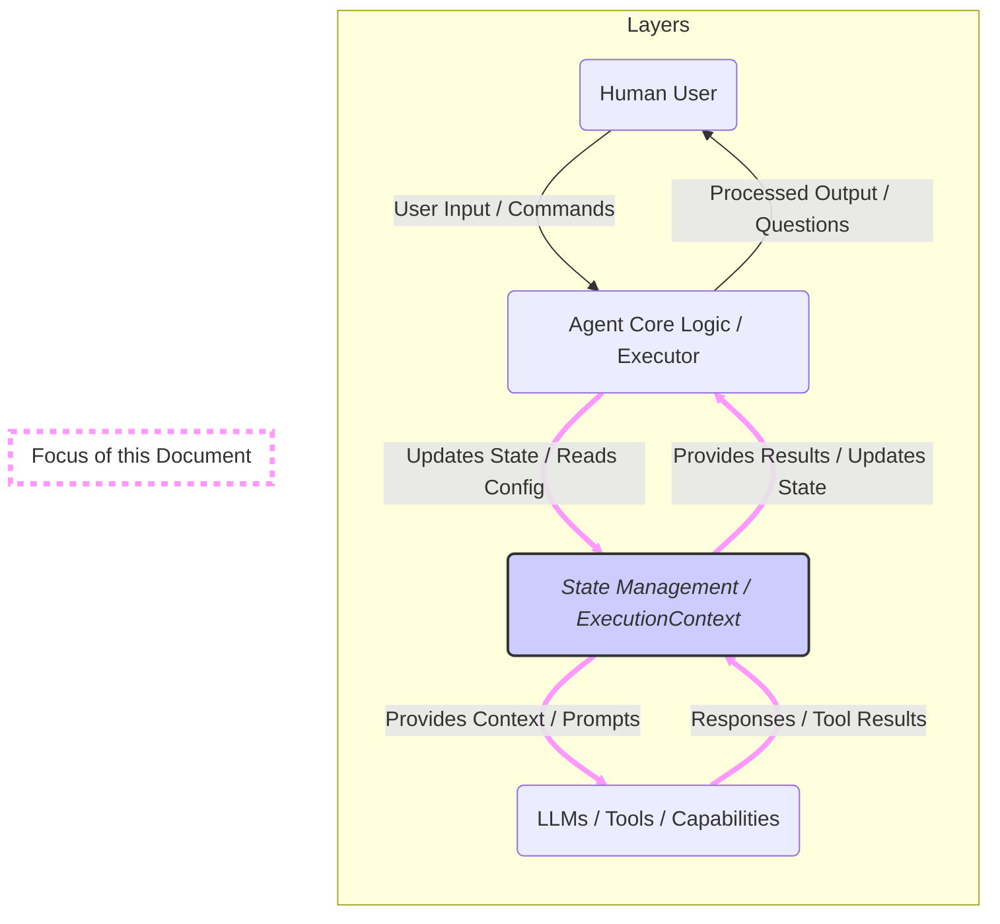
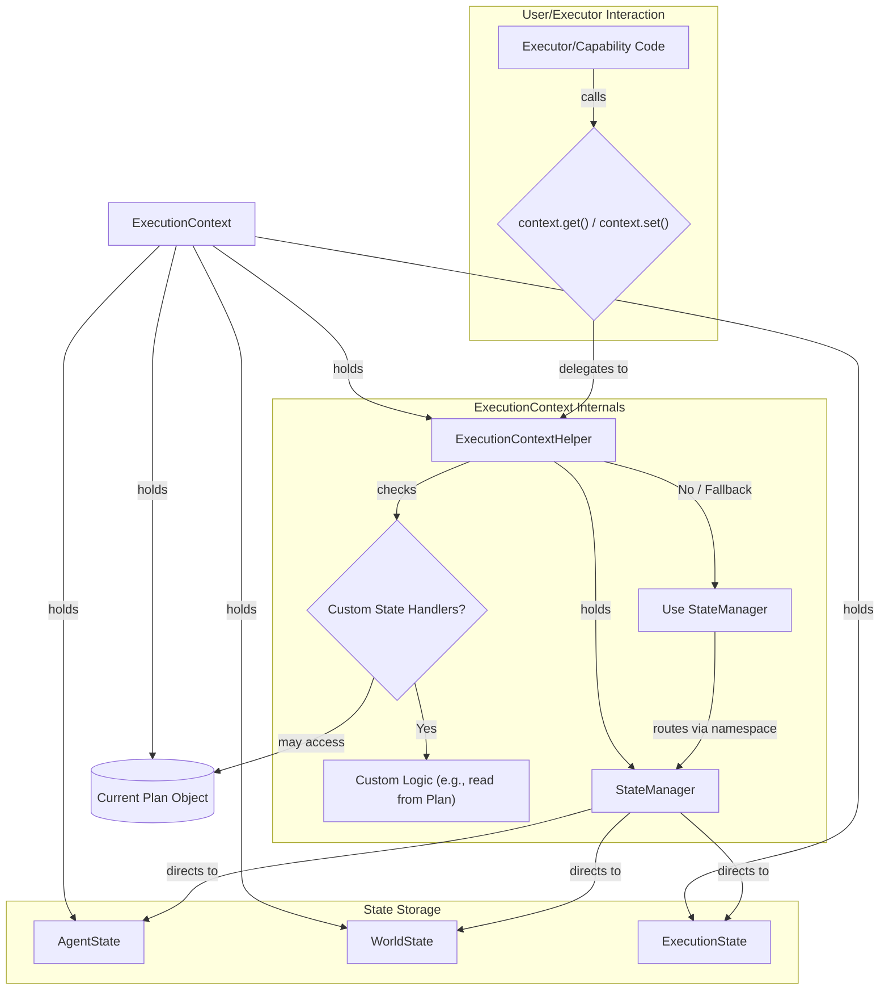

<p align="center">
  
</p>

# Execution Context State Management and Data Flow

This document describes how the `ExecutionContext` manages state and facilitates data flow **within an OpenDXA agent**, particularly between the agent's core logic (Executors) and the LLMs or Tools it utilizes. It does *not* cover the direct interaction layer between the Human User and the Agent.



## Use Case: Why Manage State During Execution?

Executing complex tasks, especially those involving multiple steps, AI reasoning, and tool usage (like in OpenDXA), requires careful management of information. Consider a typical workflow or plan:

*   **Passing Information:** A step might refine an objective, fetch some data, or generate a piece of code. Subsequent steps need access to this output.
*   **Providing Context:** An LLM call often needs more than just the immediate instruction; it might require the overall goal, user preferences, or results from previous steps to generate a relevant response.
*   **Configuration:** Steps need access to initial configuration, like the starting objective or specific parameters.
*   **Storing Results:** Intermediate thoughts (like chain-of-thought reasoning) and the final results of the execution need to be stored.
*   **Tracking Progress:** The system needs to know which steps have been completed, what their outcomes were, and what the overall status is.

Without a structured way to manage this state, workflows become brittle and difficult to implement.

## The Solution: `ExecutionContext` as the Central Hub

OpenDXA addresses this challenge using the `ExecutionContext` object (defined in `opendxa.base.execution.execution_context.py`). This object acts as a central container and manager for all the state information relevant to a specific execution run.

*Note: This state management primarily concerns the **internal workings of the agent** – managing data flow between its components (like execution steps, tools, and LLM calls) – rather than the direct interface between a human user and the agent.*

*   It is **passed along** from step to step during the execution process.
*   It provides **standardized methods** for components (like Executors, Capabilities, or individual nodes) to read and write state data.
*   It **encapsulates** the complexity of managing different types of state (agent-related, world-related, execution-related).

Essentially, if a piece of information needs to be available across different parts of an execution workflow, it should reside within the `ExecutionContext`.

## How Data Flows: The Core Mechanism

To manage information effectively, the `ExecutionContext` organizes its state using two primary concepts:

1.  **Namespaces**: The state is divided into broad, top-level categories. The standard namespaces are:
    *   `agent`: For agent-specific information (configuration, intermediate thoughts, results).
    *   `world`: For information about the external environment.
    *   `execution`: For tracking the runtime status of the execution itself.
2.  **Dot Notation**: Within each namespace, data can be structured hierarchically. Components access specific pieces of data using a dot (`.`) separated string, much like accessing attributes in an object.

A complete key to access a piece of state therefore typically takes the form `namespace.subkey.subsubkey...` (e.g., `agent.plan.initial_objective` or `execution.node_results.EXTRACT_KEYWORDS`).

The fundamental way components interact with this structured state held by `ExecutionContext` is through reading and writing values associated with these **dot-notation keys**:

*   **`context.get(key: str, default: Any = None) -> Any`**: Retrieves a value using its full key.
*   **`context.set(key: str, value: Any) -> None`**: Stores or updates a value at the specified key.

This simple `get`/`set` mechanism, operating on namespaced, dot-notated keys, forms the basis for all data flow within the execution context.

### Data Flow in Plan Definitions (`to_llm` / `from_llm`)

This mechanism is clearly visible in how execution plans (often defined in YAML) handle data for nodes, particularly those involving LLM calls or tools. With the concepts of namespaces and dot notation in mind, let's trace the flow step-by-step using an example snippet representing nodes within a larger **Plan Graph** definition where one node generates data used by the next:

**Example Plan Graph Snippet:**

```yaml
nodes:
  - id: EXTRACT_KEYWORDS
    objective: "Use LLM to identify key search terms from the initial objective."
    # Input: Reads the initial objective from state
    to_llm: "Extract key search terms from this objective: {{agent.plan.initial_objective}}"
    from_llm:
      # Output: Writes the extracted keywords (a NEW variable)
      # back to 'agent.intermediate.keywords' in the state.
      keywords: agent.intermediate.keywords # e.g., ["project X", "last 7 days"]

  - id: SEARCH_DOCUMENTS
    objective: "Search relevant documents based on the extracted keywords."
    # Input: Reads the keywords GENERATED BY THE PREVIOUS NODE
    # (Could also be tool input instead of to_llm)
    to_llm: "Search documents using keywords: {{agent.intermediate.keywords}}"
    from_llm:
      # Output: Writes the search results (another new variable)
      # back to 'agent.final_result.documents' in the state.
      document_list: agent.final_result.documents
```

**Step-by-Step Execution Flow (Concise):**

1.  **Start Node `EXTRACT_KEYWORDS`**:
    *   **Read Input**: Template `{{agent.plan.initial_objective}}` is resolved using `context.get("agent.plan.initial_objective")`.
    *   **Execute**: LLM is called with the resulting prompt.
    *   **Write Output**: LLM returns `{"keywords": [...]}`. Based on the `from_llm` map (`keywords: agent.intermediate.keywords`), `context.set("agent.intermediate.keywords", [...])` is called, storing the new keywords list.
2.  **Start Node `SEARCH_DOCUMENTS`**:
    *   **Read Input**: Template `{{agent.intermediate.keywords}}` is resolved using `context.get("agent.intermediate.keywords")` (reading the value set in the previous step).
    *   **Execute**: The search tool/LLM is called with the keywords list.
    *   **Write Output**: The tool returns `{"document_list": [...]}`. Based on the `from_llm` map (`document_list: agent.final_result.documents`), `context.set("agent.final_result.documents", [...])` is called, storing the results.
3.  **Execution Continues**: The executor proceeds.

This flow illustrates how the `to_llm` (input/read) and `from_llm` (output/write) directives, powered by `context.get()` and `context.set()`, enable the creation, storage, and subsequent use of new pieces of information within the state, facilitating complex, multi-step workflows.

## Behind the Scenes: How `ExecutionContext` Manages State

While users interact primarily via `context.get()` and `context.set()`, the `ExecutionContext` uses helper components internally to manage the state effectively:

1.  **State Containers (`AgentState`, `WorldState`, `ExecutionState`)**: These are the actual objects (defined in `opendxa.base.state`) that hold the data. They are typically Pydantic models providing structure and potentially validation. `ExecutionContext` holds instances of these.

2.  **StateManager (`opendxa.base.state.StateManager`)**: This component manages the different state containers. When `set("agent.user.name", ...)` is called, the `StateManager` knows that keys starting with `"agent."` should be routed to the `AgentState` container. It handles the prefix routing and delegates the actual `get`/`set` operation to the appropriate container.

3.  **ExecutionContextHelper (`execution_context_helper.py`)**: The `ExecutionContext` doesn't talk *directly* to the `StateManager`. It uses this internal helper class. The Helper holds the `StateManager` instance and provides the `get`/`set` methods that `ExecutionContext` exposes. Crucially, the Helper can also be configured with **custom state handlers** for specific prefixes (e.g., `"plan."`). This allows `ExecutionContext` to intercept requests for certain keys and apply custom logic (like reading directly from a loaded Plan object) *before* or *instead* of going to the `StateManager`.

**Component Interaction:**



This layered approach allows for flexibility (custom handlers) while maintaining a consistent interface (`context.get`/`set`) and organized state storage (`StateManager` and typed containers).

## Key Methods Revisited

Understanding the flow, these key methods on the `ExecutionContext` instance (`context`) become clearer:

*   **`context.get(key, default)` / `context.set(key, value)`**: The primary interface for reading/writing state, routed through the `ExecutionContextHelper`.
*   **`context.store_node_output(node_id, result)`**: An internal helper likely used by executors. Reads `from_llm` mappings for the `node_id` from the current plan and uses `context.set()` to store the relevant parts of the `result` into the state.
*   **`context.build_llm_context()`**: Gathers relevant data from various state keys (using `context.get()`) to assemble a context dictionary helpful for LLM calls.

## Organizing State: Recommended Namespace Conventions

Using consistent **namespaces** is crucial for keeping the state organized and understandable. Based on the system's design and common usage patterns observed in the code:

*   **Core Namespaces (Managed by `StateManager` via `ExecutionContextHelper`):**
    *   **`agent.`**: The most common **namespace** for agent-specific information. This includes:
        *   *Configuration & Plan Data*: e.g., `agent.plan.initial_objective`, `agent.plan.id`, `agent.config.*`.
        *   *Intermediate Data / Scratchpad*: e.g., `agent.intermediate.keywords`, `agent.scratchpad.reasoning_steps`. Useful for storing temporary results or thoughts between steps.
        *   *Final Results*: e.g., `agent.final_result.documents`, `agent.final_result.summary`. Where nodes map their ultimate outputs.
        *   *Profile/Preferences*: e.g., `agent.user.preferences`.
    *   **`world.`**: Represents the state of the external environment relevant to the agent. Content is application-specific (e.g., `world.time.current`, `world.database.schema`).
    *   **`execution.`**: Tracks the runtime state of the current execution process. Sub-keys frequently used by the framework include:
        *   `execution.status`: Overall status (e.g., `RUNNING`, `COMPLETED`, `FAILED`).
        *   `execution.current_node_id`: ID of the node currently being executed.
        *   `execution.visited_nodes`: List of node IDs visited.
        *   `execution.node_results.<node_id>`: Often stores the *entire* raw result dictionary returned by a specific node *before* `from_llm` mappings are applied.
        *   `execution.execution_path`: List tracking edges traversed.

*   **Other Potential Namespaces:**
    *   **`temp.`**: Observed in code examples (like `build_llm_context`) for potentially transient, step-specific data (e.g., `temp.plan_results.<plan_id>`). Requires careful lifecycle management if used.
    *   **`plan.`**: Used in documentation and code comments as the primary example of a **namespace** that *could* be handled by a **custom state handler** within `ExecutionContextHelper`, potentially accessing the current Plan object directly instead of using `StateManager` (e.g., `plan.objective`). Its availability depends on whether such a handler is configured.

Adhering to these conventions, especially for the core `agent`, `world`, and `execution` **namespaces**, improves clarity and interoperability within the OpenDXA framework.

## Conclusion

The `ExecutionContext`, through its interaction with `ExecutionContextHelper` and `StateManager`, provides a robust and flexible mechanism for managing state during complex executions. By leveraging the `get`/`set` methods and conventions like `to_llm`/`from_llm`, developers can control the flow of information effectively within OpenDXA workflows.

---

<p align="center">
Copyright © 2025 Aitomatic, Inc. Licensed under the MIT License.
</p>

<p align="center">
<a href="https://aitomatic.com">https://aitomatic.com</a>
</p> 