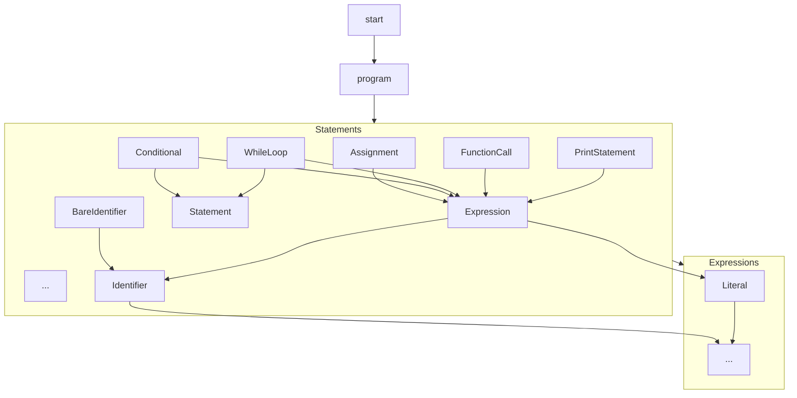

<p align="center">
  
</p>

[◀ Parser](./parser.md) | [Transformers ▶︎](./transformers.md)

# DANA Grammar

**Files**:
    - `opendxa/dana/language/dana_grammar.lark`: The Lark grammar file.
    - `opendxa/dana/language/dana_grammar_embedded.py`: The back-up grammar file, in case Lark is not available for some reason.

The DANA Parser uses the Lark parser to parse the DANA source code into a parse tree.

This document describes the formal grammar definition for the DANA language, as implemented in the Lark grammar file. The grammar defines the syntax rules for parsing DANA source code into a parse tree, which is then transformed into an AST.

## Overview

The DANA grammar is written in [Lark](https://github.com/lark-parser/lark) EBNF syntax. It specifies the structure of valid DANA programs, including statements, expressions, literals, and control flow constructs. The grammar is designed to be readable, extensible, and to support indentation-based blocks.

## Main Rules

- **start**: Entry point for parsing; matches a complete DANA program.
- **program**: Sequence of statements.
- **statement**: Assignment, conditional, while loop, function call, print statement, bare identifier, or newline.
- **assignment**: Variable assignment (`x = expr`).
- **conditional**: If/else block with indented body.
- **while_loop**: While loop with indented body.
- **function_call**: Function or core function call.
- **print_statement**: Print statement.
- **bare_identifier**: Standalone identifier.
- **expression**: Supports logical, comparison, arithmetic, and unary operations.
- **literal**: String, number, boolean, or null.
- **identifier**: Variable or function name, with optional scope prefix.

## Grammar Structure Diagram



## Special Syntax and Features

- **Indentation**: Uses `INDENT` and `DEDENT` tokens for block structure (handled by the parser's indenter).
- **Comments**: Supports C-style (`/* ... */`) and C++-style (`// ...`) comments.
- **Scope Prefixes**: Identifiers can have prefixes like `private.`, `public.`, or `protected.`
- **Flexible Expressions**: Logical (`and`, `or`, `not`), comparison (`==`, `!=`, `<`, `>`, etc.), arithmetic (`+`, `-`, `*`, `/`, `%`), and function calls.
- **Literals**: Strings, numbers, booleans, and null values.

## Extensibility

The grammar is designed to be extensible. New statements, expressions, or literal types can be added by extending the grammar file and updating the parser and transformers accordingly.

---

## Formal Grammar (Minimal EBNF)

> This EBNF is kept in sync with the Lark grammar and parser implementation in `opendxa/dana/language/dana_grammar.lark`.

```
program       ::= statement+
statement     ::= assignment | function_call | conditional | while_loop | for_loop | break_stmt | continue_stmt | function_def | comment
assignment    ::= identifier '=' expression
expression    ::= literal | identifier | function_call | binary_expression
literal       ::= string | number | boolean | none | fstring | list | dict | set
function_call ::= identifier '(' [expression (',' expression)*] ')'
conditional   ::= 'if' expression ':' NEWLINE INDENT program DEDENT [ 'else:' NEWLINE INDENT program DEDENT ]
while_loop    ::= 'while' expression ':' NEWLINE INDENT program DEDENT
for_loop      ::= 'for' identifier 'in' expression ':' NEWLINE INDENT program DEDENT
break_stmt    ::= 'break'
continue_stmt ::= 'continue'
function_def  ::= 'def' identifier '(' [identifier (',' identifier)*] ')' ':' NEWLINE INDENT program DEDENT
comment       ::= ('//' | '#') .*

identifier    ::= [a-zA-Z_][a-zA-Z0-9_.]*
list          ::= '[' expression (',' expression)* ']'
fstring       ::= 'f' string
dict          ::= '{' [key_value_pair (',' key_value_pair)*] '}'
key_value_pair ::= expression ':' expression
set           ::= '{' expression (',' expression)* '}'
binary_expression ::= expression binary_op expression
binary_op     ::= '==' | '!=' | '<' | '>' | '<=' | '>=' | 'and' | 'or' | 'in' | '+' | '-' | '*' | '/'
```

* All blocks must be indented consistently
* One instruction per line
* F-strings support expressions inside curly braces: `f"Value: {x}"`
* Built-in functions like `len()` are supported via transformer logic and do not require specific grammar rules.

---

## Example: Minimal DANA Program

```