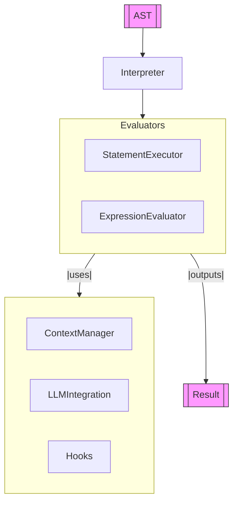

<p align="center">
  
</p>

[▲ DANA](./dana.md) 

[◀ Type Checker](./type_checker.md) | [REPL ▶︎](./repl.md)

# DANA Interpreter

**Module**: `opendxa.dana.sandbox.interpreter`

Given the program AST after trransformation (and optional type checking), we are ready to execute the program.

This document describes the architecture, responsibilities, and flow of the DANA Interpreter, which is responsible for executing DANA programs by traversing the AST and managing sandbox context.

## Overview

The DANA Interpreter executes DANA programs by walking the Abstract Syntax Tree (AST) produced by the parser and type checker. It manages variable scope, integrates with hooks for extensibility, and supports LLM-based reasoning if enabled. The interpreter is modular, delegating statement and expression execution to specialized components.

## Main Components

- **Interpreter**: The main entry point for program execution. Manages context, hooks, and delegates execution.
- **StatementExecutor**: Executes statements (assignments, conditionals, loops, function calls, etc.).
- **ExpressionEvaluator**: Evaluates expressions (arithmetic, logical, identifiers, literals, etc.).
- **ContextManager**: Manages variable scope and sandbox state.
- **LLMIntegration**: Integrates with language models for advanced reasoning (if enabled).
- **Hooks**: Extensible hooks for before/after program execution and error handling.

## Interpreter Flow



- **AST**: The abstract syntax tree from the parser/type checker.
- **Interpreter**: Orchestrates execution, manages context and hooks.
- **StatementExecutor**: Executes statements in the program.
- **ExpressionEvaluator**: Evaluates expressions as needed.
- **ContextManager**: Handles variable scope and sandbox state.
- **LLMIntegration**: Optional, for advanced reasoning.
- **Hooks**: Extensible points for before/after/error events.
- **Result**: The output of program execution.

## Responsibilities

- Execute all statements in the DANA program AST.
- Evaluate expressions and manage variable scope.
- Integrate with LLMs for reasoning (if enabled).
- Handle sandbox errors and provide clear diagnostics.
- Support extensibility via hooks.

## Example Usage

```python
from opendxa.dana.language.parser import GrammarParser
from opendxa.dana.sandbox.interpreter import Interpreter

parser = DanaParser()
result = parser.parse("x = 10\nif x > 5:\n    print('ok')")

if result.is_valid:
    interpreter = Interpreter()
    output = interpreter.execute_program(result)
    print("Program output:", output)
else:
    print("Parse errors:", result.errors)
```

## Error Handling

The interpreter raises a `SandboxError` (from `opendxa.dana.common.exceptions`) if program execution fails. Errors are caught and can be handled by registered hooks. Common sandbox errors include:
- Undefined variables
- Division by zero
- Unsupported operations

## Extensibility

The interpreter is designed to be extensible:
- Add new statement or expression types by extending `StatementExecutor` or `ExpressionEvaluator`.
- Register hooks for before/after program execution or error handling.
- Integrate with new LLMs or external systems via `LLMIntegration`.

---
<p align="center">
Copyright © 2025 Aitomatic, Inc. Licensed under the <a href="../LICENSE.md">MIT License</a>.<br/>
<a href="https://aitomatic.com">https://aitomatic.com</a>
</p> 