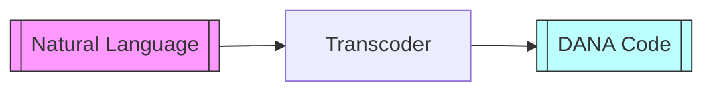
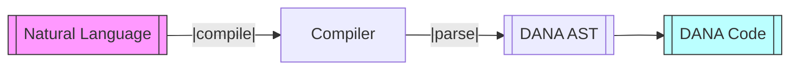
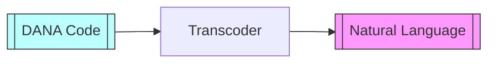
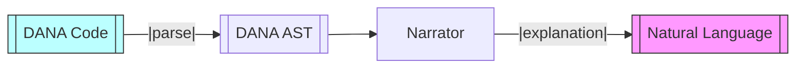

  

[◀ REPL](./repl.md) | [DANA ▶︎](./dana.md)

# DANA Transcoder

**Module**: `opendxa.dana.transcoder`

This document describes the DANA Transcoder module, which provides translation between natural language and DANA code, as well as interfaces for programmatic compilation and narration.

## Overview

The DANA Transcoder enables two-way translation:
- **Natural Language → DANA Code**: Converts user objectives or instructions into valid DANA programs using LLMs.
- **DANA Code → Natural Language**: Generates human-readable explanations of DANA programs.

This is achieved through a modular architecture with clear interfaces for extensibility and integration with LLMs.

## Main Components

- **Transcoder**: Main class for NL↔︎DANA translation. Uses an LLM resource and the DANA parser.
- **CompilerInterface**: Abstract interface for compilers that generate DANA ASTs from NL objectives.
- **NarratorInterface**: Abstract interface for narrators that generate NL descriptions from DANA ASTs.

## Transcoder Flow

**Natural Language to DANA Code:**

- `Transcoder.to_dana()`

- `Compiler.compile()`

**DANA Code to Natural Language:**

- `Transcoder.to_natural_language()`

- `Narrator.narrate()`

