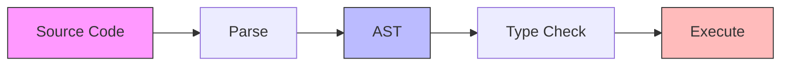
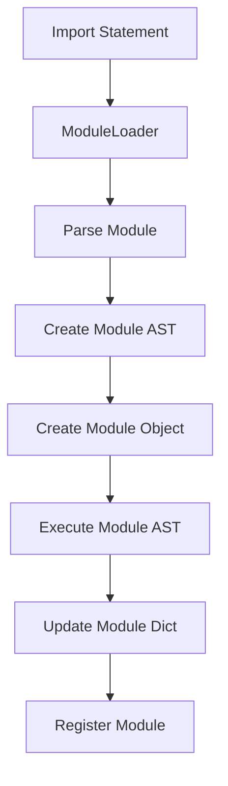
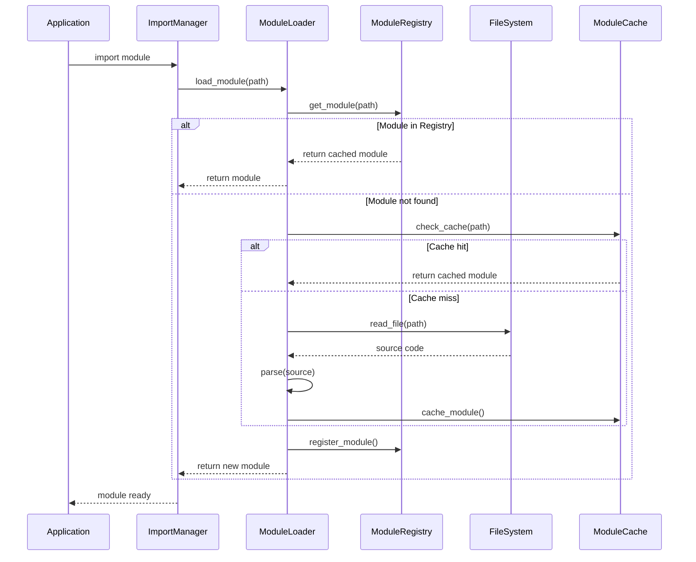
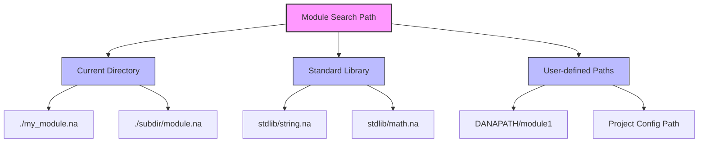
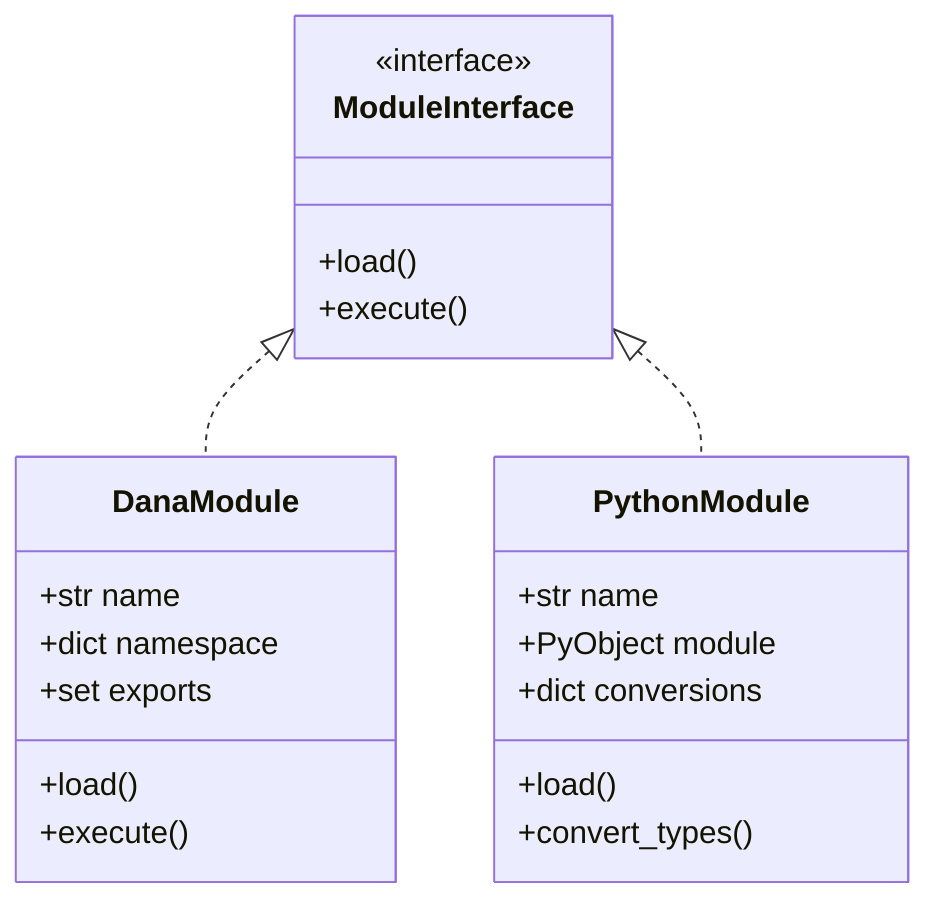

```text
Author: Christopher Nguyen
Version: 0.5
Status: Released
Module: opendxa.dana

Current Capabilities:
✅ Basic module loading and execution
✅ Module namespace isolation
✅ Basic package support with __init__.na
✅ Python module integration
✅ Circular dependency detection
✅ Basic error handling and recovery
✅ Module-level exports
✅ Basic lazy loading
🚧 Import statement syntax (parsing only - execution not implemented)
⏳ Advanced package features (partial)
⏳ Module reloading (planned)
⏳ Dynamic imports (planned)
⏳ Advanced caching (planned)
```

Also see: [Data Types and Structs](data_types_and_structs.md)

# Dana Modules and Imports

## 1. Overview

### 1.1 Motivation
Dana's module system provides a way to organize code into reusable and manageable units. Key benefits include:
* Code Reusability: Define functions, structs, and constants once, use them anywhere
* Namespacing: Avoid naming conflicts through distinct namespaces
* Logical Organization: Group related code by functionality or domain
* Collaboration: Enable independent development of different components

### 1.2 Key Concepts
* Module: A `.na` file containing Dana code (functions, structs, variables)
* Package: A directory containing related modules and an optional `__init__.na`
* Import: A mechanism to use code from other modules
* Namespace: A scope containing module-specific names and symbols

### 1.3 Example Usage

#### *`export` Statement*

```dana
# string_utils.na
export StringMetrics, calculate_metrics

struct StringMetrics:
  length: int
  word_count: int

def calculate_metrics(text: str) -> StringMetrics:
  len = len(text)
  words = len(text.split()) if len > 0 else 0
  return StringMetrics(length=len, word_count=words)

def to_uppercase(text: str) -> str:
  return text.upper()
```

#### *`import` Statement*

```dana
# main.na
import path/to/string_utils.na

text: str = "Analyze this text."
metrics: string_utils.StringMetrics = string_utils.calculate_metrics(text)
print(f"Length: {metrics.length}, Words: {metrics.word_count}")
```

## 2. Module System Design

### 2.1 Module Structure and Lifecycle


Each module goes through several stages:
1. Parsing: Source code is converted to an Abstract Syntax Tree (AST)
2. Type Checking: AST nodes are validated for type correctness
3. Execution: Code is executed in a module-specific context

### 2.2 Module Components
* AST: Represents the module's code structure
* Namespace: Contains module-specific variables and imports
* Exports: Symbols explicitly made available to other modules
* Dependencies: Other modules required for operation

### 2.3 Import Resolution
1. Module path resolution using search paths
2. Dependency graph construction
3. Circular dependency detection
4. Module loading and execution
5. Namespace population

### 2.4 Module AST and Runtime Relationships

The relationship between a module's AST and the runtime environment is carefully managed:

#### AST Structure
- Each module has its own AST with a `Program` node at the root
- The `Program` node contains a list of statements (assignments, function calls, etc.)
- The AST represents the module's code structure independent of execution state

#### Execution Context
- Each module gets its own namespace stored in `module.__dict__`
- The module's AST is executed by the `DanaInterpreter` in a `SandboxContext`
- The sandbox context manages scoped state during execution:
  - `local`: Module-specific variables
  - `private`: Internal module state
  - `public`: Exported module interface
  - `system`: Runtime metadata

#### Module Loading Flow


### 2.5 Example Module

Example: `string_utils.na`
```dana
# Module: string_utils.na

struct StringMetrics:
 length: int
 word_count: int

def calculate_metrics(text: str) -> StringMetrics:
 len = len(text)
 # Basic word count, can be made more sophisticated
 words = 0
 if len > 0:
   parts = text.split(' ')
   words = len(parts)

 return StringMetrics(length=len, word_count=words)

def to_uppercase(text: str) -> str:
 return text.upper()

public:DEFAULT_GREETING: str = "Hello, Dana!"
```

### 2.6 Import System

#### Basic Import Syntax
```dana
# In main.na
import path/to/string_utils.na
from path/to/string_utils.na import StringMetrics, calculate_metrics
from path/to/string_utils import some_other_dana_reference # .na is optional
from path/to/other_utils.py import some_python_reference # .py is required

text: str = "Sample text for analysis."
metrics: string_utils.StringMetrics = string_utils.calculate_metrics(text)
print(f"Length: {metrics.length}, Words: {metrics.word_count}")
```

#### Import with Alias
```dana
import path/to/string_utils.na as str_util

text: str = "Sample text for analysis."
metrics: str_util.StringMetrics = str_util.calculate_metrics(text)
```

#### Import Process Flow


### 2.7 Module Search Path Resolution

The Dana runtime uses the following search strategy:

1. **Current Directory**: Look in the same directory as the importing file
2. **Package Directory**: Check for package-relative imports
3. **Standard Library**: Search in Dana's standard library path
4. **DANA_PATH**: Search in paths specified in the DANA_PATH environment variable
5. **Project Config**: Search in paths specified in project configuration



### 2.8 Python Module Integration

Dana supports seamless integration with Python modules. For detailed design information, see:

- [Python Integration Overview](../02_dana_runtime_and_execution/python_integration.md)
- [Dana to Python Integration](../02_dana_runtime_and_execution/dana-to-python.md)  
- [Python to Dana Integration](../02_dana_runtime_and_execution/python-to-dana.md)



### 3.3 Error Handling

The module system includes comprehensive error handling:

```dana
struct ModuleError:
    path: str
    message: str
    cause: Exception | None
    
struct CircularImportError(ModuleError):
    cycle: list[str]  # The import cycle
    
struct ModuleNotFoundError(ModuleError):
    searched_paths: list[str]  # Paths that were searched
    
def handle_import_error(error: ModuleError):
    """Handle module import errors."""
    match error:
        case CircularImportError():
            log.error(f"Circular import detected: {' -> '.join(error.cycle)}")
        case ModuleNotFoundError():
            log.error(f"Module not found: {error.path}")
            log.debug(f"Searched paths: {error.searched_paths}")
        case _:
            log.error(f"Module error: {error.message}")
```

### 3.4 Performance Optimizations

#### Lazy Loading
```dana
struct LazyModule:
    path: str
    _loaded: bool = False
    _module: Module | None = None
    
    def __getattr__(name: str) -> any:
        """Load module on first attribute access."""
        if not self._loaded:
            self._module = load_module(self.path)
            self._loaded = True
        return getattr(self._module, name)
```

## 3. Implementation

### 3.1 Core Components

The module system is built on three main components that work together:

1. **Module Registry**: Central manager for module state
```python
class ModuleRegistry:
    """Registry for tracking Dana modules and their dependencies."""
    def __init__(self):
        self._modules: dict[str, Module] = {}        # name -> module
        self._specs: dict[str, ModuleSpec] = {}      # name -> spec
        self._aliases: dict[str, str] = {}           # alias -> real name
        self._dependencies: dict[str, set[str]] = {} # module -> dependencies
        self._loading: set[str] = set()              # modules being loaded
```

2. **Module Loader**: Handles finding and loading modules
```python
class ModuleLoader(MetaPathFinder, Loader):
    """Loader responsible for finding and loading Dana modules."""
    def __init__(self, search_paths: list[str], registry: ModuleRegistry):
        self.search_paths = [Path(p).resolve() for p in search_paths]
        self.registry = registry
```

3. **Module Types**: Core data structures
```python
@dataclass
class ModuleSpec:
    """Specification for a module during import."""
    name: str                                    # Fully qualified name
    loader: ModuleLoader                         # Loader instance
    origin: str                                  # File path/description
    parent: str | None = None                    # Parent package
    has_location: bool = True                    # Has concrete location
    submodule_search_locations: list[str] | None = None  # For packages
```

### 3.2 Implementation Status

> **⚠️ Important Note on Import Statements:**
> 
> While import statement syntax is fully supported in Dana's parser and type checker, **import statement execution is not yet implemented**. The `execute_import_statement` method in `StatementExecutor` currently raises a `SandboxError("Import statements are not yet supported in Dana")`.
> 
> **Current Status:**
> - ✅ **Parsing**: `import math` and `from collections import deque` parse correctly
> - ✅ **Type Checking**: Import statements pass type validation
> - ❌ **Execution**: Import statements fail at runtime with SandboxError
> 
> The module loading infrastructure exists but needs to be connected to the import statement executor.

#### Phase 1: Core Module System ✅
- [x] Basic module loading and execution
- [x] Module registry singleton
- [x] Module loader with search path support
- [x] Basic module object with namespace
- [x] AST execution in module context

#### Phase 2: Module Features 🟨
- [x] Basic module state management
- [x] Basic export declarations
- [x] Scope isolation
- [x] Basic cross-module references
- [~] Import statement handling
  - [x] Import statement syntax parsing (`import module`, `from module import name`)
  - [x] Import statement AST nodes (`ImportStatement`, `ImportFromStatement`)
  - [x] Import statement type checking
  - [ ] **Import statement execution (currently raises SandboxError)**
- [x] Dependency graph building
- [x] Circular dependency detection
- [ ] Module reloading support
- [ ] Dynamic imports
- [ ] Full package support

#### Phase 3: Performance & Security 🟨
- [~] Performance optimizations
  - [x] Basic lazy loading
  - [ ] Advanced caching strategies
  - [ ] Import path optimization
  - [ ] Memory usage optimization
- [x] Basic security features
  - [x] Module isolation
  - [x] Safe cross-module calls
  - [x] Basic resource cleanup
  - [x] Error boundaries

#### Phase 4: Advanced Features ⭕
- [ ] Hot Reloading
  - [ ] File watching
  - [ ] State preservation
  - [ ] Dependency updates
- [ ] Advanced Package Features
  - [ ] Resource management
  - [ ] Namespace packages
  - [ ] Version handling
- [ ] Development Tools
  - [ ] Import graph visualization
  - [ ] Debugging helpers
  - [ ] Performance profiling

#### Phase 5: Polish & Documentation 🟨
- [~] Documentation
  - [x] Basic API documentation
  - [x] Core examples
  - [ ] Advanced usage guides
  - [ ] Best practices
- [~] Testing
  - [x] Core functionality tests
  - [x] Basic integration tests
  - [ ] Performance benchmarks
  - [ ] Security tests

Legend:
✅ Complete
🟨 Partially Complete
🚧 Syntax Only (Not Executed)
⭕ Not Started

## 4. Future Work

### 4.1 Open Questions
* Circular Dependencies: How should we handle edge cases in circular dependency detection?
* Dynamic Loading: What's the best API design for dynamic module loading?
* Hot Reloading: How can we preserve state while reloading modules?
* Package Management: What additional features are needed for large-scale package management?

### 4.2 Planned Enhancements
* Enhanced package support with namespace packages
* Module hot reloading with state preservation
* Dynamic import capabilities
* Advanced caching and optimization strategies
* Comprehensive development tools