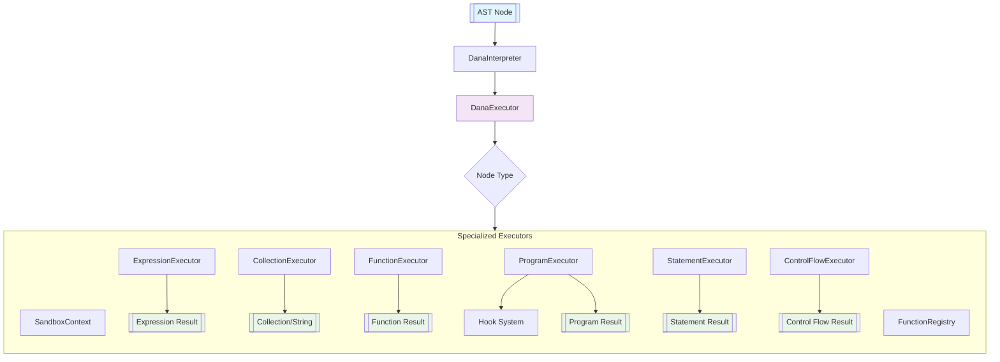

| [← Execution Model](./execution_model.md) | [Sandbox →](./sandbox.md) |
|---|---|

# Dana Interpreter

**Module**: `opendxa.dana.sandbox.interpreter`

Given the program AST after transformation (and optional type checking), we are ready to execute the program. See [Type System and Casting](./type_system_and_casting.md) for more details.

This document describes the architecture, responsibilities, and flow of the Dana Interpreter, which is responsible for executing Dana programs by traversing the AST and managing sandbox context. Refer to the [Execution Model](./execution_model.md) for an overview of how the interpreter fits into the broader execution flow.

## Overview

The Dana Interpreter has been significantly refactored into a modular, unified execution architecture. It executes Dana programs by processing the Abstract Syntax Tree (AST) through specialized executor components, treating all nodes as expressions that produce values while handling their statement-like side effects.

## Architecture

The interpreter uses a **unified execution model** where every AST node is treated as an expression that produces a value. This provides consistency and simplifies the execution logic while maintaining support for statements that have side effects.

### Key Design Principles

1. **Unified Execution**: All nodes go through a single `execute()` method
2. **Modular Executors**: Specialized executors handle different node types
3. **Value-First**: Every node evaluation produces a value
4. **Dispatcher Pattern**: Node types are mapped to specialized handlers

## Main Components

### Core Interpreter

- DanaInterpreter: Main entry point that initializes the execution environment, manages the function registry, and coordinates with the unified executor
- DanaExecutor: Central execution engine that dispatches to specialized executors based on node type

### Specialized Executors

- ExpressionExecutor: Handles expressions (arithmetic, logical, identifiers, literals, function calls)
- StatementExecutor: Executes statements (assignments, conditionals, loops)
- ControlFlowExecutor: Manages control flow (if/else, while, for, return, break, continue)
- CollectionExecutor: Handles collections and f-string expressions
- FunctionExecutor: Manages function definitions and calls (see also [Functions and Polymorphism](../01_dana_language_specification/functions_and_polymorphism.md))
- ProgramExecutor: Executes complete programs and statement blocks

### Supporting Infrastructure

- BaseExecutor: Base class providing common functionality for all executors
- FunctionRegistry: Unified registry for Dana and Python functions with namespacing support.
- SandboxContext: Provides execution context, variable scope management (see [State and Scopes](../01_dana_language_specification/state_and_scopes.md) and [Sandbox](./sandbox.md)), and access to LLM resources.
- Hooks: Extensible hook system for monitoring and extending execution

## Execution Flow



### Execution Steps

1. **AST Node**: Any AST node from the parser (statement, expression, program)
2. **DanaInterpreter**: Entry point that manages context and delegates to DanaExecutor
3. **DanaExecutor**: Central dispatcher that routes nodes to appropriate specialized executors
4. **Specialized Executors**: Handle specific node types using their domain knowledge
5. **Supporting Services**: Function registry, context management, hooks provide infrastructure
6. **Results**: Each executor produces appropriate results (expressions return values, statements may return None but have side effects)

## Key Features

### Unified Execution Model

- Single Entry Point: All nodes execute through `DanaExecutor.execute()`
- Consistent Interface: Every node produces a value, simplifying chaining and composition
- Type Dispatch: Automatic routing to appropriate specialized executors

### Function System Integration

- Unified Function Registry: Supports both Dana and Python functions
- Namespacing: Functions can be organized into namespaces (e.g., `math.sin`)
- Context Injection: Automatic context passing to functions that need it
- Cross-Language Calls: Seamless calling between Dana and Python

### Modular Architecture

- Specialized Executors: Each executor handles a specific domain (expressions, control flow, etc.)
- Inheritance Hierarchy: All executors inherit from `BaseExecutor` for consistency
- Handler Registration: Dynamic registration of node type handlers

### Error Handling and Diagnostics

- Improved Error Messages: User-friendly error formatting with context
- Execution Path Tracking: Debugging support with execution path information
- Exception Handling: Proper handling of control flow exceptions (return, break, continue). See also [Error Handling](../01_dana_language_specification/error_handling.md).

## Example Usage

### Basic Program Execution

```python
from opendxa.dana.sandbox.parser.dana_parser import DanaParser # Assuming parser details
from opendxa.dana.sandbox.interpreter.dana_interpreter import DanaInterpreter
from opendxa.dana.sandbox.sandbox_context import SandboxContext

# Parse Dana code (refer to Parser documentation)
# parser = DanaParser()
# result = parser.parse("private:x = 10\nif private:x > 5:\n log('Value is greater than 5')") # using log instead of print
#
# if result.is_valid:
# # Create context and interpreter
# context = SandboxContext()
# interpreter = DanaInterpreter(context)
#
# # Execute the program
# output = interpreter.execute_program(result.program)
#
# # Get any logged output (assuming a mechanism for this, e.g., from context or a log handler)
# # logged_output = context.get_logs() # Example
# print("Execution result:", output)
# # print("Program output:", logged_output)
# else:
# print("Parse errors:", result.errors)
```
*Note: The example above is illustrative. The exact API for parsing and accessing output/logs might differ based on the final Parser and SandboxContext implementation. `print` is not a standard Dana function; `log` or similar should be used.*

### Single Statement Execution

```python
# # Execute a single statement
# stmt_result = parser.parse("private:result = 42 * 2")
# if stmt_result.is_valid:
# value = interpreter.execute_statement(stmt_result.program, context) # context might be passed differently
# print("Statement result:", value)
# print("Variable value:", context.get("private:result"))
```

### Expression Evaluation

```python
# # Evaluate an expression
# expr_result = parser.parse("10 + 20 * 3")
# if expr_result.is_valid:
# value = interpreter.evaluate_expression(expr_result.program, context) # context might be passed differently
# print("Expression value:", value) # Output: 70
```
*Note: Direct execution of single statements or expressions might be exposed via specific methods on the interpreter or a higher-level sandbox API.*

## Advanced Features

### Function Registration and Calling

```python
# Register a Python function
# def my_function(a, b):
# return a + b
#
# interpreter.function_registry.register(
# "add", my_function, namespace="math", func_type="python"
# )

# Call from Dana code
# dana_code_calling_add = "local:sum = math:add(5, 3)"
# result = parser.parse(dana_code_calling_add)
# if result.is_valid:
# interpreter.execute_program(result.program, context)
# print("Sum from Dana:", context.get("local:sum"))

```
*Note: The `FunctionRegistry` is a key component. The specifics of registering and how namespaces are handled (e.g., `math:add` vs `math.add`) would be detailed in its own documentation or within the Functions and Polymorphism section.*

---
*Self-reflection: This document needs an accompanying `ast.md` for full context. The examples involving `parser.parse` and direct execution methods like `execute_statement` or `evaluate_expression` should be harmonized with the final API of the Dana Sandbox/Runtime. The `print()` in Dana examples was replaced with `log()` or comments about logging, as `print` isn't a standard Dana function.*