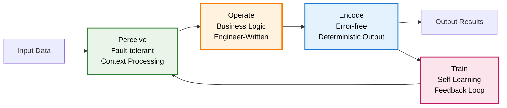

# POET: Perceive → Operate → Encode → Train Execution Model

```text
Author: Christopher Nguyen & Vinh Luong
Version: 0.4
Status: Design Phase
Module: opendxa.dana.poet
```

## Motivation: POET – A Robust, Learning-Enabled Execution Protocol for the GenAI Era

> "**Be liberal in what you accept, and conservative in what you send.**"
> — *Jon Postel, RFC 761 (1980)* ... and learn from every interaction.

This simple but profound principle, coined in the early days of internet protocol design, remains one of the most enduring foundations for building resilient systems. In today's world of probabilistic AI and structured computation, its relevance has never been greater, especially when combined with the ability to learn and adapt.

As we enter the **GenAI era**, we are witnessing a rapid convergence of **natural language understanding, symbolic reasoning, tool-use, and program synthesis**. Language models can now infer vague intent, generate structured plans, and execute arbitrary code. But they do so with **unpredictable semantics**, **fragile formatting**, and **opaque failure modes**. Furthermore, to truly improve, these systems must learn from their successes and failures.

Consider a simple agent task: summarizing an email. A naive approach might be:

```
# Naive approach - directly passing user input as prompt
email_summary = llm.generate(prompt=user_provided_email_text)
```

This often fails because `user_provided_email_text` might be too long, lack clear instructions, or contain confusing metadata. The agent needs to intelligently **perceive** the core summarization intent and the relevant content, then **operate** by sending a well-formed, optimized prompt to the LLM. The output then needs to be **encoded** (which includes validation) and an `execution_id` generated so that feedback can be used to **train** and improve future performance. Without a structured approach like POET, this becomes complex, ad-hoc, error-prone, and static.

This makes integration into **symbolic, software, or API-driven systems** extremely difficult. Outputs may be:

* Incorrect in format
* Semantically incoherent
* Missing required fields
* Failing silently or behaving nondeterministically

This is not a peripheral issue. It is the **central challenge** of turning generative models into **reliable, adaptive system components**.

---

## POET Execution Flow

The POET execution model provides a structured, learning-enabled approach to AI interactions:



This flow ensures that engineers focus on writing business logic (Operate) while the runtime automatically handles fault-tolerant input processing (Perceive), reliable output generation (Encode), and continuous learning (Train).

---

## The Neurosymbolic and Learning Opportunity

The promise of **neurosymbolic systems** is to **combine the flexibility of learning-based models with the rigor of symbolic computation**. The POET model extends this by explicitly incorporating a learning cycle.

* Language models excel at **understanding messy, underspecified, human-centric input** (`Perceive`).
* Symbolic components excel at **structured execution, error-checking, and guarantees** (`Operate`, `Encode` including validation).
* A dedicated **learning mechanism** allows the system to improve over time based on feedback (`Train`).

But today's tooling often lacks a unifying control structure to bridge these elements safely and enable continuous improvement.

What's missing is an **execution framework** that:

* Tolerates fuzziness on the input side (`Perceive`).
* Enables intelligent, adaptive operation at the core, including dynamic prompt optimization or context-sensitive adjustments to how tasks are performed (`Operate`, informed by `Train`).
* Enforces structure and validation on the output side (`Encode`).
* Retries, recovers, and learns from failure (`Encode` for retries, `Train` for learning).
* Explicitly facilitates a feedback loop for continuous improvement (`Encode` providing identifiers, `Train` processing feedback).

---

## ✅ POET: A Universal Contract for Robust, Adaptive Agent Execution

```mermaid
graph LR
    subgraph POET Unit
        direction LR
        Perceive[Perceive Stage] -- Perceived Input & Learnings --> Operate[Operate Stage]
        Operate -- Raw Output --> Encode[Encode Stage (incl. Internal Validation)]
        Encode -- Validated Output & Execution ID --> OutputToReceiver[(Output + Execution_ID)]
        Encode -- Execution Context --> TrainContextStore((Execution Context Store))
        Perceive -- Retrieves Learnings --> LearningStore([Learning Store])
    end

    OutputToReceiver --> Receiver((Downstream Receiver))
    Receiver -- Feedback & Execution ID --> Train[Train Stage]
    Train -- Updates --> LearningStore
    Train -- Retrieves Context --> TrainContextStore
```

The **Perceive → Operate → Encode → Train (POET)** protocol embodies this pattern:

1.  **Perceive (P)**: Accept inputs with fault tolerance and context sensitivity. Retrieve relevant past learnings from a `LearningStore` to inform processing. For instance, in the email summarization example, this phase would normalize the user's request, identify the actual email content, potentially use a `CodeContextAnalyzer` to understand that a concise summary is expected, and **transform this into an optimized prompt** based on current input and past successful strategies. This optimized prompt and any retrieved learnings are then passed to the `Operate` phase.

2.  **Operate (O)**: Execute the core function or plan using the (potentially optimized) input from the `Perceive` phase. This can be a tool call, LLM generation (with an enhanced prompt), symbolic program, or composite chain, utilizing the `perceived_input` and any guidance from retrieved learnings.

3.  **Encode (E)**:
    *   **Internal Validation**: Strictly check the `raw_output` from the `Operate` stage against `poet_status.expected_output_type` and other critical criteria. If validation fails, this stage can trigger a retry of the `Operate` stage (possibly with modified parameters based on the validation failure), up to `max_retries`.
    *   **Output Packaging**: If internal validation passes, package the validated output for the downstream receiver.
    *   **Execution ID Generation**: Generate a unique `execution_id` for this specific POET execution. This ID acts as a handle for future feedback.
    *   **Contextual Data Encoding for Training**: Prepare a data packet containing the `execution_id`, `perceived_input`, validated `raw_output`, and relevant details from `poet_status` (like attempt count, active profile, etc.). This packet is stored or made available for the `Train` stage upon receiving feedback.
    *   **Output**: Provide the validated output and the `execution_id` to the downstream receiver.

4.  **Train (T)**: This stage is typically activated asynchronously when a downstream receiver (or an external system) submits feedback using the `execution_id`.
    *   **Feedback Correlation**: Correlate the incoming feedback signal (e.g., reward, error report, correction) with the stored/retrieved execution context data packet for the given `execution_id`.
    *   **Learning Update**: Process this correlated information (feedback + context) and update the persistent `LearningStore`. This might involve updating models, heuristics, or statistical data that the `Perceive` stage (and potentially other stages) can use to improve performance in future executions.

---

## 🛠 Why POET Is Necessary Now

In a world where:

* LLMs hallucinate
* APIs break with malformed payloads
* Tool-using agents generate invalid commands
* Users issue ambiguous queries
* Planning and execution are lossy

...we need a **robust, extensible execution model** that embraces the **flexibility of generative inference** *without compromising the guarantees of structured computation*.

POET is that model.

---

## 🌉 Positioning POET as the Core Neurosymbolic Bridge

POET becomes the **core abstraction** for runtime control in modern AI systems:

| Use Case | POET Behavior |
| ----------------------- | ----------------------------------------------------------------------------- |
| LLM agent tool call | Perceive (NL → args), Operate (tool call), Encode (schema), Train (feedback) |
| Natural language → code | Perceive (prompt parse), Operate (generate code), Encode (syntax/type check), Train (code improvement) |
| Autonomous planner | Perceive (goal framing), Operate (plan/step), Encode (plan constraints met), Train (plan improvement) |
| Semantic search | Perceive (query), Operate (retrieve), Encode (enough results, no contradiction), Train (semantic improvement) |

POET provides a **first-class retry loop**, **extensible Perceive and Encode logic**, and a runtime introspection context (`poet_status`)—all of which are critical for **safe AI deployment**, **tool chaining**, and **adaptive agent behavior**.

---

## Final Word

> **POET operationalizes Postel's principle in the age of generative systems.**
> It allows us to tolerate ambiguity, operate intelligently, and enforce correctness—**bridging the neural and the symbolic, reliably.**

POET isn't just a wrapper.
It's the execution protocol at the **center of modern neurosymbolic intelligence**.

---

## POET Design and Specification

### ✨ POET in Action: `reason()` Adapting to Context

The power and everyday utility of the POET execution model are clearly demonstrated by Dana's built-in `reason()` function. `reason()` leverages POET to adapt its output based on the context provided by the Dana engineer, particularly through type hints. Consider the following interaction:

```python
>>> pi_description = reason("what is pi?")
# pi_description is now a string:
# "Pi (π) is a mathematical constant representing the ratio of a circle's circumference to its diameter. Its approximate value is:
# π ≈ 3.14159
# But it is an irrational number, meaning: ..."

>>> pi_float: float = reason("what is pi?")
# pi_float is now the float: 3.14159265

>>> radius = 2 ; area = pi_float * radius**2
# area is now the float: 12.5663706
```

In the first call, with no specific type hint for `pi_description` (or if `-> any` or `-> str` was implied), `reason()` returns a descriptive string. In the second call, the explicit type hint `pi_float: float` signals to POET that a floating-point number is desired. The POET framework, underpinning `reason()`:

1. **Perceives** the request "what is pi?" and critically, the `expected_output_type` of `float` from the type hint.
2. **Operates** by querying its underlying AI model, likely instructing it to provide a numerical value for Pi.
3. **Encodes** that the AI's output can be (or is) a float, ensuring the assignment to `pi_float` is type-safe and that `pi_float` can be immediately used in numerical calculations like `area = pi_float * radius**2`.

This dynamic adaptation based on context, especially the desired output type, without changing the core textual prompt, is a hallmark of the POET model and a key to Dana's expressive power and developer convenience.

---

This section outlines the POET (Perceive → Operate → Encode → Train) framework, designed for implementation in Python as part of the Dana runtime.

* The **POET control logic** and retry loop (within Encode) is implemented in Python.
* The **custom P, O, and E (specifically validation logic) functions** can be authored in **Dana**.
* The **Operate function** is decorated in Python and becomes the execution anchor.
* The framework retries execution based on internal validation outcomes within the Encode stage, with a default of **`max_retries = 3`**.
* The `poet_status` object is available to all stages (P, O, E) as part of the **sandbox context**, enabling adaptive behavior or introspection. The `Train` stage uses this context post-hoc.
* A **LearningStore** (potentially using Dana state containers) is used by the `Train` stage to persist feedback and learnings, and by the `Perceive` stage to retrieve them.

---

### 🔹 `@poet(...)` Decorator

Wraps a Python-defined **Operate** function with POET lifecycle logic. Accepts:

| Parameter | Type | Description |
| ------------- | ----------------------- | ---------------------------------------------------------------------------------------------------------- |
| `perceive` | DanaFunction | Optional Dana function that maps raw input to perceived input for the `Operate` stage. Retrieves learnings. |
| `validate` | DanaFunction | Optional Dana function used by the `Encode` stage for internal validation. Returns `true` if output is valid. |
| `max_retries` | `int` | Number of retries on internal validation failure during `Encode` stage (default = `3`) |
| `expected_output_type` | `Any` | Optional. The expected type/structure of the final output. Used by `Encode` (validation) and can inform `Perceive`/`Operate`. |

---

### 🔹 Dana ↔ Python Interface Contracts (for P, O, E stages)

| Stage    | Input Type                      | Output Type                                  |
|----------|---------------------------------|----------------------------------------------|
| `Perceive` | Dana value (`Any`)              | Dana-typed input for `Operate` (perceived_input) |
| `Operate`  | Python or Dana-compatible input | Python output (`Any`) (raw_output)         |
| `Encode`   | Python output (`Any`)           | Validated Python output & `execution_id`     |

Python will:

* Convert inputs/outputs as needed to/from Dana's runtime types for P, O, E stages.
* Provide `poet_status` as a local variable in Dana context for P, O, E stages.

*(The `Train` stage operates on feedback and stored `poet_status` context, typically asynchronously)*

---

### 🔹 `poet_status` in Dana

Exposed in the Dana local scope (per P,O,E invocation), and logged for the `Train` stage, structured as:

```python
{
 "execution_id": str, # Unique ID for this POET execution, generated in Encode stage
 "attempt": int, # Current attempt number for Operate-Encode(Validate) cycle
 "last_internal_failure": str or null, # Reason for last internal validation failure in Encode
 "max_retries": int,
 "is_internally_validated": bool, # True if Encode stage validation passed
 "perceived_input": Any, # Output of the Perceive phase.
 "raw_output": Any, # Python object output by the Operate phase.
 "validated_output": Any, # Output after successful validation in Encode (often same as raw_output if no transformation)
 "expected_output_type": Any, # The type/structure expected for the final output.
 "active_profile": str or null, # The active POET profile, e.g., system:__poet_profile
 "learnings_applied": Any or null # Optional: summary of learnings applied by Perceive
}
```

Can be used in Dana validation functions (within `Encode`) for adaptive logic. The `Train` stage uses this entire status, correlated with external feedback, to update the `LearningStore`.

---

### Kontext Rich Context in POET

The power of the POET model is significantly enhanced by its ability to leverage rich contextual information within each phase, particularly during `Perceive` but also accessible during `Operate` and `Encode` (via `poet_status.perceived_input`). This allows for more intelligent and adaptive behavior. Key types of context include:

* Code-Site Context: Derived from the Dana source code where the POET-enabled function is called. This is akin to how a human developer understands a function call by looking at its surroundings. Examples include:
 * `comments`: Block or inline comments near the call site that might explain intent or provide hints.
 * `variable_context`: Names and inferred types of nearby variables.
 * `type_hints_at_call`: If the function call is part of an assignment with a type hint (e.g., `my_var: ExpectedType = poet_function(...)`), this `ExpectedType` can be crucial for the `Perceive` phase to determine the `expected_output_type` if not explicitly provided to the decorator.
 * `surrounding_code_lines`: A few lines of code before and after the call.
 * `parent_function_name`: The name of the Dana function enclosing the POET call.
 The mechanism for gathering this (e.g., a conceptual `CodeContextAnalyzer` invoked by the POET framework during the Perceive phase) is an important implementation detail.

* Ambient System Context: Broader operational parameters available from the Dana sandbox or system environment. These provide overarching guidance or constraints. Examples:
 * `system:__poet_profile`: An identifier for an active POET execution profile (e.g., "default", "strict_validation", "creative_generation", "fault_tolerant_integration"). This can dictate the behavior of P, O, and E stages.
 * `system:__poet_settings_override`: A dictionary allowing fine-grained overrides for specific POET behaviors.
 * `system:__current_task_id`, `system:__current_task_description`: Information about the ongoing agent task.
 * `system:__session_id`, `system:__user_id`: Session and user identifiers.
 * `system:__locale`: Preferred locale for localization or language-specific behavior.
 * `system:__active_domains`: A list of active knowledge domains (e.g., `["finance", "medical_records"]`) to help scope or specialize the P/O/E logic.

By making this context available (primarily through the `perceived_input` object passed from `Perceive` to `Operate`, and available in `poet_status`), the POET framework enables functions to be highly adaptive to their specific invocation circumstances and the broader operational environment. This context is also crucial for the `Train` stage when correlating feedback.

---

## ✅ Example Usage (in Python)

```python
@poet(
 perceive="Dana::parse_and_retrieve_learnings",
 validate="Dana::check_valid_summary", # Used by the Encode stage for internal validation
 max_retries=3,
 expected_output_type="str"
)
def summarize_article(perceived_input_with_learnings):
 # perceived_input_with_learnings contains original input + any relevant past learnings
 text_to_summarize = perceived_input_with_learnings.get("text")
 prompt_strategy = perceived_input_with_learnings.get("strategy", "default_summary_prompt")
 return llm_generate(prompt_strategy, text_to_summarize)

# When summarize_article is called:
# 1. Perceive: "Dana::parse_and_retrieve_learnings" runs, fetches from LearningStore.
# 2. Operate: summarize_article body runs with this enhanced input.
# 3. Encode: Output of summarize_article is validated by "Dana::check_valid_summary".
#    - If fails, retry O-E (up to max_retries).
#    - If passes, execution_id is generated, output and ID returned.
#    - poet_status (including perceived_input, raw_output, etc.) is logged/stored for potential training.
# 4. Train (later, if feedback submitted for execution_id): Feedback + stored poet_status updates LearningStore.
```

Where:

* `Dana::parse_and_retrieve_learnings` might coerce natural language, fetch relevant learned heuristics from a `LearningStore`, and prepare input for `summarize_article`.
* `Dana::check_valid_summary` (used in `Encode`) ensures the result is a string and meets quality criteria.

---

## Future-Proofing Considerations

* Support for async `Operate` and `Encode` functions.
* Support for post-`Encode` transformation hooks (optional, if validation implies transformation).
* Retry strategy abstraction for the internal O-E loop (`exponential_backoff`, `adaptive`, etc.).
* **LearningStore Design**: Formalizing the `LearningStore` interface and implementation (e.g., using Dana state containers). This includes how learnings (models, heuristics, rules) are stored, versioned, and retrieved by `Perceive` and updated by `Train`.
* **Feedback Mechanisms**: Standardizing the API for submitting feedback to the `Train` stage (as discussed in POET-to-POET communication). This includes defining feedback structures (e.g., rewards, error reports, corrections).
* **Train Stage Implementation**: Defining how the `Train` stage processes feedback and context to update the `LearningStore`. This could range from simple statistical updates to more complex model retraining pipelines.
* POET Execution Profiles/Strategies: Building on the `system:__poet_profile` idea, formally define different POET execution profiles. These profiles could dictate default P, O, E functions, learning rates for `Train`, or specific feedback types they prioritize. For example:
  * `LLMInteractionPOET`: `Perceive` phase focuses on detailed prompt engineering using code-site, ambient context, and past LLM feedback; `Operate` calls an LLM; `Encode` checks for hallucinations or structural compliance; `Train` processes feedback from interactions to refine prompts or fine-tune models.
  * `DataValidationPOET`: `Perceive` might identify data source and schema, retrieving past validation success/failure rates; `Operate` performs data retrieval/transformation; `Encode` performs rigorous schema and integrity checks; `Train` processes feedback (e.g., correctness of validation) to improve schema interpretation or transformation rules.
  * `SafeToolCallPOET`: `Perceive` understands tool input requirements and learned best practices for tool use; `Operate` executes an external tool; `Encode` checks for successful execution and expected output structure; `Train` processes feedback on tool success/failure or output quality to refine tool usage strategies.
  These profiles could be implemented by allowing different Dana functions (or even specialized Python logic) to be specified for the P, O, and E stages, and different learning algorithms/configurations for the `Train` stage, based on the active profile.
* Advanced `CodeContextAnalyzer`: Developing a sophisticated `CodeContextAnalyzer` that can robustly extract meaningful information from Dana code. This context, when logged with `poet_status`, becomes invaluable for the `Train` stage.

---