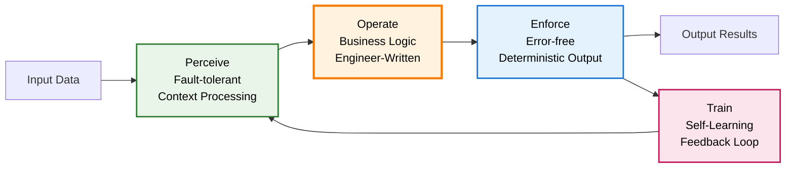

# POET: Perceive → Operate → Enforce → Train Function Execution Model

## Motivation: POET – A Robust, Learning-Enabled Function Execution Protocol for the GenAI Era

> "**Be liberal in what you accept, and conservative in what you send.**"
> — *Jon Postel, RFC 761 (1980)* ... and learn from every interaction.

This simple but profound principle, coined in the early days of internet protocol design, remains one of the most enduring foundations for building resilient systems. In today's world of probabilistic AI and structured computation, its relevance has never been greater, especially when combined with the ability to learn and adapt.

### The Challenge: Why Traditional Approaches Fall Short

Consider these common scenarios in enterprise AI:

1. **Data Processing Fragility**:
   ```python
   # Traditional approach - brittle and error-prone
   def process_customer_data(input_data: str) -> dict:
       data = json.loads(input_data)  # Fails if not perfect JSON
       return {
           'name': data['name'],      # Fails if field missing
           'email': data['email']     # Fails if field missing
       }
   ```

2. **Inconsistent LLM Outputs**:
   ```python
   # Traditional approach - unpredictable results
   response = llm.generate("Extract price from: Cost is $29.99")
   # Might return: "$29.99" or "29.99" or "twenty nine dollars and 99 cents"
   ```

3. **Static Error Handling**:
   ```python
   # Traditional approach - fixed retry logic
   def call_api(endpoint: str, max_retries: int = 3):
       for attempt in range(max_retries):
           try:
               return api.call(endpoint)
           except Exception:
               time.sleep(2 ** attempt)  # Fixed backoff
   ```

### The POET Solution: Examples in Practice

Let's see how POET addresses these challenges:

1. **Robust Data Processing**:
   ```python
   @poet
   def process_customer_data(input_data: Any) -> CustomerRecord:
       # Perceive: Intelligently handles various input formats
       #  - JSON, CSV, plain text, even partial data
       #  - Uses past successful parsing patterns
       #  - Normalizes field names based on context
       
       # Operate: Your core business logic
       customer = {
           'name': extracted_name,
           'email': extracted_email
       }
       
       # Enforce: Ensures output matches CustomerRecord type
       #  - Validates email format
       #  - Normalizes name casing
       #  - Fills optional fields with safe defaults
       
       # Train: Learns from successful processing patterns
       #  - Improves field extraction accuracy
       #  - Adapts to new data formats
       #  - Optimizes performance
       
       return CustomerRecord(**customer)
   ```

2. **Consistent LLM Interactions**:
   ```python
   # POET-enabled price extraction
   price: float = reason("Extract price from: Cost is $29.99")
   # Consistently returns: 29.99 (float)
   
   # How it works:
   # Perceive: Recognizes float extraction intent from type hint
   # Operate: Generates optimal prompt for numerical extraction
   # Enforce: Ensures valid float output, handles currency symbols
   # Train: Improves extraction accuracy over time
   ```

3. **Adaptive Error Handling**:
   ```python
   @poet
   def call_api(endpoint: str) -> APIResponse:
       # Perceive: Analyzes endpoint patterns and past performance
       #  - Time-of-day success rates
       #  - Error patterns by endpoint
       #  - Load conditions
       
       # Operate: Makes the API call with optimized parameters
       response = api.call(
           endpoint,
           timeout=learned_optimal_timeout,
           retry_strategy=learned_strategy
       )
       
       # Enforce: Ensures valid APIResponse
       #  - Validates response format
       #  - Handles partial responses
       #  - Normalizes error codes
       
       # Train: Improves reliability over time
       #  - Updates optimal timeout values
       #  - Refines retry strategies
       #  - Learns error patterns
       
       return APIResponse(response)
   ```

### Real-World Impact

Here's how POET transforms common enterprise scenarios:

1. **Document Processing**:
   - **Before**: Brittle parsers that fail on slight format changes
   - **After**: Adaptive processing that handles variations and improves accuracy
   - **Why POET Works**: Combines flexible input handling with strict output guarantees

2. **Financial Calculations**:
   - **Before**: Fixed rules that need constant updates
   - **After**: Self-improving functions that adapt to market changes
   - **Why POET Works**: Learns from successful executions while maintaining deterministic output

3. **API Integration**:
   - **Before**: Static error handling and fixed timeouts
   - **After**: Dynamic resilience with learned optimal parameters
   - **Why POET Works**: Builds knowledge about API behavior while ensuring consistent responses

As we enter the **GenAI era**, we are witnessing a rapid convergence of **natural language understanding, symbolic reasoning, tool-use, and program synthesis**. Language models can now infer vague intent, generate structured plans, and execute arbitrary code. But they do so with **unpredictable semantics**, **fragile formatting**, and **opaque failure modes**. Furthermore, to truly improve, these systems must learn from their successes and failures.

Consider a simple agent task: summarizing an email. A naive approach might be:

```
# Naive approach - directly passing user input as prompt
email_summary = llm.generate(prompt=user_provided_email_text)
```

This often fails because `user_provided_email_text` might be too long, lack clear instructions, or contain confusing metadata. The agent needs to intelligently **perceive** the core summarization intent and the relevant content, then **operate** by sending a well-formed, optimized prompt to the LLM. The output then needs to be **encoded** (which includes validation) and an `execution_id` generated so that feedback can be used to **train** and improve future performance. Without a structured approach like POET, this becomes complex, ad-hoc, error-prone, and static.

This makes integration into **symbolic, software, or API-driven systems** extremely difficult. Outputs may be:

* Incorrect in format
* Semantically incoherent
* Missing required fields
* Failing silently or behaving nondeterministically

This is not a peripheral issue. It is the **central challenge** of turning generative models into **reliable, adaptive system components**.

---

## POET Execution Flow

The POET execution model provides a structured, learning-enabled approach to AI interactions:



This flow ensures that engineers focus on writing business logic (Operate) while the runtime automatically handles fault-tolerant input processing (Perceive), reliable output generation (Enforce), and continuous learning (Train).

---

## The Neurosymbolic and Learning Opportunity

The promise of **neurosymbolic systems** is to **combine the flexibility of learning-based models with the rigor of symbolic computation**. The POET model extends this by explicitly incorporating a learning cycle.

* Language models excel at **understanding messy, underspecified, human-centric input** (`Perceive`).
* Symbolic components excel at **structured execution, error-checking, and guarantees** (`Operate`, `Enforce` including validation).
* A dedicated **learning mechanism** allows the system to improve over time based on feedback (`Train`).

But today's tooling often lacks a unifying control structure to bridge these elements safely and enable continuous improvement.

What's missing is an **execution framework** that:

* Tolerates fuzziness on the input side (`Perceive`).
* Enables intelligent, adaptive operation at the core, including dynamic prompt optimization or context-sensitive adjustments to how tasks are performed (`Operate`, informed by `Train`).
* Enforces structure and validation on the output side (`Enforce`).
* Retries, recovers, and learns from failure (`Enforce` for retries, `Train` for learning).
* Explicitly facilitates a feedback loop for continuous improvement (`Enforce` providing identifiers, `Train` processing feedback).

---

## ✅ POET: A Universal Contract for Robust, Adaptive Agent Execution

```mermaid
graph LR
    subgraph POET Unit
        direction LR
        Perceive[Perceive Stage] -- Perceived Input & Learnings --> Operate[Operate Stage]
        Operate -- Raw Output --> Enforce[Enforce Stage (incl. Internal Validation)]
        Enforce -- Validated Output & Execution ID --> OutputToReceiver[(Output + Execution_ID)]
        Enforce -- Execution Context --> TrainContextStore((Execution Context Store))
        Perceive -- Retrieves Learnings --> LearningStore([Learning Store])
    end

    OutputToReceiver --> Receiver((Downstream Receiver))
    Receiver -- Feedback & Execution ID --> Train[Train Stage]
    Train -- Updates --> LearningStore
    Train -- Retrieves Context --> TrainContextStore
```

The **Perceive → Operate → Enforce → Train (POET)** protocol embodies this pattern:

1.  **Perceive (P)**: Accept inputs with fault tolerance and context sensitivity. Retrieve relevant past learnings from a `LearningStore` to inform processing. For instance, in the email summarization example, this phase would normalize the user's request, identify the actual email content, potentially use a `CodeContextAnalyzer` to understand that a concise summary is expected, and **transform this into an optimized prompt** based on current input and past successful strategies. This optimized prompt and any retrieved learnings are then passed to the `Operate` phase.

2.  **Operate (O)**: Execute the core function or plan using the (potentially optimized) input from the `Perceive` phase. This can be a tool call, LLM generation (with an enhanced prompt), symbolic program, or composite chain, utilizing the `perceived_input` and any guidance from retrieved learnings.

3.  **Enforce (E)**:
    *   **Internal Validation**: Strictly check the `raw_output` from the `Operate` stage against `poet_status.expected_output_type` and other critical criteria. If validation fails, this stage can trigger a retry of the `Operate` stage (possibly with modified parameters based on the validation failure), up to `max_retries`.
    *   **Output Packaging**: If internal validation passes, package the validated output for the downstream receiver.
    *   **Execution ID Generation**: Generate a unique `execution_id` for this specific POET execution. This ID acts as a handle for future feedback.
    *   **Contextual Data Enforcement for Training**: Prepare a data packet containing the `execution_id`, `perceived_input`, validated `raw_output`, and relevant details from `poet_status` (like attempt count, active profile, etc.). This packet is stored or made available for the `Train` stage upon receiving feedback.
    *   **Output**: Provide the validated output and the `execution_id` to the downstream receiver.

4.  **Train (T)**: This stage is typically activated asynchronously when a downstream receiver (or an external system) submits feedback using the `execution_id`.
    *   **Feedback Correlation**: Correlate the incoming feedback signal (e.g., reward, error report, correction) with the stored/retrieved execution context data packet for the given `execution_id`.
    *   **Learning Update**: Process this correlated information (feedback + context) and update the persistent `LearningStore`. This might involve updating models, heuristics, or statistical data that the `Perceive` stage (and potentially other stages) can use to improve performance in future executions.

---

## 🛠 Why POET Is Necessary Now

In a world where:

* LLMs hallucinate
* APIs break with malformed payloads
* Tool-using agents generate invalid commands
* Users issue ambiguous queries
* Planning and execution are lossy

...we need a **robust, extensible execution model** that embraces the **flexibility of generative inference** *without compromising the guarantees of structured computation*.

POET is that model.

---

## 🌉 Positioning POET as the Core Neurosymbolic Bridge

POET becomes the **core abstraction** for runtime control in modern AI systems:

| Use Case | POET Behavior |
| ----------------------- | ----------------------------------------------------------------------------- |
| LLM agent tool call | Perceive (NL → args), Operate (tool call), Enforce (schema), Train (feedback) |
| Natural language → code | Perceive (prompt parse), Operate (generate code), Enforce (syntax/type check), Train (code improvement) |
| Autonomous planner | Perceive (goal framing), Operate (plan/step), Enforce (plan constraints met), Train (plan improvement) |
| Semantic search | Perceive (query), Operate (retrieve), Enforce (enough results, no contradiction), Train (semantic improvement) |

POET provides a **first-class retry loop**, **extensible Perceive and Enforce logic**, and a runtime introspection context (`poet_status`)—all of which are critical for **safe AI deployment**, **tool chaining**, and **adaptive agent behavior**.

---

## Final Word

> **POET operationalizes Postel's principle in the age of generative systems.**
> It allows us to tolerate ambiguity, operate intelligently, and enforce correctness—**bridging the neural and the symbolic, reliably.**

POET isn't just a wrapper.
It's the execution protocol at the **center of modern neurosymbolic intelligence**.

---

## POET Design and Specification

### ✨ POET in Action: `reason()` Adapting to Context

The power and everyday utility of the POET execution model are clearly demonstrated by Dana's built-in `reason()` function. `reason()` leverages POET to adapt its output based on the context provided by the Dana engineer, particularly through type hints. Consider the following interaction:

```python
>>> pi_description = reason("what is pi?")
# pi_description is now a string:
# "Pi (π) is a mathematical constant representing the ratio of a circle's circumference to its diameter. Its approximate value is:
# π ≈ 3.14159
# But it is an irrational number, meaning: ..."

>>> pi_float: float = reason("what is pi?")
# pi_float is now the float: 3.14159265

>>> radius = 2 ; area = pi_float * radius**2
# area is now the float: 12.5663706
```

In the first call, with no specific type hint for `pi_description` (or if `-> any` or `-> str` was implied), `reason()` returns a descriptive string. In the second call, the explicit type hint `pi_float: float` signals to POET that a floating-point number is desired. The POET framework, underpinning `reason()`:

1. **Perceives** the request "what is pi?" and critically, the `expected_output_type` of `float` from the type hint.
2. **Operates** by querying its underlying AI model, likely instructing it to provide a numerical value for Pi.
3. **Enforces** that the AI's output can be (or is) a float, ensuring the assignment to `pi_float` is type-safe and that `pi_float` can be immediately used in numerical calculations like `area = pi_float * radius**2`.

This dynamic adaptation based on context, especially the desired output type, without changing the core textual prompt, is a hallmark of the POET model and a key to Dana's expressive power and developer convenience.

---

This section outlines the POET (Perceive → Operate → Enforce → Train) framework, designed for implementation in Python as part of the Dana runtime.

* The **POET control logic** and retry loop (within Enforce) is implemented in Python.
* The **custom P, O, and E (specifically validation logic) functions** can be authored in **Dana**.
* The **Operate function** is decorated in Python and becomes the execution anchor.
* The framework retries execution based on internal validation outcomes within the Enforce stage, with a default of **`max_retries = 3`**.
* The `poet_status` object is available to all stages (P, O, E) as part of the **sandbox context**, enabling adaptive behavior or introspection. The `Train` stage uses this context post-hoc.
* A **LearningStore** (potentially using Dana state containers) is used by the `Train` stage to persist feedback and learnings, and by the `Perceive` stage to retrieve them.

---

### 🔹 `@poet(...)` Decorator

Wraps a Python-defined **Operate** function with POET lifecycle logic. Accepts:

| Parameter | Type | Description |
| ------------- | ----------------------- | ---------------------------------------------------------------------------------------------------------- |
| `perceive` | DanaFunction | Optional Dana function that maps raw input to perceived input for the `Operate` stage. Retrieves learnings. |
| `validate` | DanaFunction | Optional Dana function used by the `Enforce` stage for internal validation. Returns `true` if output is valid. |
| `max_retries`

## Technical Implementation: The How and Why

### 1. The `@poet` Decorator: Core Configuration

```python
@poet(
    perceive="Dana::parse_and_validate_input",
    validate="Dana::ensure_valid_output",
    max_retries=3,
    expected_output_type="CustomerRecord"
)
def process_customer(input_data: Any) -> CustomerRecord:
    # Your business logic here
    pass
```

**Why These Parameters?**
- `perceive`: Separates input processing from business logic, enabling reuse and learning
- `validate`: Ensures output consistency without cluttering business logic
- `max_retries`: Balances reliability with performance
- `expected_output_type`: Guides both perception and validation

### 2. The `poet_status` Object: Runtime Context

```python
{
    "execution_id": "poet_exec_1234",          # For feedback correlation
    "attempt": 2,                              # Current retry attempt
    "last_internal_failure": "Invalid email",  # Why last attempt failed
    "max_retries": 3,                         # From decorator config
    "is_internally_validated": false,          # Validation status
    "perceived_input": {                       # Processed input + context
        "raw_data": {...},
        "extracted_fields": {...},
        "confidence_scores": {...}
    },
    "raw_output": {...},                      # Direct function output
    "validated_output": null,                 # Post-validation output
    "expected_output_type": "CustomerRecord", # Target type
    "active_profile": "strict_validation",    # Current POET profile
    "learnings_applied": {                    # What we learned/used
        "field_mappings": {...},
        "validation_rules": [...]
    }
}
```

**Why Track This Information?**
1. **Debugging**: Trace execution flow and failure points
2. **Learning**: Correlate inputs, outputs, and success rates
3. **Adaptation**: Adjust behavior based on past performance
4. **Audit**: Track decision-making process for compliance

### 3. Learning Store Integration: Making Functions Smarter

```python
# Example learning store schema
class LearningStore:
    def store_success_pattern(self, 
        pattern_type: str,      # e.g., "field_extraction"
        input_pattern: dict,    # What we saw
        success_strategy: dict, # What worked
        confidence: float      # How well it worked
    ): ...
    
    def get_relevant_learnings(self,
        current_input: Any,    # What we're processing now
        pattern_type: str      # What kind of help we need
    ) -> List[Strategy]: ...

# Example usage in a Perceive function
def parse_customer_data(input_data: Any, poet_status: dict) -> dict:
    # Get relevant past learnings
    strategies = learning_store.get_relevant_learnings(
        input_data, 
        "customer_data_parsing"
    )
    
    # Apply learned strategies
    for strategy in strategies:
        if strategy.matches(input_data):
            result = strategy.apply(input_data)
            if result.is_valid:
                return result
    
    # Fall back to default parsing
    return default_parser(input_data)
```

**Why This Design?**
1. **Pattern Recognition**: Functions learn from successful executions
2. **Graceful Degradation**: Falls back to reliable defaults
3. **Continuous Improvement**: Builds knowledge over time
4. **Domain Adaptation**: Learns patterns specific to each use case

### 4. Practical Example: Document Processing Pipeline

```python
@poet(
    perceive="Dana::document_preprocessing",
    validate="Dana::document_validation",
    max_retries=3
)
def process_document(doc: Any) -> ProcessedDoc:
    """
    Process various document formats into structured data.
    
    The POET framework handles:
    1. Perceive: Format detection, OCR if needed, layout analysis
    2. Operate: Your core extraction logic here
    3. Enforce: Schema validation, format normalization
    4. Train: Learn from successful processing patterns
    """
    # Your core logic here - focused purely on business rules
    return extract_document_data(doc)

# Example usage showing POET's adaptive behavior
def handle_documents(docs: List[Any]) -> List[ProcessedDoc]:
    results = []
    for doc in docs:
        try:
            # POET handles all the complexity:
            # - Learns from successful processing patterns
            # - Adapts to different document formats
            # - Ensures consistent output structure
            # - Improves accuracy over time
            processed = process_document(doc)
            results.append(processed)
        except POETValidationError as e:
            log.error(f"Document processing failed: {e}")
            # POET provides rich error context
            log.debug(f"POET status: {e.poet_status}")
    return results
```

### 5. Error Handling and Recovery

```python
# Example of how POET handles errors
@poet(
    perceive="Dana::api_request_preparation",
    validate="Dana::api_response_validation"
)
def call_external_api(request: dict) -> APIResponse:
    """
    POET provides sophisticated error handling:
    
    1. Perceive phase might:
       - Check API health
       - Load optimal timeout from learned patterns
       - Prepare request based on past successes
    
    2. Enforce (validation) phase might:
       - Detect partial responses
       - Handle rate limiting
       - Normalize error formats
    
    3. Train phase learns:
       - Best retry intervals
       - Optimal request patterns
       - Error recovery strategies
    """
    return api.call(**request)

# Usage showing error recovery
try:
    result = call_external_api({"endpoint": "/data"})
except POETExecutionError as e:
    # Rich error context
    if e.poet_status.attempt == e.poet_status.max_retries:
        # Exhausted retries
        log.error(f"Final attempt failed: {e.poet_status.last_internal_failure}")
    else:
        # Intermediate failure
        log.warn(f"Attempt {e.poet_status.attempt} failed, retrying...")
```

### 6. Profile-Based Behavior

POET profiles allow customizing behavior for different use cases:

```python
# Example profiles
POET_PROFILES = {
    "strict_validation": {
        "max_retries": 1,
        "validation_level": "strict",
        "learning_rate": 0.1  # Conservative learning
    },
    "fault_tolerant": {
        "max_retries": 5,
        "validation_level": "lenient",
        "learning_rate": 0.3  # More aggressive learning
    }
}

# Usage with profiles
@poet(profile="strict_validation")
def process_financial_data(data: Any) -> FinancialRecord:
    # Strict validation, conservative learning
    pass

@poet(profile="fault_tolerant")
def process_social_media(data: Any) -> SocialPost:
    # More retries, lenient validation
    pass
```

**Why Profiles?**
1. **Domain Appropriateness**: Different domains need different behaviors
2. **Risk Management**: Balance reliability vs. flexibility
3. **Resource Optimization**: Adjust retry/validation intensity
4. **Learning Customization**: Control adaptation rates