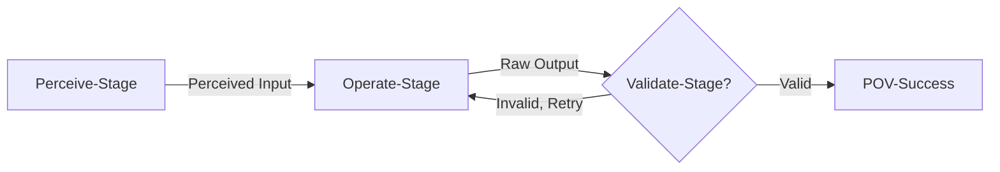

# POV: Perceive → Operate → Validate Execution Model

## Motivation: POV – A Robust Execution Protocol for the GenAI Era

> "**Be liberal in what you accept, and conservative in what you send.**"
> — *Jon Postel, RFC 761 (1980)*

This simple but profound principle, coined in the early days of internet protocol design, remains one of the most enduring foundations for building resilient systems. In today's world of probabilistic AI and structured computation, its relevance has never been greater.

As we enter the **GenAI era**, we are witnessing a rapid convergence of **natural language understanding, symbolic reasoning, tool-use, and program synthesis**. Language models can now infer vague intent, generate structured plans, and execute arbitrary code. But they do so with **unpredictable semantics**, **fragile formatting**, and **opaque failure modes**.

Consider a simple agent task: summarizing an email. A naive approach might be:

```
# Naive approach - directly passing user input as prompt
email_summary = llm.generate(prompt=user_provided_email_text)
```

This often fails because `user_provided_email_text` might be too long, lack clear instructions, or contain confusing metadata. The agent needs to intelligently **perceive** the core summarization intent and the relevant content, then **operate** by sending a well-formed, optimized prompt to the LLM. Without a structured approach, this "pre-processing" becomes complex, ad-hoc, and error-prone.

This makes integration into **symbolic, software, or API-driven systems** extremely difficult. Outputs may be:

* Incorrect in format
* Semantically incoherent
* Missing required fields
* Failing silently or behaving nondeterministically

This is not a peripheral issue. It is the **central challenge** of turning generative models into **reliable system components**.

---

## The Neurosymbolic Opportunity

The promise of **neurosymbolic systems** is to **combine the flexibility of learning-based models with the rigor of symbolic computation**.

* Language models excel at **understanding messy, underspecified, human-centric input**.
* Symbolic components excel at **structured execution, error-checking, and guarantees**.

But today's tooling lacks a unifying control structure to bridge the two safely.

What's missing is an **execution framework** that:

* Tolerates fuzziness on the input side
* Enables intelligent, adaptive operation at the core, including dynamic prompt optimization or context-sensitive adjustments to how tasks are performed.
* Enforces structure and validation on the output side
* Retries, recovers, and learns from failure

---

## ✅ POV: A Universal Contract for Robust Agent Execution



The **Perceive → Operate → Validate (POV)** protocol embodies this pattern:

1. **Perceive**: Accept inputs with fault tolerance and context sensitivity. For instance, in the email summarization example above, this phase would go beyond naively accepting the raw email. It would normalize the user's request, identify the actual email content, potentially use a `CodeContextAnalyzer` to understand that a concise summary is expected (based on how `email_summary` might be used later in the code), and **transform this into an optimized prompt** (e.g., by truncating the email, adding specific instructions like "Summarize the key points of the following email in 3 sentences:", and removing irrelevant headers). This optimized prompt is then passed to the `Operate` phase.

2. **Operate**: Execute the core function or plan using the (potentially optimized) input from the `Perceive` phase. This can be a tool call, LLM generation (with an enhanced prompt), symbolic program, or composite chain, utilizing the (potentially rich) `perceived_input`.

3. **Validate**: Strictly check the output against `pov_status.expected_output_type` and other criteria. Ensure it meets structural, semantic, or type-based expectations. If it doesn't, retry the operate stage with introspective awareness of failure context.

---

## 🛠 Why POV Is Necessary Now

In a world where:

* LLMs hallucinate
* APIs break with malformed payloads
* Tool-using agents generate invalid commands
* Users issue ambiguous queries
* Planning and execution are lossy

...we need a **robust, extensible execution model** that embraces the **flexibility of generative inference** *without compromising the guarantees of structured computation*.

POV is that model.

---

## 🌉 Positioning POV as the Core Neurosymbolic Bridge

POV becomes the **core abstraction** for runtime control in modern AI systems:

| Use Case | POV Behavior |
| ----------------------- | ----------------------------------------------------------------------------- |
| LLM agent tool call | Perceive (NL → args), Operate (tool call), Validate (schema) |
| Natural language → code | Perceive (prompt parse), Operate (generate code), Validate (syntax/type check) |
| Autonomous planner | Perceive (goal framing), Operate (plan/step), Validate (plan constraints met) |
| Semantic search | Perceive (query), Operate (retrieve), Validate (enough results, no contradiction) |

POV provides a **first-class retry loop**, **extensible Perceive and Validate logic**, and a runtime introspection context (`pov_status`)—all of which are critical for **safe AI deployment**, **tool chaining**, and **adaptive agent behavior**.

---

## Final Word

> **POV operationalizes Postel's principle in the age of generative systems.**
> It allows us to tolerate ambiguity, operate intelligently, and enforce correctness—**bridging the neural and the symbolic, reliably.**

POV isn't just a wrapper.
It's the execution protocol at the **center of modern neurosymbolic intelligence**.

---

## POV Design and Specification

### ✨ POV in Action: `reason()` Adapting to Context

The power and everyday utility of the POV execution model are clearly demonstrated by Dana's built-in `reason()` function. `reason()` leverages POV to adapt its output based on the context provided by the Dana engineer, particularly through type hints. Consider the following interaction:

```python
>>> pi_description = reason("what is pi?")
# pi_description is now a string:
# "Pi (π) is a mathematical constant representing the ratio of a circle's circumference to its diameter. Its approximate value is:
# π ≈ 3.14159
# But it is an irrational number, meaning: ..."

>>> pi_float: float = reason("what is pi?")
# pi_float is now the float: 3.14159265

>>> radius = 2 ; area = pi_float * radius**2
# area is now the float: 12.5663706
```

In the first call, with no specific type hint for `pi_description` (or if `-> any` or `-> str` was implied), `reason()` returns a descriptive string. In the second call, the explicit type hint `pi_float: float` signals to POV that a floating-point number is desired. The POV framework, underpinning `reason()`:

1. **Perceives** the request "what is pi?" and critically, the `expected_output_type` of `float` from the type hint.
2. **Operates** by querying its underlying AI model, likely instructing it to provide a numerical value for Pi.
3. **Validates** that the AI's output can be (or is) a float, ensuring the assignment to `pi_float` is type-safe and that `pi_float` can be immediately used in numerical calculations like `area = pi_float * radius**2`.

This dynamic adaptation based on context, especially the desired output type, without changing the core textual prompt, is a hallmark of the POV model and a key to Dana's expressive power and developer convenience.

---

This section outlines the POV (Perceive → Operate → Validate) framework, designed for implementation in Python as part of the Dana runtime.

* The **POV control logic** and retry loop is implemented in Python.
* The **custom P and V functions** are authored in **Dana**.
* The **Operate function** is decorated in Python and becomes the execution anchor.
* The framework retries execution based on validation outcomes, with a default of **`max_retries = 3`**.
* The `pov_status` object is available to all stages as part of the **sandbox context**, enabling adaptive behavior or introspection.

---

### 🔹 `@pov(...)` Decorator

Wraps a Python-defined **Operate** function with POV lifecycle logic. Accepts:

| Parameter | Type | Description |
| ------------- | ----------------------- | ---------------------------------------------------------------------------------------------------------- |
| `perceive` | DanaFunction | Optional Dana function that maps raw input to perceived input |
| `validate` | DanaFunction | Optional Dana function that returns `true` if output is valid |
| `max_retries` | `int` | Number of retries on validation failure (default = `3`) |
| `expected_output_type` | `Any` | Optional. The expected type or structure of the final output. Used by `Validate` and can inform `Perceive`/`Operate`. |

---

### 🔹 Dana ↔ Python Interface Contracts

| Stage | Input Type | Output Type |
| ---------- | ------------------------------- | ------------------------------------- |
| `Perceive` | Dana value (`Any`) | Dana-typed input for `Operate` |
| `Operate` | Python or Dana-compatible input | Python output (`Any`) |
| `Validate` | Python output (`Any`) | Boolean Dana result (`true` if valid) |

Python will:

* Convert inputs/outputs as needed to/from Dana's runtime types
* Provide `pov_status` as a local variable in Dana context

---

### 🔹 `pov_status` in Dana

Exposed in the Dana local scope (per invocation), structured as:

```python
{
 "attempt": int,
 "last_failure": str or null,
 "max_retries": int,
 "successful": bool,
 "perceived_input": Any, # Output of the Perceive phase. Can be a simple transformed value or a richer structure/dictionary \
 # containing the normalized input along with relevant code-site and ambient system context \
 # gathered during perception.
 "raw_output": Any, # Python object output by the Operate phase.
 "expected_output_type": Any # The type/structure expected for the final output. Populated from decorator arg or Perceive phase.
}
```

Can be used in Dana validation functions for adaptive logic (e.g. "on second retry, try a stricter check").

---

### Kontext Rich Context in POV

The power of the POV model is significantly enhanced by its ability to leverage rich contextual information within each phase, particularly during `Perceive` but also accessible during `Operate` and `Validate` (via `pov_status.perceived_input`). This allows for more intelligent and adaptive behavior. Key types of context include:

* Code-Site Context: Derived from the Dana source code where the POV-enabled function is called. This is akin to how a human developer understands a function call by looking at its surroundings. Examples include:
 * `comments`: Block or inline comments near the call site that might explain intent or provide hints.
 * `variable_context`: Names and inferred types of nearby variables.
 * `type_hints_at_call`: If the function call is part of an assignment with a type hint (e.g., `my_var: ExpectedType = pov_function(...)`), this `ExpectedType` can be crucial for the `Perceive` phase to determine the `expected_output_type` if not explicitly provided to the decorator.
 * `surrounding_code_lines`: A few lines of code before and after the call.
 * `parent_function_name`: The name of the Dana function enclosing the POV call.
 The mechanism for gathering this (e.g., a conceptual `CodeContextAnalyzer` invoked by the POV framework during the Perceive phase) is an important implementation detail.

* Ambient System Context: Broader operational parameters available from the Dana sandbox or system environment. These provide overarching guidance or constraints. Examples:
 * `system:__pov_profile` (or `system:__dana_ipv_profile` if aligning with older concepts): An identifier for an active POV execution profile (e.g., "default", "strict_validation", "creative_generation", "fault_tolerant_integration"). This can dictate the behavior of P, O, and V stages.
 * `system:__pov_settings_override`: A dictionary allowing fine-grained overrides for specific POV behaviors.
 * `system:__current_task_id`, `system:__current_task_description`: Information about the ongoing agent task.
 * `system:__session_id`, `system:__user_id`: Session and user identifiers.
 * `system:__locale`: Preferred locale for localization or language-specific behavior.
 * `system:__active_domains`: A list of active knowledge domains (e.g., `["finance", "medical_records"]`) to help scope or specialize the P/A/V logic.

By making this context available (primarily through the `perceived_input` object passed from `Perceive` to `Operate`, and available in `pov_status`), the POV framework enables functions to be highly adaptive to their specific invocation circumstances and the broader operational environment.

---

## ✅ Example Usage (in Python)

```python
@pov(
 perceive="Dana::parse_input",
 validate="Dana::check_valid_summary",
 max_retries=3
)
def summarize(perceived_input):
 return llm_generate(perceived_input)
```

Where:

* `Dana::parse_input` might coerce natural language into a prompt object
* `Dana::check_valid_summary` ensures the result is JSON with a `summary` field

---

## Future-Proofing Considerations

* Support for async `Operate` functions
* Support for post-`Structure` transformation hooks (optional)
* Retry strategy abstraction (`exponential_backoff`, `adaptive`, etc.)
* Integration with Dana state containers for cross-call memory
* POV Execution Profiles/Strategies: Building on the `system:__pov_profile` idea, formally define different POV execution profiles. For example:
 * `LLMInteractionPOV`: `Perceive` phase focuses on detailed prompt engineering using code-site and ambient context; `Operate` calls an LLM; `Validate` checks for hallucinations or structural compliance.
 * `DataValidationPOV`: `Perceive` might identify data source and schema; `Operate` performs data retrieval/transformation; `Validate` performs rigorous schema and integrity checks.
 * `SafeToolCallPOV`: `Perceive` understands tool input requirements; `Operate` executes an external tool; `Validate` checks for successful execution and expected output structure.
 These profiles could be implemented by allowing different Dana functions (or even specialized Python logic) to be specified for the P, A, and V stages based on the active profile.
* Advanced `CodeContextAnalyzer`: Developing a sophisticated `CodeContextAnalyzer` that can robustly extract meaningful information from Dana code, potentially handling minified or uncommented code through heuristics or lightweight parsing.

---

## Future-Proofing Considerations

* Support for async `Operate` functions
* Support for post-`Structure` transformation hooks (optional)
* Retry strategy abstraction (`exponential_backoff`, `adaptive`, etc.)
* Integration with Dana state containers for cross-call memory