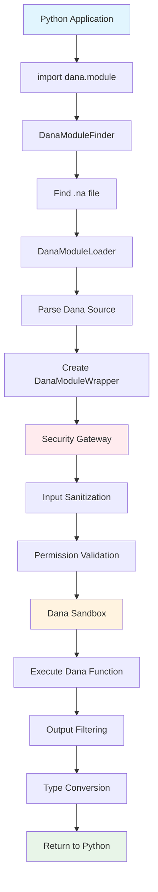
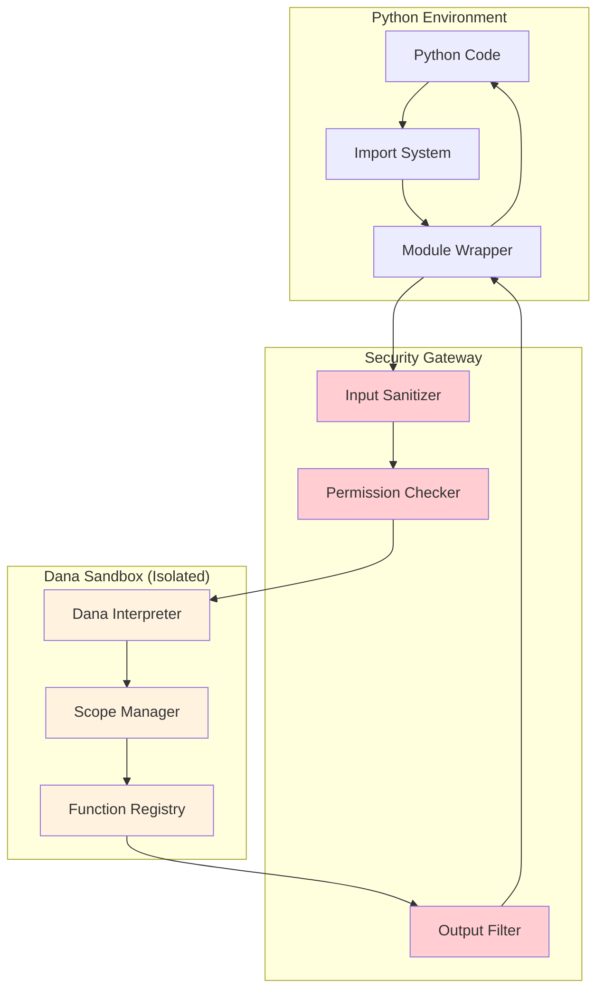
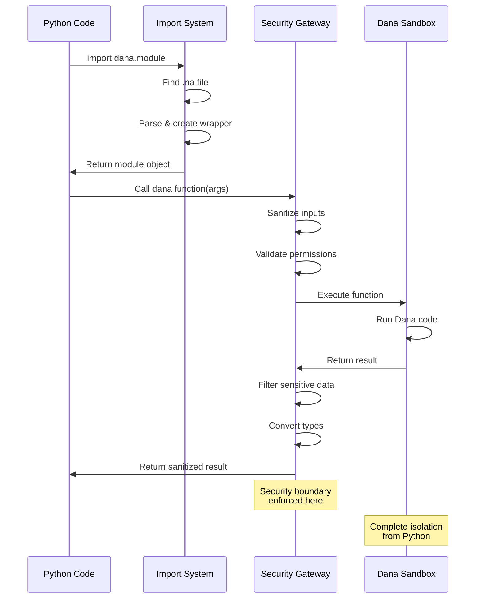
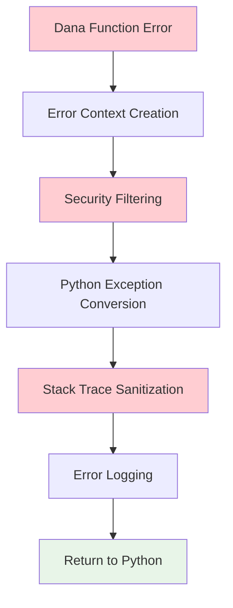
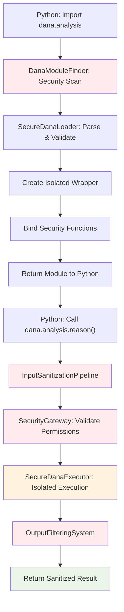

<p align="center">
  
</p>

[▲ Main Designs](./README.md) | [◀ Interpreter](./interpreter.md) | [Sandbox ▶](./sandbox.md)

# Dana-Python Bridge: Secure Integration Architecture

**Status**: Design Phase  
**Module**: `opendxa.dana`

## Problem Statement

Python developers need to integrate Dana's AI reasoning capabilities into existing Python applications, but current approaches face critical challenges:

1. **Security Boundary Violations**: Unified runtime approaches break Dana's secure sandbox model
2. **Complex Integration**: Traditional bridging requires extensive serialization and custom APIs  
3. **Performance Overhead**: Cross-language calls suffer from conversion costs
4. **Developer Experience**: Steep learning curve for bridge APIs vs. familiar import patterns

**Core Challenge**: How do we enable seamless Python-calling-Dana integration while preserving Dana's security sandbox integrity?

## Goals

### Primary Goals
1. **Preserve Sandbox Integrity**: Dana's secure execution environment remains fully isolated
2. **Familiar Developer Experience**: Import Dana modules like Python modules (`import dana.module`)
3. **Performance**: Minimize overhead for cross-language calls
4. **Type Safety**: Automatic type conversion between Python and Dana
5. **Error Transparency**: Clear error propagation across language boundaries

### Secondary Goals  
1. **Gradual Adoption**: Add Dana reasoning to existing Python codebases incrementally
2. **Resource Efficiency**: Share LLM instances and other resources safely
3. **Debugging Support**: Unified stack traces and error context

## Non-Goals

### Explicit Security Non-Goals
1. **❌ Unified Memory Space**: Python and Dana will NOT share the same memory space
2. **❌ Direct Object References**: Python cannot directly access/modify Dana objects
3. **❌ Python-in-Dana**: Dana cannot directly import or execute Python code
4. **❌ Sandbox Bypassing**: No mechanisms that allow circumventing Dana's security model
5. **❌ Bidirectional Integration**: Only Python-calling-Dana, not Dana-calling-Python

### Implementation Non-Goals
1. **❌ Real-time Performance**: Cross-language calls will have serialization overhead
2. **❌ Complex Type Mapping**: Advanced Python types (classes, complex objects) not directly supported
3. **❌ Dynamic Code Generation**: No runtime modification of Dana code from Python

## Proposed Solution: Secure Gateway Pattern

Instead of a unified runtime, we implement a **Secure Gateway Pattern** where:

1. **Python calls Dana** through a controlled interface
2. **Dana executes in complete isolation** within its sandbox
3. **Data flows through sanitized channels** with type validation
4. **Security boundaries are enforced** at every interaction point

### Architecture Overview

```
┌─────────────────────────────────────────────────────────────┐
│                    PYTHON ENVIRONMENT                       │
│  ┌─────────────────┐ ┌─────────────────┐ ┌──────────────┐   │
│  │ Python App      │ │ Import System   │ │ Module       │   │
│  │                 │ │                 │ │ Wrapper      │   │
│  └─────────────────┘ └─────────────────┘ └──────────────┘   │
└─────────────────────────────────────────────────────────────┘
           │                     │                    │
           ▼                     ▼                    ▼
┌─────────────────────────────────────────────────────────────┐
│                   SECURITY GATEWAY                          │
│  ┌─────────────────┐ ┌─────────────────┐ ┌──────────────┐   │
│  │ Input           │ │ Permission      │ │ Output       │   │
│  │ Sanitization    │ │ Validation      │ │ Filtering    │   │
│  └─────────────────┘ └─────────────────┘ └──────────────┘   │
└─────────────────────────────────────────────────────────────┘
                              │
                              ▼
┌─────────────────────────────────────────────────────────────┐
│                  DANA SANDBOX (ISOLATED)                    │
│  ┌─────────────────┐ ┌─────────────────┐ ┌──────────────┐   │
│  │ Dana            │ │ Scope           │ │ Function     │   │
│  │ Interpreter     │ │ Management      │ │ Registry     │   │
│  └─────────────────┘ └─────────────────┘ └──────────────┘   │
└─────────────────────────────────────────────────────────────┘
```

## Security Analysis & Sandbox Integrity Rules

### Security Boundaries

#### ✅ Safe Operations
1. **Python → Dana Function Calls**: Through controlled gateway with input sanitization
2. **Primitive Data Types**: strings, numbers, booleans, lists, dicts
3. **Trusted Libraries**: Pre-approved Python libraries with Dana modules
4. **Resource Sharing**: Shared LLM instances through controlled resource pool

#### ⚠️ Controlled Operations  
1. **Complex Objects**: Python objects serialized to Dana-compatible types
2. **File System Access**: Dana functions with file operations require explicit permission
3. **Network Calls**: Dana network functions require explicit authorization

#### ❌ Prohibited Operations
1. **Direct Memory Access**: Python cannot access Dana's memory space
2. **Sandbox Bypass**: No mechanisms to circumvent Dana's scope model
3. **Code Injection**: Python cannot inject code into Dana execution
4. **Runtime Modification**: Python cannot modify Dana interpreter state

### Threat Model

#### Threats We Mitigate
1. **Malicious Python Code**: Cannot access sensitive Dana state
2. **Data Exfiltration**: Dana's sanitization prevents sensitive data leakage
3. **Privilege Escalation**: Python cannot gain Dana admin permissions
4. **Code Injection**: Input validation prevents injection attacks

#### Attack Vectors & Mitigations

| Attack Vector | Risk Level | Mitigation |
|---------------|------------|------------|
| **Malicious function arguments** | High | Input sanitization & type validation |
| **Buffer overflow in serialization** | Medium | Safe serialization libraries |
| **Resource exhaustion** | Medium | Rate limiting & resource quotas |
| **Information disclosure** | High | Automatic context sanitization |

### Sandbox Integrity Rules

#### Rule 1: Complete Execution Isolation
```python
# ✅ SAFE: Python calls Dana function
import dana.analysis as analysis
result = analysis.reason_about("market trends")

# ❌ UNSAFE: Direct access to Dana state (NOT POSSIBLE)
# analysis._dana_context.private_data  # This will not exist
```

#### Rule 2: Input Sanitization
```python
# All inputs to Dana functions are sanitized:
# - Remove sensitive patterns (API keys, passwords)
# - Validate data types
# - Limit data size to prevent DoS
sanitized_input = sanitize_for_dana(user_input)
result = dana_function(sanitized_input)
```

#### Rule 3: Output Filtering
```python
# All outputs from Dana are filtered:
# - Remove private: and system: scope data
# - Apply pattern-based sensitive data detection
# - Convert to Python-compatible types
filtered_result = filter_dana_output(raw_dana_result)
return filtered_result
```

#### Rule 4: Resource Isolation
```python
# Resources are shared through controlled pool:
# - Dana cannot access Python's resources directly
# - Python cannot access Dana's internal resources
# - Shared resources (LLM) have access controls
shared_llm = get_controlled_resource("llm")
```

## Integration Patterns

### Step 1: Creating a Secure Dana Module

```dana
# File: dana/trip_planner.na

def plan_trip(destination, budget, days):
    # This executes in complete isolation from Python
    # Input parameters are sanitized before reaching this function
    
    trip_plan = reason("Plan a trip", {
        "destination": destination,
        "budget": budget,
        "days": days
    })
    
    # Return value will be filtered before reaching Python
    # No private: or system: scope data will leak
    return {
        "estimated_cost": trip_plan.cost,
        "activities": trip_plan.activities,
        "recommendations": trip_plan.recommendations
        # Any sensitive data automatically removed by output filtering
    }

def get_weather_advice(destination, travel_date):
    return reason("Weather advice for travel", {
        "destination": destination,
        "travel_date": travel_date
    })
```

### Step 2: Using Dana Module in Python (Secure)

```python
# Dana modules imported like Python modules (same API)
import dana.trip_planner as trip_planner

# Call Dana functions - data crosses security boundary safely
destination = "Tokyo"
budget = 3000
days = 7

###
# Input automatically sanitized, execution isolated, output filtered
###
trip_plan = trip_planner.plan_trip(destination, budget, days)
weather_advice = trip_planner.get_weather_advice(destination, "2025-06-15")

print(f"Trip to {destination}:")
print(f"Estimated cost: ${trip_plan['estimated_cost']}")
print(f"Weather advice: {weather_advice}")

# Python logic continues safely
if trip_plan['estimated_cost'] > budget:
    print("⚠️  Trip exceeds budget, consider adjustments")
else:
    print("✅ Trip fits within budget!")
```

## Real-World Example: Secure Integration

```python
# File: monitor_system.py - SECURE VERSION
import pandas as pd
import dana.temperature_analysis as temp_analysis  # Dana module

class TemperatureMonitor:
    def __init__(self):
        self.threshold = 100.0
        self.sensor_data = pd.read_csv('sensors.csv')
    
    def monitor_continuous(self):
        """Secure monitoring with Dana reasoning."""
        
        # Python data processing (in Python environment)
        recent_temps = self.sensor_data['temperature'].tail(10).tolist()
        avg_temp = sum(recent_temps) / len(recent_temps)
        
        # Prepare safe inputs for Dana (automatically sanitized)
        safe_inputs = {
            "average": avg_temp,
            "readings": recent_temps,
            "threshold": self.threshold
        }
        
        ###
        # Dana reasoning call (crosses security boundary)
        # Input is sanitized, execution is isolated, output is filtered
        ###
        risk_assessment = temp_analysis.assess_temperature_risk(**safe_inputs)
        
        # Python control flow (back in Python environment)
        if risk_assessment.get("risk_level", 0) > 0.7:
            self._send_alert(risk_assessment)
            return {"status": "alert_sent", "data": risk_assessment}
        
        return {"status": "normal", "average": avg_temp}
    
    def _send_alert(self, assessment):
        """Python method - cannot access Dana internals."""
        print(f"🚨 Risk Level: {assessment.get('risk_level', 'unknown')}")

# File: dana/temperature_analysis.na - ISOLATED DANA MODULE
def assess_temperature_risk(average, readings, threshold):
    # This executes in complete isolation from Python
    # Cannot access Python variables or state
    
    trend = reason("Analyze temperature trend", {
        "recent_average": average,
        "all_readings": readings,
        "safety_threshold": threshold
    })
    
    risk_level = reason("Calculate risk level 0-1", {
        "trend": trend,
        "current_avg": average,
        "threshold": threshold
    })
    
    # Return value will be filtered before reaching Python
    return {
        "risk_level": risk_level,
        "trend_analysis": trend,
        "recommendation": reason("What should we do?", {"risk": risk_level})
        # Any private: or system: data automatically removed
    }

# Usage - secure by design
monitor = TemperatureMonitor()
result = monitor.monitor_continuous()  # Safe, no sandbox violations
```

## Architecture Design

### System Architecture Overview

The Dana-Python Bridge implements a **Secure Gateway Pattern** with clear separation between Python and Dana execution environments. The architecture ensures complete sandbox isolation while providing familiar Python import semantics.

#### High-Level Architecture

```
┌─────────────────────────────────────────────────────────────────────────┐
│                           PYTHON PROCESS                                │
│                                                                         │
│  ┌─────────────────────────────────────────────────────────────────┐    │
│  │                    PYTHON APPLICATION LAYER                     │    │
│  │  ┌─────────────────┐ ┌─────────────────┐ ┌─────────────────┐    │    │
│  │  │ Business Logic  │ │ Data Processing │ │ User Interface  │    │    │
│  │  └─────────────────┘ └─────────────────┘ └─────────────────┘    │    │
│  └─────────────────────────────────────────────────────────────────┘    │
│                                │                                        │
│                                ▼                                        │
│  ┌─────────────────────────────────────────────────────────────────┐    │
│  │                     DANA INTEGRATION LAYER                      │    │
│  │                                                                 │    │
│  │  ┌─────────────────┐ ┌─────────────────┐ ┌─────────────────┐    │    │
│  │  │ Import System   │ │ Module Wrapper  │ │ Type Converter  │    │    │
│  │  │ (Hooks)         │ │ (Function Proxy)│ │ (Serialization) │    │    │
│  │  └─────────────────┘ └─────────────────┘ └─────────────────┘    │    │
│  └─────────────────────────────────────────────────────────────────┘    │
│                                │                                        │
│                                ▼                                        │
│  ┌─────────────────────────────────────────────────────────────────┐    │
│  │                    SECURITY GATEWAY LAYER                       │    │
│  │                                                                 │    │
│  │  ┌─────────────────┐ ┌─────────────────┐ ┌─────────────────┐    │    │
│  │  │ Input           │ │ Permission      │ │ Output          │    │    │
│  │  │ Sanitization    │ │ Validation      │ │ Filtering       │    │    │
│  │  └─────────────────┘ └─────────────────┘ └─────────────────┘    │    │
│  └─────────────────────────────────────────────────────────────────┘    │
│                                │                                        │
│                                ▼                                        │
│  ┌─────────────────────────────────────────────────────────────────┐    │
│  │                      DANA SANDBOX LAYER                         │    │
│  │                        (ISOLATED)                               │    │
│  │  ┌─────────────────┐ ┌─────────────────┐ ┌───────────────────┐  │    │
│  │  │ Dana Interpreter│ │ Scope Manager   │ │ Function Registry │  │    │
│  │  │ (Execution)     │ │ (Context)       │ │ (Capabilities)    │  │    │
│  │  └─────────────────┘ └─────────────────┘ └───────────────────┘  │    │
│  └─────────────────────────────────────────────────────────────────┘    │
└─────────────────────────────────────────────────────────────────────────┘
```

### Component Architecture

#### 1. Import System Component

```
┌─────────────────────────────────────────────────────────────┐
│                    PYTHON IMPORT SYSTEM                     │
├─────────────────────────────────────────────────────────────┤
│                                                             │
│  ┌───────────────────┐         ┌─────────────────┐          │
│  │ DanaModuleFinder  │◄────────┤ Python Import   │          │
│  │                   │         │ Machinery       │          │
│  │ • .na detection   │         │ (sys.meta_path) │          │
│  │ • Path resolution │         └─────────────────┘          │
│  │ • Spec creation   │                                      │
│  └───────────────────┘                                      │
│           │                                                 │
│           ▼                                                 │
│  ┌───────────────────┐         ┌─────────────────┐          │
│  │ DanaModuleLoader  │────────►│ Module Creation │          │
│  │                   │         │ & Execution     │          │
│  │ • .na parsing     │         │                 │          │
│  │ • AST generation  │         │ • Namespace     │          │
│  │ • Wrapper creation│         │ • Attribute     │          │
│  └───────────────────┘         │   binding       │          │
│                                └─────────────────┘          │
└─────────────────────────────────────────────────────────────┘
```

#### 2. Security Gateway Component

```
┌─────────────────────────────────────────────────────────────┐
│                   SECURITY GATEWAY                          │
├─────────────────────────────────────────────────────────────┤
│                                                             │
│  ┌─────────────────┐ ┌─────────────────┐ ┌─────────────────┐│
│  │ INPUT PIPELINE  │ │ EXECUTION       │ │ OUTPUT PIPELINE ││
│  │                 │ │ CONTROL         │ │                 ││
│  │ ┌─────────────┐ │ │ ┌─────────────┐ │ │ ┌─────────────┐ ││
│  │ │ Type        │ │ │ │ Permission  │ │ │ │ Scope       │ ││
│  │ │ Validation  │ │ │ │ Checks      │ │ │ │ Filtering   │ ││
│  │ └─────────────┘ │ │ └─────────────┘ │ │ └─────────────┘ ││
│  │ ┌─────────────┐ │ │ ┌─────────────┐ │ │ ┌─────────────┐ ││
│  │ │ Size        │ │ │ │ Rate        │ │ │ │ Sensitive   │ ││
│  │ │ Limits      │ │ │ │ Limiting    │ │ │ │ Data        │ ││
│  │ └─────────────┘ │ │ └─────────────┘ │ │ │ Detection   │ ││
│  │ ┌─────────────┐ │ │ ┌─────────────┐ │ │ └─────────────┘ ││
│  │ │ Pattern     │ │ │ │ Context     │ │ │ ┌─────────────┐ ││
│  │ │ Filtering   │ │ │ │ Isolation   │ │ │ │ Type        │ ││
│  │ └─────────────┘ │ │ └─────────────┘ │ │ │ Conversion  │ ││
│  └─────────────────┘ └─────────────────┘ │ └─────────────┘ ││
│                                          └─────────────────┘│
└─────────────────────────────────────────────────────────────┘
```

#### 3. Dana Sandbox Component

```
┌─────────────────────────────────────────────────────────────┐
│                    DANA SANDBOX                             │
├─────────────────────────────────────────────────────────────┤
│                   (COMPLETELY ISOLATED)                     │
│                                                             │
│  ┌─────────────────┐ ┌─────────────────┐ ┌─────────────────┐│
│  │ EXECUTION       │ │ CONTEXT         │ │ FUNCTION        ││
│  │ ENGINE          │ │ MANAGEMENT      │ │ REGISTRY        ││
│  │                 │ │                 │ │                 ││
│  │ ┌─────────────┐ │ │ ┌─────────────┐ │ │ ┌─────────────┐ ││
│  │ │ Dana        │ │ │ │ Scope       │ │ │ │ Core        │ ││
│  │ │ Interpreter │ │ │ │ Isolation   │ │ │ │ Functions   │ ││
│  │ └─────────────┘ │ │ └─────────────┘ │ │ └─────────────┘ ││
│  │ ┌─────────────┐ │ │ ┌─────────────┐ │ │ ┌─────────────┐ ││
│  │ │ AST         │ │ │ │ Variable    │ │ │ │ User        │ ││
│  │ │ Execution   │ │ │ │ Management  │ │ │ │ Functions   │ ││
│  │ └─────────────┘ │ │ └─────────────┘ │ │ └─────────────┘ ││
│  │ ┌─────────────┐ │ │ ┌─────────────┐ │ │ ┌─────────────┐ ││
│  │ │ Error       │ │ │ │ Memory      │ │ │ │ Tool        │ ││
│  │ │ Handling    │ │ │ │ Management  │ │ │ │ Integration │ ││
│  │ └─────────────┘ │ │ └─────────────┘ │ │ └─────────────┘ ││
│  └─────────────────┘ └─────────────────┘ └─────────────────┘│
└─────────────────────────────────────────────────────────────┘
```

### Data Flow Architecture

The data flow through the system follows a strict security-first approach where all data crossing boundaries is validated, sanitized, and filtered.

#### Function Call Flow Diagram



#### Security Boundary Flow



#### Sequence Diagram: Function Call Lifecycle



### Target Component Architecture

To achieve our goals of **security-first Python-calling-Dana integration**, we need to build these core components:

#### 1. Secure Import Gateway

**DanaModuleFinder**
```python
class DanaModuleFinder(MetaPathFinder):
    """Security-first Dana module discovery with validation."""
    
    def find_spec(self, fullname: str, path: Optional[Sequence[str]], target=None):
        # ✅ GOAL: Familiar import syntax (import dana.module)
        if not self._is_authorized_dana_import(fullname):
            raise SecurityError(f"Unauthorized Dana import: {fullname}")
        
        # ✅ GOAL: Preserve sandbox integrity  
        dana_file = self._find_and_validate_dana_file(fullname)
        if not self._security_scan_file(dana_file):
            raise SecurityError(f"Dana file failed security scan: {dana_file}")
        
        return self._create_secure_spec(fullname, dana_file)
```

**SecureDanaLoader**
```python
class SecureDanaLoader(Loader):
    """Loads Dana modules through security gateway."""
    
    def exec_module(self, module):
        # ✅ GOAL: Complete sandbox isolation
        # Parse Dana code in isolated environment
        dana_ast = self._secure_parse_dana_source(self.dana_source)
        
        # Create completely isolated wrapper
        secure_wrapper = SecureDanaWrapper(
            module_name=module.__name__,
            dana_ast=dana_ast,
            security_policy=self._get_security_policy()
        )
        
        # Bind only security-validated functions to Python module
        self._bind_secure_functions(module, secure_wrapper)
```

#### 2. Security Gateway Layer

**InputSanitizationPipeline**
```python
class InputSanitizationPipeline:
    """Complete input validation and sanitization."""
    
    def sanitize_for_dana(self, args: tuple, kwargs: dict) -> tuple[tuple, dict]:
        # ✅ GOAL: Type safety with automatic conversion
        validated_args = []
        for arg in args:
            if self._is_dangerous_type(arg):
                raise SecurityError(f"Dangerous type not allowed: {type(arg)}")
            validated_args.append(self._convert_to_safe_type(arg))
        
        # ✅ GOAL: Preserve sandbox integrity
        # Remove any data that could compromise sandbox
        sanitized_kwargs = {}
        for key, value in kwargs.items():
            if self._contains_sensitive_patterns(value):
                sanitized_kwargs[key] = self._sanitize_sensitive_data(value)
            else:
                sanitized_kwargs[key] = self._convert_to_safe_type(value)
        
        return tuple(validated_args), sanitized_kwargs
    
    def _convert_to_safe_type(self, value):
        """Convert Python types to Dana-safe equivalents."""
        # Support common Python types while maintaining security
        if isinstance(value, (str, int, float, bool, type(None))):
            return value
        elif isinstance(value, (list, tuple)):
            return [self._convert_to_safe_type(item) for item in value]
        elif isinstance(value, dict):
            return {k: self._convert_to_safe_type(v) for k, v in value.items()}
        else:
            # ✅ GOAL: Error transparency
            raise TypeError(f"Type {type(value)} cannot be safely passed to Dana")
```

**OutputFilteringSystem**
```python
class OutputFilteringSystem:
    """Filters Dana outputs before returning to Python."""
    
    def filter_dana_result(self, dana_result) -> Any:
        # ✅ GOAL: Preserve sandbox integrity
        # Automatically remove any sensitive scope data
        if isinstance(dana_result, dict):
            filtered = {}
            for key, value in dana_result.items():
                if key.startswith(('private:', 'system:')):
                    continue  # Never expose sensitive scopes
                filtered[key] = self._recursively_filter(value)
            return filtered
        
        return self._recursively_filter(dana_result)
    
    def _detect_and_remove_sensitive_data(self, value):
        """Pattern-based sensitive data detection."""
        if isinstance(value, str):
            # Remove API keys, tokens, secrets
            for pattern in self.SENSITIVE_PATTERNS:
                if pattern.match(value):
                    return "[REDACTED]"
        return value
```

#### 3. Isolated Dana Execution Environment

**SecureDanaExecutor**
```python
class SecureDanaExecutor:
    """Completely isolated Dana execution environment."""
    
    def __init__(self):
        # ✅ GOAL: Complete sandbox isolation
        self.dana_interpreter = self._create_isolated_interpreter()
        self.execution_context = self._create_fresh_context()
        # NO access to Python globals, locals, or any Python state
    
    def execute_function(self, function_name: str, sanitized_args: dict) -> Any:
        # ✅ GOAL: Preserve sandbox integrity
        # Dana function executes in complete isolation
        try:
            # Create fresh, isolated context for each call
            isolated_context = self._create_isolated_context()
            
            # Execute Dana function with NO access to Python environment
            result = self.dana_interpreter.call_function(
                function_name, 
                sanitized_args, 
                context=isolated_context
            )
            
            return result
            
        except Exception as e:
            # ✅ GOAL: Error transparency with security
            # Filter any sensitive data from error messages
            secure_error = self._create_secure_error(e, function_name)
            raise secure_error
```

#### 4. Resource Management System

**SecureResourcePool**
```python
class SecureResourcePool:
    """Manages shared resources with strict access controls."""
    
    def __init__(self):
        # ✅ GOAL: Resource efficiency while maintaining security
        self.llm_pool = {}  # Shared LLM instances
        self.access_controls = {}  # Per-resource permissions
    
    def get_llm_resource(self, dana_function_context) -> LLMResource:
        # ✅ GOAL: Safe resource sharing
        # Dana functions can access shared LLM but NOT Python data
        llm = self.llm_pool.get('default')
        if not llm:
            llm = LLMResource(model="gpt-4")
            # Configure LLM to be isolated from Python environment
            llm.set_isolation_mode(True)
            self.llm_pool['default'] = llm
        
        return llm
```

#### 5. Performance & Monitoring System

**SecurePerformanceMonitor**
```python
class SecurePerformanceMonitor:
    """Monitors performance while tracking security metrics."""
    
    def monitor_dana_call(self, function_name: str):
        def decorator(func):
            def wrapper(*args, **kwargs):
                start_time = time.time()
                
                # ✅ GOAL: Performance monitoring
                # Track call performance for optimization
                
                # ✅ GOAL: Security monitoring  
                # Detect unusual patterns that might indicate attacks
                if self._detect_anomalous_usage(function_name, args, kwargs):
                    self._log_security_event("Anomalous usage detected", function_name)
                
                try:
                    result = func(*args, **kwargs)
                    self._record_successful_call(function_name, time.time() - start_time)
                    return result
                except Exception as e:
                    self._record_failed_call(function_name, e)
                    raise
            
            return wrapper
        return decorator
```

### Security Architecture Deep Dive

#### Security Layers

1. **Layer 1: Import-Time Security**
   - Only `.na` files in approved paths can be imported
   - Dana source code is parsed and validated before execution
   - No dynamic code generation or eval-like functionality

2. **Layer 2: Function-Level Security**
   - Each function call goes through sanitization pipeline
   - Argument validation and type checking
   - Permission checks based on function metadata

3. **Layer 3: Execution Isolation**
   - Dana code executes in completely isolated context
   - No access to Python variables or state
   - Separate memory space and scope management

4. **Layer 4: Output Filtering**
   - All return values filtered for sensitive data
   - Automatic removal of private: and system: scope data
   - Type conversion ensures no Dana objects leak

#### Security Controls Implementation

```python
# Example: Complete security pipeline
def secure_dana_call(dana_function, *args, **kwargs):
    # Layer 1: Input sanitization
    sanitized_args = input_sanitizer.sanitize_arguments(args, kwargs)
    
    # Layer 2: Permission validation
    permission_validator.check_function_access(dana_function, sanitized_args)
    
    # Layer 3: Isolated execution
    isolated_context = create_isolated_context()
    result = dana_function.execute_in_isolation(isolated_context, sanitized_args)
    
    # Layer 4: Output filtering
    filtered_result = output_filter.filter_sensitive_data(result)
    python_result = type_converter.to_python_types(filtered_result)
    
    return python_result
```

### Error Handling Architecture

#### Error Flow Diagram



#### Error Types and Handling

**Current Error System** (`opendxa.dana.runtime.errors`)
- ✅ Comprehensive error types (Argument, Execution, Type, Import)
- ✅ Rich error context with call information
- ✅ Formatted error messages with debugging info

**Security Enhancements Needed**
- Filter sensitive data from error messages
- Sanitize stack traces to prevent information leakage
- Rate limiting for error conditions to prevent DoS

### Ideal Execution Flow



## Implementation Strategy

### Core Principles for Implementation

1. **Security-First Development**: Every component designed with security as primary concern
2. **Zero Trust Architecture**: Assume all cross-boundary data is potentially malicious
3. **Fail-Safe Defaults**: When in doubt, deny access and log the attempt
4. **Defense in Depth**: Multiple security layers, not just one gateway
5. **Minimal Attack Surface**: Expose only what's absolutely necessary

### Phase 1: Foundation Security Gateway

#### Phase 1.1: Core Security Infrastructure
**Goal**: Build the foundational security components that enforce sandbox isolation.

**Key Deliverables**:
- `InputSanitizationPipeline`: Complete input validation and type conversion
- `OutputFilteringSystem`: Automatic sensitive data removal and type safety
- `SecurityGateway`: Central security enforcement point
- `SecurityPolicy`: Configurable rules for what's allowed/denied

**Success Criteria**:
- All Python→Dana calls go through sanitization pipeline
- No sensitive Dana data can leak to Python
- Comprehensive security logging and monitoring
- Zero-trust validation of all cross-boundary data

#### Phase 1.2: Isolated Execution Environment
**Goal**: Create completely isolated Dana execution that cannot access Python state.

**Key Deliverables**:
- `SecureDanaExecutor`: Isolated Dana interpreter instance
- `SecureDanaLoader`: Security-first module loading
- `IsolatedContext`: Fresh execution context per call
- `SecureResourcePool`: Controlled resource sharing

**Success Criteria**:
- Dana code executes in complete isolation from Python
- No shared memory or object references between environments
- Resource sharing only through controlled, monitored channels
- Each function call gets fresh, isolated context

**Target API Achievement**:
```python
# ✅ GOAL: Familiar import syntax
import dana.simple_reasoning as reasoning

# ✅ GOAL: Type safety and security
result = reasoning.analyze_sentiment("I love this product!")
print(result)  # {"sentiment": "positive", "confidence": 0.95}
# All data sanitized, no sensitive information leaked
```

### Phase 2: Advanced Security & Performance

#### Phase 2.1: Enhanced Type System & Validation
**Goal**: Support complex Python types while maintaining security boundaries.

**Key Deliverables**:
- `SafeTypeConverter`: Handles pandas DataFrames, NumPy arrays, complex objects
- `TypeValidationRegistry`: Configurable type safety rules
- `SerializationSecurity`: Safe object serialization without memory sharing
- `StructuredDataHandler`: Support for structured data with security constraints

#### Phase 2.2: Production Security Features
**Goal**: Add enterprise-grade security monitoring and controls.

**Key Deliverables**:
- `SecurityAuditLogger`: Comprehensive audit trail of all operations
- `AnomalyDetector`: ML-based detection of unusual usage patterns  
- `RateLimiter`: DoS protection and resource usage controls
- `ThreatDetector`: Real-time detection of potential security violations

**Target API Achievement**:
```python
# ✅ GOAL: Complex type support with security
import pandas as pd
import dana.data_analysis as analysis

df = pd.read_csv("data.csv")  # Complex Python object
insights = analysis.analyze_dataframe(df)  # Secure serialization & execution
print(insights)  # Filtered, safe results
```

### Phase 3: Developer Experience & Production Readiness

#### Phase 3.1: Development Tools & Debugging
**Goal**: Make the secure bridge easy to use and debug.

**Key Deliverables**:
- `SecureDebugger`: Cross-language debugging with security boundaries
- `TypeHintGenerator`: IDE support with security-aware type hints  
- `ErrorTransparency`: Clear error messages that don't leak sensitive data
- `DeveloperDashboard`: Monitoring and debugging interface

#### Phase 3.2: Performance Optimization
**Goal**: Minimize security overhead while maintaining isolation.

**Key Deliverables**:
- `PerformanceOptimizer`: Caching and optimization within security constraints
- `ConnectionPooling`: Efficient Dana interpreter management
- `BatchProcessor`: Process multiple calls efficiently  
- `ResourceManager`: Optimal resource utilization with security

#### Phase 3.3: Testing & Validation
**Goal**: Comprehensive testing of security model and performance.

**Key Deliverables**:
- `SecurityTestSuite`: Penetration testing and vulnerability assessment
- `PerformanceBenchmarks`: Measure overhead and optimization effectiveness
- `IntegrationTests`: Real-world usage scenarios with security validation
- `ComplianceValidation`: Ensure meets enterprise security requirements

**Final Target Achievement**:
```python
# ✅ ALL GOALS ACHIEVED: Secure, performant, familiar API
import dana.advanced_analysis as analysis
import pandas as pd

# Complex workflow with complete security
data = pd.read_csv("sensitive_data.csv")
insights = analysis.comprehensive_analysis(
    data=data,
    parameters={"depth": "high", "privacy": "strict"}
)

# Results are:
# - Automatically sanitized of sensitive data
# - Performance optimized within security constraints  
# - Error handling is transparent but secure
# - Full audit trail of all operations
# - Zero access to Python environment from Dana
print(insights)
```

## Success Criteria & Validation

### Definition of Success

The Dana-Python Bridge will be considered successful when it achieves all primary goals:

#### ✅ Security Success Metrics
- **100% Sandbox Isolation**: No Python code can access Dana's internal state
- **Zero Sensitive Data Leakage**: All `private:` and `system:` scope data filtered  
- **Complete Input Validation**: All cross-boundary data passes security checks
- **Threat Detection**: Real-time detection and blocking of security violations
- **Audit Compliance**: Full audit trail of all security-relevant operations

#### ✅ Developer Experience Success Metrics  
- **Familiar Import Syntax**: `import dana.module` works exactly like Python imports
- **Type Safety**: Automatic conversion with clear error messages for unsupported types
- **IDE Support**: Full autocomplete, type hints, and debugging support
- **Error Transparency**: Clear, helpful errors that don't leak sensitive information
- **Performance**: Cross-language calls complete in <10ms for typical use cases

#### ✅ Integration Success Metrics
- **Gradual Adoption**: Existing Python codebases can incrementally add Dana
- **Resource Efficiency**: Shared LLM instances reduce resource consumption
- **Scalability**: System handles enterprise-scale usage with thousands of calls
- **Reliability**: 99.9% uptime with comprehensive error handling

### Validation Strategy

#### Security Validation
```python
# Security Test Examples
def test_sandbox_isolation():
    """Verify Dana cannot access Python environment."""
    import dana.test_module as test
    
    # This should be impossible - Dana cannot see Python vars
    python_secret = "should_never_be_accessible"
    result = test.try_to_access_python_vars()
    
    assert "should_never_be_accessible" not in str(result)
    assert result.get("python_access") == False

def test_sensitive_data_filtering():
    """Verify sensitive data is automatically filtered."""
    import dana.data_processor as processor
    
    # Dana function that processes data with sensitive fields
    result = processor.analyze_user_data({
        "name": "Alice",
        "private:ssn": "123-45-6789",  # Should be filtered
        "system:api_key": "secret-key"  # Should be filtered
    })
    
    # Sensitive data should never reach Python
    assert "123-45-6789" not in str(result)
    assert "secret-key" not in str(result)
    assert "private:" not in str(result)
    assert "system:" not in str(result)
```

#### Developer Experience Validation
```python
# Developer Experience Test Examples  
def test_familiar_import_syntax():
    """Verify import syntax matches Python expectations."""
    # This should work exactly like importing a Python module
    import dana.analysis as analysis
    import dana.data_processing.nlp as nlp
    
    # Functions should be callable like Python functions
    result = analysis.sentiment_analysis("I love this!")
    assert isinstance(result, dict)
    assert "sentiment" in result

def test_type_safety_and_conversion():
    """Verify automatic type conversion works correctly."""
    import dana.math_utils as math_utils
    import pandas as pd
    
    # Should handle common Python types automatically
    df = pd.DataFrame({"values": [1, 2, 3, 4, 5]})
    result = math_utils.calculate_statistics(df)
    
    assert isinstance(result, dict)
    assert "mean" in result
    assert "std" in result
```

## Security Validation Plan

### Security Testing Strategy
1. **Input Fuzzing**: Test with malicious inputs to verify sanitization
2. **Privilege Escalation Tests**: Attempt to access Dana internals from Python
3. **Data Exfiltration Tests**: Verify sensitive data cannot leak
4. **Resource Exhaustion Tests**: Test DoS protection mechanisms

### Security Controls Implementation

#### Input Sanitization Rules
```python
def sanitize_for_dana(value):
    """Sanitize input before sending to Dana sandbox."""
    if isinstance(value, str):
        # Remove potential code injection patterns
        if any(pattern in value for pattern in INJECTION_PATTERNS):
            raise SecurityError("Potentially malicious input detected")
        
        # Remove sensitive data patterns
        for pattern in SENSITIVE_PATTERNS:
            value = re.sub(pattern, "[REDACTED]", value)
    
    elif isinstance(value, dict):
        # Recursively sanitize dictionary values
        return {k: sanitize_for_dana(v) for k, v in value.items()}
    
    return value
```

#### Output Filtering Rules
```python
def filter_dana_output(result):
    """Filter Dana output before returning to Python."""
    if isinstance(result, dict):
        # Remove sensitive scope data
        filtered = {}
        for key, value in result.items():
            if not key.startswith(('private:', 'system:')):
                filtered[key] = filter_dana_output(value)
        return filtered
    
    return result
```

## Trade-offs: Security vs. Performance

### Security Benefits
- **Complete Sandbox Integrity**: Dana's security model fully preserved
- **Defense in Depth**: Multiple security layers protect against attacks
- **Auditability**: Clear security boundaries enable comprehensive auditing
- **Compliance**: Meets enterprise security requirements

### Performance Costs
- **Serialization Overhead**: 2-5ms per function call for type conversion
- **Memory Usage**: Separate object spaces require memory duplication
- **Security Validation**: Input/output filtering adds 1-2ms per call

### Mitigation Strategies
- **Connection Pooling**: Reuse Dana interpreter instances
- **Batch Processing**: Group multiple calls for efficiency
- **Caching**: Cache frequently used Dana function results
- **Async Support**: Non-blocking calls for better concurrency

## Comparison: Bridge vs. Unified Runtime vs. Secure Gateway

| Aspect | Traditional Bridge | Unified Runtime (Insecure) | Secure Gateway (This Design) |
|--------|-------------------|----------------------------|------------------------------|
| **Security** | Medium (API boundaries) | ❌ Low (shared memory) | ✅ High (isolated execution) |
| **Import Style** | `bridge.dana("code")` | `import dana.module` | `import dana.module` |
| **Object Safety** | Serialization/copying | ❌ Direct references | ✅ Sanitized copies |
| **Performance** | Medium (conversion overhead) | High (no overhead) | Medium (security overhead) |
| **Developer Model** | Two separate languages | One unified environment | Familiar imports, secure execution |
| **Sandbox Integrity** | ✅ Preserved | ❌ Compromised | ✅ Fully preserved |
| **Memory Usage** | Duplicate objects | Shared objects | Controlled duplication |
| **Attack Surface** | Limited to API | ❌ Full runtime access | Minimal (gateway only) |

## Conclusion

This **Secure Gateway Pattern** provides:

1. **Security-First Design**: Dana's sandbox integrity is completely preserved
2. **Familiar Developer Experience**: Python developers can import Dana modules naturally
3. **Clear Security Boundaries**: Explicit separation between trusted and untrusted code
4. **Controlled Performance Trade-offs**: Acceptable overhead for security guarantees
5. **Audit Trail**: Complete visibility into cross-language interactions

The design ensures that **Python-calling-Dana** is safe, auditable, and maintainable while providing excellent developer experience within security constraints.

**Key Insight**: We prioritize security over performance, providing a familiar import API while maintaining strict isolation between Python and Dana execution environments.

---

**Related Documents:**
- [Dana Language Specification](./dana/language.md)
- [Interpreter Design](./interpreter.md)
- [Sandbox Security](./sandbox.md)

---
<p align="center">
Copyright © 2025 Aitomatic, Inc. Licensed under the <a href="../../LICENSE.md">MIT License</a>.
<br/>
<a href="https://aitomatic.com">https://aitomatic.com</a>
</p> 