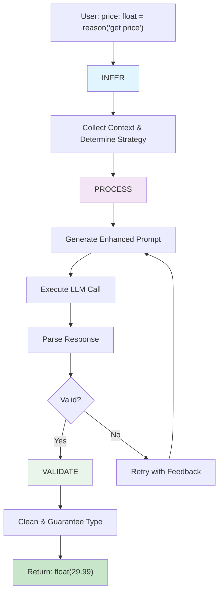
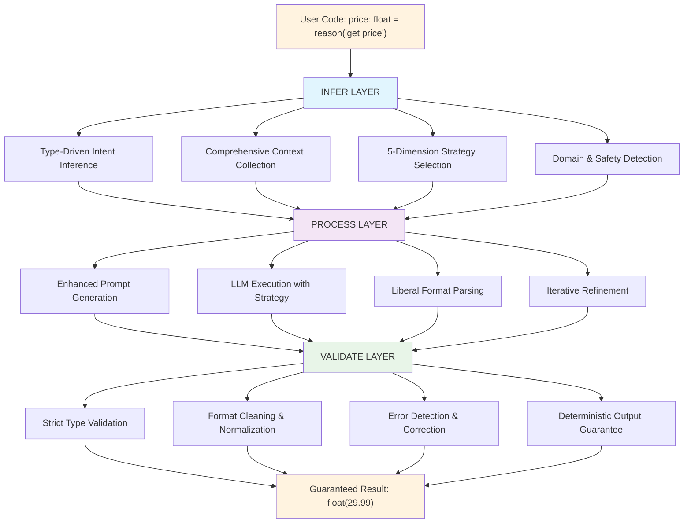
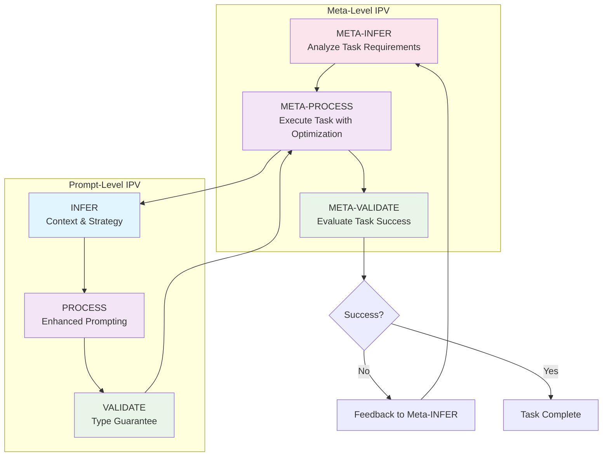

# IPV (Infer-Process-Validate) Architecture

## Overview

Dana introduces **IPV (Infer-Process-Validate)** as a foundational API pattern for intelligent optimization across all system operations. IPV applies **Postel's Law** to create robust, user-friendly interfaces that "be liberal in what you accept, be conservative in what you send."

**Core Philosophy**: IPV makes every Dana operation smarter, more reliable, and more user-friendly by automatically handling the complexity of inference, processing, and validation.

**Key Applications**:
- **Prompt Optimization**: Automatically enhance LLM interactions
- **Function Calls**: Make all function calls more reliable and intelligent
- **Program Execution**: Optimize entire Dana program execution
- **Data Processing**: Handle messy inputs and guarantee clean outputs
- **Error Recovery**: Gracefully handle failures and edge cases

## The IPV Pattern

IPV is a three-phase pattern that can be applied to any operation that needs to be more intelligent and reliable:

### **Universal IPV Phases**

#### **1. INFER (Liberal Input Acceptance)**
- Accept minimal, ambiguous, or messy input
- Apply intelligent inference to understand intent
- Collect relevant context automatically
- Determine optimal processing strategy

#### **2. PROCESS (Generous Transformation)**
- Handle multiple input formats liberally
- Apply adaptive processing strategies
- Retry and iterate when needed
- Extract meaning from complex or inconsistent data

#### **3. VALIDATE (Conservative Output Guarantee)**
- Apply strict validation to ensure quality
- Clean and normalize outputs
- Guarantee type compliance and format consistency
- Provide reliable, deterministic results

### **IPV Applications Across Dana**

#### **Prompt Optimization (Primary Example)**
```dana
# User provides minimal prompt
price: float = reason("get price")

# INFER: Detect financial domain, extraction task, add context
# PROCESS: Handle any LLM response format, parse liberally
# VALIDATE: Guarantee exactly float(29.99), not "$29.99"
```

#### **Function Calls**
```dana
# User calls function with messy data
result = analyze_data(messy_csv_string)

# INFER: Detect data format, analysis requirements, domain context
# PROCESS: Clean data, handle missing values, apply appropriate analysis
# VALIDATE: Ensure output meets expected schema and quality standards
```

#### **File Processing**
```dana
# User loads file with unknown format
data = load_file("unknown_format.txt")

# INFER: Detect file format, encoding, structure
# PROCESS: Parse with appropriate parser, handle errors gracefully
# VALIDATE: Return clean, structured data in expected format
```

#### **API Calls**
```dana
# User makes API call with minimal configuration
response = api_call("get user data")

# INFER: Determine endpoint, authentication, required parameters
# PROCESS: Handle rate limits, retries, different response formats
# VALIDATE: Return clean, typed data with error handling
```

## IPV for Prompt Optimization

Now let's see how IPV specifically applies to prompt optimization:

## Universal IPV API Design

IPV provides a consistent API pattern that can be applied to any Dana operation:

### **Basic IPV Interface**
```dana
# Any operation can use IPV with clean phase-based configuration
result = ipv_operation(input, {
    "infer": {
        "function": custom_infer_function,     # Optional: custom inference function
        "config": {"strategy": "comprehensive", "context_collection": "detailed"}
    },
    "process": {
        "function": custom_process_function,   # Optional: custom processing function
        "config": {"max_iterations": 3, "error_handling": "liberal"}
    },
    "validate": {
        "function": custom_validate_function,  # Optional: custom validation function
        "config": {"quality_threshold": "high", "type_enforcement": "strict"}
    }
})

# Or use defaults with just config
result = ipv_operation(input, {
    "infer": {"config": {"strategy": "comprehensive"}},
    "process": {"config": {"max_iterations": 5}},
    "validate": {"config": {"quality_threshold": "maximum"}}
})

# Or mix custom functions with default config
result = ipv_operation(input, {
    "infer": {"function": domain_expert_infer},  # Custom function, default config
    "process": {"config": {"max_iterations": 3}}, # Default function, custom config
    "validate": {"function": strict_validator}   # Custom function, default config
})
```

### **IPV Function Signatures**
```dana
# Standard signatures for IPV functions
def custom_infer(input: any, context: SandboxContext, options: dict) -> dict:
    """INFER phase: Understand what the operation needs."""
    pass

def custom_process(input: any, enhanced_context: dict, options: dict) -> any:
    """PROCESS phase: Execute the operation with strategy."""
    pass

def custom_validate(result: any, enhanced_context: dict, options: dict) -> any:
    """VALIDATE phase: Ensure output meets requirements."""
    pass
```

### **IPV-Enhanced Operations**

#### **File Operations**
```dana
# Load any file format intelligently
data = ipv_load_file("messy_data.???", {
    "infer": {
        "config": {"detect_format": True, "encoding_detection": True}
    },
    "process": {
        "config": {"error_recovery": "liberal", "format_conversion": "auto"}
    },
    "validate": {
        "config": {"output_schema": "structured_data", "quality_check": True}
    }
})
```

#### **Data Processing**
```dana
# Process messy data intelligently
clean_data = ipv_process_data(raw_data, {
    "infer": {
        "config": {"data_profiling": True, "quality_assessment": True}
    },
    "process": {
        "config": {"missing_value_strategy": "intelligent", "outlier_handling": "auto"}
    },
    "validate": {
        "config": {"data_quality_threshold": "high", "schema_compliance": True}
    }
})
```

#### **API Calls**
```dana
# Make API calls with intelligent handling
response = ipv_api_call("get user data", {
    "infer": {
        "config": {"endpoint_discovery": True, "auth_detection": True}
    },
    "process": {
        "config": {"retry_strategy": "exponential_backoff", "rate_limiting": "auto"}
    },
    "validate": {
        "config": {"response_schema": "user_data_v2", "data_sanitization": True}
    }
})
```

## Prompt Optimization as IPV Application

Prompt optimization is just one specific application of the IPV pattern:

## Foundational Principle: Infer-Process-Validate

Dana's prompt optimization is built on the **Infer-Process-Validate** pattern, which applies **Postel's Law** to AI interactions:

> *"Be liberal in what you accept, be conservative in what you send"* - Jon Postel

### **The Three Phases:**

#### **1. INFER (Be Liberal in Accepting Intent)**
- Accept minimal, ambiguous user prompts
- Apply Do-What-I-Mean intelligence to infer rich context
- Generously interpret user intent from limited information
- Include all available context automatically

#### **2. PROCESS (Transform Generously)**  
- Accept any LLM response format liberally
- Apply intelligent parsing and transformation
- Handle edge cases, formatting variations, and errors gracefully
- Extract meaning from messy or inconsistent outputs

#### **3. VALIDATE (Be Conservative in Output)**
- Guarantee exact type compliance
- Apply strict validation and error correction
- Ensure deterministic, reliable results
- Retry until output meets conservative standards

### **Example in Action:**
```python
# User provides minimal input (liberal acceptance)
price: float = reason("get price")

# INFER: System generously interprets intent
# - Detects financial domain from "price"
# - Infers extraction task from float type
# - Adds comprehensive context automatically

# PROCESS: Accept any LLM response format
# - "The total price is $29.99 (including tax)" → 29.99
# - Liberal parsing handles currency symbols, text, etc.

# VALIDATE: Conservative output guarantee  
# - Strict validation ensures exactly float(29.99)
# - Type guarantee: user gets what annotation promises
```

## The Workhorse Pattern

### **Zero-Config Intelligence**
```python
# The system infers EVERYTHING from the assignment context
price: float = reason("Extract the price from this text")
email: str = reason("Find the email address")
is_urgent: bool = reason("Is this message urgent?")
analysis: dict = reason("Analyze this data")

# Behind the scenes, Dana automatically:
# - Sees expected type and applies appropriate optimization
# - Adds format validation and error handling
# - Ensures deterministic, reliable results
# - Handles edge cases and fallbacks
# - Includes code context (function name, variables, surrounding lines)
# - Adds user context (timezone, location, current time, preferences)
# - Incorporates execution context (recent errors, performance, state)
```

### **Type-Driven Optimization Examples**

#### **Numeric Extraction**
```python
price: float = reason("Get the price")
# Auto-optimized for: exact decimal format, handles currency symbols, returns 0.0 if not found

count: int = reason("How many items?")
# Auto-optimized for: integer format, handles text numbers, clear fallback
```

#### **Text Extraction**
```python
summary: str = reason("Summarize this report")
# Auto-optimized for: clean string, no extra formatting, handles "unable to summarize" case

email: str = reason("Extract email address")
# Auto-optimized for: valid email format, handles "not found" case
```

**The key insight**: LLMs often return annoying markdown formatting like `**bold**` and bullet points. For `str` type, the system automatically:
- Removes all markdown formatting (`**bold**` → `bold`)
- Converts bullet points to clean paragraph text
- Handles whitespace and line breaks properly
- Returns exactly what users expect: clean, readable text

#### **Classification**
```python
is_approved: bool = reason("Should we approve this request?")
# Auto-optimized for: true/false only, no explanations, conservative fallback

category: str = reason("Classify this message", {"options": ["urgent", "normal", "low"]})
# Auto-optimized for: exact option matching, handles ambiguous cases
```

#### **Structured Data**
```python
analysis: dict = reason("Analyze customer feedback")
# Auto-optimized for: valid JSON, consistent structure, error handling

items: list = reason("List the key points")
# Auto-optimized for: array format, consistent item structure
```

## The 5 Optimization Dimensions

Instead of complex nested configurations, Dana uses 5 clear dimensions that are easy to understand and reason about:

### **1. RELIABILITY** - How consistent should outputs be?
- **`maximum`** - Same input = same output (financial data, extraction)
- **`high`** - Consistent format, slight content variation (analysis, classification)
- **`medium`** - Consistent structure, varied content (summaries, explanations)
- **`low`** - Creative variation encouraged (stories, brainstorming)

### **2. PRECISION** - How exact should responses be?
- **`exact`** - Precise numbers, specific facts, no approximations
- **`specific`** - Detailed but allows reasonable interpretation
- **`general`** - High-level, approximate, conceptual
- **`loose`** - Broad strokes, creative interpretation

### **3. SAFETY** - How cautious should the system be?
- **`maximum`** - Medical, legal, financial advice - ultra-conservative
- **`high`** - Business decisions, public communications
- **`medium`** - General analysis, recommendations
- **`low`** - Creative content, casual interactions

### **4. STRUCTURE** - How formatted should output be?
- **`strict`** - Exact JSON schema, specific formats, rigid structure
- **`formatted`** - Consistent organization, clear sections
- **`organized`** - Logical flow, some formatting
- **`free`** - Natural language, minimal formatting

### **5. CONTEXT** - How much background detail?
- **`maximum`** - Full background, examples, methodology, assumptions
- **`detailed`** - Good context, some examples, clear reasoning
- **`standard`** - Basic context, essential information
- **`minimal`** - Just the answer, no extra context

## Type-Driven Defaults

| Type | Reliability | Precision | Safety | Structure | Context | Auto-Cleaning | Why |
|------|-------------|-----------|--------|-----------|---------|---------------|-----|
| **`float`** | maximum | exact | high | strict | minimal | Strip text, extract numbers, handle currency | Numbers must be precise and consistent |
| **`int`** | maximum | exact | high | strict | minimal | Extract integers, handle text numbers | Integers need exact values |
| **`bool`** | maximum | exact | medium | strict | minimal | Parse yes/no, true/false, approved/rejected | True/false must be unambiguous |
| **`str`** | high | specific | medium | organized | standard | **Remove markdown, bullets, clean whitespace** | Text needs consistency but some flexibility |
| **`dict`** | high | specific | medium | strict | detailed | Validate JSON, fix common syntax errors | Structured data needs clear organization |
| **`list`** | high | specific | medium | formatted | standard | Parse arrays, handle bullet points as items | Arrays need consistent item structure |

## API Design

### **Level 1: Automatic (95% of use cases)**
```python
# Just works - no configuration needed
price: float = reason("Extract the price")
summary: str = reason("Summarize this document")
is_valid: bool = reason("Is this data valid?")
```

### **Level 2: Profiles (When you need different behavior)**
```python
# Use built-in profiles for common scenarios
creative_story: str = reason("Write a story", {"profile": "creative"})
financial_analysis: dict = reason("Analyze portfolio", {"profile": "financial"})
scientific_report: str = reason("Analyze experiment", {"profile": "scientific"})
```

### **Level 3: Advanced Control (Expert users)**
```dana
# Full control when needed
result = reason("complex analysis", {
    "infer": {"config": {"context_collection": "comprehensive", "domain_detection": "deep"}},
    "process": {"config": {"max_iterations": 5, "strategy_adaptation": "dynamic"}},
    "validate": {"config": {"quality_threshold": "high", "error_tolerance": "minimal"}}
})
```

### **Level 4: Custom IPV Functions (Expert users)**
```dana
# Define custom functions for each IPV phase
def my_custom_infer(prompt: str, context: SandboxContext, options: dict) -> dict:
    """Custom INFER phase - understand what this specific prompt needs."""
    enhanced_context = {
        "domain": detect_domain_from_prompt(prompt),
        "user_expertise": context.get("private.user_expertise", "general"),
        "task_complexity": analyze_complexity(prompt),
        "success_criteria": infer_success_criteria(prompt, context)
    }
    return enhanced_context

def my_custom_process(prompt: str, enhanced_context: dict, options: dict) -> any:
    """Custom PROCESS phase - execute with domain-specific strategy."""
    if enhanced_context["domain"] == "financial":
        # Use specialized financial analysis approach
        return execute_financial_analysis(prompt, enhanced_context)
    elif enhanced_context["task_complexity"] == "high":
        # Use multi-step reasoning for complex tasks
        return execute_multi_step_reasoning(prompt, enhanced_context)
    else:
        # Fall back to standard processing
        return execute_standard_llm_call(prompt, enhanced_context, options)

def my_custom_validate(result: any, enhanced_context: dict, options: dict) -> any:
    """Custom VALIDATE phase - ensure output meets specific requirements."""
    # Apply domain-specific validation
    if enhanced_context["domain"] == "financial":
        validated_result = validate_financial_output(result, enhanced_context)
    else:
        validated_result = validate_standard_output(result, enhanced_context)
    
    # Ensure output meets success criteria
    if not meets_success_criteria(validated_result, enhanced_context["success_criteria"]):
        raise ValidationError("Output does not meet success criteria")
    
    return validated_result

# Use custom IPV functions
result = reason("analyze Q4 financial performance", {
    "infer": {"function": my_custom_infer},
    "process": {"function": my_custom_process},
    "validate": {"function": my_custom_validate}
})
```

### **Composable IPV Functions**
```dana
# Mix and match: use custom functions for some phases, defaults for others
result = reason("complex domain-specific task", {
    "infer": {"function": my_domain_expert_infer},     # Custom domain understanding
    "process": {},                                     # Use default processing
    "validate": {"function": my_strict_validator}      # Custom validation only
})

# Combine custom functions with custom config
result = reason("complex financial analysis", {
    "infer": {
        "function": enhanced_financial_infer,
        "config": {"context_depth": "comprehensive"}
    },
    "process": {
        "function": my_custom_process,
        "config": {"max_iterations": 5, "fallback_strategy": "conservative"}
    },
    "validate": {
        "function": my_custom_validate,
        "config": {"quality_threshold": "maximum", "error_tolerance": "zero"}
    }
})
```

## Built-in Optimization Profiles

### **Production Ready**
```python
result: any = reason("Any task", {"profile": "production_ready"})
# reliability=maximum, precision=exact, safety=high, structure=strict, context=standard
```

### **Creative**
```python
story: str = reason("Write a story", {"profile": "creative"})
# reliability=low, precision=loose, safety=low, structure=free, context=detailed
```

### **Scientific**
```python
analysis: str = reason("Analyze experiment", {"profile": "scientific"})
# reliability=high, precision=exact, safety=maximum, structure=formatted, context=maximum
```

### **Financial**
```python
report: dict = reason("Financial analysis", {"profile": "financial"})
# reliability=maximum, precision=exact, safety=maximum, structure=strict, context=detailed
```

### **Casual**
```python
response: str = reason("Chat response", {"profile": "casual"})
# reliability=medium, precision=general, safety=low, structure=organized, context=standard
```

## Optimization Strategies

For expert users who need custom optimization logic, strategies are functions that enhance prompts:

### **Strategy Concept**
- **Input**: Original prompt, context, feedback from previous iterations
- **Output**: Enhanced prompt for better LLM performance
- **Composable**: Strategies can be combined using Dana's pipe operator

### **Strategy Types**
1. **Simple Enhancement**: Add context, format requirements, examples
2. **Agentic Workflows**: Goal-driven optimization with planning and reasoning
3. **Feedback-Driven**: Learn from validation errors and improve iteratively

### **Strategy Composition**
```python
# Compose strategies using Dana's pipe operator
enhanced_optimizer = add_context | ensure_determinism | validate_format

result: dict = reason("Analyze data", {
    "strategy": enhanced_optimizer
})
```

## Automatic Context Collection

The system automatically enhances prompts with **all available context** in zero-config mode:

### **Context Types**
- **Code Context**: Function name, variables, surrounding lines, module info
- **User Context**: Time, location, timezone, language, preferences
- **Execution Context**: Recent calls, performance, errors, execution state
- **Domain Context**: Inferred domain, safety requirements, compliance needs

### **Future Context Types**
- **Personal Context**: Role, expertise, communication style, work patterns
- **Organizational Context**: Company profile, team dynamics, strategic priorities
- **Relationship Context**: Manager preferences, collaboration patterns
- **Historical Context**: Project history, successful patterns, client relationships

### **Context Enhancement Example**
```python
# User writes:
def analyze_sales(data: list) -> dict:
    summary = reason("Analyze sales data")
    return summary

# System automatically enhances to:
"""
Analyze sales data

Context:
- Function: analyze_sales
- Input: data (type: list)
- Expected return: dict (structured analysis)
- Current execution: Line 2 of analyze_sales function
- User location: San Francisco, CA (USD context)
- Domain: Business/Financial

Requirements:
- Return valid JSON object
- Include key metrics and insights
- Handle empty data gracefully
"""
```

## Iteration and Feedback

### **Automatic Iteration Triggers**
1. **Type Validation Fails** - Response doesn't match expected type
2. **Format Validation Fails** - Response doesn't conform to requirements
3. **Quality Score Too Low** - Custom objective function returns low score
4. **Determinism Check Fails** - Responses inconsistent across attempts

### **Feedback-Driven Improvement**
The system learns from failures and automatically improves prompts:

```python
# Iteration 1: Original prompt
"Extract the price"

# Iteration 2: Enhanced after type validation failure
"Extract the price. Return ONLY the numeric value as a decimal (e.g., 29.99). If no price found, return 0.0."

# Iteration 3: Further enhanced after format failure
"Extract the price. Requirements: Return ONLY a decimal number. No currency symbols. No text. Examples: '29.99' not '$29.99'"
```

## Unified Architecture

All the concepts in this design work together through a **layered architecture** that implements the **Infer-Process-Validate** pattern:

### **Prompt Optimization Process Flow**



### **Architecture Overview**



### **Meta-Optimization: IPV at Higher Level**

The **Infer-Process-Validate** pattern applies at **both levels** - creating a fractal architecture:



### **Dual-Level IPV Pattern**

#### **Meta-Level: Task Optimization**

**META-INFER (Liberal Task Acceptance)**
- Accept high-level, ambiguous task goals
- Infer success criteria from context and domain
- Determine what "good enough" means for this task
- Collect task-relevant context and constraints

**META-PROCESS (Liberal Execution Strategy)**
- Try multiple approaches and strategies
- Accept partial successes and learn from them
- Adapt optimization parameters based on intermediate results
- Handle various execution paths and edge cases

**META-VALIDATE (Conservative Success Criteria)**
- Apply strict evaluation of task completion
- Ensure results meet quality thresholds
- Validate against original requirements
- Provide conservative assessment of success

#### **Prompt-Level: Response Optimization**

**PROMPT-INFER (Liberal Intent Acceptance)**
- Accept minimal user prompts
- Infer rich context and requirements
- Apply type-driven optimization strategies

**PROMPT-PROCESS (Liberal Response Handling)**
- Handle any LLM response format
- Apply iterative refinement
- Parse and transform responses liberally

**PROMPT-VALIDATE (Conservative Output Guarantee)**
- Ensure exact type compliance
- Apply strict format validation
- Guarantee deterministic results

### **IPV Meta-Optimization Examples**

#### **Code Generation with IPV at Both Levels**

```python
def generate_working_function(requirements: str) -> str:
    # META-INFER: Understand what "working" means
    success_criteria = infer_success_criteria(requirements)
    # - Must compile without errors
    # - Must pass basic functionality tests  
    # - Must handle edge cases appropriately
    
    max_attempts = 5
    for attempt in range(max_attempts):
        # META-PROCESS: Execute with adaptive strategy
        optimization_strategy = adapt_strategy_for_attempt(attempt, previous_failures)
        
        # PROMPT-LEVEL IPV: Generate code with optimized prompting
        code: str = reason(f"Generate Python function: {requirements}", {
            "strategy": optimization_strategy,
            "attempt": attempt,
            "previous_failures": get_previous_failures()
        })
        
        # META-VALIDATE: Conservative evaluation of task success
        execution_result = execute_code_safely(code)
        validation_result = validate_against_criteria(code, success_criteria)
        
        if validation_result.meets_all_criteria():
            return code  # Conservative success
        
        # Feed back to META-INFER for next iteration
        update_success_criteria(validation_result.gaps)
    
    return fallback_implementation(requirements)
```

#### **Analysis with Confidence - Dual IPV**

```python
def high_confidence_analysis(data: dict) -> dict:
    # META-INFER: What does "high confidence" mean for this data?
    confidence_requirements = infer_confidence_requirements(data)
    # - Statistical significance thresholds
    # - Domain-specific validation criteria
    # - Uncertainty quantification needs
    
    while True:
        # META-PROCESS: Execute analysis with current understanding
        current_strategy = get_current_analysis_strategy()
        
        # PROMPT-LEVEL IPV: Generate analysis with optimized prompting
        analysis: dict = reason("Analyze this data thoroughly", {
            "strategy": current_strategy,
            "confidence_target": confidence_requirements.threshold,
            "validation_criteria": confidence_requirements.criteria
        })
        
        # META-VALIDATE: Conservative confidence assessment
        confidence_evaluation = evaluate_analysis_confidence(
            analysis, data, confidence_requirements
        )
        
        if confidence_evaluation.meets_threshold():
            return analysis  # Conservative success
        
        # Feed back to META-INFER: Adjust understanding of requirements
        refine_confidence_requirements(confidence_evaluation.gaps)
        adjust_analysis_strategy(confidence_evaluation.weaknesses)
```

### **Benefits of Dual-Level IPV**

1. **Consistent Architecture**: Same pattern at both levels creates predictable behavior
2. **Fractal Scalability**: Can add more levels (team-level, organization-level) using same pattern
3. **Clear Separation**: Task-level concerns vs prompt-level concerns are cleanly separated
4. **Robust Learning**: Failures at either level inform improvements at the appropriate level
5. **Conservative Guarantees**: Both levels provide conservative success criteria

### **Design Principles for Dual IPV**

1. **Liberal at Input, Conservative at Output**: Both levels follow Postel's Law
2. **Context Flows Down**: Meta-level context informs prompt-level optimization
3. **Feedback Flows Up**: Prompt-level failures inform meta-level strategy adjustments
4. **Independent Validation**: Each level has its own success criteria and validation
5. **Graceful Degradation**: Failures at either level have appropriate fallback strategies

### **Meta-Level Context Types**

Just as prompt-level IPV collects comprehensive context, meta-level IPV collects:

- **Task Context**: What is the user trying to accomplish?
- **Success Context**: What does "good enough" mean for this task?
- **Performance Context**: Speed vs accuracy vs cost tradeoffs
- **Domain Context**: Industry-specific success criteria
- **Historical Context**: What has worked for similar tasks?
- **Constraint Context**: Time, resource, and quality limitations

## IPV as Core Dana System Primitive

**Key Insight**: IPV should be built into Dana's core architecture, not just as a prompt optimization feature. This creates a **unified execution model** where all Dana operations follow the same pattern.

### **User Experience: IPV Just Works**

The beauty of core IPV integration is that **users don't need to think about it**. It just makes everything work better automatically.

#### **Level 1: Completely Automatic (95% of users)**
```dana
# Users write normal Dana code - IPV happens automatically
price: float = reason("get the price from this invoice")
summary: str = reason("summarize this report") 
is_urgent: bool = reason("is this message urgent?")

# Behind the scenes, IPV automatically:
# - INFER: Detects you want a float, adds financial context, uses extraction optimization
# - PROCESS: Handles any LLM response format, retries if needed, parses liberally  
# - VALIDATE: Guarantees you get exactly float(29.99), not "$29.99" or "twenty-nine ninety-nine"
```

#### **Level 2: Simple Configuration (When you need different behavior)**
```dana
# Use built-in profiles for different scenarios
creative_story: str = reason("write a story", profile="creative")
financial_report: dict = reason("analyze portfolio", profile="financial") 
quick_answer: str = reason("what's 2+2?", profile="fast")

# Or adjust specific aspects
analysis: dict = reason("analyze this data", {
    "reliability": "high",     # More consistent outputs
    "context": "detailed"      # Include more background
})
```

#### **Level 3: Advanced Control (Expert users)**
```dana
# Full control when needed
result = reason("complex analysis", {
    "infer": {"config": {"context_collection": "comprehensive", "domain_detection": "deep"}},
    "process": {"config": {"max_iterations": 5, "strategy_adaptation": "dynamic"}},
    "validate": {"config": {"quality_threshold": "high", "error_tolerance": "minimal"}}
})
```

#### **Level 4: Custom IPV Functions (Expert users)**
```dana
# Define custom functions for each IPV phase
def my_custom_infer(prompt: str, context: SandboxContext, options: dict) -> dict:
    """Custom INFER phase - understand what this specific prompt needs."""
    enhanced_context = {
        "domain": detect_domain_from_prompt(prompt),
        "user_expertise": context.get("private.user_expertise", "general"),
        "task_complexity": analyze_complexity(prompt),
        "success_criteria": infer_success_criteria(prompt, context)
    }
    return enhanced_context

def my_custom_process(prompt: str, enhanced_context: dict, options: dict) -> any:
    """Custom PROCESS phase - execute with domain-specific strategy."""
    if enhanced_context["domain"] == "financial":
        # Use specialized financial analysis approach
        return execute_financial_analysis(prompt, enhanced_context)
    elif enhanced_context["task_complexity"] == "high":
        # Use multi-step reasoning for complex tasks
        return execute_multi_step_reasoning(prompt, enhanced_context)
    else:
        # Fall back to standard processing
        return execute_standard_llm_call(prompt, enhanced_context, options)

def my_custom_validate(result: any, enhanced_context: dict, options: dict) -> any:
    """Custom VALIDATE phase - ensure output meets specific requirements."""
    # Apply domain-specific validation
    if enhanced_context["domain"] == "financial":
        validated_result = validate_financial_output(result, enhanced_context)
    else:
        validated_result = validate_standard_output(result, enhanced_context)
    
    # Ensure output meets success criteria
    if not meets_success_criteria(validated_result, enhanced_context["success_criteria"]):
        raise ValidationError("Output does not meet success criteria")
    
    return validated_result

# Use custom IPV functions
result = reason("analyze Q4 financial performance", {
    "infer": {"function": my_custom_infer},
    "process": {"function": my_custom_process},
    "validate": {"function": my_custom_validate}
})
```

#### **Composable IPV Functions**
```dana
# Mix and match: use custom functions for some phases, defaults for others
result = reason("complex domain-specific task", {
    "infer": {"function": my_domain_expert_infer},     # Custom domain understanding
    "process": {},                                     # Use default processing
    "validate": {"function": my_strict_validator}      # Custom validation only
})

# Combine custom functions with custom config
result = reason("complex financial analysis", {
    "infer": {
        "function": enhanced_financial_infer,
        "config": {"context_depth": "comprehensive"}
    },
    "process": {
        "function": my_custom_process,
        "config": {"max_iterations": 5, "fallback_strategy": "conservative"}
    },
    "validate": {
        "function": my_custom_validate,
        "config": {"quality_threshold": "maximum", "error_tolerance": "zero"}
    }
})
```

### **How IPV Enhances Every Dana Operation**

#### **Program Execution Gets Smarter**
```dana
# This Dana program automatically gets IPV optimization at every level
private.customer_data = load_customer_data()           # Function call uses IPV
private.sentiment = reason("analyze sentiment")        # Prompt uses IPV  
private.response = generate_response(private.sentiment) # Function call uses IPV

# IPV automatically:
# - Understands this is customer service context
# - Adds appropriate safety and empathy guidelines
# - Ensures consistent, professional outputs
# - Handles errors gracefully with fallbacks
```

#### **Function Calls Become More Reliable**
```dana
# Even regular function calls get IPV benefits
result = analyze_data(customer_feedback)

# IPV automatically:
# - INFER: Understands this is data analysis, adds relevant context
# - PROCESS: Handles edge cases, retries on failure, adapts to data format
# - VALIDATE: Ensures output meets expected format and quality standards
```

### **Built-in IPV Profiles**

Users can choose from pre-configured profiles that optimize for different scenarios:

| Profile | Use Case | Behavior |
|---------|----------|----------|
| **`default`** | General use | Balanced reliability and speed |
| **`production`** | Business critical | Maximum reliability, comprehensive validation |
| **`creative`** | Content generation | Encourages variety, looser validation |
| **`financial`** | Money/numbers | Maximum precision, strict validation |
| **`fast`** | Quick answers | Minimal context, single iteration |
| **`scientific`** | Research/analysis | Detailed context, rigorous validation |

### **IPV Configuration Made Simple**

Instead of complex nested configurations, users get intuitive controls:

```dana
# Simple, understandable options
result = reason("analyze customer feedback", {
    "reliability": "high",      # How consistent? (low/medium/high/maximum)
    "precision": "specific",    # How exact? (loose/general/specific/exact)  
    "safety": "high",          # How cautious? (low/medium/high/maximum)
    "context": "detailed"      # How much background? (minimal/standard/detailed/maximum)
})
```

### **Automatic Learning and Improvement**

IPV learns from usage patterns and gets better over time:

```dana
# The system automatically learns that when you ask for financial analysis...
financial_summary = reason("analyze Q4 revenue")

# ...it should:
# - Use high precision and reliability
# - Include relevant financial context
# - Apply conservative validation
# - Format numbers consistently
# - Handle currency symbols properly

# No configuration needed - it just gets smarter
```

### **Error Handling That Just Works**

IPV provides graceful error handling automatically:

```dana
# If this fails for any reason...
result = reason("extract the key insights")

# IPV automatically:
# - Tries different prompt formulations
# - Adjusts context and examples
# - Falls back to simpler approaches
# - Provides meaningful error messages
# - Never leaves you with cryptic failures
```

### **Integration with Dana's Core Features**

#### **Works with Dana's State System**
```dana
# IPV automatically uses Dana's scoped state for context
private.user_role = "financial_analyst"
private.company = "TechCorp"
public.current_quarter = "Q4_2024"

# This automatically includes relevant context
analysis = reason("analyze our performance")
# IPV knows you're a financial analyst at TechCorp analyzing Q4 2024
```

#### **Respects Dana's Security Model**
```dana
# IPV only uses context you have access to
# Private data stays private
# System data is used appropriately
# Public data is included when relevant
```

### **Why This Matters for Users**

1. **Zero Learning Curve**: Dana just works better, no new concepts to learn
2. **Automatic Optimization**: Every operation gets smarter without configuration
3. **Consistent Behavior**: Same reliable patterns across all Dana operations  
4. **Graceful Degradation**: Failures are handled intelligently
5. **Progressive Enhancement**: Can add more control when needed

### **The Result: Dana That Just Works**

With IPV as a core primitive, Dana becomes the **first AI programming language** where optimization and reliability are built-in, not bolt-on. Users get:

- **Smarter prompts** without prompt engineering
- **More reliable outputs** without complex validation
- **Better error handling** without try-catch blocks
- **Automatic learning** without manual tuning

The system just **works better**, automatically.

### **Integration Points in Current Architecture**

IPV integrates seamlessly into Dana's existing architecture:

- **Function Registry**: All function calls automatically get IPV optimization
- **Dana Interpreter**: Program execution uses IPV for better reliability  
- **Core Functions**: The `reason()` function gets enhanced with IPV
- **State Management**: IPV uses Dana's scoped state for context collection

### **Implementation Summary**

IPV becomes a core system primitive that enhances every Dana operation:

1. **Automatic Integration**: No changes needed to existing Dana code
2. **Progressive Enhancement**: Users can add more control when needed
3. **Consistent Behavior**: Same IPV pattern across all operations
4. **Built-in Learning**: System gets smarter over time automatically

### **IPV Function Signatures**

Each IPV phase has a specific function signature that users must follow:

#### **INFER Function Signature**
```dana
def custom_infer(prompt: str, context: SandboxContext, options: dict) -> dict:
    """
    Analyze the prompt and context to determine optimization strategy.
    
    Args:
        prompt: The original user prompt
        context: Dana's sandbox context with state and resources
        options: Any additional options passed to reason()
    
    Returns:
        dict: Enhanced context with inferred requirements, domain info, etc.
    """
    pass
```

#### **PROCESS Function Signature**  
```dana
def custom_process(prompt: str, enhanced_context: dict, options: dict) -> any:
    """
    Execute the actual LLM interaction with optimization strategy.
    
    Args:
        prompt: The original user prompt
        enhanced_context: Output from the INFER phase
        options: Any additional options passed to reason()
    
    Returns:
        any: Raw result from LLM or processing pipeline
    """
    pass
```

#### **VALIDATE Function Signature**
```dana
def custom_validate(result: any, enhanced_context: dict, options: dict) -> any:
    """
    Validate and clean the result to meet requirements.
    
    Args:
        result: Output from the PROCESS phase
        enhanced_context: Output from the INFER phase
        options: Any additional options passed to reason()
    
    Returns:
        any: Validated, cleaned result that meets requirements
    """
    pass
```

### **Real-World IPV Function Examples**

#### **Domain-Specific INFER Function**
```dana
def medical_infer(prompt: str, context: SandboxContext, options: dict) -> dict:
    """INFER function specialized for medical domain."""
    return {
        "domain": "medical",
        "safety_level": "maximum",  # Medical advice requires highest safety
        "precision": "exact",       # Medical facts must be precise
        "validation_required": ["medical_accuracy", "safety_warnings"],
        "context_sources": ["medical_knowledge_base", "current_guidelines"],
        "liability_considerations": True
    }

def financial_infer(prompt: str, context: SandboxContext, options: dict) -> dict:
    """INFER function specialized for financial domain."""
    return {
        "domain": "financial", 
        "precision": "exact",       # Numbers must be precise
        "currency_context": context.get("public.user_currency", "USD"),
        "regulatory_compliance": True,
        "validation_required": ["numerical_accuracy", "regulatory_compliance"],
        "risk_disclosure": True
    }
```

#### **Custom PROCESS Functions**
```dana
def multi_step_process(prompt: str, enhanced_context: dict, options: dict) -> any:
    """PROCESS function that breaks complex tasks into steps."""
    if enhanced_context.get("task_complexity") == "high":
        # Break down into subtasks
        subtasks = decompose_task(prompt, enhanced_context)
        results = []
        
        for subtask in subtasks:
            subtask_result = reason(subtask, {"profile": "focused"})
            results.append(subtask_result)
        
        # Synthesize final result
        return reason(f"Synthesize these results: {results}")
    else:
        # Use standard processing for simple tasks
        return standard_llm_call(prompt, enhanced_context, options)

def consensus_process(prompt: str, enhanced_context: dict, options: dict) -> any:
    """PROCESS function that uses multiple perspectives for validation."""
    perspectives = ["analyst", "critic", "synthesizer"]
    results = {}
    
    for perspective in perspectives:
        perspective_prompt = f"As a {perspective}, {prompt}"
        results[perspective] = reason(perspective_prompt, {"profile": perspective})
    
    # Find consensus or highlight disagreements
    return synthesize_consensus(results, enhanced_context)
```

#### **Custom VALIDATE Functions**
```dana
def strict_financial_validate(result: any, enhanced_context: dict, options: dict) -> any:
    """VALIDATE function with strict financial accuracy requirements."""
    # Validate numerical accuracy
    if contains_numbers(result):
        validated_numbers = validate_financial_calculations(result)
        if not validated_numbers:
            raise ValidationError("Financial calculations failed validation")
    
    # Check regulatory compliance
    if enhanced_context.get("regulatory_compliance"):
        compliance_check = verify_regulatory_compliance(result, enhanced_context)
        if not compliance_check.passed:
            raise ValidationError(f"Regulatory compliance failed: {compliance_check.issues}")
    
    # Add required disclaimers
    if enhanced_context.get("risk_disclosure"):
        result = add_risk_disclaimers(result)
    
    return result

def creative_validate(result: any, enhanced_context: dict, options: dict) -> any:
    """VALIDATE function for creative content with minimal constraints."""
    # Only check for basic safety and appropriateness
    if not is_appropriate_content(result):
        raise ValidationError("Content failed appropriateness check")
    
    # Ensure minimum creativity threshold
    creativity_score = assess_creativity(result)
    if creativity_score < enhanced_context.get("min_creativity", 0.3):
        # Try to enhance creativity rather than fail
        result = enhance_creativity(result, enhanced_context)
    
    return result
```

### **IPV Function Libraries**

Users can create and share libraries of IPV functions:

```dana
# Import pre-built IPV function libraries
from dana.ipv.medical import medical_infer, medical_validate
from dana.ipv.financial import financial_infer, financial_process, financial_validate
from dana.ipv.creative import creative_process, creative_validate

# Use library functions
medical_analysis = reason("analyze these symptoms", {
    "infer": {"function": medical_infer},
    "validate": {"function": medical_validate}
})

# Combine functions from different libraries
result = reason("create a financial report with creative visualizations", {
    "infer": {"function": financial_infer},           # Financial domain understanding
    "process": {"function": creative_process},        # Creative content generation
    "validate": {"function": financial_validate}     # Strict financial validation
})
```