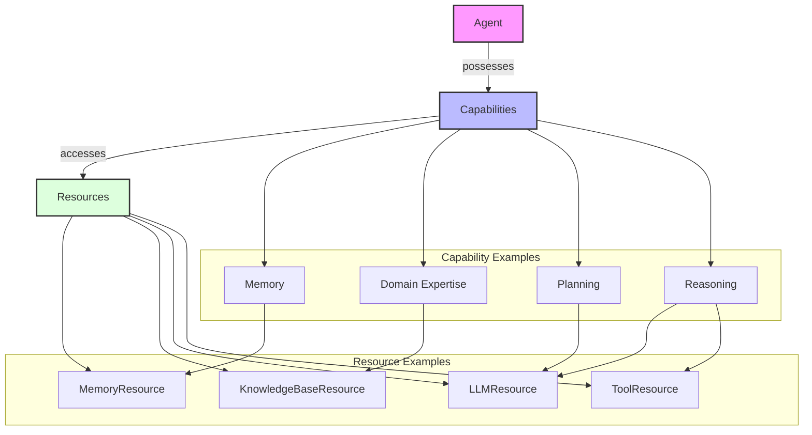
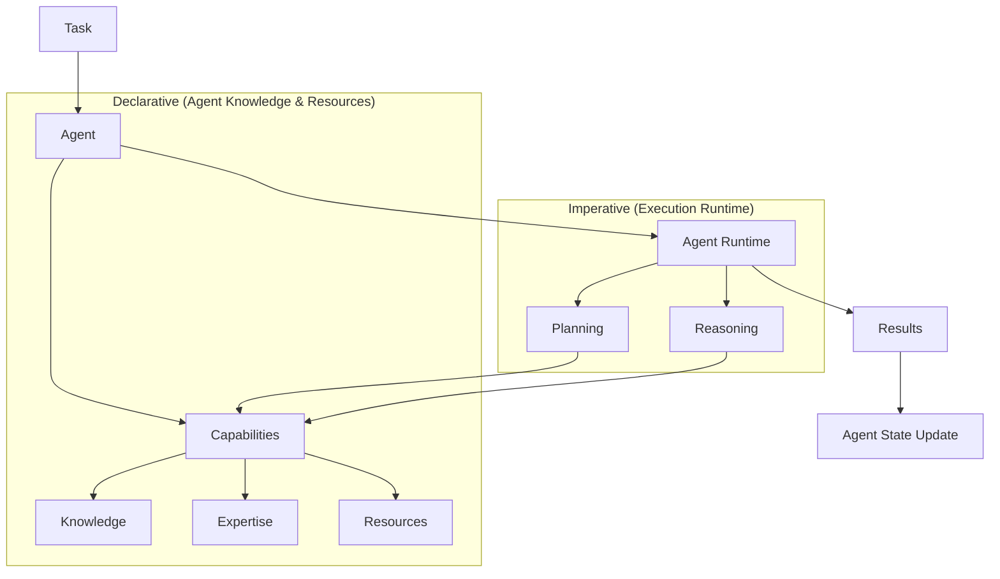

<p align="center">
  
</p>

[Project Overview](../../README.md) | [Main Documentation](../README.md)

# OpenDXA Agent System Concepts

The OpenDXA agent system provides the core components and abstractions for building intelligent agents. It enables agents to execute tasks through a two-layer architecture involving planning and reasoning, leveraging various capabilities and resources.

## Design Philosophy

1.  **Simple things should be simple, complex things should be possible:** Start with easy defaults, allow for advanced customization.
2.  **Composition over inheritance:** Prefer composing agents from capabilities and resources rather than deep inheritance trees.
3.  **Smart defaults with explicit control:** Provide sensible defaults but allow users to override them when needed.

## Core Concepts

The agent system revolves around three primary concepts:

1.  **Agents:** The central execution units.
    *   Possess capabilities to perform tasks.
    *   Manage access to resources.
    *   Execute plans generated by the Planning layer.
    *   Maintain internal state and context.

2.  **Capabilities:** Define *what* an agent can do at a cognitive level.
    *   Higher-level functions like Memory, Domain Expertise, Planning, Reasoning.
    *   Composed of one or more Resources combined with specific logic.
    *   Agents can have multiple capabilities working together.
    *   Capabilities can share underlying Resources.

3.  **Resources:** Represent *what* tools, data sources, or interfaces an agent has access to.
    *   Examples: LLMs (`LLMResource`), Human-in-the-loop (`HumanResource`), Databases, APIs (`ToolResource`), Knowledge Bases (`KnowledgeBaseResource`), Memory (`MemoryResource`), I/O (`InterfaceResource`).
    *   Provide raw functionality that Capabilities orchestrate.
    *   Can be accessed by multiple Capabilities.

### Relationship

Agents possess Capabilities, and Capabilities access Resources to perform their functions.



## Agent Factory

The `AgentFactory` (and the convenient `Agent` class which often wraps it) simplifies creating agents with common configurations.

*   Provides tested, optimized default configurations.
*   Ensures consistent initialization.
*   Enables quick starts with methods like `.with_llm()`, `.with_capability()`, `.with_planning()`, etc.

### Basic Usage

```python
from opendxa.agent import Agent
from opendxa.agent.resource import LLMResource
from opendxa.base.execution import PlanStrategy, ReasoningStrategy

# Simple Q&A (uses default planning/reasoning)
answer = Agent().ask("What is quantum computing?")

# Agent with specific LLM and explicit execution strategies
agent = Agent(name="researcher") \
    .with_llm(LLMResource()) \
    .with_planning(PlanStrategy.SEQUENTIAL) \
    .with_reasoning(ReasoningStrategy.CHAIN_OF_THOUGHT)

result = agent.execute(
    objective="Research quantum computing"
)

# Agent with multiple resources
agent_complex = Agent(name="assistant") \
    .with_llm(LLMResource(config={"model": "openai:gpt-4"})) \
    .with_resources({
        "human": HumanResource(name="user"),
        "calculator": ToolResource(endpoint="local_calculator_tool")
    })
```

## Execution Architecture (Declarative vs. Imperative)

Agents bridge the declarative (what the agent knows/has) and imperative (how the agent acts) aspects:



1.  **Declarative:** The `Agent` configuration defines its available `Capabilities` and `Resources`.
2.  **Imperative:** The `AgentRuntime` (often managed internally by the `Agent` instance) uses the `Planning` and `Reasoning` systems. These systems, in turn, utilize the agent's declared `Capabilities` (which access `Resources`) to execute the plan.

## Runtime System

The agent runtime manages the execution flow and state:

*   Handles `initialize()` and `cleanup()` lifecycle methods.
*   Supports asynchronous execution (`async_execute`).
*   Can often be used as an async context manager (`async with agent as runtime_agent:`).

```python
# Using the agent as an async context manager
async with agent as runtime_agent:
    result = await runtime_agent.async_execute(
        objective="Process task"
    )

# Manual initialization and cleanup
await agent.initialize()
try:
    result = await agent.async_execute(
        objective="Process task"
    )
finally:
    await agent.cleanup()
```

## Key Design Principles of Agent State/Execution

1.  **Single Source of Truth:** State (`AgentState`, `WorldState`, `ExecutionState`) is managed centrally, often via a `StateManager`. See [State Management Concepts](state_management.md).
2.  **History Tracking:** State changes, plan evolution, and objective updates should be tracked.
3.  **Execution Context:** Provides access to resources and state during execution.

## Configuration

Agents can be configured through:

1.  `Agent` constructor parameters (e.g., `name`).
2.  Factory methods (e.g., `.with_llm()`, `.with_resources()`, `.with_capability()`).
3.  Resource configuration dictionaries.
4.  State preferences (if applicable).

## Error Handling

Robust agents should incorporate error handling, potentially including:

*   Automatic retries for transient resource errors.
*   Graceful resource cleanup on failure.
*   State preservation where possible.
*   Defined error recovery strategies.

---
<p align="center">
Copyright © 2024 Aitomatic, Inc. Licensed under the [MIT License](../../LICENSE.md).
<br/>
<a href="https://aitomatic.com">https://aitomatic.com</a>
</p> 