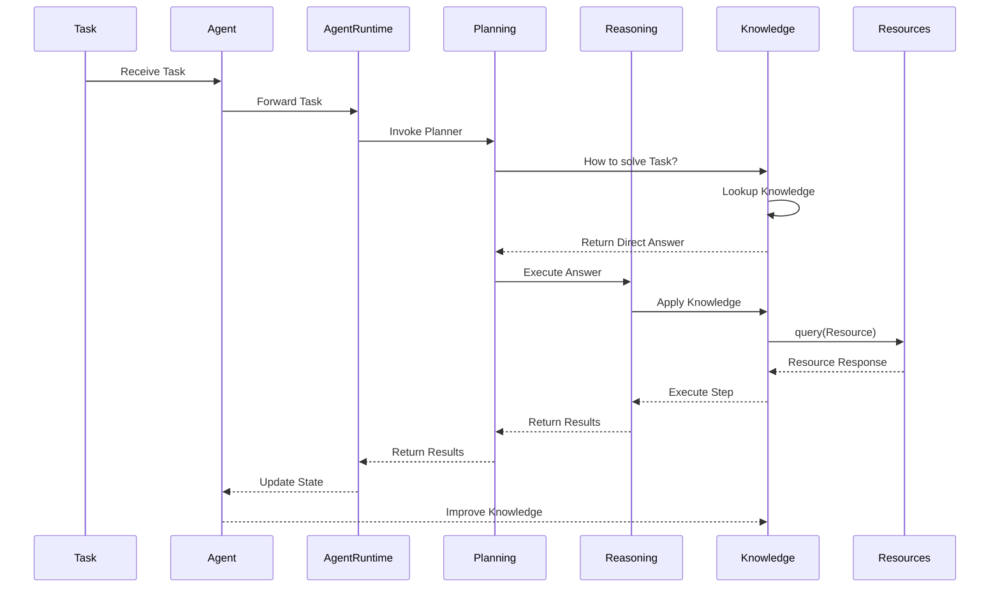
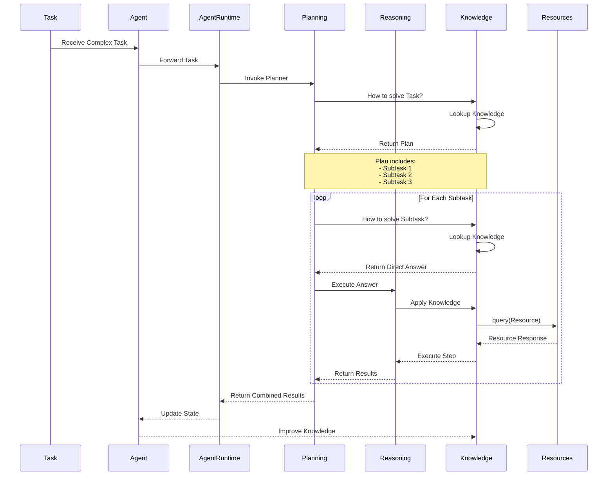
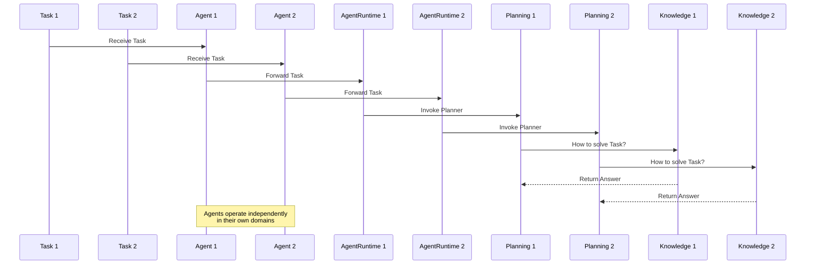
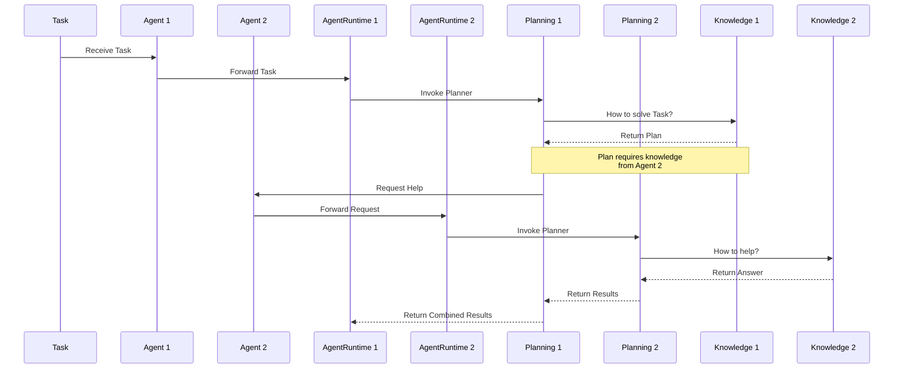

# OpenDXA Interaction Patterns

## Basic Interaction Pattern

The heart of OpenDXA is a consistent Planning-Knowledge interaction pattern:

1. **Basic Interaction Loop**:
   - Planning asks Knowledge: "How to solve X?"
   - Knowledge responds with one of three types:

     a. **Terminal** (Complete Solution)
        * Direct answer available in knowledge base
        * No further decomposition needed
        * Ready for immediate execution

     b. **Recursive** (Decomposable Solution)
        * Solution exists but requires multiple steps (with known workflows)
        * Each step may need further resolution
        * Natural hierarchical decomposition

     c. **Fallback** (Incomplete Solution)
        * No direct solution in knowledge base
        * Requires Reasoning to derive solution
        * Results stored for future reference

2. **Recursive Nature**:
   - For each step in a plan:
     - Same Planning-Knowledge interaction
     - All resolution through Knowledge
     - Natural termination at Complete Solutions
   - For Incomplete Solutions:
     - Planning delegates to Reasoning
     - Reasoning attempts to derive solution
     - Results are stored back in Knowledge
     - Future queries can use stored solutions

3. **Key Aspects**:
   - Consistent interaction pattern throughout
   - All knowledge access through Knowledge
   - Natural termination at Complete Solutions
   - Hierarchical decomposition for complex tasks
   - Continuous learning through Reasoning
   - Knowledge base evolution over time

## Single Agent Scenarios

### 1. Simple Task



### 2. Complex Task



## Multi-Agent Scenarios

OpenDXA supports three main types of multi-agent interactions:

1. **Separate Tasks**
   - Multiple Agents working on different, independent tasks
   - Each Agent operates in its own domain
   - No coordination needed
   - Like different specialists in different fields



2. **Collaborative Tasks**
   - Multiple Agents working together on same task
   - Agents with complementary knowledge
   - Need to coordinate and share knowledge
   - Like a team of specialists working together



3. **Hierarchical Tasks**
   - One Agent delegating to other Agents
   - Parent Agent breaks down task
   - Child Agents handle specific aspects
   - Results flow back up the hierarchy

```mermaid
sequenceDiagram
    participant T as Task
    participant PA as Parent Agent
    participant CA1 as Child Agent 1
    participant CA2 as Child Agent 2
    participant PAR as Parent Runtime
    participant CAR1 as Child Runtime 1
    participant CAR2 as Child Runtime 2
    participant PP as Parent Planning
    participant CP1 as Child Planning 1
    participant CP2 as Child Planning 2

    T->>PA: Receive Task
    PA->>PAR: Forward Task
    PAR->>PP: Invoke Planner
    PP->>PP: Break Down Task
    PP->>CA1: Delegate Subtask 1
    PP->>CA2: Delegate Subtask 2
    CA1->>CAR1: Forward Subtask
    CA2->>CAR2: Forward Subtask
    CAR1->>CP1: Invoke Planner
    CAR2->>CP2: Invoke Planner
    CP1-->>PP: Return Results
    CP2-->>PP: Return Results
    PP-->>PAR: Return Combined Results
``` 