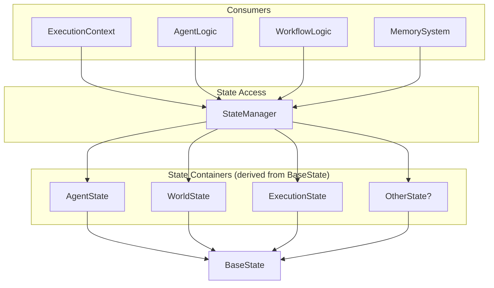
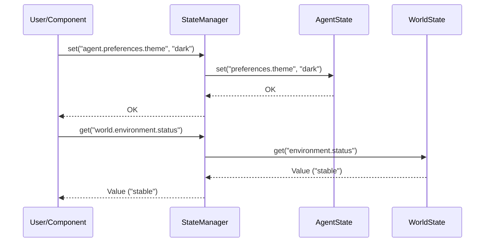

<p align="center">
  
</p>

[Project Overview](../../README.md) | [Main Documentation](../README.md)

# OpenDXA State Management Concepts

The state management module in OpenDXA provides a robust foundation for managing and maintaining state across the framework. It implements a flexible and extensible state management system that supports both simple and complex state requirements, enabling communication and data flow between different components and execution steps.

## Overview & Key Features

The state management system is built around the `BaseState` class and a coordinating `StateManager`.

*   **`BaseState`**: The foundation for all state containers.
    *   **Blackboard Pattern**: A shared dictionary (`blackboard`) for storing structured, nested state accessible via dot notation.
    *   **Artifact Storage**: A dictionary (`artifacts`) for storing arbitrary, non-structured data (e.g., large blobs, file handles).
    *   **Dot Notation Access**: Methods (`get`, `set`, `delete`) provide intuitive access to nested state within the `blackboard` (e.g., `state.set("user.preferences.theme", "dark")`).
    *   **Type Safety**: Built on Pydantic for robust type checking and validation when subclassed.
    *   **Serialization**: Methods (`dump_state`) to export state.
*   **`StateManager`**: A unified interface for accessing different state containers.
    *   **Prefix-Based Routing**: Routes access (`get`, `set`) to the correct state container (e.g., `AgentState`, `WorldState`, `ExecutionState`) based on a key prefix (e.g., `"agent.user.name"`, `"world.environment.status"`).
    *   **Centralized Access**: Provides a single point of interaction for components like `ExecutionContext`.
    *   **Extensibility**: Supports registering custom state handlers.

This system facilitates communication between execution steps. For example, one step might store user input in `agent_state` using `state_manager.set("agent.user.name", name)`, and a later step can retrieve it using `state_manager.get("agent.user.name")`.

## Architecture



*   Components interact with the `StateManager`.
*   `StateManager` holds references to specific state container instances (like `AgentState`, `WorldState`, `ExecutionState`).
*   All state containers inherit from `BaseState`.
*   `StateManager` routes `get`/`set` calls to the appropriate container based on the key prefix.

### State Access Pattern Example



## Key State Classes & Components

1.  **`BaseState`**: The foundational Pydantic model.
    *   Manages `artifacts` and `blackboard` dictionaries.
    *   Provides `get`, `set`, `delete`, `dump_state`, `reset` methods.
2.  **`AgentState`**: Tracks agent-specific state (internal progress, preferences, agent-related artifacts).
3.  **`WorldState`**: Represents the external environment state (status, resources, constraints, world-related artifacts).
4.  **`ExecutionState`**: Manages execution-specific state (current status, node results, history, visited nodes).
5.  **`StateManager`**: Routes access to registered state containers via prefixes.

### Blackboard vs. Artifacts

*   Use the **`blackboard`** for structured, configuration-like, or status data that benefits from dot notation access.
*   Use **`artifacts`** for large, opaque data blobs, files, complex objects, or anything not easily represented or accessed via nested keys.

## Usage Examples

*(Note: Assumes `AgentState`, `WorldState`, `ExecutionState`, `StateManager`, and potentially `ExecutionStatus` enum are imported)*

**Direct `BaseState` Usage:**

```python
state = BaseState()
state.set("user.preferences.theme", "dark")
theme = state.get("user.preferences.theme") # "dark"
state.delete("user.preferences.theme")
nested_dict = state.dump_state()
flat_dict = state.dump_state(flat=True) # Keys like "user.preferences.language"
state.reset()
```

**Using `StateManager`:**

```python
# Initialize state containers
agent_state = AgentState()
world_state = WorldState()
exec_state = ExecutionState()

# Initialize StateManager (typically done within ExecutionContext)
state_manager = StateManager(
    state_containers={
        "agent": agent_state,
        "world": world_state,
        "exec": exec_state
        # Prefix maps to state object instance
    }
)

# Set values using prefixes
state_manager.set("agent.preferences.theme", "dark")
state_manager.set("world.location.city", "London")
state_manager.set("exec.status", ExecutionStatus.RUNNING)

# Get values using prefixes
theme = state_manager.get("agent.preferences.theme")
city = state_manager.get("world.location.city")
status = state_manager.get("exec.status")

# Direct access still possible if holding the state object reference
world_state.set("weather.condition", "cloudy")
```

**Passing Data Between Execution Steps:**

```python
# --- Node A --- 
def execute_node_a(state_manager: StateManager):
    intermediate_result = "result_from_node_a"
    # Store in a shared space, e.g., agent's scratchpad
    state_manager.set("agent.scratchpad.node_a_output", intermediate_result)

# --- Node B --- 
def execute_node_b(state_manager: StateManager):
    # Retrieve the value from the shared space
    retrieved_result = state_manager.get("agent.scratchpad.node_a_output")
    if retrieved_result:
        print(f"Using result from Node A: {retrieved_result}")
    # ... use the result ...
```

## Design Principles

*   **Simplicity & Intuitiveness**: Dot notation access (`BaseState`), prefix routing (`StateManager`).
*   **Flexibility**: Supports structured (`blackboard`) and unstructured (`artifacts`) data.
*   **Type Safety**: Leverages Pydantic when `BaseState` is subclassed with typed fields.
*   **Extensibility**: `BaseState` can be subclassed; `StateManager` supports custom handlers.
*   **Encapsulation**: `StateManager` provides a unified access point.

## Integration

The `StateManager` is the primary integration point, typically held within the `ExecutionContext` and used by:

*   Agent Logic
*   Planning/Reasoning/Workflow Steps
*   Memory Systems (for persistence/loading)
*   Resource Management

## Best Practices

1.  **Use `StateManager`**: Prefer accessing state via `StateManager` (usually through `ExecutionContext`) for proper routing and encapsulation.
2.  **Clear Prefixes**: Use distinct and meaningful prefixes (e.g., `agent.`, `world.`, `exec.`).
3.  **`blackboard` for Structure**: Use for configuration, status, results, and data needing dot notation.
4.  **`artifacts` for Blobs**: Use for large, opaque, or file-like data.
5.  **Error Handling**: Handle potential `KeyError` when getting values.
6.  **State Isolation**: Avoid mixing unrelated state under the same prefix structure.

---
<p align="center">
Copyright © 2024 Aitomatic, Inc. Licensed under the <a href="../../LICENSE.md">MIT License</a>.
<br/>
<a href="https://aitomatic.com">https://aitomatic.com</a>
</p> 