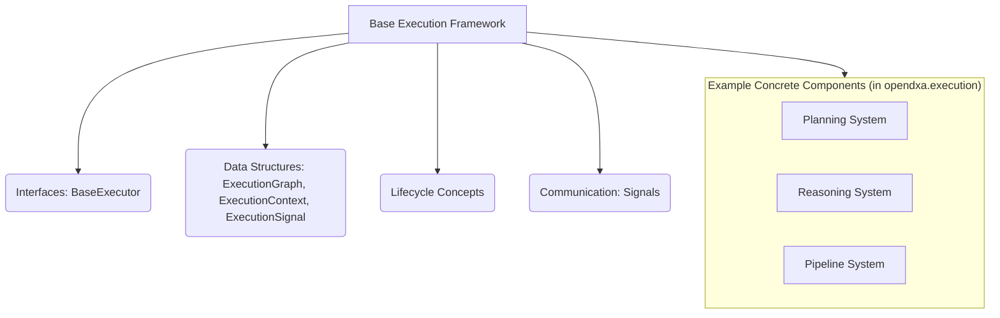

<p align="center">
  
</p>

[Project Overview](../../README.md) | [Main Documentation](../README.md)

# OpenDXA Base Execution Framework Concepts

The Base Execution framework (`opendxa.base.execution`) provides the foundational interfaces and abstract classes for task execution within the OpenDXA system. It establishes the core structure, lifecycle, and communication patterns that all specific execution implementations (like Planning, Reasoning, Pipelines) build upon.

## Overview

The Base Execution framework provides:

*   **Core Interfaces/Abstract Classes:** Defines `BaseExecutor`, `ExecutionGraph`, `ExecutionContext`, `ExecutionSignal`, etc.
*   **Standardized Execution Lifecycle:** Implies stages like validation, execution, setup, teardown.
*   **Execution Graph Structure:** Basic components for defining execution flows (`ExecutionNode`, `ExecutionEdge`).
*   **Signal-Based Communication:** Defines `ExecutionSignal` for inter-component communication during execution.



## Key Components

### 1. `BaseExecutor` Class

This abstract class defines the fundamental interface for any component that executes a task or a part of an execution graph.

```python
# Simplified definition
class BaseExecutor:
    """Base class for all executors in OpenDXA."""

    async def execute(self, context: ExecutionContext) -> ExecutionResult:
        """Execute the task defined by or managed by this executor.
        Uses the provided context for state and resources.
        Returns a result indicating success/failure and output data.
        """
        raise NotImplementedError

    async def validate(self, context: ExecutionContext) -> bool:
        """Optional: Validate if the executor can run with the given context."""
        # Default implementation might return True or raise NotImplementedError
        return True

    # Other potential lifecycle methods like setup, teardown might be included
    # via mixins or expected by specific execution managers.
```

### 2. `ExecutionGraph`

Provides a basic structure for representing execution flows as directed graphs.

```python
# Simplified definition
from opendxa.common.graph import DirectedGraph # Typically based on a common graph

class ExecutionGraph(DirectedGraph):
    """Base class for execution graphs."""

    def __init__(self, objective: str):
        super().__init__(objective=objective)
        # Nodes and edges are managed by the base DirectedGraph

    # Methods to add ExecutionNode and ExecutionEdge instances
    def add_node(self, node: ExecutionNode) -> None:
        super().add_node(node)

    def add_edge(self, source_id: str, target_id: str, edge_data: dict = None) -> None:
        # Simplified edge creation
        edge = ExecutionEdge(f"{source_id}_to_{target_id}", source_id, target_id, edge_data)
        super().add_edge(edge)

# ExecutionNode and ExecutionEdge would also be defined, likely inheriting
# from common graph Node/Edge types and adding execution-specific fields.
```

### 3. `ExecutionContext`

This crucial class holds the state and resources needed during an execution run. It's passed between execution components.

```python
# Simplified definition
class ExecutionContext:
    """Context for execution containing state and resources."""

    def __init__(self, resources: Dict[str, Any] = None, state_manager: StateManager = None):
        # Manages different state containers (AgentState, WorldState, ExecutionState)
        self.state_manager = state_manager or StateManager()
        # Holds available resources (LLMs, tools, etc.)
        self.resources = resources or {}
        # Buffer for signals generated during execution
        self.signals: List[ExecutionSignal] = []

    # Provides methods to access state via StateManager
    def get_state(self, key: str, default: Any = None) -> Any:
        return self.state_manager.get(key, default)

    def set_state(self, key: str, value: Any) -> None:
        self.state_manager.set(key, value)

    # Provides methods to access resources
    async def get_resource(self, name: str) -> Any:
        # May involve initialization logic
        return self.resources.get(name)

    # Methods for handling signals
    def add_signal(self, signal: ExecutionSignal):
        self.signals.append(signal)
```

**Note:** For details on how `ExecutionContext` uses `StateManager` for state access and data flow, see the [State Management Concepts](state_management.md) documentation.

### 4. `ExecutionSignal`

A standardized data structure (often a `dataclass`) used for communication between execution components (e.g., between Reasoning and Planning, or from Executors to a manager).

```python
from dataclasses import dataclass, field
from enum import Enum

class ExecutionSignalType(Enum):
    DATA_RESULT = "data_result"
    CONTROL_START = "control_start"
    CONTROL_COMPLETE = "control_complete"
    CONTROL_ERROR = "control_error"
    DISCOVERY = "discovery"
    # ... other types

@dataclass
class ExecutionSignal:
    """Signal for execution communication."""
    type: ExecutionSignalType
    source_id: str # ID of the component sending the signal
    result: Dict[str, Any] = field(default_factory=dict) # Data payload
    metadata: Dict[str, Any] = field(default_factory=dict)
```

## Usage Guide

The base framework components are typically subclassed and used by higher-level systems like Planning and Reasoning.

**Creating a Base Executor:**

```python
from opendxa.base.execution import BaseExecutor, ExecutionContext, ExecutionResult

class MyTaskExecutor(BaseExecutor):
    async def execute(self, context: ExecutionContext) -> ExecutionResult:
        print(f"Executing task with objective: {context.get_state('exec.objective')}")
        # Access resources via context.get_resource(...)
        # Access state via context.get_state(...)
        # Perform task...
        result_data = {"output": "Task completed successfully"}
        # Optionally add signals to context.add_signal(...)
        return ExecutionResult(success=True, data=result_data)

    async def validate(self, context: ExecutionContext) -> bool:
        # Example validation
        return context.get_resource("required_tool") is not None
```

**Using `ExecutionGraph` (Conceptual):**

```python
# Typically done within a Planner or Workflow component
from opendxa.base.execution import ExecutionGraph, ExecutionNode, ExecutionEdge
from opendxa.common.graph import NodeType

graph = ExecutionGraph(objective="Process data")
graph.add_node(ExecutionNode(node_id="START", node_type=NodeType.START))
graph.add_node(ExecutionNode(node_id="FETCH", node_type=NodeType.TASK, objective="Fetch data"))
graph.add_node(ExecutionNode(node_id="PROCESS", node_type=NodeType.TASK, objective="Process data"))
graph.add_node(ExecutionNode(node_id="END", node_type=NodeType.END))

graph.add_edge("START", "FETCH")
graph.add_edge("FETCH", "PROCESS")
graph.add_edge("PROCESS", "END")

# The graph would then be passed to an execution manager or executor.
```

## Best Practices

1.  **Interface Compliance:** Strictly adhere to the method signatures (`execute`, `validate`) when subclassing `BaseExecutor`.
2.  **Graph Management:** Ensure graph consistency (valid node IDs, dependencies) when constructing `ExecutionGraph` instances.
3.  **State Management:** Use the `ExecutionContext` and its `StateManager` for all state interactions within execution logic.
4.  **Signal Handling:** Utilize `ExecutionSignal` for standardized communication between components instead of direct calls where appropriate.
5.  **Extensibility:** Build specialized executors and graph types by inheriting from these base classes.

---
<p align="center">
Copyright © 2024 Aitomatic, Inc. Licensed under the <a href="../../LICENSE.md">MIT License</a>.
<br/>
<a href="https://aitomatic.com">https://aitomatic.com</a>
</p> 