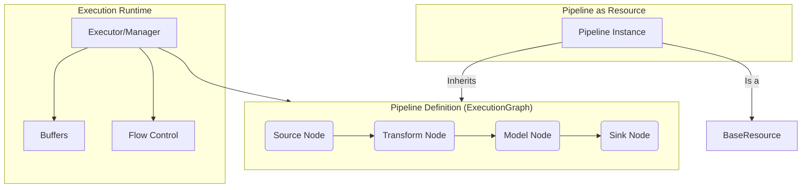
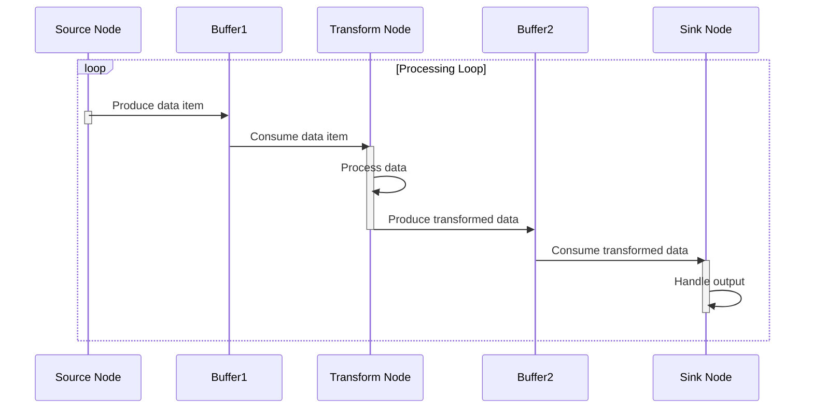

<p align="center">
  
</p>

[Project Overview](../../README.md) | [Main Documentation](../README.md)

# OpenDXA Pipeline System Concepts

The Pipeline system (`opendxa.execution.pipeline`) provides a framework for creating and executing data processing pipelines within OpenDXA. It leverages the [Base Execution Framework](base_execution.md) (using `ExecutionGraph`) to define complex data flows and integrates with the [Resource System](resource_system.md) (inheriting from `BaseResource`) to make pipelines discoverable and manageable entities.

## Overview & Key Features

*   **Graph-Based Data Flow:** Define pipelines as directed graphs where nodes represent processing steps (sources, transforms, models, sinks) and edges represent data flow.
*   **Asynchronous Execution:** Supports async processing with configurable buffering between nodes.
*   **Typed Connections (Implicit):** While not strictly enforced at the base level, designed for type-safe connections between nodes.
*   **Error Handling:** Built upon the base execution error handling.
*   **Resource Integration:** Pipelines themselves act as resources, manageable via the agent's resource system.
*   **Monitoring & Metrics:** (Potential for extension) Can incorporate monitoring.

## Architecture

A pipeline consists of interconnected nodes representing a data flow, managed by an underlying execution mechanism.



## Components

### 1. `Pipeline` Class

This core class provides the dual functionality:

*   **Inherits `ExecutionGraph`:** Allows defining the pipeline structure (nodes, edges).
*   **Inherits `BaseResource`:** Makes the pipeline instance discoverable and manageable (e.g., `initialize`, `cleanup`, `query`).

```python
# Simplified Conceptual Example
from opendxa.execution.pipeline import Pipeline, PipelineNode, PipelineContext
from opendxa.base.execution import ExecutionGraph
from opendxa.base.resource import BaseResource
from opendxa.common.graph import NodeType

class Pipeline(ExecutionGraph, BaseResource):
    def __init__(self, name: str, objective: str, description: str = "", **kwargs):
        ExecutionGraph.__init__(self, objective=objective)
        BaseResource.__init__(self, name=name, description=description, **kwargs)
        # ... pipeline specific initialization ...

    async def execute(self, context: PipelineContext = None) -> dict:
        """Executes the defined pipeline graph."""
        context = context or PipelineContext()
        # ... logic to traverse the graph, manage buffers, execute nodes ...
        print(f"Executing pipeline: {self.objective}")
        # Placeholder for actual execution result
        return {"status": "completed", "sink_output": "..."}

    async def query(self, request: dict) -> dict:
        """Allows executing the pipeline via the resource interface."""
        input_data = request.get("data")
        options = request.get("options", {})
        context = options.get("context", PipelineContext())
        
        # Potentially push input_data to source node(s) via context or other means
        if input_data:
             context.set_state("pipeline.input_data", input_data) # Example

        return await self.execute(context)

    # ... other methods like initialize, cleanup inherited/overridden ...
```

### 2. Pipeline Node Types (`NodeType` Enum)

Pipelines typically use specific node types from `opendxa.common.graph.NodeType`:

*   **`SOURCE`:** Entry point for data (e.g., reading from sensors, databases, message queues).
*   **`TASK`:** General processing steps (e.g., transformations, feature engineering, filtering).
*   **`MODEL`:** Nodes specifically for ML model inference.
*   **`SINK`:** Exit point for data (e.g., writing to storage, dashboards, other systems).

### 3. Data Flow & Buffering

Data flows from source(s) through intermediate nodes to sink(s). The execution runtime manages this flow, often using internal buffers (like `asyncio.Queue`) between async node executions to handle backpressure and decouple processing steps.



## Resource Integration Details

Because `Pipeline` inherits from `BaseResource`, an instantiated pipeline can be treated like any other resource:

*   **Lifecycle:** Managed via `pipeline.initialize()` and `pipeline.cleanup()`.
*   **Execution via Query:** Can be triggered using `pipeline.query({"data": ..., "options": ...})`.
*   **Discovery:** Can be registered and discovered by agents.

```python
# Example: Managing a pipeline as a resource
my_pipeline = Pipeline(name="data_processor", objective="Process sensor stream")
# ... (add nodes and edges to my_pipeline) ...

# Initialize (e.g., connect to data sources/sinks)
await my_pipeline.initialize()

# Execute by querying the resource
result = await my_pipeline.query({"data": sensor_reading, "options": {"batch": False}})

# Cleanup
await my_pipeline.cleanup()
```

## Execution Flow Summary

1.  **Definition:** Create a `Pipeline` instance, add `PipelineNode`s (Source, Task, Model, Sink), and connect them with edges.
2.  **Initialization:** Call `await pipeline.initialize()` to set up resources associated with nodes.
3.  **Execution:** Triggered either by calling `await pipeline.execute(context)` directly or `await pipeline.query(...)` via the resource interface. The runtime manages data flow through the graph, potentially using internal buffers.
4.  **Completion:** Sinks receive final data; `execute`/`query` returns results; state is updated.
5.  **Cleanup:** Call `await pipeline.cleanup()` to release node resources.

## Best Practices

*   **Node Granularity:** Keep node logic focused on a single task (e.g., one transformation, one model inference).
*   **Configuration:** Configure buffer sizes, batching, and timeouts appropriately for the expected data volume and processing time.
*   **Error Handling:** Implement robust error handling within each node's execution logic.
*   **Context Usage:** Pass necessary configuration or shared resources via the `PipelineContext`.
*   **Performance:** Profile pipelines to identify bottlenecks; consider parallel execution patterns if applicable within the graph structure.

---
<p align="center">
Copyright © 2024 Aitomatic, Inc. Licensed under the [MIT License](../../LICENSE.md).
<br/>
<a href="https://aitomatic.com">https://aitomatic.com</a>
</p> 