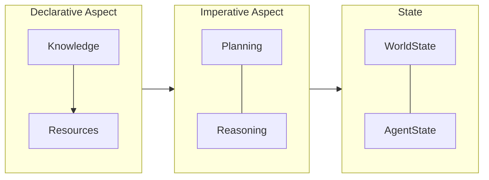
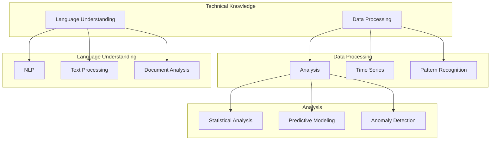
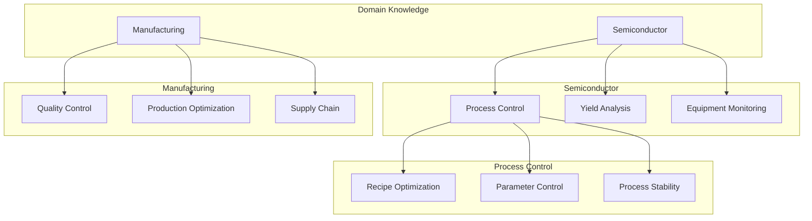

<p align="center">
  
</p>

[Project Overview](../../README.md) | [Main Documentation](../README.md)

# OpenDXA Planning System Concepts

The planning system is a core component of OpenDXA's Imperative Aspect, responsible for generating and managing executable plans based on objectives and available knowledge. It works in conjunction with the reasoning system to ensure effective task execution.

## Architecture



## Knowledge Structure

Planning relies on both technical and domain knowledge to create effective plans.

### Technical Knowledge

Represents general problem-solving and process knowledge.



### Domain Knowledge

Represents expertise specific to a particular field or application.



## Planning Patterns

The planning system supports four fundamental patterns, each building on the previous to handle increasing complexity:

1.  **Direct Planning**
    *   Single-step execution
    *   Fixed objectives
    *   Minimal overhead
    *   Best for simple, well-defined tasks

2.  **Sequential Planning**
    *   Linear workflows
    *   Clear dependencies
    *   Progress tracking
    *   Best for multi-step tasks with known sequences

3.  **Hierarchical Planning**
    *   Goal decomposition
    *   Nested objectives
    *   Resource delegation
    *   Best for complex, structured goals

4.  **Dynamic Planning**
    *   Adaptive replanning
    *   Objective evolution
    *   Resource reallocation
    *   Best for uncertain or changing environments

## Usage Examples

*(Note: These examples assume relevant classes like `ExecutionContext`, planners, etc., are imported)*

### Direct Planning

```python
planner = DirectPlanner()
context = ExecutionContext(
    objective="Summarize this text",
    capabilities=["text_analysis"]
)
plan = await planner.create_plan(context)
```

### Sequential Planning

```python
planner = SequentialPlanner()
context = ExecutionContext(
    objective="Research quantum computing",
    capabilities=["search", "analysis", "synthesis"],
    requirements=["find_papers", "analyze_trends", "synthesize_findings"]
)
plan = await planner.create_plan(context)
```

### Hierarchical Planning

```python
planner = HierarchicalPlanner()
context = ExecutionContext(
    objective="Launch new product",
    capabilities=["research", "development", "marketing"],
    subgoals={
        "research": ["market", "competition"],
        "development": ["prototype", "testing"],
        "launch": ["marketing", "distribution"]
    }
)
plan = await planner.create_plan(context)
```

### Dynamic Planning

```python
planner = DynamicPlanner()
context = ExecutionContext(
    objective="Maintain system health",
    capabilities=["monitoring", "scaling", "security"],
    adaptation_rules={
        "high_load": "scale_resources",
        "errors": "activate_fallback",
        "attacks": "enhance_security"
    }
)
plan = await planner.create_plan(context)
```

## Implementation Details

### Core Components

1.  **Planning Pattern Base**
    ```python
    class PlanningPattern:
        """Base class for all planning patterns."""

        async def create_plan(self, context: ExecutionContext) -> Plan:
            """Generate a plan for the given execution context."""
            raise NotImplementedError

        async def update_plan(self, plan: Plan, state: ExecutionState) -> Plan:
            """Update plan based on execution state."""
            raise NotImplementedError
    ```

2.  **Plan Structure**
    ```python
    class Plan:
        """Represents an executable plan."""

        def __init__(self):
            self.steps: List[Step]
            self.dependencies: Dict[str, List[str]]
            self.resources: Dict[str, Resource]
            self.metrics: Dict[str, Metric]
    ```

### Pattern Selection Guide

Choose a planning pattern based on:

1.  **Objective Complexity**
    *   Single goal → Direct
    *   Linear sequence → Sequential
    *   Nested goals → Hierarchical
    *   Evolving goals → Dynamic

2.  **Environmental Stability**
    *   Static, known → Direct/Sequential
    *   Partially known → Hierarchical
    *   Highly dynamic → Dynamic

3.  **Resource Management**
    *   Fixed resources → Direct
    *   Staged allocation → Sequential
    *   Hierarchical sharing → Hierarchical
    *   Dynamic reallocation → Dynamic

## Integration with Reasoning

Planning patterns interact with the reasoning system through:

1.  Plan execution delegation
2.  Signal processing (receiving updates or discoveries from reasoning)
3.  Resource coordination
4.  Progress tracking based on reasoning feedback

Example of handling signals from Reasoning:

```python
async def _handle_reasoning_signals(self, signals: List[Signal]) -> None:
    """Process signals from reasoning layer."""
    for signal in signals:
        if signal.type == SignalType.DISCOVERY:
            # e.g., new information requires plan adjustment
            await self._update_objective(signal.content)
        elif signal.type == SignalType.RESOURCE:
            # e.g., a resource became unavailable
            await self._reallocate_resources(signal.content)
```

## Resource Management Considerations

Each pattern has different resource needs and management implications:

*   **Direct:** Minimal overhead; basic resource allocation.
*   **Sequential:** Moderate overhead; supports staged allocation per step.
*   **Hierarchical:** Higher overhead; handles nested allocation and potential resource sharing across sub-plans.
*   **Dynamic:** Most intensive; requires continuous monitoring and potential reallocation.

## Testing and Validation

Effective plans should be validated against:

1.  **Objective Alignment:** Does the plan directly address the stated objective?
2.  **Resource Feasibility:** Are the required resources available and allocated correctly?
3.  **Step Coherence:** Do the steps logically follow each other and contribute to the goal?
4.  **Adaptation Rules (Dynamic):** Are the rules for replanning clear and appropriate?

## Best Practices

1.  **Pattern Selection:** Choose the simplest pattern that meets the requirements of the task's complexity, environment, and resource constraints.
2.  **Implementation:** Define objectives clearly, allocate resources appropriately, handle signals effectively, and track progress reliably.
3.  **Monitoring:** Observe objective evolution, resource utilization, plan effectiveness metrics, and adaptation success rate (for dynamic planning).

---
<p align="center">
Copyright © 2024 Aitomatic, Inc. Licensed under the <a href="../../LICENSE.md">MIT License</a>.
<br/>
<a href="https://aitomatic.com">https://aitomatic.com</a>
</p> 