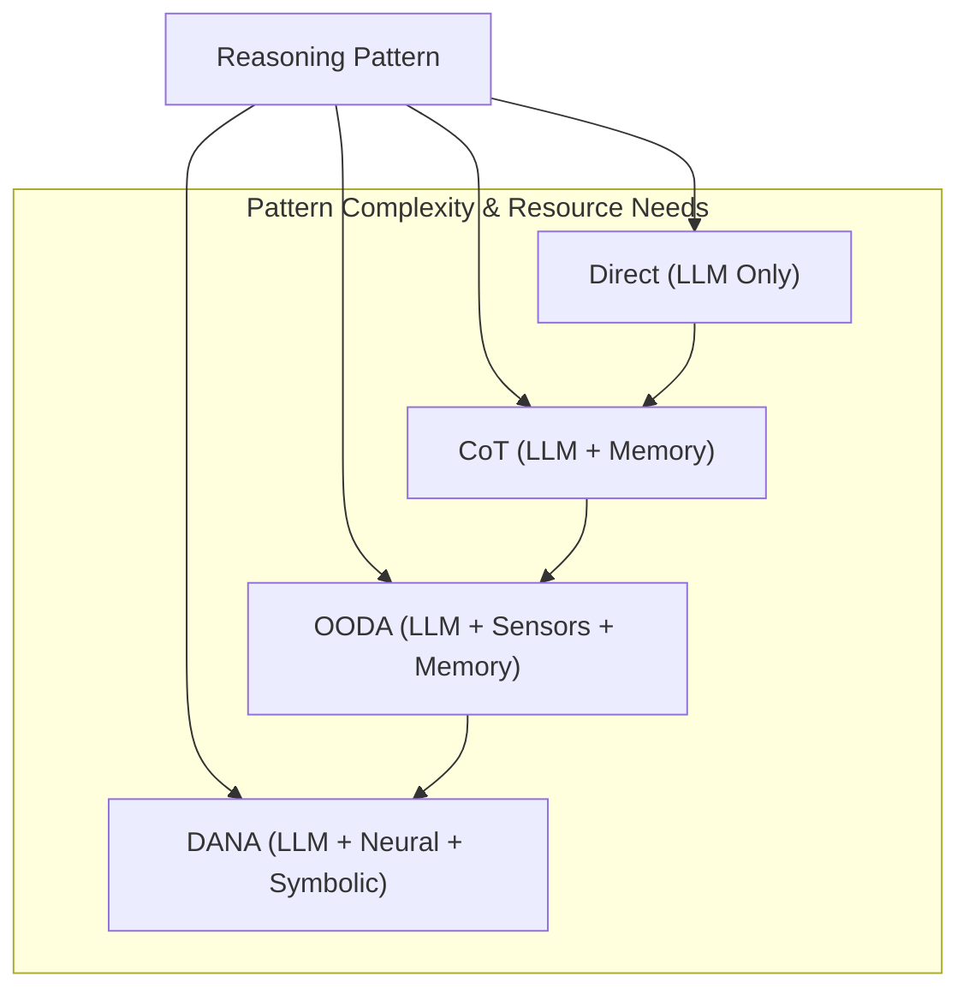

<p align="center">
  
</p>

[Project Overview](../../README.md) | [Main Documentation](../README.md)

# OpenDXA Reasoning System Concepts

The reasoning layer is the tactical brain of the DXA agent system, responsible for executing plans and making step-by-step decisions. While the planning layer decides *what* to do, Reasoning Patterns determine *how* to think about each step. It implements various patterns - from simple direct queries to sophisticated neural-symbolic reasoning - each optimized for different types of tasks.

The reasoning layer maintains continuous communication with the planning layer through signals, allowing for dynamic adaptation as new information is discovered or circumstances change. This separation of strategic and tactical thinking enables both simple, one-shot tasks and complex, evolving objectives to be handled effectively.

## Design Philosophy

> Simple things should be easy, complex things should be possible.

This principle guides our Reasoning Pattern design:

-   **Direct Reasoning Pattern:** For simple queries (one line of code).
-   **Chain of Thought Reasoning Pattern:** For clearer thinking (when needed).
-   **OODA Reasoning Pattern:** For continuous adaptation (when appropriate).
-   **DANA Reasoning Pattern:** For sophisticated neural-symbolic integration (when beneficial).

Each pattern builds on the same foundation but adds power and flexibility where needed.

## Architecture

The Reasoning System primarily consists of different **Reasoning Patterns** that define how an agent processes information and executes a plan step.



## Reasoning Patterns

### 1. Direct Reasoning

*   **Best for:** Simple, single-step tasks, Q&A.
*   **Process:** Simple LLM query based on the step objective.
*   **Characteristics:** Quick responses, minimal processing, lowest resource usage.

```python
class DirectReasoning(ReasoningPattern):
    async def reason_about_step(self, step, context):
        prompt = self._create_prompt(step)
        response = await context.llm.query(prompt)
        return self._process_response(response)
```

### 2. Chain of Thought (CoT)

*   **Best for:** Complex problem solving, tasks requiring explainability.
*   **Process:**
    1.  Break down the problem/step.
    2.  Generate intermediate reasoning steps ("thoughts").
    3.  Synthesize a final conclusion based on thoughts.
*   **Characteristics:** Step-by-step thinking, explicit reasoning, verifiable logic, requires memory resource.

```python
class ChainOfThoughtReasoning(ReasoningPattern):
    async def reason_about_step(self, step, context):
        thoughts = await self._generate_thoughts(step)
        conclusion = await self._synthesize(thoughts)
        return self._create_result(thoughts, conclusion)
```

### 3. OODA Loop (Observe-Orient-Decide-Act)

*   **Best for:** Continuous monitoring, real-time adaptation, control systems.
*   **Process:** Executes a continuous cycle:
    1.  **Observe:** Gather data from sensors or environment.
    2.  **Orient:** Analyze the situation based on observations and context.
    3.  **Decide:** Choose the next action based on orientation.
    4.  **Act:** Execute the decided action.
*   **Characteristics:** Adaptive response, suitable for dynamic environments, requires sensor/monitoring resources.

```python
class OODAReasoning(ReasoningPattern):
    async def reason_about_step(self, step, context):
        # Simplified representation of the loop within a step execution
        observation = await self._observe(step.targets, context)
        orientation = await self._orient(observation, context)
        decision = await self._decide(orientation, context)
        action = await self._act(decision, context)
        return self._create_result(action)
```

### 4. DANA (Domain-Aware Neural-Symbolic)

*   **Best for:** Specialized domain tasks requiring expert knowledge, code generation/execution.
*   **Process:** Combines neural and symbolic approaches:
    1.  Neural search (e.g., vector DB) for similar problems/patterns/solutions.
    2.  Synthesize or select a program/symbolic representation.
    3.  Execute the program/symbolic logic.
    4.  Validate the result.
*   **Characteristics:** Leverages domain expertise, can perform complex computations, highest resource needs (LLM, Vector DB, Runtime/Executor).

```python
class DANAReasoning(ReasoningPattern):
    async def reason_about_step(self, step, context):
        patterns = await self._neural_search(step, context)
        program = await self._synthesize_program(patterns, context)
        result = await self._execute_symbolically(program, context)
        return self._validate_result(result, context)
```

## Usage and Pattern Selection

Choosing the right pattern is crucial for efficiency and effectiveness.

### Selection Guide

1.  **Task Complexity:**
    *   Simple Q&A → Direct
    *   Multi-step analysis → CoT
    *   Real-time adaptation → OODA
    *   Domain expertise/Code → DANA
2.  **Resource Availability:**
    *   Minimal (LLM only) → Direct
    *   LLM + Memory → CoT
    *   LLM + Sensors → OODA
    *   LLM + VectorDB + Runtime → DANA
3.  **Performance Needs:**
    *   Fastest response → Direct
    *   Explainable steps → CoT
    *   Continuous operation → OODA
    *   Optimal/complex solution → DANA

### Examples

*(Note: Assumes relevant classes like `Agent`, `MemoryResource`, `SystemSensors`, `VectorDB`, etc., are imported and configured)*

**Simple Query (Direct):**

```python
agent = Agent("assistant").with_reasoning("direct")
result = await agent.run("What is quantum computing?")
```

**Complex Analysis (CoT):**

```python
agent = Agent("analyst")\
    .with_reasoning("cot")\
    .with_resources({"memory": MemoryResource(), "search": SearchResource()})
result = await agent.run({
    "task": "analyze",
    "topic": "Impact of quantum computing on cryptography"
})
```

**Continuous Monitoring (OODA):**

```python
agent = Agent("monitor")\
    .with_reasoning("ooda")\
    .with_resources({"sensors": SystemSensors(), "alerts": AlertSystem()})
async with agent:
    await agent.run({"task": "monitor_system"})
```

**Domain-Specific Task (DANA):**

```python
agent = Agent("optimizer")\
    .with_reasoning("dana")\
    .with_resources({"vector_db": VectorDB(), "runtime": CodeExecutor()})
result = await agent.run({
    "task": "optimize",
    "target": my_function
})
```

## Implementation Details

### Pattern Structure

All patterns inherit from a base class:

```python
class ReasoningPattern:
    """Base class for all reasoning patterns."""

    async def reason_about_step(self, step: Dict, context: Context) -> Result:
        """Apply reasoning to a single step."""
        raise NotImplementedError
```

### State Management

Each pattern execution manages its internal state, including:

*   Current step context
*   Intermediate results or thoughts
*   Confidence scores
*   Resource usage tracking

### Signal Generation

Reasoning patterns communicate back to the execution or planning layer via signals, indicating:

*   Need for plan updates (e.g., discovered new critical info)
*   Resource issues (e.g., API key invalid)
*   Discovery of new information relevant to the broader objective
*   Step completion status (success, failure, requires clarification)

## Integration with Planning

The reasoning system executes steps defined by the planning system and provides feedback:

1.  **Execution:** Receives plan steps from the planner.
2.  **Feedback:** Sends signals regarding step progress, resource needs, or discoveries.
3.  **Adaptation:** Planner may adjust the plan based on signals from the reasoning layer.

Example signal handling (conceptual, within the execution loop):

```python
async def _execute_step_with_reasoning(self, step, context):
    # Execute reasoning pattern for the step
    reasoning_pattern = context.get_reasoning_pattern()
    result = await reasoning_pattern.reason_about_step(step, context)

    # Generate signals based on the result
    signals = self._generate_signals_from_result(result)

    # Send signals (e.g., back to planner or execution manager)
    await context.send_signals(signals)

    return result
```

## Testing and Validation

Reasoning patterns should incorporate mechanisms for:

*   **Confidence Scoring:** Estimating the reliability of the reasoning result.
*   **Result Validation:** Checking the output against constraints or known facts.
*   **Error Detection:** Identifying failures during the reasoning process.
*   **Performance Metrics:** Tracking latency, resource consumption, etc.

## Best Practices

1.  **Pattern Selection:** Use the simplest pattern adequate for the task complexity and resource availability.
2.  **Implementation:** Ensure clear step definitions, robust error handling, proper resource management (via context), and meaningful signal generation.
3.  **Monitoring:** Track confidence scores, resource usage, reasoning steps (especially for CoT), and performance.

---
<p align="center">
Copyright © 2024 Aitomatic, Inc. Licensed under the <a href="../../LICENSE.md">MIT License</a>.
<br/>
<a href="https://aitomatic.com">https://aitomatic.com</a>
</p> 