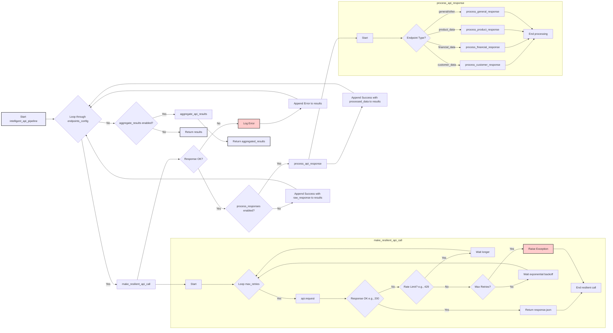
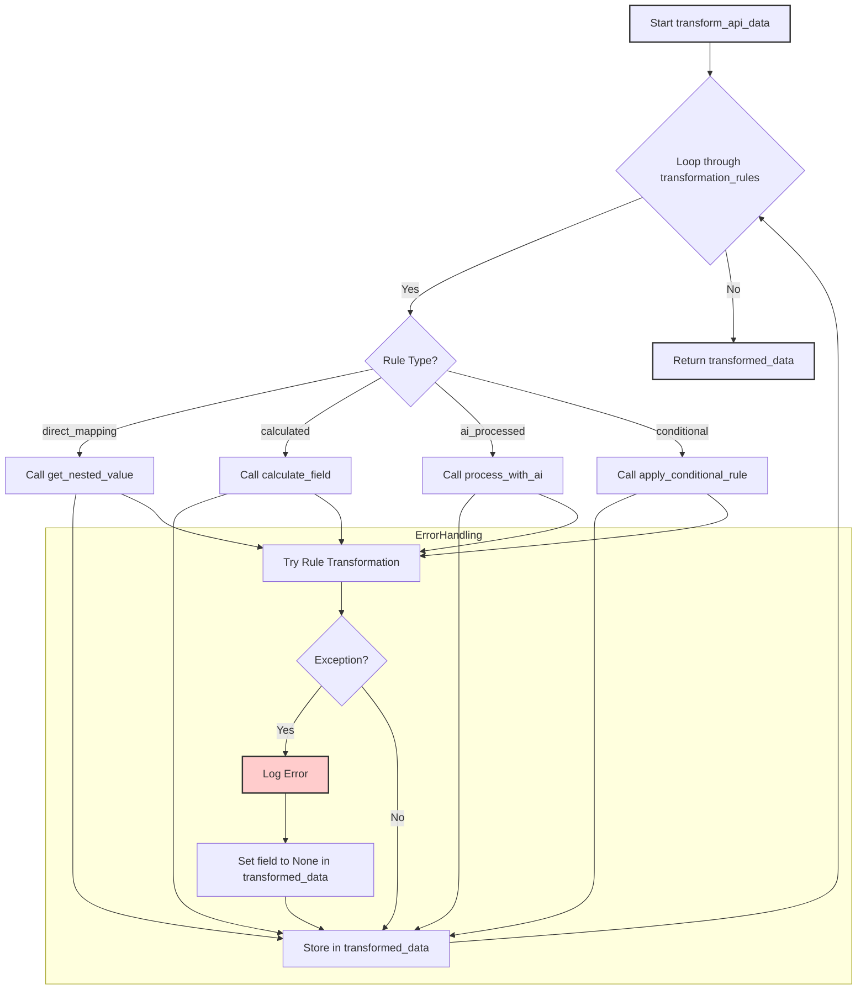

# API Integration Recipe

*Build robust API integrations with intelligent error handling and data processing*

---

## Overview

This recipe demonstrates how to build sophisticated API integrations using OpenDXA. Learn to create reliable, intelligent systems that can interact with external APIs, handle errors gracefully, and process responses intelligently.

## What You'll Build

A comprehensive API integration system that can:
- Connect to REST APIs with authentication
- Handle errors and retries intelligently
- Process API responses with AI-powered analysis
- Transform data between different formats
- Monitor API performance and reliability

## Quick Start

### Basic API Integration

```dana
# Configure API resource
api = create_api_resource(
 base_url="https://api.example.com",
 api_key="your_api_key",
 timeout=30
)

# Simple API call with intelligent processing
def get_customer_info(customer_id):
 # Make API call
 response = api.get(f"/customers/{customer_id}")

 # Process response with AI
 analysis = reason(f"""
 Analyze this customer data:
 {response}

 Provide:
 - Customer summary
 - Key insights
 - Risk assessment
 - Recommended actions
 """)

 return {
 "raw_data": response,
 "analysis": analysis,
 "customer_id": customer_id
 }

# Use the integration
customer_data = get_customer_info("12345")
log(f"Customer analysis: {customer_data['analysis']}", level="INFO")
```



### Advanced API Pipeline

```dana
# Advanced API integration with retry logic and intelligent processing
def intelligent_api_pipeline(endpoints, processing_config=None):
 """Process multiple API endpoints with intelligent analysis."""

 config = processing_config or {
 "max_retries": 3,
 "retry_delay": 2,
 "process_responses": True,
 "aggregate_results": True
 }

 results = []

 for endpoint_config in endpoints:
 try:
 # Make API call with retry logic
 response = make_resilient_api_call(
 endpoint_config,
 max_retries=config["max_retries"],
 retry_delay=config["retry_delay"]
 )

 # Process response if enabled
 if config["process_responses"]:
 processed = process_api_response(response, endpoint_config)
 else:
 processed = response

 results.append({
 "endpoint": endpoint_config["url"],
 "status": "success",
 "data": processed,
 "timestamp": get_current_time()
 })

 log(f"Successfully processed {endpoint_config['url']}", level="INFO")

 except Exception as e:
 log(f"Failed to process {endpoint_config['url']}: {e}", level="ERROR")
 results.append({
 "endpoint": endpoint_config["url"],
 "status": "error",
 "error": str(e),
 "timestamp": get_current_time()
 })

 # Aggregate results if enabled
 if config["aggregate_results"]:
 aggregated = aggregate_api_results(results)
 return aggregated

 return results

# Helper functions
def make_resilient_api_call(endpoint_config, max_retries=3, retry_delay=2):
 """Make API call with automatic retry and error handling."""

 for attempt in range(max_retries):
 try:
 response = api.request(
 method=endpoint_config.get("method", "GET"),
 url=endpoint_config["url"],
 params=endpoint_config.get("params", {}),
 data=endpoint_config.get("data", {}),
 headers=endpoint_config.get("headers", {})
 )

 # Validate response
 if response.status_code == 200:
 return response.json()
 elif response.status_code == 429: # Rate limit
 log(f"Rate limited, waiting {retry_delay * 2} seconds", level="WARNING")
 wait(retry_delay * 2)
 continue
 else:
 raise Exception(f"HTTP {response.status_code}: {response.text}")

 except Exception as e:
 if attempt == max_retries - 1:
 raise e

 log(f"Attempt {attempt + 1} failed: {e}, retrying...", level="WARNING")
 wait(retry_delay)
 retry_delay *= 2 # Exponential backoff

def process_api_response(response, endpoint_config):
 """Process API response with intelligent analysis."""

 endpoint_type = endpoint_config.get("type", "general")

 if endpoint_type == "customer_data":
 return process_customer_response(response)
 elif endpoint_type == "financial_data":
 return process_financial_response(response)
 elif endpoint_type == "product_data":
 return process_product_response(response)
 else:
 return process_general_response(response)

def process_customer_response(response):
 """Process customer-related API responses."""
 return reason(f"""
 Analyze this customer data from API:
 {response}

 Provide:
 - Customer profile summary
 - Segmentation insights
 - Engagement patterns
 - Churn risk assessment
 - Upsell opportunities
 """)

def process_financial_response(response):
 """Process financial data API responses."""
 return reason(f"""
 Analyze this financial data from API:
 {response}

 Provide:
 - Financial health assessment
 - Trend analysis
 - Risk indicators
 - Performance metrics
 - Recommendations
 """)

def aggregate_api_results(results):
 """Aggregate multiple API results with intelligent synthesis."""

 successful_results = [r for r in results if r["status"] == "success"]

 if not successful_results:
 return {"status": "no_successful_results", "results": results}

 # Intelligent aggregation
 aggregated_analysis = reason(f"""
 Synthesize insights from these API results:
 {successful_results}

 Provide:
 - Overall summary
 - Cross-endpoint patterns
 - Data quality assessment
 - Conflicting information analysis
 - Consolidated recommendations
 """)

 return {
 "status": "aggregated",
 "total_endpoints": len(results),
 "successful_endpoints": len(successful_results),
 "aggregated_insights": aggregated_analysis,
 "individual_results": results
 }
```

## 📋 Implementation Steps

### Step 1: API Resource Configuration

```dana
# Create flexible API resource
def create_custom_api_resource(config):
 """Create API resource with custom configuration."""

 api_config = {
 "base_url": config["base_url"],
 "timeout": config.get("timeout", 30),
 "rate_limit": config.get("rate_limit", 100), # requests per minute
 "auth_type": config.get("auth_type", "api_key"),
 "retry_config": {
 "max_retries": config.get("max_retries", 3),
 "backoff_factor": config.get("backoff_factor", 2),
 "retry_on": config.get("retry_on", [429, 500, 502, 503, 504])
 }
 }

 # Create resource with authentication
 if api_config["auth_type"] == "api_key":
 api_resource = create_api_resource(
 base_url=api_config["base_url"],
 api_key=config["api_key"],
 timeout=api_config["timeout"]
 )
 elif api_config["auth_type"] == "oauth":
 api_resource = create_oauth_api_resource(
 base_url=api_config["base_url"],
 client_id=config["client_id"],
 client_secret=config["client_secret"],
 timeout=api_config["timeout"]
 )
 elif api_config["auth_type"] == "bearer":
 api_resource = create_bearer_api_resource(
 base_url=api_config["base_url"],
 token=config["token"],
 timeout=api_config["timeout"]
 )

 return api_resource
```

### Step 2: Data Transformation Pipeline

```dana
# Data transformation and validation
def transform_api_data(data, transformation_rules):
 """Transform API data according to specified rules."""

 transformed_data = {}

 for field, rule in transformation_rules.items():
 try:
 if rule["type"] == "direct_mapping":
 transformed_data[field] = get_nested_value(data, rule["source"])

 elif rule["type"] == "calculated":
 transformed_data[field] = calculate_field(data, rule["formula"])

 elif rule["type"] == "ai_processed":
 transformed_data[field] = process_with_ai(data, rule["prompt"])

 elif rule["type"] == "conditional":
 transformed_data[field] = apply_conditional_rule(data, rule["conditions"])

 except Exception as e:
 log(f"Error transforming field {field}: {e}", level="ERROR")
 transformed_data[field] = None

 return transformed_data

def get_nested_value(data, path):
 """Get value from nested dictionary using dot notation."""
 keys = path.split(".")
 value = data
 for key in keys:
 if isinstance(value, dict) and key in value:
 value = value[key]
 else:
 return None
 return value

def calculate_field(data, formula):
 """Calculate field value using formula."""
 # Safe evaluation of mathematical expressions
 return eval_safe_formula(formula, data)

def process_with_ai(data, prompt_template):
 """Process data using AI reasoning."""
 prompt = prompt_template.format(data=data)
 return reason(prompt)

def apply_conditional_rule(data, conditions):
 """Apply conditional logic to determine field value."""
 for condition in conditions:
 if evaluate_condition(data, condition["if"]):
 return condition["then"]
 return conditions[-1].get("else", None)
```



### Step 3: API Monitoring and Analytics

```dana
# API performance monitoring
def monitor_api_performance(endpoints, monitoring_config=None):
 """Monitor API performance and generate insights."""

 config = monitoring_config or {
 "check_interval": 300, # 5 minutes
 "alert_thresholds": {
 "response_time": 5000, # 5 seconds
 "error_rate": 5, # 5%
 "availability": 95 # 95%
 },
 "metrics_to_track": [
 "response_time",
 "status_codes",
 "error_rate",
 "throughput"
 ]
 }

 monitoring_results = []

 for endpoint in endpoints:
 # Measure performance
 start_time = get_current_time()

 try:
 response = api.get(endpoint["health_check_url"])
 response_time = get_current_time() - start_time

 metrics = {
 "endpoint": endpoint["name"],
 "response_time": response_time,
 "status_code": response.status_code,
 "timestamp": get_current_time(),
 "availability": 100 if response.status_code == 200 else 0
 }

 # Analyze performance
 analysis = analyze_api_performance(metrics, config["alert_thresholds"])

 monitoring_results.append({
 "metrics": metrics,
 "analysis": analysis,
 "alerts": generate_alerts(metrics, config["alert_thresholds"])
 })

 except Exception as e:
 monitoring_results.append({
 "endpoint": endpoint["name"],
 "error": str(e),
 "availability": 0,
 "timestamp": get_current_time()
 })

 # Generate monitoring report
 report = generate_monitoring_report(monitoring_results)
 return report

def analyze_api_performance(metrics, thresholds):
 """Analyze API performance metrics."""
 return reason(f"""
 Analyze these API performance metrics:
 {metrics}

 Thresholds: {thresholds}

 Provide:
 - Performance assessment
 - Trend analysis
 - Issues identification
 - Optimization recommendations
 """)

def generate_alerts(metrics, thresholds):
 """Generate alerts based on threshold violations."""
 alerts = []

 if metrics["response_time"] > thresholds["response_time"]:
 alerts.append({
 "type": "high_response_time",
 "severity": "warning",
 "message": f"Response time {metrics['response_time']}ms exceeds threshold {thresholds['response_time']}ms"
 })

 if metrics["availability"] < thresholds["availability"]:
 alerts.append({
 "type": "low_availability",
 "severity": "critical",
 "message": f"Availability {metrics['availability']}% below threshold {thresholds['availability']}%"
 })

 return alerts
```

```mermaid
graph TD
    MA_Start[Start monitor_api_performance] --> MA_Loop{Loop through endpoints};
    MA_Loop -- Yes --> MA_HealthCheck[Measure API Performance (health_check_url)];
    MA_HealthCheck --> MA_Analyze[analyze_api_performance];
    MA_Analyze --> MA_GenAlerts[generate_alerts];
    MA_GenAlerts --> MA_AppendRes[Append metrics, analysis, alerts to results];
    MA_AppendRes --> MA_Loop;
    MA_HealthCheck -- Exception --> MA_LogError[Log Error & Record Failure];
    MA_LogError --> MA_Loop;
    MA_Loop -- No --> MA_GenReport[generate_monitoring_report];
    MA_GenReport --> MA_End[Return Report];

    style MA_Start fill:#lightgreen,stroke:#333,stroke-width:2px
    style MA_End fill:#lightgreen,stroke:#333,stroke-width:2px
    style MA_LogError fill:#ffcccc,stroke:#333,stroke-width:2px
```

### Step 4: Advanced Integration Patterns

```dana
# Multi-API workflow orchestration
def orchestrate_multi_api_workflow(workflow_config):
 """Orchestrate complex workflows across multiple APIs."""

 workflow_results = {}

 for step in workflow_config["steps"]:
 try:
 # Check dependencies
 if not check_step_dependencies(step, workflow_results):
 log(f"Skipping step {step['name']} - dependencies not met", level="WARNING")
 continue

 # Prepare request data
 request_data = prepare_request_data(step, workflow_results)

 # Execute API call
 response = execute_api_step(step, request_data)

 # Process response
 processed_response = process_step_response(response, step)

 # Store result
 workflow_results[step["name"]] = {
 "response": processed_response,
 "status": "success",
 "timestamp": get_current_time()
 }

 log(f"Completed workflow step: {step['name']}", level="INFO")

 except Exception as e:
 log(f"Workflow step {step['name']} failed: {e}", level="ERROR")
 workflow_results[step["name"]] = {
 "error": str(e),
 "status": "failed",
 "timestamp": get_current_time()
 }

 # Check if workflow should continue on error
 if not step.get("continue_on_error", False):
 log("Workflow stopped due to error", level="ERROR")
 break

 # Generate workflow summary
 summary = generate_workflow_summary(workflow_results)

 return {
 "workflow_results": workflow_results,
 "summary": summary,
 "overall_status": determine_overall_status(workflow_results)
 }

def check_step_dependencies(step, workflow_results):
 """Check if step dependencies are satisfied."""
 dependencies = step.get("depends_on", [])

 for dependency in dependencies:
 if dependency not in workflow_results:
 return False
 if workflow_results[dependency]["status"] != "success":
 return False

 return True

def prepare_request_data(step, workflow_results):
 """Prepare request data using previous step results."""
 base_data = step.get("request_data", {})

 # Substitute variables from previous steps
 for key, value in base_data.items():
 if isinstance(value, str) and value.startswith("${"):
 # Extract variable reference
 var_ref = value[2:-1] # Remove ${ and }
 parts = var_ref.split(".")
 step_name = parts[0]
 field_path = ".".join(parts[1:])

 if step_name in workflow_results:
 substituted_value = get_nested_value(
 workflow_results[step_name]["response"],
 field_path
 )
 base_data[key] = substituted_value

 return base_data

def execute_api_step(step, request_data):
 """Execute individual API step."""
 method = step.get("method", "GET")
 url = step["url"]

 if method == "GET":
 return api.get(url, params=request_data)
 elif method == "POST":
 return api.post(url, data=request_data)
 elif method == "PUT":
 return api.put(url, data=request_data)
 elif method == "DELETE":
 return api.delete(url)
 else:
 raise ValueError(f"Unsupported HTTP method: {method}")

def process_step_response(response, step):
 """Process step response according to configuration."""
 processing_rules = step.get("response_processing", {})

 if "ai_analysis" in processing_rules:
 analysis = reason(f"""
 {processing_rules['ai_analysis']['prompt']}

 Response data: {response}
 """)
 return {"original": response, "analysis": analysis}

 if "transformation" in processing_rules:
 transformed = transform_api_data(response, processing_rules["transformation"])
 return {"original": response, "transformed": transformed}

 return response
```

```mermaid
graph TD
    MW_Start[Start orchestrate_multi_api_workflow] --> MW_LoopSteps{Loop through workflow_config["steps"]};
    MW_LoopSteps -- Yes --> MW_CheckDeps[check_step_dependencies];
    MW_CheckDeps -- Dependencies Met? --> MW_PrepData[prepare_request_data];
    MW_CheckDeps -- No --> MW_LogSkip[Log Skip & Continue Loop];
    MW_LogSkip --> MW_LoopSteps;
    MW_PrepData --> MW_ExecStep[execute_api_step];
    MW_ExecStep --> MW_ProcResp[process_step_response];
    MW_ProcResp --> MW_StoreSuccess[Store Success in workflow_results];
    MW_StoreSuccess --> MW_LoopSteps;
    MW_ExecStep -- Exception --> MW_StoreFail[Log Error & Store Failure in workflow_results];
    MW_StoreFail --> MW_CheckContinue{Continue on Error?};
    MW_CheckContinue -- Yes --> MW_LoopSteps;
    MW_CheckContinue -- No --> MW_LogStop[Log Workflow Stop & Break Loop];
    MW_LoopSteps -- No --> MW_GenSummary[generate_workflow_summary];
    MW_GenSummary --> MW_End[Return Workflow Results & Summary];
    MW_LogStop --> MW_GenSummary; 

    style MW_Start fill:#lightgreen,stroke:#333,stroke-width:2px
    style MW_End fill:#lightgreen,stroke:#333,stroke-width:2px
    style MW_StoreFail fill:#ffcccc,stroke:#333,stroke-width:2px
    style MW_LogSkip fill:#ffebcc,stroke:#333,stroke-width:2px
    style MW_LogStop fill:#ffcccc,stroke:#333,stroke-width:2px
```

## Advanced Features

### Intelligent Error Recovery

```dana
# Intelligent error handling and recovery
def intelligent_error_recovery(error, context, recovery_strategies):
 """Implement intelligent error recovery using AI analysis."""

 # Analyze error with AI
 error_analysis = reason(f"""
 Analyze this API error and recommend recovery strategy:

 Error: {error}
 Context: {context}
 Available strategies: {recovery_strategies}

 Consider:
 - Error type and severity
 - Context of the failure
 - Available recovery options
 - Probability of success for each strategy
 """)

 # Implement recommended recovery strategy
 recommended_strategy = error_analysis.get("recommended_strategy")

 if recommended_strategy in recovery_strategies:
 return execute_recovery_strategy(recommended_strategy, context)
 else:
 log(f"No suitable recovery strategy found for error: {error}", level="ERROR")
 return None

def execute_recovery_strategy(strategy, context):
 """Execute the recommended recovery strategy."""

 if strategy == "retry_with_backoff":
 return retry_with_exponential_backoff(context)
 elif strategy == "switch_endpoint":
 return switch_to_alternative_endpoint(context)
 elif strategy == "degrade_gracefully":
 return degrade_service_gracefully(context)
 elif strategy == "use_cached_data":
 return use_cached_fallback_data(context)
 else:
 log(f"Unknown recovery strategy: {strategy}", level="ERROR")
 return None
```

```mermaid
graph TD
    IER_Start[Start intelligent_error_recovery] --> IER_Analyze[Analyze Error with reason()];
    IER_Analyze --> IER_GetStrategy[Get recommended_strategy from analysis];
    IER_GetStrategy --> IER_CheckStrategy{Strategy in recovery_strategies?};
    IER_CheckStrategy -- Yes --> IER_Execute[execute_recovery_strategy];
    IER_Execute --> IER_Branch{Strategy Type?};
    IER_Branch -- retry_with_backoff --> IER_Retry[Call retry_with_exponential_backoff];
    IER_Branch -- switch_endpoint --> IER_Switch[Call switch_to_alternative_endpoint];
    IER_Branch -- degrade_gracefully --> IER_Degrade[Call degrade_service_gracefully];
    IER_Branch -- use_cached_data --> IER_Cache[Call use_cached_fallback_data];
    IER_Branch -- other/unknown --> IER_LogUnknown[Log Unknown Strategy];
    IER_Retry --> IER_End[Return Recovery Result];
    IER_Switch --> IER_End;
    IER_Degrade --> IER_End;
    IER_Cache --> IER_End;
    IER_LogUnknown --> IER_ReturnNone[Return None];
    IER_CheckStrategy -- No --> IER_LogNoStrategy[Log No Suitable Strategy];
    IER_LogNoStrategy --> IER_ReturnNone;
    IER_ReturnNone --> IER_End;

    style IER_Start fill:#lightgreen,stroke:#333,stroke-width:2px
    style IER_End fill:#lightgreen,stroke:#333,stroke-width:2px
    style IER_LogUnknown fill:#ffcccc,stroke:#333,stroke-width:2px
    style IER_LogNoStrategy fill:#ffcccc,stroke:#333,stroke-width:2px
```

### Real-time API Monitoring

```dana
# Real-time monitoring and alerting
def setup_realtime_monitoring(apis, notification_config):
 """Set up real-time monitoring for multiple APIs."""

 monitoring_active = True

 while monitoring_active:
 for api_config in apis:
 try:
 # Check API health
 health_status = check_api_health(api_config)

 # Analyze status
 if health_status["status"] != "healthy":
 alert = generate_health_alert(api_config, health_status)
 send_notification(alert, notification_config)

 # Store metrics
 store_monitoring_metrics(api_config["name"], health_status)

 except Exception as e:
 log(f"Monitoring error for {api_config['name']}: {e}", level="ERROR")

 # Wait before next check
 wait(notification_config.get("check_interval", 60))

def check_api_health(api_config):
 """Check health of individual API."""
 start_time = get_current_time()

 try:
 response = api.get(api_config["health_endpoint"])
 response_time = get_current_time() - start_time

 return {
 "status": "healthy" if response.status_code == 200 else "unhealthy",
 "response_time": response_time,
 "status_code": response.status_code,
 "timestamp": get_current_time()
 }
 except Exception as e:
 return {
 "status": "unreachable",
 "error": str(e),
 "timestamp": get_current_time()
 }
```

## 📊 Testing and Validation

### API Integration Testing

```dana
# Comprehensive API testing
def test_api_integration(test_suite):
 """Run comprehensive API integration tests."""

 test_results = []

 for test_case in test_suite["test_cases"]:
 try:
 # Execute test
 result = execute_api_test(test_case)

 # Validate result
 validation = validate_test_result(result, test_case["expected"])

 test_results.append({
 "test_name": test_case["name"],
 "status": "passed" if validation["valid"] else "failed",
 "result": result,
 "validation": validation,
 "timestamp": get_current_time()
 })

 except Exception as e:
 test_results.append({
 "test_name": test_case["name"],
 "status": "error",
 "error": str(e),
 "timestamp": get_current_time()
 })

 # Generate test report
 report = generate_test_report(test_results)
 return report

def execute_api_test(test_case):
 """Execute individual API test case."""

 # Prepare test data
 test_data = prepare_test_data(test_case)

 # Make API call
 response = make_test_api_call(test_case, test_data)

 # Process response
 processed = process_test_response(response, test_case)

 return processed

def validate_test_result(result, expected):
 """Validate test result against expected outcome."""

 validation = reason(f"""
 Validate this API test result against expected outcome:

 Actual result: {result}
 Expected: {expected}

 Check:
 - Data correctness
 - Response format
 - Business logic validation
 - Error handling
 """)

 return validation
```

## Next Steps

### Enhancements
- Add GraphQL API support
- Implement API versioning strategies
- Create API documentation automation
- Add performance benchmarking
- Implement circuit breaker patterns

### Integration Patterns
- Event-driven API integrations
- Microservices communication patterns
- API gateway integration
- Webhook handling
- Real-time data streaming

---

*Ready to integrate with APIs? Try the [Quick Start](#quick-start) example or explore more [OpenDXA Recipes](../README.md).*