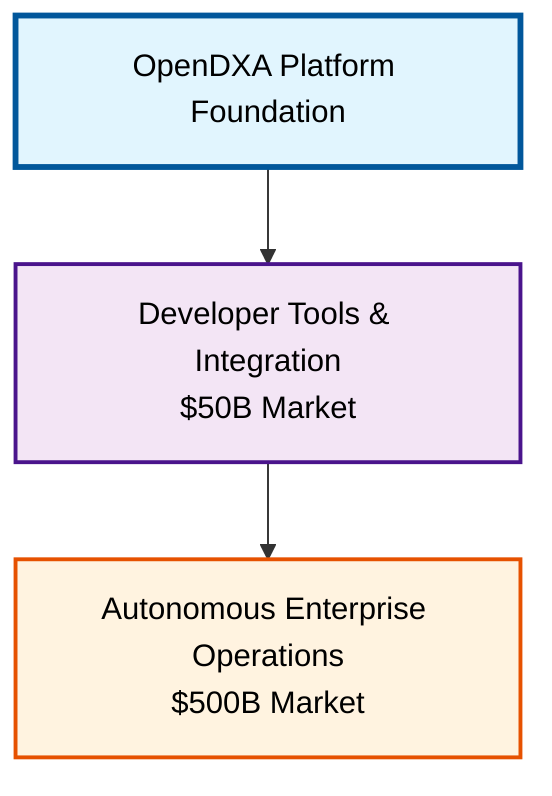
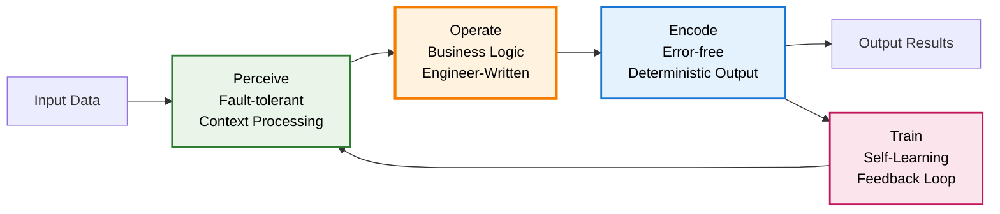

# For Investors

**The AI coding ecosystem just created multiple $1B+ companies in 24 months. OpenDXA extends this proven model into autonomous enterprise operations—a market 10x larger.**

## OpenDXA's Multi-Layer Value Creation

## The AI Coding Wave: Validated Success Formula

The AI coding ecosystem explosion validates our path forward:

- **Cursor**: $9.9B valuation, $500M ARR in record time
- **Windsurf**: $3B valuation, AI coding editor with explosive growth
- **Magic Dev**: $1.5B valuation, AI coding models  
- **Codeium**: $1.25B valuation challenging GitHub Copilot
- **Replit**: $1.16B valuation, AI-powered IDE platform

**Pattern**: AI tools that help developers write code are generating massive value. OpenDXA applies this same pattern to enterprise operations execution.

## What OpenDXA Delivers: Familiar + Revolutionary

### Shared with AI Coding Leaders (Table Stakes)

**AI Code Generation**: Advanced AI assistance for writing Dana code
**Pythonic Language**: Familiar syntax with seamless Python integration—zero learning curve for millions of developers

### Revolutionary Differentiators (Competitive Moats)

- **Self-Learning Functions**: Code that improves its own performance through production usage
**AI-Powered Runtime**: First execution environment designed for autonomous AI operations

## Feature Positioning vs AI Coding Ecosystem

| Capability | AI Coding Tools | OpenDXA | User Benefits |
|------------|----------------|---------|---------------|
| **Code Generation** | ✅ Advanced AI assistance | ✅ Advanced AI assistance | **Parity** - Proven demand |
| **Familiar Language** | ✅ Popular languages | ✅ Pythonic Dana + Python interop | **Parity** - Zero adoption friction |
| **Self-Learning Functions** | ❌ Static generated code | ✅ Functions optimize themselves | **Breakthrough** - Compound value |
| **AI-Powered Runtime** | ❌ Traditional execution | ✅ Native AI integration | **Breakthrough** - Enterprise reliability |

## Technical Breakthrough: POET Self-Learning Functions

**POET (Perceive-Operate-Encode-Train) represents the next evolution beyond static code generation:**

**Result**: Engineers write business logic once. Functions become autonomous, self-optimizing production systems.

### P - Perceive: Fault-Tolerant Context Inference

**Capability**: Runtime automatically handles messy, real-world input through intelligent context analysis

**Examples**:

- **Email parsing**: Extracts key data even when emails have varying formats, attachments, or forwarded content
- **Sensor data**: Interprets readings despite noise, missing values, or equipment drift
- **Document processing**: Understands intent from PDFs, scanned images, or malformed text

**User Benefit**: Functions work reliably with imperfect real-world data without manual error handling

### O - Operate: AI-Enhanced Business Logic

**Capability**: Engineers write core business logic, optionally leveraging Aitomatic's AI code generation APIs

**Examples**:

- **Core logic**: `if temperature > threshold: trigger_alert()`
- **AI-assisted**: Use Aitomatic APIs for complex decision-making within business rules
- **Hybrid approach**: Traditional logic + AI reasoning for edge cases

**User Benefit**: Focus on business rules while optionally incorporating AI capabilities where needed

### E - Encode: Guaranteed Output Reliability

**Capability**: Runtime ensures outputs exactly match user expectations through intelligent type validation

**Examples**:

- **Type hints**: `-> float` guarantees numeric output, even from text extraction
- **Structure validation**: `-> List[Customer]` ensures properly formatted customer objects
- **Format compliance**: `-> ISO8601DateTime` delivers correctly formatted timestamps

**User Benefit**: Eliminate output parsing errors and downstream system failures

### T - Train: Revolutionary Adaptive Functions

**Capability**: Functions automatically improve their performance through production usage—first time at Pythonic code level

**Examples**:

- **Optimization learning**: Yield control functions learn better parameter combinations over time
- **Pattern recognition**: Fraud detection improves accuracy by learning from new attack patterns  
- **Performance tuning**: Functions automatically adjust response times based on usage patterns

**User Benefit**: Systems get smarter and more valuable over time without engineering effort

## Market Opportunity: AI Coding Success × 10

### Immediate Market: Dana Development Tools ($50B)

Building on proven AI coding success:

- **Code Generation Parity**: Same developer experience as Cursor/v0
- **Python Ecosystem**: Leverage existing libraries and developer familiarity
- **Enterprise Focus**: Purpose-built for business automation

### Exponential Market: Autonomous Enterprise Operations ($500B)

The natural evolution beyond code generation:

- **Self-Optimizing Systems**: Functions that improve themselves in production
- **Autonomous Operations**: AI systems running enterprise processes independently  
- **Platform Economics**: Revenue scales with customer value creation, not seat count

**Market Timing**: AI coding tools proved enterprises pay premium for AI productivity. OpenDXA targets the 10x larger market of enterprises paying for AI autonomy.

## Production Validation: Enterprise Results

**Semiconductor Manufacturing**: 25% yield improvements worth $50M+ annually per fab
- Traditional: Static process controls requiring manual optimization
- OpenDXA: Self-learning functions automatically optimize from 10,000+ variables

**Financial Services**: 60% compliance cost reduction with improving accuracy
- Traditional: Rule-based systems requiring constant updates
- OpenDXA: Functions adapt to regulatory changes and market conditions automatically

**Healthcare Systems**: 40% faster diagnostics while improving outcomes
- Traditional: Fixed diagnostic protocols
- OpenDXA: Self-improving workflows that learn from population health patterns

**These aren't pilots—they're production deployments generating measurable value today.**

## Defensible Platform Advantages

### Open-Source Developer Ecosystem

- **Pythonic Dana Language**: Instant adoption by millions of Python developers
- **AI Code Generation**: Cursor-level development experience
- **Community Velocity**: Open-source accelerates development beyond proprietary efforts

### Self-Learning Network Effects

- **POET Functions**: Improve with aggregate usage across all customers
- **Shared Intelligence**: Learning insights strengthen the platform for everyone
- **Data Advantage**: Production optimization data competitors cannot replicate

### Revenue Model Scalability

- **Developer Tools**: Immediate Cursor-level subscription revenue
- **Runtime Platform**: Fees scale with autonomous process execution
- **Performance Value**: Revenue sharing based on efficiency improvements delivered

## Investment Opportunity: The Next AI Coding Wave

**AI Coding Ecosystem Success**: $9B Cursor + $700M Bolt.new + $1.25B Codeium = Validated market demand

**OpenDXA Advantage**: Same proven formula applied to enterprise operations—a market 10x larger with higher-value use cases

### Economic Impact Projection

- **Conservative Value Creation**: $50B+ annual enterprise value by 2030
- **Platform Capture**: 10-15% through runtime licensing and performance dividends
- **Revenue Projection**: $5-7.5B annual platform revenue

### Competitive Timing

**Limited Window**: Microsoft, Google, and AWS building enterprise AI runtimes
**Advantage Period**: 18-month window to establish platform dominance
**Ecosystem Position**: First autonomous enterprise runtime with production validation

## The Platform Play of the AI Era

**This is the Databricks moment for enterprise AI.** Just as Databricks created massive value by establishing the unified analytics platform, OpenDXA is positioned to lead the autonomous enterprise runtime ecosystem.

**Investment Thesis**:

- **Proven demand pattern**: AI coding tools validated enterprise willingness to pay premium for AI productivity
- **Natural market expansion**: From development productivity to enterprise operations autonomy
- **Technical breakthrough**: Self-learning functions + AI-powered runtime create defensible moats
- **Market timing**: Riding proven AI coding wave into 10x larger enterprise operations market

**The companies that deploy autonomous systems first will dominate their industries. The platform that enables this transformation will capture unprecedented value.**

## Investment Inquiries

**This opportunity is available to qualified investors for a limited time.**

**Note: We only engage with accredited investors and principals directly. No agents or intermediaries, please.**

For immediate consideration: investors@aitomatic.com
=======
The shift from static to adaptive computing represents a once-in-a-generation opportunity to establish the foundation for all enterprise AI systems. OpenDXA Dana, the first true runtime for the AI era, is positioned to be this foundation - just as early platform plays like VMware and Spark created massive value by solving fundamental infrastructure challenges.

Imagine these transformative capabilities across critical domains:

In semiconductor manufacturing: Traditional systems use static functions that alert on predefined thresholds. OpenDXA Dana's adaptive functions learn from historical patterns - they understand that a 2% deviation at step A followed by a 1% change at step B predicts yield issues 98% of the time, even though neither deviation alone breaks thresholds. The function automatically adjusts its sensitivity based on upstream conditions, material batches, and maintenance cycles.

In financial trading: Static algorithms follow fixed rules for position sizing. OpenDXA Dana's adaptive functions dynamically adjust trading parameters based on real-time market microstructure, correlation shifts across asset classes, and emerging systemic risks - capabilities that previously required constant human monitoring and adjustment.

In healthcare diagnostics: Traditional rule-based systems use fixed decision trees. OpenDXA Dana's functions learn from patient populations, adapting their diagnostic pathways based on demographic shifts, seasonal patterns, and emerging condition variants - while maintaining full auditability for regulatory compliance.

In energy grid management: Static load balancing uses predetermined thresholds. OpenDXA Dana's adaptive functions learn consumption patterns across the network, anticipating demand spikes from subtle precursors like social media sentiment, weather micropatterns, and industrial activity signals - enabling proactive rather than reactive grid management.

## Market Context

The enterprise AI infrastructure market is projected to reach $150B by 2027. Within this, the segment for development tools and runtime environments represents approximately $30B, with a 45% CAGR as enterprises move from experimentation to production deployment. Our initial focus is on regulated industries and mission-critical applications, where the need for reliable, auditable AI systems is most acute.

## Technical Foundation

The adaptive runtime architecture introduces capabilities previously impossible in traditional systems:
- Self-learning functions that improve with usage patterns
- Context-aware execution that adapts to changing conditions
- Deterministic control flow with dynamic AI operations
- Built-in fault tolerance and verification for LLM interactions
- Enterprise-grade security and audit controls

## Application Domains

The platform is particularly relevant for industries requiring intelligent, adaptive systems:
- Semiconductor manufacturing process control
- Financial services compliance and automation
- Healthcare decision support systems
- Enterprise knowledge management
- Complex industrial automation

## Investment Inquiries

**Note: We only engage with accredited investors and principals directly. No agents or intermediaries, please.**

For investment opportunities, qualified parties may contact: investors@aitomatic.com 