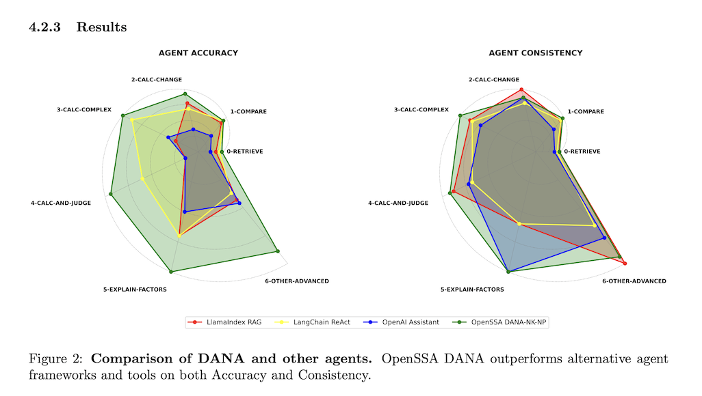

# OpenDXA for Researchers

*Exploring the theoretical foundations, research implications, and academic opportunities in agent-native neurosymbolic AI at the convergence of development assistance and autonomous execution*

---

## Research Overview

OpenDXA represents a significant advancement in neurosymbolic computing through its agent-native architecture, bridging the gap between symbolic reasoning and neural computation while converging AI coding assistance with autonomous execution. For researchers, OpenDXA offers:

- Novel Architecture: A practical implementation of agent-native neurosymbolic principles that unifies development and runtime
- Research Platform: Tools for studying the convergence of human-AI collaboration in development and autonomous agent behavior
- Theoretical Foundations: New approaches to reliability, transparency, and verification in self-improving AI systems
- Empirical Opportunities: Real-world data on AI system behavior across development and production phases

### Foundational Research: DANA Paper

A key publication outlining the principles behind OpenDXA is:

- [DANA: Domain-Aware Neurosymbolic Agents for Consistency and Accuracy](https://arxiv.org/abs/2410.02823). *V. Luong, S. Dinh, S. Raghavan, et al.* (arXiv:2410.02823) - This paper introduces DANA (Domain-Aware Neurosymbolic Agent), an architecture that addresses inconsistency and inaccuracy in LLMs by integrating domain-specific knowledge with neurosymbolic approaches. It demonstrates how DANA achieves high accuracy and consistency, for example, on financial benchmarks. [[DOI](https://doi.org/10.48550/arXiv.2410.02823)]

 

---

## Research Domains

### Neurosymbolic Computing
OpenDXA provides a unique platform for advancing neurosymbolic research:

- Hybrid Architectures: Study the integration of symbolic and neural components
- Reasoning Patterns: Analyze how systems combine logical and probabilistic reasoning
- Context Management: Investigate scalable approaches to context-aware processing
- Verification Methods: Develop new techniques for verifying probabilistic systems

### Cognitive Architecture Research
Dana's design offers insights into cognitive computing principles:

- Memory Systems: Multi-scope memory management and access patterns
- Attention Mechanisms: Context-driven focus and processing strategies
- Learning Integration: Continuous learning in production environments
- Meta-Cognition: Self-awareness and self-improvement in AI systems

### Human-AI Interaction
OpenDXA enables new research in collaborative intelligence:

- Transparency Effects: Impact of system transparency on trust and adoption
- Collaborative Patterns: Effective human-AI workflow designs
- Knowledge Transfer: Mechanisms for sharing insights between humans and AI
- Explainable AI: Practical approaches to AI explanation and interpretation

---

## Theoretical Foundations

### The Dana Language Paradigm

Dana represents a new paradigm in programming languages designed specifically for agent-native AI automation that bridges development assistance with autonomous execution:

```python
# Traditional approach: Opaque, brittle
result = llm_call("analyze data", context=data)
if result.confidence < 0.8:
 # Manual error handling
 result = fallback_method()

# Dana approach: Transparent, self-correcting
analysis = reason("analyze data", context=data)
while confidence(analysis) < high_confidence:
 analysis = reason("refine analysis", context=[data, analysis])
```

Key Innovations:
- Explicit State Management: All context and variables are tracked and inspectable
- Built-in Verification: Confidence tracking and automatic retry mechanisms
- Context-Aware Reasoning: Intelligent context selection and management
- Self-Healing Execution: Automatic error detection and correction

### Neurosymbolic Integration Model

OpenDXA implements a novel agent-native approach to neurosymbolic integration that unifies development-time assistance with runtime autonomy:

```
Symbolic Layer (Dana Language)
├── Explicit Logic and Control Flow
├── Deterministic State Management
├── Verifiable Execution Paths
└── Human-Readable Programs

Neural Layer (LLM Integration)
├── Adaptive Reasoning and Understanding
├── Context-Aware Processing
├── Natural Language Capabilities
└── Pattern Recognition and Learning

Integration Mechanisms
├── Seamless Function Calls (reason, use)
├── Context Bridge (automatic context injection)
├── Verification Loops (confidence-based retry)
└── Learning Feedback (continuous improvement)
```

### CORRAL Knowledge Lifecycle

The CORRAL framework represents a systematic approach to domain knowledge management:

1. **Collect**: Systematic knowledge acquisition from diverse sources
2. **Organize**: Structured representation and categorization
3. **Retrieve**: Context-aware knowledge access and selection
4. **Reason**: Inference and decision-making processes
5. **Act**: Knowledge application to real-world tasks
6. **Learn**: Feedback integration and knowledge refinement

[Detailed Theoretical Framework](manifesto/vision.md)

### Research Opportunities at the Convergence

### Development-Runtime Continuity

OpenDXA's unified model enables new research into continuous AI systems:

Research Questions:
- How do AI systems maintain consistency when transitioning from development assistance to autonomous execution?
- What are the optimal boundaries between human-guided development and machine learning?
- How can we ensure reliability across the development-to-production pipeline?

Experimental Opportunities:
- Longitudinal studies of agent evolution from development to deployment
- Analysis of human-AI collaboration patterns in agent-native development
- Performance studies of context-aware execution across different domains

### Adaptive Function Research

OpenDXA's POET-enabled self-improvement provides unique research opportunities:

Research Questions:
- How do functions optimize themselves while maintaining reliability guarantees?
- What are the convergence properties of self-improving compositional pipelines?
- How can we verify the behavior of adaptive systems over time?

Research Directions:
- Formal verification of self-modifying agent systems
- Stability analysis of POET learning loops
- Meta-learning approaches for agent-native development

---

## 🔬 Research Opportunities

### Formal Verification in Probabilistic Systems

OpenDXA's architecture enables new approaches to formal verification:

Research Questions:
- How can we formally verify properties of systems that include probabilistic components?
- What mathematical frameworks can model the behavior of neurosymbolic systems?
- How do we ensure correctness in systems that adapt and learn?

Potential Approaches:
- Probabilistic model checking for Dana programs
- Temporal logic specifications for agent behavior
- Statistical verification of LLM-integrated systems

### Cognitive Load and System Transparency

OpenDXA's transparency features provide opportunities to study cognitive effects:

Research Questions:
- How does system transparency affect user trust and decision-making?
- What level of detail is optimal for different types of users?
- How do transparent AI systems change human reasoning patterns?

Experimental Opportunities:
- User studies with varying levels of system transparency
- Cognitive load measurements during AI-assisted tasks
- Long-term studies of human-AI collaboration patterns

### Adaptive Learning in Production Systems

OpenDXA's self-improving capabilities enable research into adaptive systems:

Research Questions:
- How do AI systems learn and adapt in real-world environments?
- What are the optimal strategies for balancing exploration and exploitation?
- How can we ensure stable learning in dynamic environments?

Research Directions:
- Online learning algorithms for agent capabilities
- Meta-learning approaches for rapid adaptation
- Stability analysis of self-modifying systems

---

## 🧪 Empirical Research Platform

### Data Collection and Analysis

OpenDXA provides rich data for empirical research:

Available Data Types:
- Execution Traces: Complete logs of agent execution and decision-making
- Performance Metrics: Response times, accuracy, and reliability measurements
- User Interaction Data: How humans interact with and modify agent behavior
- Learning Patterns: How agents improve over time and across domains

Research Applications:
- Large-scale analysis of AI reasoning patterns
- Performance optimization through empirical analysis
- User behavior studies in human-AI collaboration
- Longitudinal studies of system evolution

### Benchmarking and Evaluation

OpenDXA enables new approaches to AI system evaluation:

Novel Evaluation Metrics:
- Transparency Score: Quantifying system explainability
- Reliability Index: Measuring consistency across diverse inputs
- Adaptability Measure: Assessing learning and improvement rates
- Collaboration Effectiveness: Evaluating human-AI team performance

Benchmark Development:
- Domain-specific evaluation suites
- Cross-system comparison frameworks
- Longitudinal performance tracking
- Real-world deployment studies

---

## 📖 Academic Collaboration

### Research Partnerships

OpenDXA actively collaborates with academic institutions:

Current Partnerships:
- University research labs studying neurosymbolic computing
- Cognitive science departments investigating human-AI interaction
- Computer science programs developing formal verification methods
- Business schools analyzing AI adoption and organizational change

Collaboration Opportunities:
- Joint research projects and publications
- Student internships and thesis projects
- Access to production data and systems
- Co-development of research tools and methodologies

### Publication and Dissemination

OpenDXA research contributes to multiple academic venues:

Target Conferences:
- AAAI (Artificial Intelligence)
- IJCAI (International Joint Conference on AI)
- NeurIPS (Neural Information Processing Systems)
- ICML (International Conference on Machine Learning)
- CHI (Computer-Human Interaction)

Journal Publications:
- Journal of Artificial Intelligence Research
- Artificial Intelligence
- ACM Transactions on Intelligent Systems
- IEEE Transactions on Cognitive and Developmental Systems

### Educational Applications

OpenDXA serves as an educational platform for AI concepts:

Course Integration:
- AI and Machine Learning courses
- Software Engineering and System Design
- Human-Computer Interaction
- Cognitive Science and Psychology

Student Projects:
- Undergraduate capstone projects
- Graduate research theses
- Hackathons and competitions
- Open-source contributions

---

## 🔮 Future Research Directions

### Theoretical Advances

Formal Foundations:
- Mathematical models of neurosymbolic computation
- Complexity analysis of hybrid reasoning systems
- Correctness proofs for adaptive AI systems
- Information-theoretic analysis of transparency

Cognitive Models:
- Mapping Dana operations to cognitive science principles
- Models of human-AI collaborative reasoning
- Theories of trust and transparency in AI systems
- Frameworks for explainable AI evaluation

### Technological Innovation

Advanced Architectures:
- Distributed neurosymbolic systems
- Quantum-classical hybrid computing
- Neuromorphic implementation of Dana
- Edge computing for agent deployment

Enhanced Capabilities:
- Multi-modal reasoning and understanding
- Causal reasoning and intervention
- Temporal reasoning and planning
- Social and collaborative intelligence

### Societal Impact Research

Adoption and Diffusion:
- Organizational factors in AI adoption
- Economic impact of transparent AI systems
- Social implications of human-AI collaboration
- Policy frameworks for responsible AI

Ethics and Governance:
- Ethical implications of transparent AI
- Governance models for adaptive systems
- Accountability in human-AI teams
- Privacy and security in collaborative AI

---

## 📊 Research Resources

### Datasets and Benchmarks

OpenDXA Research Datasets:
- Production execution traces from diverse domains
- Human-AI interaction logs and annotations
- Performance benchmarks across different tasks
- Longitudinal studies of system evolution

Benchmark Suites:
- Neurosymbolic reasoning benchmarks
- Transparency and explainability evaluations
- Human-AI collaboration assessments
- Real-world deployment case studies

### Tools and Frameworks

Research Tools:
- Dana program analysis and visualization
- Execution trace analysis and mining
- Performance profiling and optimization
- User study and experiment frameworks

Development Platforms:
- Research-oriented OpenDXA distributions
- Experimental feature branches
- Simulation and testing environments
- Integration with research computing resources

### Community and Support

Research Community:
- Monthly research seminars and presentations
- Annual OpenDXA research symposium
- Collaborative research working groups
- Peer review and feedback networks

Technical Support:
- Research-specific documentation and tutorials
- Direct access to core development team
- Priority support for academic projects
- Custom feature development for research needs

---

## 📞 Getting Involved

### For Individual Researchers
- Explore the Platform: [Start with the manifesto](manifesto/vision.md) and [theoretical foundations](neurosymbolic/README.md)
- Join Research Community: [Research mailing list](mailto:research@aitomatic.com) and [Discord channel](https://discord.gg/opendxa-research)
- Propose Collaboration: [Submit research proposal](research/README.md)

### For Research Groups
- Partnership Inquiry: [Contact research partnerships](mailto:partnerships@aitomatic.com)
- Grant Collaboration: [Joint funding opportunities](research/README.md)
- Data Access Request: [Research data access program](research/README.md)

### For Students
- Thesis Projects: [Student research program](research/README.md)
- Internship Opportunities: [Research internships](research/README.md)
- Open Source Contributions: [Student contributor guide](research/README.md)

---

*Ready to advance the frontiers of neurosymbolic AI? Start with our [research manifesto](manifesto/vision.md) or [explore collaboration opportunities](research/README.md).*

<p align="center">
Copyright © 2025 Aitomatic, Inc. Licensed under the <a href="../../LICENSE.md">MIT License</a>.
<br/>
<a href="https://aitomatic.com">https://aitomatic.com</a>
</p>
