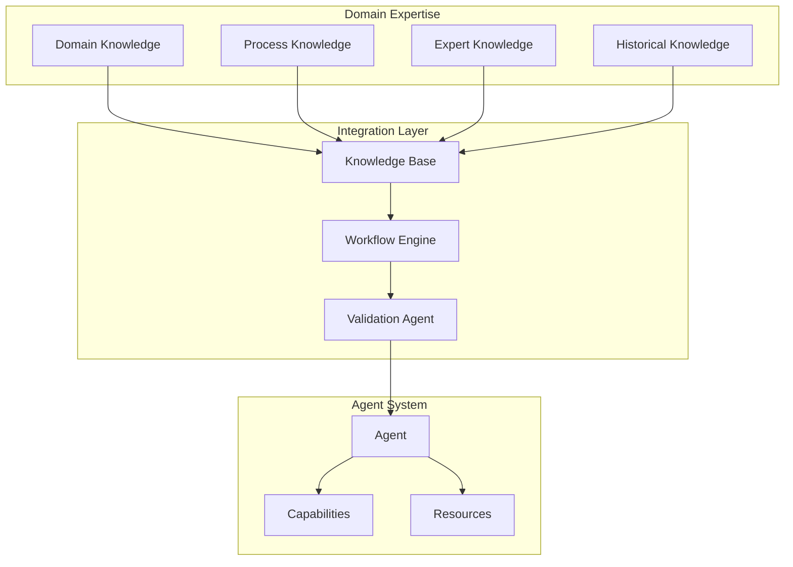

<!-- markdownlint-disable MD041 -->
<!-- markdownlint-disable MD033 -->
# Domain Expertise in OpenDXA

## Overview

OpenDXA's domain expertise integration is a key differentiator that enables building truly expert agents. The framework provides structured ways to embed domain knowledge, processes, and expertise into agents, making them more effective and reliable in specific domains.

## Key Features

### 1. Knowledge Representation
- Structured domain models
- Process definitions
- Rules and constraints
- Best practices
- Historical data

### 2. Expertise Integration
- Domain-specific capabilities
- Expert knowledge bases
- Process workflows
- Validation rules
- Quality metrics

## Architecture



## Implementation

### 1. Knowledge Base Integration
```python
from opendxa.knowledge import KnowledgeBase
from opendxa.domain import DomainExpert

# Initialize knowledge base
kb = KnowledgeBase()
kb.load_domain_knowledge("semiconductor")

# Create domain expert
expert = DomainExpert(
 knowledge_base=kb,
 domain="semiconductor",
 expertise_level="advanced"
)
```

### 2. Process Integration
```python
from opendxa.process import ProcessDefinition
from opendxa.workflow import WorkflowEngine

# Define process
process = ProcessDefinition(
 name="wafer_inspection",
 steps=[
 {"name": "pre_inspection", "type": "setup"},
 {"name": "inspection", "type": "main"},
 {"name": "post_inspection", "type": "cleanup"}
 ]
)

# Create workflow
workflow = WorkflowEngine(process)
```

### 3. Validation Integration
```python
from opendxa.validation import ValidationEngine
from opendxa.metrics import QualityMetrics

# Initialize validation
validation = ValidationEngine(
 rules=process.validation_rules,
 metrics=QualityMetrics()
)

# Validate process
result = validation.validate(process_data)
```

## Best Practices

1. **Knowledge Organization**
 - Structure domain knowledge clearly
 - Define processes explicitly
 - Document rules and constraints
 - Maintain version control

2. **Expertise Integration**
 - Use appropriate abstractions
 - Validate knowledge quality
 - Test thoroughly
 - Monitor performance

3. **Process Management**
 - Define clear workflows
 - Handle exceptions
 - Track progress
 - Ensure quality

## Common Patterns

1. **Domain-Specific Agent**
 ```python
 from opendxa.agent import Agent
 from opendxa.domain import DomainExpert

 # Create domain expert
 expert = DomainExpert(
 knowledge_base=kb,
 domain="semiconductor"
 )

 # Create agent with expertise
 agent = Agent()
 agent.with_expertise(expert)
 agent.with_capabilities([
 "process_control",
 "quality_assurance",
 "troubleshooting"
 ])
 ```

2. **Process Execution**
 ```python
 # Define process
 process = ProcessDefinition(
 name="wafer_inspection",
 steps=inspection_steps
 )

 # Execute with validation
 result = await agent.execute_process(
 process=process,
 validation=True,
 metrics=True
 )
 ```

3. **Expert Consultation**
 ```python
 # Query expert knowledge
 advice = expert.consult(
 context="wafer_defect",
 parameters=defect_data
 )

 # Apply expert advice
 action = agent.interpret_advice(advice)
 result = await agent.execute_action(action)
 ```

## Domain Examples

1. **Semiconductor Manufacturing**
 - Process control
 - Quality assurance
 - Equipment monitoring
 - Yield analysis

2. **Healthcare**
 - Patient diagnosis
 - Treatment planning
 - Medical records
 - Clinical guidelines

3. **Finance**
 - Risk assessment
 - Portfolio management
 - Compliance checking
 - Market analysis

## Next Steps

- Learn about [Declarative-Imperative Architecture](../key-differentiators/declarative-imperative.md)
- Understand [Knowledge Evolution](../key-differentiators/knowledge-evolution.md)
- Explore [Protocol Federation](../key-differentiators/protocol-federation.md)
- See [Examples](../../examples/domain-expert.md)

---
<p align="center">
Copyright © 2025 Aitomatic, Inc. Licensed under the <a href="../../LICENSE.md">MIT License</a>.
<br/>
<a href="https://aitomatic.com">https://aitomatic.com</a>
</p>
