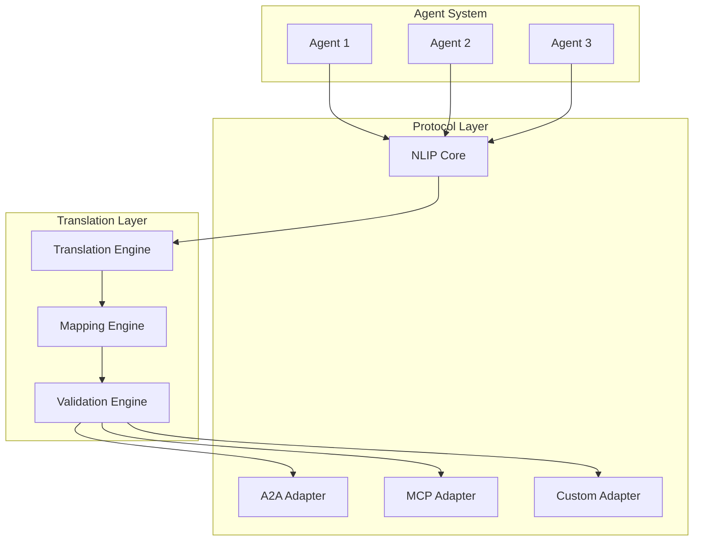

<!-- markdownlint-disable MD041 -->
<!-- markdownlint-disable MD033 -->
# Protocol Federation in OpenDXA

## Overview

OpenDXA's Protocol Federation system, built on the Natural Language Interoperability Protocol (NLIP), enables seamless communication between different agent systems and standards. This eliminates vendor lock-in and allows integration with various AI platforms and tools.

## Key Features

### 1. Interoperability
- Cross-protocol communication
- Standard translation
- Protocol adaptation
- Message routing
- Error handling

### 2. Protocol Support
- A2A (Agent-to-Agent)
- MCP (Model Context Protocol)
- Custom protocols
- Legacy systems
- Future standards

## Architecture



## Implementation

### 1. Protocol Setup
```python
from opendxa.protocol import ProtocolManager
from opendxa.adapters import A2AAdapter, MCPAdapter

# Initialize protocol manager
protocols = ProtocolManager()

# Register adapters
protocols.register(A2AAdapter())
protocols.register(MCPAdapter())
```

### 2. Message Translation
```python
from opendxa.translation import MessageTranslator

# Initialize translator
translator = MessageTranslator(protocols)

# Translate message
translated = translator.translate(
 message=original_message,
 from_protocol="a2a",
 to_protocol="mcp"
)
```

### 3. Protocol Routing
```python
from opendxa.routing import MessageRouter

# Initialize router
router = MessageRouter(protocols)

# Route message
result = await router.route(
 message=message,
 target="agent2",
 protocol="mcp"
)
```

## Best Practices

1. **Protocol Design**
 - Clear message formats
 - Standard interfaces
 - Error handling
 - Version control

2. **Translation**
 - Accurate mapping
 - Context preservation
 - Error recovery
 - Performance optimization

3. **Routing**
 - Efficient paths
 - Load balancing
 - Error handling
 - Monitoring

## Common Patterns

1. **Cross-Protocol Communication**
 ```python
 # Send message across protocols
 result = await protocols.send(
 message=message,
 from_agent="agent1",
 to_agent="agent2",
 from_protocol="a2a",
 to_protocol="mcp"
 )
 ```

2. **Protocol Adaptation**
 ```python
 # Adapt message for protocol
 adapted = protocols.adapt(
 message=message,
 target_protocol="mcp",
 context=context
 )

 # Send adapted message
 result = await protocols.send(
 message=adapted,
 to_agent="agent2"
 )
 ```

3. **Error Handling**
 ```python
 try:
 result = await protocols.send(message)
 except ProtocolError as e:
 # Handle protocol error
 if e.is_transient:
 # Retry
 result = await protocols.retry(message)
 else:
 # Log and report
 logger.error(f"Protocol error: {e}")
 ```

## Protocol Examples

1. **A2A Communication**
 - Agent discovery
 - Message exchange
 - State synchronization
 - Error handling

2. **MCP Integration**
 - Tool discovery
 - Context sharing
 - State management
 - Error handling

3. **Custom Protocols**
 - Legacy systems
 - Specialized tools
 - Domain-specific
 - Performance critical

## Next Steps

- Learn about [Declarative-Imperative Architecture](../key-differentiators/declarative-imperative.md)
- Understand [Domain Expertise](../key-differentiators/domain-expertise.md)
- Explore [Knowledge Evolution](../key-differentiators/knowledge-evolution.md)
- See [Examples](../../examples/protocol-federation.md)

---
<p align="center">
Copyright © 2025 Aitomatic, Inc. Licensed under the <a href="../../LICENSE.md">MIT License</a>.
<br/>
<a href="https://aitomatic.com">https://aitomatic.com</a>
</p>
