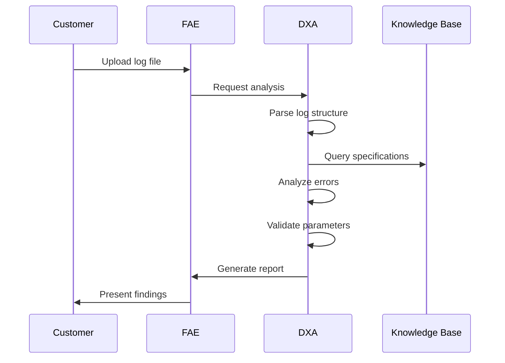
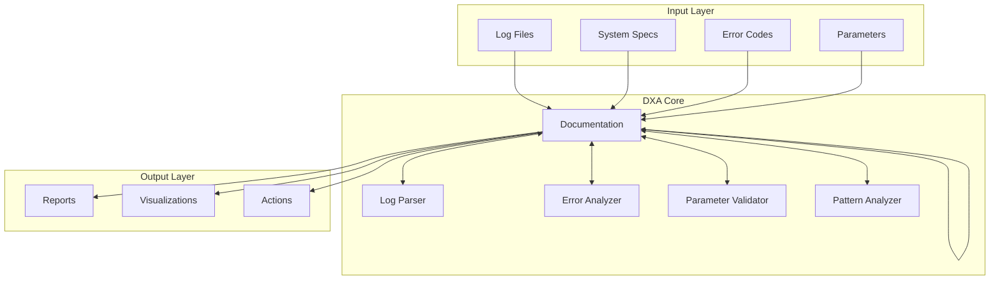

<!-- markdownlint-disable MD041 -->
<!-- markdownlint-disable MD033 -->
# Semiconductor System Log Analysis Requirements

## Scenario Overview

This document describes the requirements for semiconductor customers who need to analyze system log files for error detection and parameter validation using DXA in a single conversation.

## Business/Technical Problem Statement

### Persona
Alex Thompson, Semiconductor Process Engineer
- 6+ years experience in semiconductor manufacturing
- Responsible for troubleshooting equipment issues and process anomalies
- Must maintain high throughput while ensuring process quality
- Works across multiple tools and process types
- Reports to the Fab Engineering Manager

### Use Case
Alex needs to quickly analyze system log files to identify errors, validate parameters, and diagnose issues in semiconductor manufacturing equipment. He must extract meaningful insights from complex log data, identify patterns, and recommend appropriate corrective actions to prevent production delays and quality issues.

### Scenario
During a routine process check, Alex notices unusual behavior in one of the lithography tools. He needs to:
1. Collect and upload the system log files from the affected tool
2. Parse and analyze the log data for error patterns
3. Validate key process parameters against specifications
4. Identify potential root causes based on historical data
5. Recommend specific corrective actions
6. Document his findings for the maintenance team

Alex is under pressure to diagnose and resolve the issue quickly as the affected tool is critical to the current production lot. He needs a system that can help him analyze complex log data rapidly and provide actionable insights.

### System Components

1. **Log Processing System**
 - Log file parser
 - Error code extractor
 - Parameter validator
 - Pattern matcher
 - Statistical analyzer

2. **Knowledge Base**
 - System specifications
 - Error code libraries
 - Parameter tolerances
 - Tool configurations
 - Technical documentation

3. **Analysis Engine**
 - Error detection
 - Parameter validation
 - Trend analysis
 - Pattern recognition
 - Root cause identification

4. **Reporting System**
 - Analysis report generator
 - Visualization tools
 - Documentation references
 - Action recommendations

### Example Scenario: Log Analysis Process

#### Context

- Semiconductor system log analysis environment
- DXA has access to:
 - System specification databases
 - Error code libraries
 - Parameter tolerance specifications
 - Tool configuration databases
 - Technical documentation
 - Standard log formats

#### Challenge

1. Accurate Analysis
 - Parse complex log formats
 - Identify error patterns
 - Validate parameters
 - Detect anomalies
 - Cross-reference specifications

2. Timely Response
 - Process logs quickly
 - Generate actionable insights
 - Provide clear recommendations
 - Maintain conversation context
 - Handle follow-up questions

3. Data Security
 - Protect proprietary information
 - Handle sensitive data
 - Maintain compliance
 - Manage access levels
 - Control data retention

#### DXA Actions

1. **Log Processing**
 - Parse log files
 - Extract error codes
 - Validate parameters
 - Analyze trends
 - Detect patterns

2. **Analysis Generation**
 - Cross-reference specifications
 - Identify root causes
 - Generate recommendations
 - Create visualizations
 - Document findings

## Solution Architecture

### 1. Input Components

- Log file parser
- System specification access
- Error code libraries
- Parameter databases

### 2. DXA Core Components

#### Log Parser

- Format recognition
- Structure identification
- Data extraction
- Error handling

#### Error Analyzer

- Pattern matching
- Code categorization
- Severity assessment
- Root cause analysis

#### Parameter Validator

- Specification comparison
- Tolerance checking
- Trend analysis
- Correlation detection

### Integration Details

#### System Integration

- Log file format support
- Database connectivity
- Security protocols
- Access management

#### Knowledge Integration

- Specification databases
- Error libraries
- Tool configurations
- Technical documentation

## Success Criteria

- Accurate error code identification (>99% accuracy)
- Correct parameter extraction and validation
- Valid trend and pattern recognition
- Response time under 2 minutes
- Successful root cause identification
- Compliance with semiconductor industry standards

## Performance Metrics

- Log parsing accuracy
- Error pattern recognition rate
- Parameter validation accuracy
- Analysis generation time
- Pattern matching precision
- Solution relevance score

---

Copyright © 2025 Aitomatic, Inc. Licensed under the <a href="../../LICENSE.md">MIT License</a>.
 
<a href="https://aitomatic.com">https://aitomatic.com</a>

