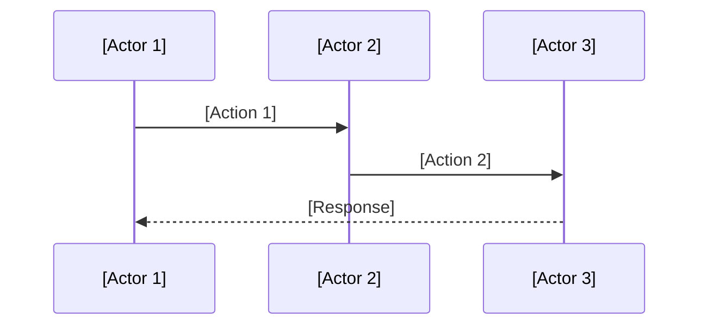
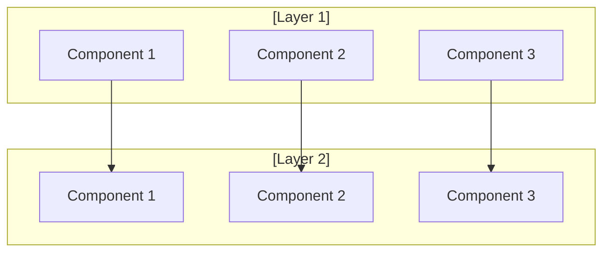

<!-- markdownlint-disable MD041 -->
<!-- markdownlint-disable MD033 -->
# [Title]

## Business/Technical Problem Statement

### Persona
**[Name, Role]**
- [Key characteristic 1]
- [Key characteristic 2]
- [Key characteristic 3]
- [Key characteristic 4]
- [Reporting structure/position in organization]

### Use Case
[Persona] needs to [primary action] in [context]. They must [secondary action] to [goal].

### Scenario
[Describe a specific situation where the persona encounters a problem]. They need to:
1. [Step 1]
2. [Step 2]
3. [Step 3]
4. [Step 4]
5. [Step 5]
6. [Step 6]

[Persona] is under pressure because [constraint or urgency]. They need a system that [system requirement].

## Scenario Overview

[Brief description of the system and its primary purpose]

### [Specific Components]

1. **[Component 1]**
   - Key feature 1
   - Key feature 2
   - Key feature 3

2. **[Component 2]**
   - Key feature 1
   - Key feature 2
   - Key feature 3

### Example Scenario: [Scenario Name]

#### Context

- [Context point 1]
- [Context point 2]
- [Context point 3]

#### Challenge

1. [Challenge 1]
   - Detail 1
   - Detail 2
   - Detail 3

2. [Challenge 2]
   - Detail 1
   - Detail 2
   - Detail 3

#### [System Name] Actions

1. **[Action Category 1]**
   - Action 1
   - Action 2
   - Action 3

2. **[Action Category 2]**
   - Action 1
   - Action 2
   - Action 3

## Solution Architecture

### 1. [Layer 1] Components

- Component 1 details
- Component 2 details
- Component 3 details

### 2. [Layer 2] Components

#### [Component 1]

- Feature 1
- Feature 2
- Feature 3

#### [Component 2]

- Feature 1
- Feature 2
- Feature 3

### Integration Details

#### [Integration Type 1]

- Integration point 1
- Integration point 2
- Integration point 3

#### [Integration Type 2]

- Integration point 1
- Integration point 2
- Integration point 3

## Success Criteria

- Criterion 1
- Criterion 2
- Criterion 3

## Performance Metrics

- Metric 1
- Metric 2
- Metric 3

---

Copyright © 2025 Aitomatic, Inc. Licensed under the <a href="../../LICENSE.md">MIT License</a>.
 
<a href="https://aitomatic.com">https://aitomatic.com</a>

