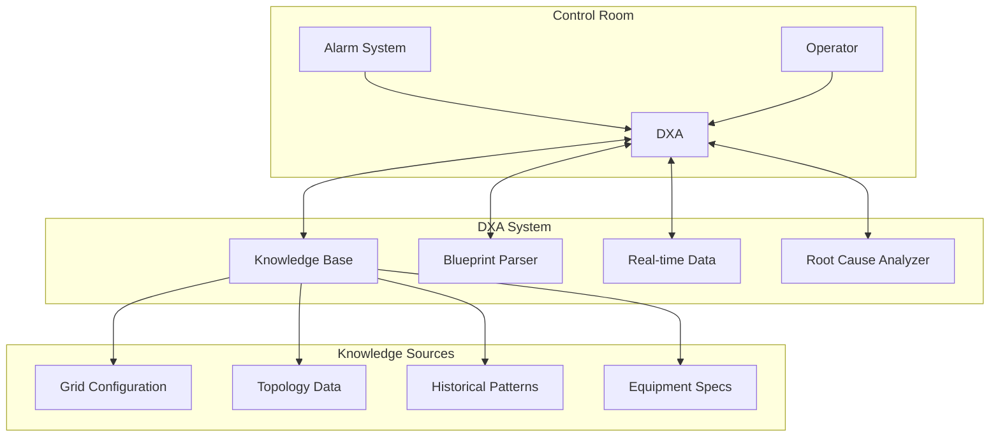
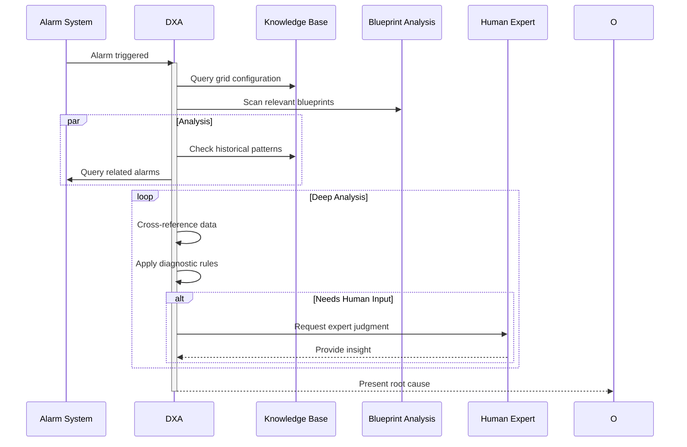

<!-- markdownlint-disable MD041 -->
<!-- markdownlint-disable MD033 -->
# Utility Fault Diagnosis Scenario

This scenario describes how a Domain Expert Agent (DXA) performs root-cause analysis of alarms in an electrical grid base station, supporting grid operators in fault diagnosis and resolution.

## Business/Technical Problem Statement

### Persona
David Wilson, Grid Operator
- 15+ years experience in electrical grid operations
- Responsible for monitoring and maintaining grid stability
- Must ensure continuous power supply while preventing system failures
- Works across multiple substations and grid sections
- Reports to the Grid Operations Manager

### Use Case
David needs to quickly diagnose and resolve alarms in the electrical grid base station to prevent power outages and system failures. He must analyze alarm data, determine root causes, and implement appropriate corrective actions to maintain grid stability and ensure continuous power supply.

### Scenario
During a routine monitoring shift, David receives multiple alarms from a critical substation. He needs to:
1. Review the alarm data and system status
2. Analyze the grid configuration and topology
3. Identify potential root causes based on historical data
4. Determine if immediate intervention is required
5. Recommend specific corrective actions
6. Document his findings for the maintenance team

David is under pressure to diagnose and resolve the issue quickly as the affected substation serves a critical load and any delay could lead to power outages. He needs a system that can help him analyze complex alarm data rapidly and provide actionable insights.

## Scenario Overview

The Domain Expert Agent (DXA) assists grid operators in diagnosing and resolving alarms in electrical grid base stations, ensuring continuous power supply and system stability.

### Grid Station Components

1. **Alarm System**
 - Real-time monitoring
 - Alarm classification
 - Severity assessment
 - Historical tracking

2. **Knowledge Base**
 - Grid configuration data
 - Equipment blueprints
 - Control system documentation
 - Historical alarm patterns

### System Architecture

### Root Cause Analysis Process

### Success Criteria

- Single root cause identified (vs probability-ranked list)
- Supporting evidence documented
- Clear fault location specified
- Minimal human expert consultation needed
- Accurate blueprint interpretation
- Rapid analysis completion

### DXA Performance Metrics

- Root cause accuracy rate
- Time to determination
- False positive rate
- Human expert consultation frequency
- Blueprint analysis accuracy
- Knowledge base coverage

### Key Capabilities

- PDF blueprint parsing and interpretation
- Grid topology understanding
- Real-time system state analysis
- Pattern recognition in alarm sequences
- Integration with control systems
- Selective human expert engagement

## Demo Script (3 minutes)

### Setup (30s)

- Grid control room view showing base station monitoring interface
- Split screen displaying:
 - Alarm notification system
 - DXA analysis interface
 - Grid topology visualization
 - Blueprint analysis window

### Demo Flow

#### 0:00-0:30 - Normal Operation & Alarm

- Show normal grid monitoring state
- Trigger alarm from critical subsystem
- DXA immediately begins data collection:
 - Real-time sensor readings
 - Related alarms/events
 - Equipment state

#### 0:30-1:30 - Root Cause Analysis

- DXA performs multi-source analysis:
 - Parse relevant blueprints
 - Query grid configuration
 - Analyze historical patterns
 - Cross-reference documentation
- Show real-time reasoning process
- Display confidence levels for potential causes

#### 1:30-2:30 - Expert Consultation & Resolution

- DXA identifies need for human expertise
- Show targeted question generation
- Expert provides input
- DXA incorporates feedback and finalizes diagnosis
- Present definitive root cause with evidence

#### 2:30-3:00 - Value Summary

- Show time saved vs traditional diagnosis
- Display accuracy metrics
- Highlight knowledge capture for future cases
- Demonstrate blueprint analysis accuracy

### Interactive Elements

- Drill-down into blueprint analysis
- Alternative fault scenario exploration
- Historical case comparison
- Expert feedback integration

### Technical Requirements

#### Demo Environment

- Grid control system simulation
- Blueprint parsing system
- Real-time data streams
- Expert interface mockup

#### Visualization Requirements

- Alarm visualization
- Blueprint analysis overlay
- Reasoning process display
- Root cause confidence metrics
- Knowledge base updates

#### Backup Plans

- Pre-recorded analysis sequence
- Offline blueprint analysis results
- Sample expert consultation workflow
- Alternative fault scenarios

---

Copyright © 2025 Aitomatic, Inc. Licensed under the <a href="../../LICENSE.md">MIT License</a>.
 
<a href="https://aitomatic.com">https://aitomatic.com</a>

