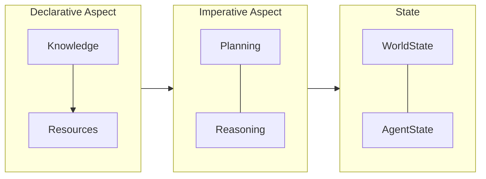

# Declarative-Imperative Architecture in OpenDXA

## Overview

OpenDXA's architecture is built around a clear separation between declarative (what the agent knows) and imperative (how the agent acts) aspects. This separation is a key differentiator that enables more robust, maintainable, and scalable agent systems.

## Architecture Components

### 1. Declarative Aspect
- Defines what the agent knows
- Manages knowledge and resources
- Handles domain expertise
- Provides structured access to knowledge

### 2. Imperative Aspect
- Implements planning and reasoning
- Executes tasks using available knowledge
- Manages state and context
- Coordinates multi-agent interactions

## Architecture Diagram



## Key Benefits

1. **Clear Separation of Concerns**
   - Knowledge management is separate from execution
   - Easier to maintain and evolve
   - Better testability
   - More predictable behavior

2. **Improved Maintainability**
   - Knowledge can be updated independently
   - Execution logic can be modified without affecting knowledge
   - Easier to debug and troubleshoot
   - Better code organization

3. **Enhanced Scalability**
   - Knowledge can be distributed
   - Execution can be parallelized
   - Resources can be shared
   - State can be managed efficiently

## Implementation

### 1. Declarative Implementation
```python
from opendxa.knowledge import KnowledgeBase
from opendxa.resources import ResourceManager

# Initialize knowledge
kb = KnowledgeBase()
kb.load_domain_knowledge("semiconductor")

# Initialize resources
resources = ResourceManager()
resources.add("llm", LLMResource())
resources.add("calculator", ToolResource())
```

### 2. Imperative Implementation
```python
from opendxa.execution import WorkflowExecutor
from opendxa.planning import Planner
from opendxa.reasoning import Reasoner

# Initialize execution components
executor = WorkflowExecutor()
planner = Planner(knowledge_base=kb)
reasoner = Reasoner(resources=resources)
```

## Best Practices

1. **Knowledge Organization**
   - Structure knowledge clearly
   - Use appropriate representations
   - Maintain version control
   - Document knowledge sources

2. **Execution Design**
   - Keep execution logic clean
   - Use appropriate patterns
   - Handle errors gracefully
   - Monitor performance

3. **Integration**
   - Define clear interfaces
   - Use appropriate abstractions
   - Maintain separation
   - Test thoroughly

## Common Patterns

1. **Knowledge Access**
   ```python
   # Declarative: Define knowledge
   class ProcessKnowledge:
       def __init__(self):
           self.steps = []
           self.parameters = {}
   
   # Imperative: Use knowledge
   def execute_process(knowledge: ProcessKnowledge):
       for step in knowledge.steps:
           execute_step(step, knowledge.parameters)
   ```

2. **Resource Management**
   ```python
   # Declarative: Define resources
   resources = {
       "llm": LLMResource(),
       "calculator": ToolResource()
   }
   
   # Imperative: Use resources
   async def process_with_resources(resources):
       result = await resources["llm"].query("Calculate 2+2")
       return resources["calculator"].calculate(result)
   ```

3. **State Management**
   ```python
   # Declarative: Define state
   class ProcessState:
       def __init__(self):
           self.current_step = 0
           self.results = []
   
   # Imperative: Update state
   def update_process_state(state: ProcessState, result):
       state.current_step += 1
       state.results.append(result)
   ```

## Next Steps

- Learn about [Domain Expertise](../key-differentiators/domain-expertise.md)
- Understand [Knowledge Evolution](../key-differentiators/knowledge-evolution.md)
- Explore [Protocol Federation](../key-differentiators/protocol-federation.md)
- See [Examples](../../examples/domain-expert.md)

---
<p align="center">
Copyright © 2024 Aitomatic, Inc. Licensed under the [MIT License](../../LICENSE.md).
<br/>
<a href="https://aitomatic.com">https://aitomatic.com</a>
</p> 