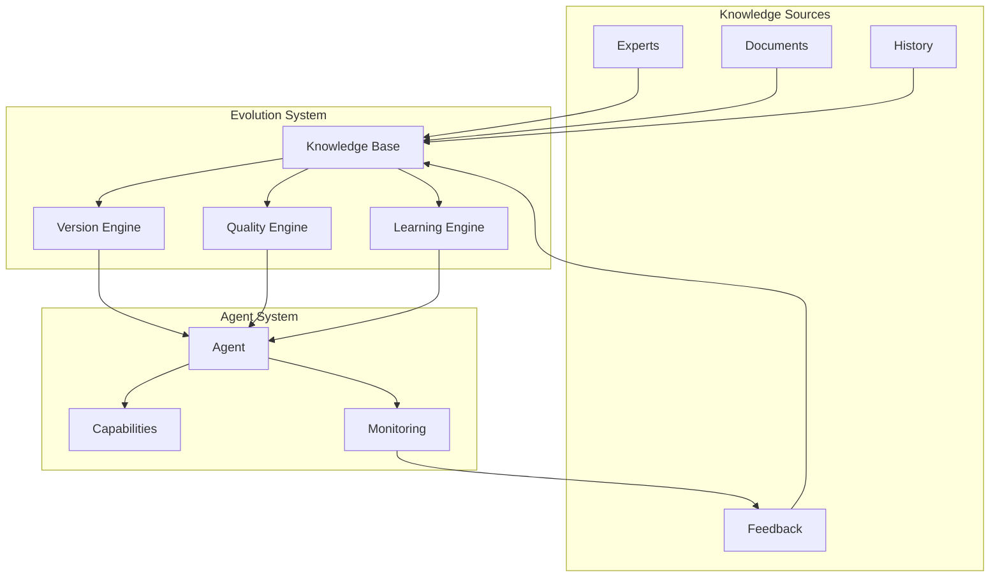

<!-- markdownlint-disable MD041 -->
<!-- markdownlint-disable MD033 -->
<p align="center">
  
</p>

[Project Overview](../../README.md)


# Knowledge Evolution in OpenDXA

## Overview

OpenDXA's knowledge evolution system enables agents to learn and adapt over time by managing the full lifecycle of knowledge. This includes capturing new knowledge, validating it, integrating it into the knowledge base, and ensuring its quality and relevance.

## Key Features

### 1. Knowledge Lifecycle
- Capture new knowledge
- Validate and verify
- Integrate into knowledge base
- Monitor and maintain
- Evolve and improve

### 2. Evolution Mechanisms
- Version control
- Quality tracking
- Feedback integration
- Performance monitoring
- Continuous improvement

## Architecture



## Implementation

### 1. Knowledge Capture
```python
from opendxa.knowledge import KnowledgeBase
from opendxa.evolution import KnowledgeCapture

# Initialize knowledge base
kb = KnowledgeBase()

# Capture new knowledge
capture = KnowledgeCapture(kb)
new_knowledge = capture.from_expert(
    expert="process_engineer",
    content=process_improvement,
    context="wafer_inspection"
)
```

### 2. Knowledge Validation
```python
from opendxa.validation import KnowledgeValidator
from opendxa.metrics import QualityMetrics

# Initialize validation
validator = KnowledgeValidator(
    metrics=QualityMetrics(),
    rules=validation_rules
)

# Validate new knowledge
result = validator.validate(
    knowledge=new_knowledge,
    context="semiconductor"
)
```

### 3. Knowledge Integration
```python
from opendxa.evolution import KnowledgeIntegrator

# Initialize integrator
integrator = KnowledgeIntegrator(kb)

# Integrate validated knowledge
version = integrator.integrate(
    knowledge=new_knowledge,
    validation_result=result,
    source="expert_feedback"
)
```

## Best Practices

1. **Knowledge Capture**
   - Document sources clearly
   - Capture context
   - Validate inputs
   - Track provenance

2. **Knowledge Validation**
   - Define clear rules
   - Use appropriate metrics
   - Consider context
   - Document decisions

3. **Knowledge Integration**
   - Version control
   - Quality assurance
   - Performance monitoring
   - Feedback loops

## Common Patterns

1. **Knowledge Update**
   ```python
   # Capture new knowledge
   new_knowledge = capture.from_expert(
       expert="process_engineer",
       content=improvement
   )
   
   # Validate
   result = validator.validate(new_knowledge)
   
   # Integrate if valid
   if result.is_valid:
       version = integrator.integrate(
           knowledge=new_knowledge,
           validation_result=result
       )
   ```

2. **Quality Tracking**
   ```python
   # Track knowledge quality
   metrics = QualityMetrics()
   metrics.track(
       knowledge_id="process_001",
       metric="accuracy",
       value=0.95
   )
   
   # Analyze trends
   analysis = metrics.analyze(
       knowledge_id="process_001",
       timeframe="last_month"
   )
   ```

3. **Feedback Integration**
   ```python
   # Collect feedback
   feedback = collect_feedback(
       knowledge_id="process_001",
       user="operator",
       rating=4,
       comments="Very helpful"
   )
   
   # Process feedback
   result = process_feedback(
       feedback=feedback,
       knowledge_base=kb
   )
   
   # Update if needed
   if result.needs_update:
       update_knowledge(result)
   ```

## Evolution Examples

1. **Process Optimization**
   - Capture improvements
   - Validate effectiveness
   - Integrate changes
   - Monitor results

2. **Quality Assurance**
   - Track metrics
   - Identify issues
   - Implement fixes
   - Verify improvements

3. **Expert Knowledge**
   - Document expertise
   - Validate accuracy
   - Integrate into system
   - Maintain relevance

## Next Steps

- Learn about [Declarative-Imperative Architecture](../key-differentiators/declarative-imperative.md)
- Understand [Domain Expertise](../key-differentiators/domain-expertise.md)
- Explore [Protocol Federation](../key-differentiators/protocol-federation.md)
- See [Examples](../../examples/knowledge-evolution.md)

---
<p align="center">
Copyright © 2025 Aitomatic, Inc. Licensed under the <a href="../../LICENSE.md">MIT License</a>.
<br/>
<a href="https://aitomatic.com">https://aitomatic.com</a>
</p>
