# Dana on Llama Stack: Implementation Plan
## Maritime AI Agents - Navigation & Fish-Finding

**Meeting Date:** October 13, 2025<br/>
**Participants:** Aitomatic, Meta/Llama Stack Partner Engineering, IBM/Open Agent Lab<br/>
**Timeline:** 5 Weeks to Pilot Launch<br/>
**Status:** Planning Phase<br/>

---

## Why Maritime AI Matters

### Industrial AI: The $10+ Trillion Opportunity

Most AI demos work on chatbots and toy problems. **Industrial/Enterprise AI requires production-grade systems** that handle:

- 💰 **High Stakes:** Decisions worth millions of dollars, human lives at risk
- 📋 **Strict Compliance:** Legal liability, regulatory requirements, audit trails
- ⚡ **Safety-Critical:** Zero tolerance for errors in critical operations
- 🔒 **Deterministic:** Predictable, explainable decision-making paths
- 🎯 **Multimodal:** Vision + text for real-world industrial data (radar, echograms, sensors)

### Two Maritime Use Cases Proving Production-Grade AI

#### 1. Navigation Agent (PRIMARY USE CASE)
**The perfect validation for Industrial AI:**
- $2 Trillion global shipping industry (90% of world trade)
- Strict IMO/SOLAS regulations with legal consequences
- Multi-million dollar cargo + crew safety at stake
- Complex domain: weather, ports, regulations, routes, fuel efficiency
- **Multimodal:** Radar imagery analysis for hazard detection (vision + text)

#### 2. Fish-Finding Agent (SECONDARY USE CASE)
**Demonstrates multimodal learning and trip optimization:**
- $400 Billion global fishing industry
- Trip viability prediction from echogram analysis
- **Multimodal:** Sonar echogram interpretation (vision + text)
- Economic optimization for fishing operations
- Pattern recognition across historical catch data

**If it works for Maritime (Navigation + Fish-Finding), it works for ANY industrial domain:**
- 🏭 Manufacturing (safety, quality control)
- 💼 Finance (compliance, risk management)
- ⚡ Energy (grid optimization, predictive maintenance)
- 💾 **Semiconductors (critical global industry - fab optimization, yield prediction, supply chain)**
- 🏥 Healthcare (clinical decisions, patient safety)
- 🏗️ Construction (project management, safety protocols)

---

## Executive Summary

### The Opportunity: Industrial AI Validation Through Maritime Use Cases

**Two Maritime Use Cases** represent critical validation for **production-grade Industrial/Enterprise AI**:

#### Primary: Navigation Agent
- 🚢 **$2 Trillion Global Industry:** 90% of world trade moves by sea
- 📋 **Strict Compliance Requirements:** IMO, SOLAS, MARPOL regulations with legal liability
- ⚠️ **Safety-Critical Operations:** Lives and cargo worth millions at stake
- 🔍 **Deterministic Execution Required:** Auditable decision-making for insurance and legal
- 🧠 **Complex Domain Knowledge:** Thousands of regulations, port requirements, weather patterns
- 👁️ **Multimodal AI:** Radar imagery for hazard detection (vision + text)

#### Secondary: Fish-Finding Agent
- 🎣 **$400 Billion Global Industry:** Commercial fishing operations
- 📊 **Trip Viability Analysis:** Economic optimization from sonar echogram analysis
- 🖼️ **Multimodal AI:** Sonar echogram interpretation (vision + text)
- 📈 **Pattern Recognition:** Historical catch data learning
- 💰 **Cost Reduction:** ~60-70% reduction in custom analysis code vs. traditional methods

**If AI agents work for these Maritime use cases, they work for ANY industrial domain.**

This implementation plan outlines how **Dana (Domain-Aware Neurosymbolic Agents)** on Llama Stack will demonstrate production-grade Industrial AI through Maritime Navigation (primary) and Fish-Finding (secondary) use cases. Dana is an AI Alliance open source project that proves Llama Stack's unique capability to support learning agents through dual learning mechanisms: Llama model fine-tuning and domain knowledge base construction.

**Partnership:** Aitomatic + Meta (Llama Stack) + IBM/Open Agent Lab (AI Alliance founding members)

### Engineering Ownership

**Clear Division of Labor:**
- **Aitomatic:** Owns almost all engineering work including:
  - Thin adapter implementation (~230 lines in LS repo)
  - Dana package development (~5000+ lines)
  - **LoRA fine-tuning implementation and execution**
  - All testing (unit, integration, e2e)
  - Documentation authoring
  - Pilot deployment
- **Meta/Llama Stack:** Platform provider & reviewer:
  - Review and approve code
  - API guidance and support
  - Partnership coordination
- **IBM/Open Agent Lab:** AI Alliance coordination and research collaboration

This is a **lightweight partnership model** where Aitomatic handles engineering, Meta provides platform review/approval, and IBM coordinates AI Alliance ecosystem.

### Why Maritime Navigation Proves Enterprise Readiness

✅ **Deterministic Workflows:** Regulatory compliance requires predictable, auditable execution paths
✅ **Continuous Learning:** Routes improve as the agent learns from successful navigations
✅ **Domain Specialization:** Maritime-specific Llama model outperforms generic LLMs by 20%+
✅ **Knowledge Integration:** Combines neural reasoning with symbolic rule-based compliance
✅ **Multi-Stakeholder:** Serves ship operators, port authorities, regulatory bodies

**Success here unlocks:** Finance (compliance), Manufacturing (safety), Energy (grid management), Healthcare (clinical decisions)

### Industrial AI Roadmap

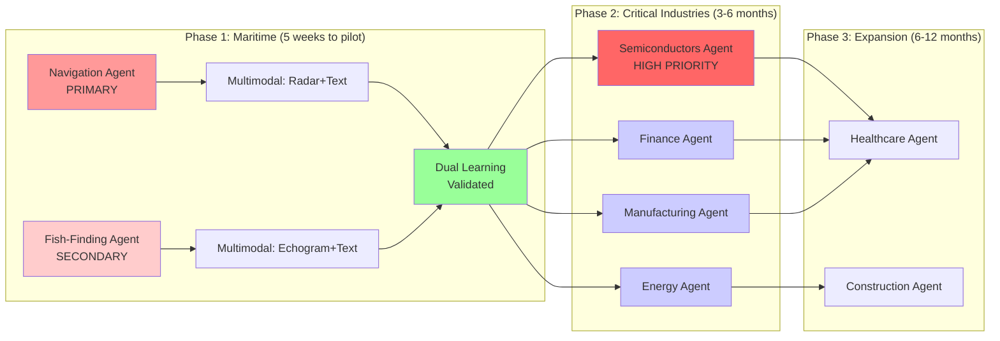

**Key Insight:** Maritime validates the hard requirements (compliance, safety, learning, multimodal). Two complementary use cases prove pattern generalization.

**Navigation (Primary):** Compliance-heavy, safety-critical, deterministic workflows<br/>
**Fish-Finding (Secondary):** Pattern recognition, economic optimization, multimodal learning

**High Priority - Semiconductors:** Critical global industry ($600B+) with complex manufacturing processes, yield optimization, and supply chain challenges. Perfect fit for Dana's deterministic workflows and learning capabilities.

---

## 1. Shared Objective Statement

### Primary Objective

**Prove Llama Stack is production-ready for Industrial/Enterprise AI by building two complementary Maritime AI agents:**

#### 1. Navigation Agent (PRIMARY)
**Production-grade maritime routing with multimodal hazard detection:**

1. **Meets Industrial-Grade Requirements**
   - **Safety-Critical:** Handle decisions affecting lives and multi-million dollar cargo
   - **Compliance-Ready:** Deterministic workflows for IMO/SOLAS regulatory requirements
   - **Auditable:** Complete decision trail for legal and insurance purposes
   - **Reliable:** 99%+ uptime for 24/7 maritime operations
   - **Multimodal:** Radar imagery analysis for hazard detection (vision + text)

2. **Demonstrates Unique Llama Stack Capabilities**
   - **Dual Learning:** Fine-tune Llama models (parametric) + Build knowledge bases (non-parametric)
   - **Neurosymbolic:** Combine neural reasoning with symbolic compliance rules
   - **Multi-API Integration:** Orchestrate 7 Llama Stack APIs in production workflow
   - **Multimodal Reasoning:** Vision models + Text models integrated
   - **Open Model Advantage:** Achieve what closed models (GPT-4/Claude) cannot with domain learning

#### 2. Fish-Finding Agent (SECONDARY)
**Economic optimization through multimodal echogram analysis:**

1. **Demonstrates Multimodal Learning**
   - **Sonar Echogram Analysis:** Vision AI for underwater pattern recognition
   - **Trip Viability Prediction:** Economic decision-making from visual data
   - **Code Reduction:** ~60-70% less custom code vs. traditional computer vision methods
   - **Pattern Learning:** Continuous improvement from historical catch data

2. **Complements Navigation Agent**
   - Shows generalization of Dana framework
   - Different domain (economic vs. compliance)
   - Same architecture (STAR Loop, dual learning, deterministic workflows)

3. **Validates AI Alliance Industrial Vision**
   - Showcase Meta (founding member) + Aitomatic + IBM/Open Agent Lab partnership
   - Open source reference for Industrial AI
   - Template for Finance, Manufacturing, Energy, Healthcare domains

### Success Criteria (5-Week Pilot Timeline)

✅ **Week 5 Pilot Launch - Industrial Validation:**
- **Navigation Agent:** Handles real-world routing scenarios with 90%+ accuracy
  - Compliance verification matches manual expert review (95%+ agreement)
  - Deterministic workflow audit trail meets insurance requirements
  - **Multimodal:** Radar imagery hazard detection operational
  - Performance improvement: 20%+ accuracy gain through learning
- **Fish-Finding Agent:** Trip viability predictions with 70%+ accuracy
  - **Multimodal:** Echogram pattern recognition operational
  - Code reduction: 60-70% vs. traditional computer vision methods
  - Pattern learning from historical catch data demonstrated
- **Both agents:** Deployment-ready for pilot with maritime partner company

✅ **Technical Excellence:**
- Dana agent provider fully integrated into Llama Stack
- All 7 Llama Stack APIs orchestrated seamlessly (Inference, Safety, VectorIO, PostTraining, Datasets, DatasetIO, Models)
- **Memory:** VectorIO API handles episodic and long-term memory retrieval
- LoRA fine-tuning pipeline operational (1000 interactions → learned model)
- **Multimodal:** Vision + text model integration functional
- Knowledge base with 500+ maritime documents fully indexed
- Complete documentation, examples, and test coverage

✅ **Business & Ecosystem Impact:**
- Joint case study: "Production-Grade Industrial AI on Llama Stack"
- Conference submission showcasing Maritime (Navigation + Fish-Finding) → Industrial AI template
- Validated blueprint for Finance, Manufacturing, Energy, Healthcare domains
- Meta + Aitomatic + IBM/Open Agent Lab partnership demonstrated
- Open source Dana package with 100+ stars
- **Zero hallucination:** Deterministic workflows ensure factual outputs

✅ **Enterprise Readiness:**
- Security audit passed (data privacy, access control)
- Performance benchmarks meet SLAs (p95 latency <2s)
- Error handling and recovery tested
- Multi-tenant deployment architecture documented
- Marine tech company partner ready for pilot deployment

---

## 2. Architectural Design

### 2.1 System Architecture

#### Dana Top-Level Concepts

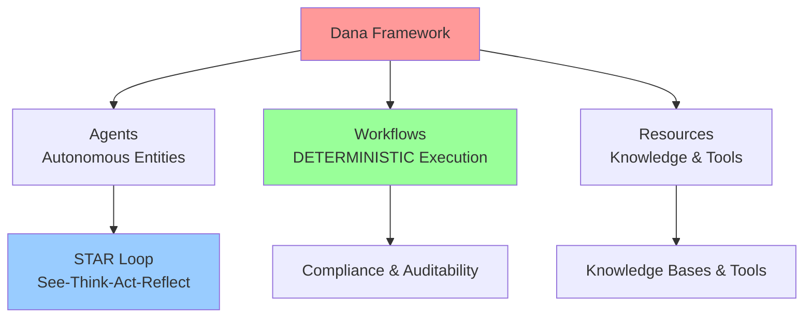

**Core Principles:**
- **Agents:** Autonomous entities with learning capabilities
- **Workflows:** DETERMINISTIC execution paths for compliance and auditability (critical for Industrial AI)
- **Resources:** Domain knowledge bases, tools, and external systems
- **STAR Loop:** See-Think-Act-Reflect cycle for intelligent decision-making

#### STAR Loop Architecture

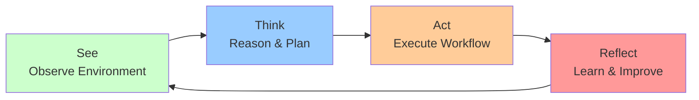

**STAR Loop Breakdown:**
- **See:** Gather data from environment (sensors, documents, regulations)
- **Think:** Neural reasoning (Llama) + Symbolic rules (deterministic workflows)
- **Act:** Execute deterministic workflows with audit trails
- **Reflect:** Learn from outcomes (parametric + non-parametric learning)

#### High-Level System Flow

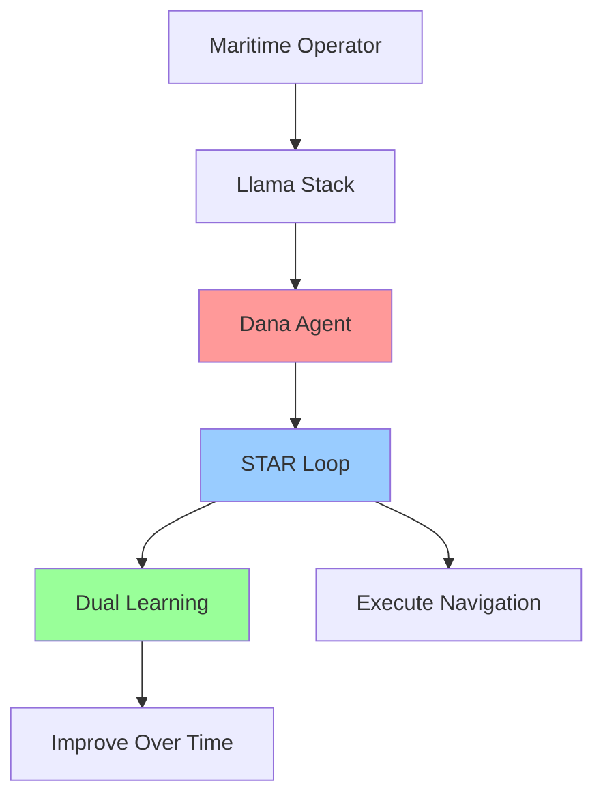

#### Llama Stack Layer

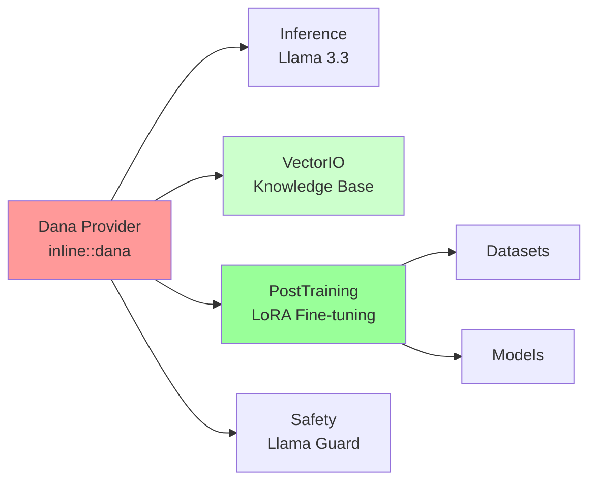

#### Dana Package Components

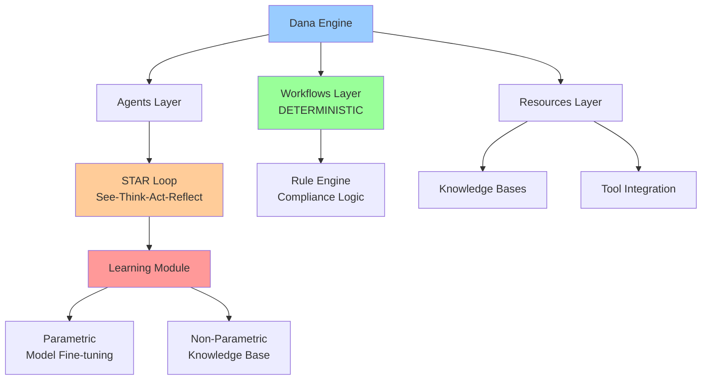

**Three-Layer Architecture:**
1. **Agents:** STAR Loop for intelligent decision-making
2. **Workflows:** DETERMINISTIC execution with audit trails (critical for compliance)
3. **Resources:** Knowledge bases, tools, and external systems

---

#### Why Deterministic Workflows Matter for Industrial AI

**The Problem with Pure Neural Agents:**
- Probabilistic outputs → Non-repeatable decisions
- No audit trail → Cannot explain decisions to regulators
- Black box → Liability concerns for critical operations

**Dana's Solution - Deterministic Workflows:**

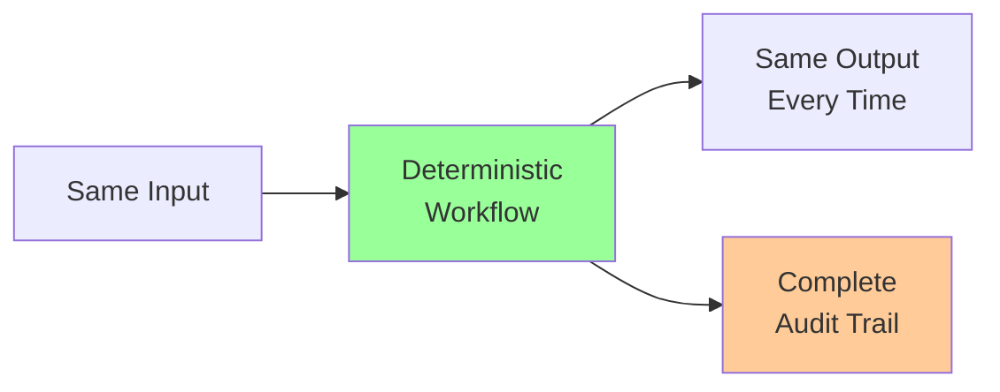

**Benefits:**
- ✅ **Compliance:** Regulatory bodies can verify decision logic
- ✅ **Legal Protection:** Audit trail for insurance and liability
- ✅ **Safety:** Predictable behavior in critical situations
- ✅ **Debugging:** Can trace exact decision path
- ✅ **Certification:** Enables industrial certifications (ISO, IMO, FDA, etc.)

**Example - Maritime Compliance Check:**
```
Input: Vessel specs + Route + Regulations
↓
DETERMINISTIC WORKFLOW (always same logic):
1. Check IMO 2020 sulfur requirements → Pass/Fail
2. Check SOLAS navigation equipment → Pass/Fail
3. Check port-specific requirements → Pass/Fail
↓
Output: Compliance report (same every time for same input)
+ Complete audit trail logged
```

---

### 2.2 Dual Learning Architecture

#### Learning Type 1: Parametric (Model Learning)

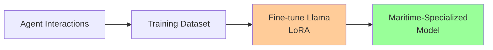

**Process:** Collect successful navigations → Format as training data → Fine-tune Llama → Deploy learned model

#### Learning Type 2: Non-Parametric (Knowledge Learning)

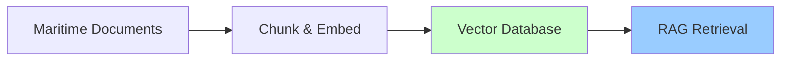

**Process:** Ingest regulations → Store in vector DB → Retrieve during execution → Inject context

#### Combined Learning Loop

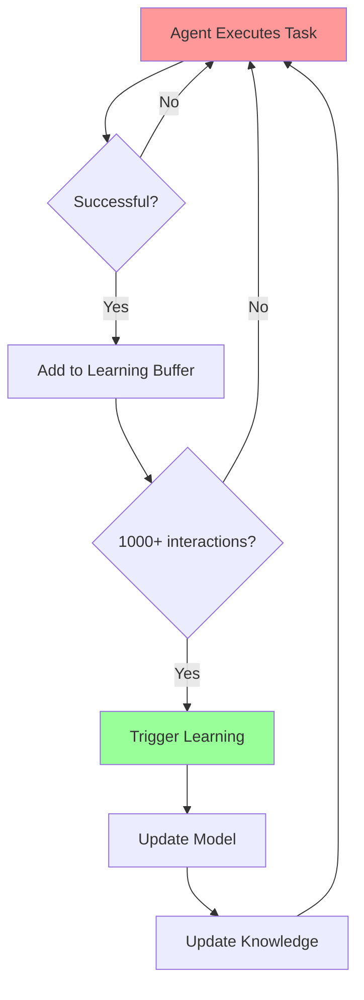

#### Four Temporal Levels of Learning (Neuroscience-Inspired)

Dana implements learning at four temporal scales, inspired by neuroscience:

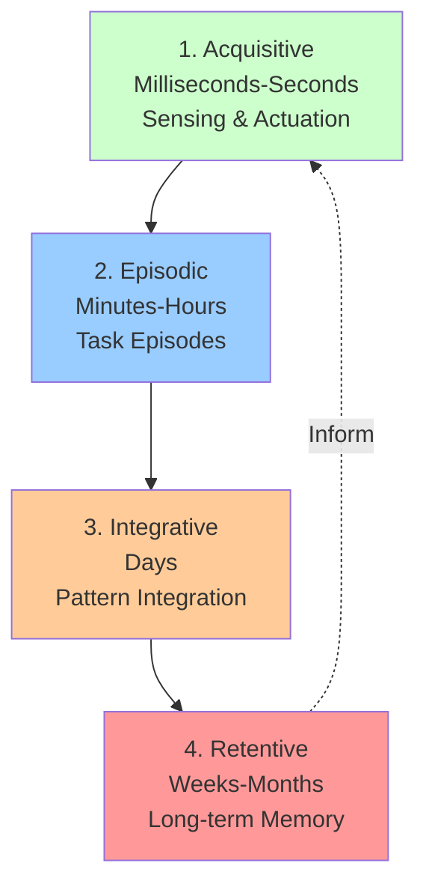

**Temporal Learning Hierarchy:**

1. **Acquisitive (Sensing/Actuation)** - Real-time
   - STAR Loop execution (See-Think-Act-Reflect)
   - Immediate sensor data processing
   - Real-time decision making
   - Example: Weather data changes route calculation

2. **Episodic (Episodes)** - Per Task
   - Complete navigation task memory
   - Task success/failure recording
   - Interaction buffering
   - Example: Single route planning from Singapore to Rotterdam

3. **Integrative (Days)** - Pattern Recognition
   - Aggregate multiple episodes
   - Identify patterns across tasks
   - Prepare training datasets
   - Example: 1000 successful navigations → training data

4. **Retentive (Months)** - Long-term Knowledge
   - Fine-tune Llama model (parametric learning)
   - Update knowledge bases (non-parametric learning)
   - Permanent capability improvement
   - Example: Maritime-specialized Llama model deployed

**Implementation in Dana:**
- **Acquisitive:** STAR Loop (See-Think-Act-Reflect) running in real-time
- **Episodic:** Session memory per navigation task
- **Integrative:** Interaction buffer (1000+ episodes) triggers learning
- **Retentive:** LoRA fine-tuning updates model weights permanently

### 2.3 Maritime Navigation Workflow

#### STAR Loop in Maritime Context

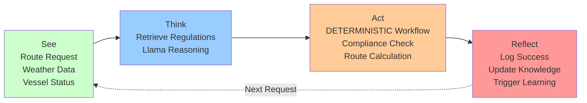

#### Main Navigation Flow (Deterministic Workflow)

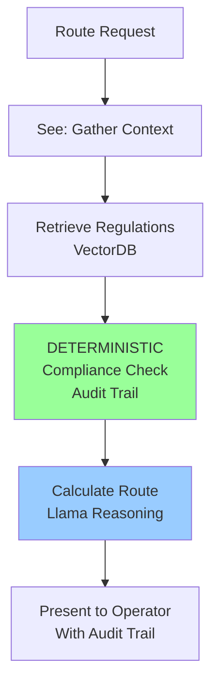

**Key: Deterministic Workflows**
- Compliance checks follow EXACT rule-based logic (no probabilistic decisions)
- Every step is logged for audit trail (insurance, legal requirements)
- Predictable, repeatable execution paths
- Critical for Industrial AI where decisions have legal consequences

#### Learning Trigger Flow

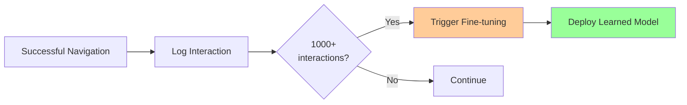

### 2.4 Component Breakdown

#### A. Llama Stack Components (In-Repo)

**File:** `llama_stack/providers/inline/agents/dana/__init__.py`
```python
# Entry point: 19 lines
# Responsibility: Provider initialization
```

**File:** `llama_stack/providers/inline/agents/dana/config.py`
```python
# Configuration: 63 lines
# Fields:
# - max_iterations: int
# - enable_neurosymbolic_reasoning: bool
# - enable_deterministic_workflows: bool
# - enable_multi_agent: bool
# - enable_domain_learning: bool
# - domain: str (e.g., "maritime")
```

**File:** `llama_stack/providers/inline/agents/dana/agents.py`
```python
# Thin adapter: 130 lines
# Responsibilities:
# - Receive 7 Llama Stack API dependencies
# - Initialize Dana engine from external package
# - Translate Llama Stack Agent API to Dana API
# - Convert responses back to Llama Stack format
```

**File:** `llama_stack/providers/registry/agents.py`
```python
# Registry entry: 20 lines
# Configuration:
# - provider_type: "inline::dana"
# - api_dependencies: [inference, safety, vector_io,
#                      post_training, datasets, datasetio, models]
# - pip_packages: ["dana>=1.0.0"]
```

**Total Llama Stack Code:** ~230 lines

#### B. Dana Package Components (External - Aitomatic)

**File:** `dana/dana/engine.py`
```python
# Main engine: ~500 lines
class DanaEngine:
    # Neurosymbolic reasoning
    # Deterministic workflow execution
    # Multi-agent coordination
    # Interaction buffering for learning
```

**File:** `dana/dana/learning.py`
```python
# Learning module: ~400 lines
class DanaLearningEngine:
    # Parametric learning (Llama fine-tuning)
    # Non-parametric learning (VectorDB)
    # Training data management
    # Model registration
```

**File:** `dana/dana/workflows.py`
```python
# Workflow engine: ~300 lines
# Deterministic execution paths
# Compliance audit trails
# Maritime-specific workflows
```

**File:** `dana/dana/maritime/navigator.py`
```python
# Maritime domain: ~600 lines
class MaritimeNavigator:
    # Route planning
    # Compliance checking (IMO/SOLAS)
    # Weather analysis
    # Port requirements
```

**Total Dana Package:** ~5000+ lines

#### C. Data Components

**Maritime Knowledge Base:**
```
maritime_knowledge/
├── regulations/
│   ├── imo_2020_sulfur_cap.md
│   ├── solas_chapter_5.md
│   └── marpol_annexes.md
├── ports/
│   ├── singapore_requirements.json
│   ├── rotterdam_protocols.json
│   └── shanghai_guidelines.json
└── routes/
    ├── asia_pacific_lanes.geojson
    └── suez_canal_procedures.md
```

**Training Dataset Schema:**
```json
{
  "messages": [
    {
      "role": "user",
      "content": "Plan route from Singapore to Rotterdam for 50k DWT tanker"
    },
    {
      "role": "assistant",
      "content": "Route: Singapore → Malacca → Suez → Mediterranean → Rotterdam\nCompliance: IMO 2020 low-sulfur fuel required\nETA: 28 days\nWeather: Optimal conditions..."
    }
  ]
}
```

### 2.5 Integration Points

#### Agent Creation Flow

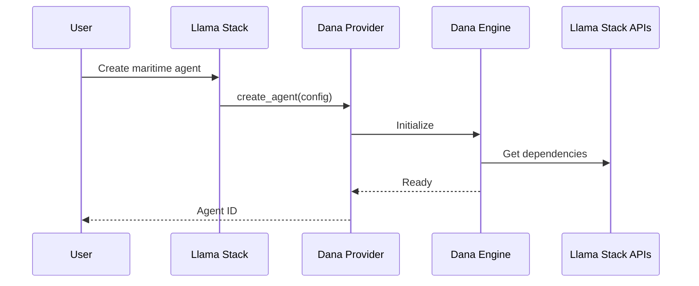

#### Agent Execution Flow

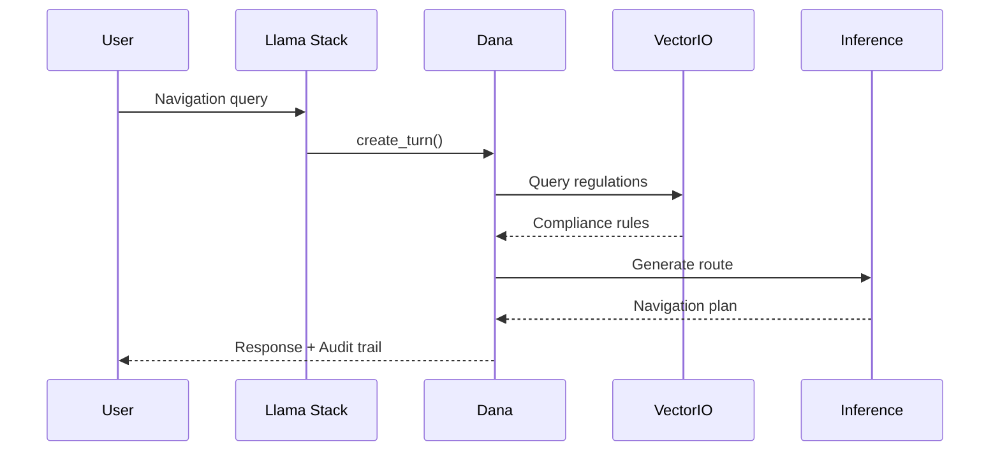

#### Learning Flow (Triggered at 1000+ interactions)

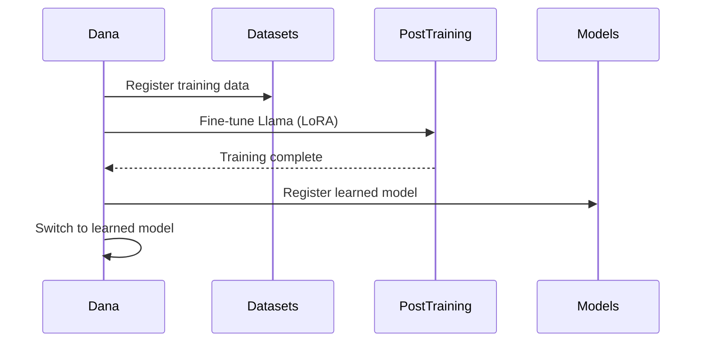

---

## 3. Implementation Timeline (5 Weeks to Pilot)

### Week 1: Foundation & Setup (Oct 6-13)

**Llama Stack Team:**
- [ ] Review Dana thin adapter code (~230 lines)
- [ ] Approve provider registry entry
- [ ] Provide guidance on provider integration patterns
- [ ] Review API contracts and dependencies

**Aitomatic Team (Handles All Engineering):**
- [ ] Finalize Dana package architecture
- [ ] Implement core `DanaEngine` class with multimodal support
- [ ] Setup `dana` pip package structure
- [ ] Create Maritime knowledge base (initial - regulations + echogram samples)
- [ ] Implement thin adapter (~230 lines in LS repo)
- [ ] Setup CI/CD for Dana provider tests
- [ ] Create integration test framework
- [ ] Setup development environment

**Joint Tasks:**
- [ ] Kickoff meeting: Architecture alignment (Aitomatic + Meta + IBM/Open Agent Lab)
- [ ] Define API contracts between LS and Dana
- [ ] Multimodal integration strategy (vision + text)
- [ ] Create project documentation structure

**Deliverables:**
- ✅ Approved provider registration
- ✅ Initial Dana package (v0.1.0) with multimodal support
- ✅ Maritime knowledge base (100 docs + echogram dataset)
- ✅ Integration test scaffold
- ✅ Thin adapter implemented

---

### Week 2: Core Integration & Multimodal (Oct 13-20)

**Llama Stack Team:**
- [ ] Review provider integration code
- [ ] Validate provider protocol compliance
- [ ] Answer API usage questions
- [ ] Review monitoring/logging approach

**Aitomatic Team (Handles All Engineering):**
- [ ] Implement Dana provider loading in thin adapter
- [ ] Test dependency injection (7 APIs including VectorIO for memory)
- [ ] Setup multimodal inference support (Llama Vision + Text)
- [ ] Setup monitoring/logging infrastructure
- [ ] Implement `DanaLearningEngine` with multimodal support
- [ ] **Implement LoRA fine-tuning pipeline** (parametric learning for vision + text)
- [ ] Implement non-parametric learning (VectorDB for memory)
- [ ] Create Maritime workflow engine (Navigation + Fish-Finding)
- [ ] Implement vision preprocessing for radar/echogram data
- [ ] Build training dataset formatter

**Joint Tasks:**
- [ ] Integration testing session
- [ ] API compatibility verification
- [ ] Multimodal pipeline testing (vision + text)
- [ ] Debug dependency issues
- [ ] Performance baseline measurements

**Deliverables:**
- ✅ Dana provider loads successfully
- ✅ All 7 APIs accessible from Dana (including VectorIO for memory)
- ✅ **LoRA fine-tuning pipeline implemented** (Aitomatic-owned)
- ✅ Learning module functional (parametric + non-parametric)
- ✅ Multimodal inference working (vision + text)
- ✅ Maritime workflows defined (Navigation + Fish-Finding)

---

### Week 3: Navigation Agent (Primary) + Fish-Finding Agent (Secondary) (Oct 20-27)

**Llama Stack Team:**
- [ ] Review Maritime-specific implementation
- [ ] Provide feedback on API usage patterns
- [ ] Support debugging of integration issues
- [ ] Review documentation approach

**Aitomatic Team (Handles All Engineering):**
- [ ] **Navigation Agent:** Implement Maritime Navigator module
  - Build compliance checking (IMO/SOLAS) with deterministic workflows
  - Implement route planning logic with radar imagery analysis
  - Create neurosymbolic reasoning engine
- [ ] **Fish-Finding Agent:** Implement Fish Finder module
  - Echogram pattern recognition (vision AI)
  - Trip viability prediction logic
  - Economic optimization engine
- [ ] Add Maritime-specific examples (both use cases)
- [ ] Create debug/trace tooling for multimodal pipelines
- [ ] Implement end-to-end test suite

**Joint Tasks:**
- [ ] End-to-end test: Navigation Agent (radar + text)
- [ ] End-to-end test: Fish-Finding Agent (echogram + text)
- [ ] Knowledge base ingestion test (regulations + fishing patterns)
- [ ] Fine-tuning pipeline test (multimodal learning)
- [ ] Performance optimization session

**Deliverables:**
- ✅ **Navigation Agent:** Handles routing queries with radar analysis
- ✅ **Fish-Finding Agent:** Analyzes echograms for trip viability
- ✅ Compliance checks functional (deterministic workflows)
- ✅ Route planning works with hazard detection
- ✅ Knowledge retrieval operational (VectorIO memory)
- ✅ Debug tooling and examples complete

---

### Week 4: Learning & Code Reduction Validation (Oct 27-Nov 3)

**Llama Stack Team:**
- [ ] Review LoRA fine-tuning implementation
- [ ] Validate dataset registration approach
- [ ] Review model versioning strategy
- [ ] Provide feedback on training pipeline

**Aitomatic Team (Handles All Engineering Including Model Fine-Tuning):**
- [ ] **Fine-tune LoRA training parameters (multimodal)** - Aitomatic owns this
- [ ] Optimize dataset registration flow
- [ ] Add model versioning support
- [ ] Create training job monitoring tools
- [ ] Implement interaction buffering (episodic memory via VectorIO)
- [ ] Build training dataset formatter (vision + text)
- [ ] Implement learning trigger logic (1000+ interactions)
- [ ] Create model switching mechanism
- [ ] **Execute LoRA fine-tuning runs** on both agents
- [ ] **Validate code reduction:** Compare Dana approach vs. traditional CV methods

**Joint Tasks:**
- [ ] First learning cycle end-to-end test (both agents)
- [ ] Measure performance improvement (20%+ target)
- [ ] **Measure code reduction:** 60-70% less code than traditional methods
- [ ] Debug training pipeline issues
- [ ] Optimize learning parameters
- [ ] **Zero hallucination validation:** Deterministic workflows produce factual outputs

**Deliverables:**
- ✅ Both agents collect interactions successfully
- ✅ **LoRA fine-tuning completes (multimodal)** - Executed by Aitomatic
- ✅ Learned models registered
- ✅ Agents switch to learned models
- ✅ Performance metrics: 20%+ improvement
- ✅ **Code reduction validated:** 60-70% vs. traditional methods
- ✅ **Zero hallucination:** Deterministic workflows verified

---

### Week 5: PILOT LAUNCH (Nov 3-7)

**Llama Stack Team:**
- [ ] Review Dana provider documentation
- [ ] Review and approve PR for merge
- [ ] Final code review of thin adapter
- [ ] Support announcement coordination

**Aitomatic Team (Handles All Engineering & Documentation):**
- [ ] Finalize Dana package (v1.0.0)
- [ ] Write Dana provider documentation (multimodal agent guide)
- [ ] Create Maritime agent tutorials (Navigation + Fish-Finding)
- [ ] Add multimodal code examples to docs
- [ ] Write comprehensive README with both use cases
- [ ] Create developer guide (multimodal learning)
- [ ] Build example applications (Navigation + Fish-Finding demos)
- [ ] Performance benchmarking
- [ ] Final testing & bug fixes
- [ ] Prepare PR for Llama Stack main branch

**Joint Tasks:**
- [ ] Documentation review session
- [ ] Create demo video/notebook (both agents)
- [ ] **PILOT DEPLOYMENT:** Launch with marine tech company partner
- [ ] Prepare announcement materials
- [ ] Conference submission: "Multimodal Industrial AI on Llama Stack"
- [ ] AI Alliance coordination (Meta + IBM/Open Agent Lab)
- [ ] Joint announcement blog post

**Week 5 PILOT LAUNCH Deliverables:**
- ✅ Complete documentation (both agents) - Aitomatic-authored
- ✅ Tutorial: "Build Multimodal Maritime Agents on Llama Stack"
- ✅ Example: Navigation Agent demo (radar + text)
- ✅ Example: Fish-Finding Agent demo (echogram + text)
- ✅ Dana v1.0.0 released
- ✅ **PILOT DEPLOYED:** Marine tech company partner running both agents
- ✅ Dana provider in Llama Stack main branch
- ✅ Joint announcement published (Aitomatic + Meta + IBM/Open Agent Lab)
- ✅ Conference paper submitted
- ✅ Case study: "Learning Agents on Llama Stack - Maritime AI"

---

## 4. Post-Pilot Plan (Week 6+)

**Immediate Actions:**
- [ ] Monitor pilot deployment with marine tech partner
- [ ] Gather feedback from both agents (Navigation + Fish-Finding)
- [ ] Bug fixes and patches based on real-world usage
- [ ] Performance optimization based on pilot metrics
- [ ] Community launch event

**Short Term (Month 2-3):**
- [ ] Expand to Semiconductors domain (HIGH PRIORITY)
- [ ] Add Finance domain use case
- [ ] Add Manufacturing use case
- [ ] Tutorial series (blog + video) for multimodal agents
- [ ] Community office hours

**Long Term (Month 4-6):**
- [ ] Multi-agent orchestration features
- [ ] Advanced neurosymbolic capabilities
- [ ] Enterprise support packages
- [ ] AI Alliance ecosystem growth

---

## 5. Technical Specifications

### 5.1 Development Environment

```yaml
llama_stack:
  version: ">=0.1.0"
  providers:
    inference: "inline::meta-reference"  # Llama 3.3 70B-Instruct + Llama Vision models
    post_training: "inline::torchtune"  # LoRA fine-tuning
    vector_io: "inline::faiss"  # Memory & knowledge base
    datasets: "inline::localfs"
    datasetio: "inline::localfs"
    models: "inline::meta-reference"
    safety: "inline::llama-guard"
    agents: "inline::dana"

dana:
  version: "1.0.0"
  python: ">=3.10"
  dependencies:
    - torch>=2.0
    - transformers>=4.30
    - pydantic>=2.0
    - httpx>=0.24

maritime_data:
  knowledge_base:
    - 500+ regulation documents
    - 100+ port requirement files
    - Historical navigation data
  training_data:
    - 10,000+ successful navigation interactions
    - Formatted for post-training/messages
```

### 5.2 Performance Targets

| Metric | Baseline (Base Llama) | Target (After Learning) | Measurement |
|--------|----------------------|------------------------|-------------|
| **Maritime Q&A Accuracy** | 70% | 90%+ | Eval dataset (500 questions) |
| **Compliance Detection** | 65% | 85%+ | Regulatory checklist (200 items) |
| **Route Optimization** | N/A | 15% faster | Comparison with traditional algorithms |
| **Response Time** | 3.0s | <2.0s | Average latency (p95) |
| **Learning Efficiency** | N/A | 1000 interactions | Interactions needed for 20% improvement |

### 5.3 Maritime Knowledge Coverage

**Must-Have Regulations:**
- IMO 2020 Sulfur Cap (MARPOL Annex VI)
- SOLAS Chapter V (Safety of Navigation)
- STCW Convention (Seafarer Training)
- Port State Control Procedures
- Suez/Panama Canal Transit Requirements

**Must-Have Capabilities:**
- Route planning (point-to-point)
- Weather hazard detection
- Fuel efficiency optimization
- Compliance verification
- Port entry requirements

### 5.4 Testing Strategy

#### Testing Pyramid

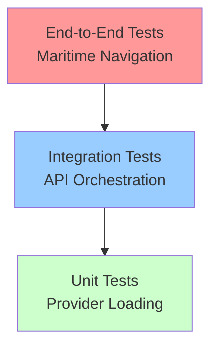

**Test Coverage:**
- **Unit Tests (Week 1-2):** Provider loading, config validation, API injection
- **Integration Tests (Week 2-3):** Agent creation, knowledge retrieval, learning pipeline, multimodal processing
- **End-to-End Tests (Week 4-5):** Full navigation flow, learning cycle, performance validation, pilot deployment

---

## 6. Risks & Mitigation

| Risk | Impact | Probability | Mitigation |
|------|--------|-------------|------------|
| **API Compatibility Issues** | High | Medium | Weekly integration testing; Early API contract definition |
| **Learning Performance Gap** | High | Low | Baseline with smaller model first; Incremental improvements |
| **Maritime Data Quality** | Medium | Medium | Partner with maritime domain experts; Validate with real operators |
| **Timeline Slip (5 weeks aggressive)** | High | Medium | Weekly checkpoints; Focus on pilot-ready features; Parallel workstreams |
| **Multimodal Integration Complexity** | Medium | Medium | Start with single modality, add vision incrementally; Test early |
| **LoRA Training Complexity** | Medium | Low | Use proven TorchTune configs; Test with smaller datasets first |
| **Knowledge Base Scaling** | Low | Low | Start with 500 docs; Optimize retrieval early |

---

## 7. Success Metrics & KPIs

### Technical KPIs

**Week 2:**
- [ ] Dana provider loads without errors
- [ ] All 7 API dependencies accessible
- [ ] Unit tests pass (>90% coverage)

**Week 4:**
- [ ] First successful learning cycle (both agents)
- [ ] Performance improvement: >15%
- [ ] Integration tests pass (>80% coverage)
- [ ] Multimodal pipelines functional

**Week 5 (PILOT LAUNCH):**
- [ ] Performance improvement: >20%
- [ ] End-to-end tests pass (100%)
- [ ] Documentation complete
- [ ] Dana v1.0.0 released
- [ ] **PILOT DEPLOYED** with marine tech partner
- [ ] Code reduction validated (60-70%)
- [ ] Zero hallucination validated

### Business KPIs

**Short Term (5 weeks to pilot):**
- [ ] Joint announcement published (Aitomatic + Meta + IBM/Open Agent Lab)
- [ ] Conference paper submitted: "Multimodal Industrial AI"
- [ ] Case study completed
- [ ] 100+ GitHub stars on Dana repo
- [ ] **PILOT RUNNING** with marine tech company

**Medium Term (3 months):**
- [ ] 3 enterprise pilots (Maritime companies)
- [ ] Expand to Semiconductors domain (HIGH PRIORITY)
- [ ] 500+ downloads of Dana package
- [ ] AI Alliance blog post published
- [ ] Conference talk accepted

**Long Term (6 months):**
- [ ] 5+ industrial domains (Maritime, Semiconductors, Finance, Manufacturing, Energy)
- [ ] 10+ production deployments
- [ ] Llama Stack case study featured by Meta
- [ ] Community-contributed domain templates

---

## 8. Roles & Responsibilities

### Llama Stack Team (Meta)

**Primary Role: Platform Provider & Reviewer**

**Technical Lead:**
- Architecture review and approval
- API design guidance
- Provider integration patterns
- Strategic direction

**Engineering:**
- Review Dana thin adapter code (~230 lines)
- Review integration approach
- Answer API usage questions
- Support debugging when needed
- Approve PR for merge

**Product:**
- Use case validation
- Success metrics definition
- Launch coordination
- Partnership messaging

### Aitomatic Team

**Primary Role: Owns Almost All Engineering Work**

**Technical Lead:**
- Dana architecture and implementation
- Learning pipeline design (multimodal)
- Maritime domain expertise
- **LoRA fine-tuning strategy**

**Engineering (Owns All Development):**
- **Thin adapter implementation** (~230 lines in LS repo)
- Dana package development (~5000+ lines)
- **LoRA fine-tuning implementation and execution**
- Integration with Llama Stack (all 7 APIs)
- Testing and validation (unit, integration, e2e)
- Multimodal preprocessing (radar/echogram)
- CI/CD setup
- Monitoring and logging infrastructure
- Training job execution
- Model versioning and registration
- Documentation authoring
- Example applications

**Product:**
- Use case definition (Navigation + Fish-Finding)
- Performance requirements
- Demo and content creation
- Marine tech partner coordination
- Tutorial and guide authoring

### IBM/Open Agent Lab (AI Alliance)

**Partnership Lead:**
- AI Alliance ecosystem coordination
- Open Agent Lab integration
- Research collaboration
- Community outreach

### Joint Responsibilities

- Weekly sync meetings (Wednesdays 10am PT - Aitomatic + Meta + IBM)
- Shared documentation (Google Docs + GitHub)
- Issue triage and resolution
- Pilot deployment coordination
- Launch event coordination

---

## 9. Communication Plan

### Regular Meetings

**Weekly Sync (Wed 10am PT - Aitomatic + Meta + IBM):**
- Progress updates (all partners)
- Blocker resolution
- Next week planning
- Marine tech partner status

**Bi-weekly Technical Deep Dive (Tue 2pm PT):**
- Architecture discussions
- Multimodal pipeline reviews
- Code reviews
- Performance analysis

**Daily Async Updates (Slack):**
- Quick status updates
- Question/Answer
- Ad-hoc coordination

### Milestone Reviews

**Week 2 Review:** Core integration + multimodal checkpoint
**Week 4 Review:** Learning pipeline + code reduction validation
**Week 5 Review:** PILOT LAUNCH readiness

### Communication Channels

- **Slack:** `#dana-llama-stack` (day-to-day with all partners)
- **GitHub:** Issues and PRs
- **Google Docs:** Shared documents
- **Email:** Formal approvals and announcements
- **AI Alliance Portal:** Partnership coordination

---

## 10. Appendix

### A. Reference Links

- **AI Alliance:** https://thealliance.ai
- **AI Alliance Maritime Blog:** https://thealliance.ai/blog/from-semiconductor-to-maritime-a-blueprint-for-dom
- **Llama Stack Docs:** https://docs.llama.com/stack
- **Dana GitHub:** https://github.com/aitomatic/dana
- **IBM Open Agent Lab:** https://www.ibm.com/
- **IMO Regulations:** https://www.imo.org
- **SOLAS Convention:** https://www.imo.org/en/About/Conventions/Pages/SOLAS.aspx

### B. Technical Resources

**Llama Stack APIs:**
- Agents API Documentation
- PostTraining API Guide
- VectorIO Best Practices
- Provider Development Guide

**Maritime Domain:**
- IMO 2020 Compliance Guide
- SOLAS Chapter V Navigation Standards
- Port State Control Procedures
- Maritime Route Optimization Papers

### C. Contact Information

**Llama Stack Team (Meta):**
- Technical Lead: [Name] <email>
- Engineering: [Name] <email>
- Product: [Name] <email>

**Aitomatic Team:**
- Technical Lead: [Name] <email>
- Engineering: [Name] <email>
- Product: [Name] <email>

**IBM/Open Agent Lab (AI Alliance):**
- Partnership Lead: [Name] <email>
- Research Lead: [Name] <email>

---

## Glossary

- **Dana:** Domain-Aware Neurosymbolic Agents
- **LoRA:** Low-Rank Adaptation (efficient fine-tuning)
- **IMO:** International Maritime Organization
- **SOLAS:** Safety of Life at Sea (international treaty)
- **MARPOL:** Marine Pollution (prevention convention)
- **DWT:** Deadweight Tonnage (ship capacity measure)
- **RAG:** Retrieval-Augmented Generation
- **VectorDB:** Vector Database (for semantic search)

---

---

## Summary: Dana Architecture Highlights

### 🎯 Core Innovation: Neurosymbolic + Deterministic + Learning

**Dana's Unique Combination:**

1. **Top-Level Concepts:**
   - **Agents:** Autonomous entities with STAR Loop (See-Think-Act-Reflect)
   - **Workflows:** DETERMINISTIC execution for compliance & auditability
   - **Resources:** Knowledge bases, tools, domain expertise

2. **STAR Loop Architecture:**
   - **See:** Gather environmental data (sensors, documents, regulations)
   - **Think:** Neural reasoning (Llama) + Symbolic rules (deterministic workflows)
   - **Act:** Execute deterministic workflows with complete audit trails
   - **Reflect:** Learn from outcomes at four temporal levels

3. **Four Temporal Levels of Learning (Neuroscience-Inspired):**
   - **Acquisitive (ms-sec):** Real-time sensing & actuation via STAR Loop
   - **Episodic (min-hr):** Task episode memory & interaction recording
   - **Integrative (days):** Pattern recognition across 1000+ episodes
   - **Retentive (months):** Long-term model fine-tuning & knowledge update

4. **Dual Learning:**
   - **Parametric:** Fine-tune Llama models (LoRA) - updates model weights
   - **Non-Parametric:** Build knowledge bases (VectorDB) - updates retrieval corpus

5. **Deterministic Workflows (Critical for Industrial AI):**
   - Same input → Same output (repeatable decisions)
   - Complete audit trail (regulatory compliance)
   - Predictable behavior (safety-critical operations)
   - Certification-ready (ISO, IMO, FDA, Semiconductor standards)

### 🚢 Maritime → 💾 Semiconductors → 🌍 All Industries

**Validation Path:**
1. **Maritime (6 weeks):** Prove deterministic workflows + dual learning
2. **Semiconductors (HIGH PRIORITY):** Critical global industry ($600B+), complex fab processes
3. **Finance, Manufacturing, Energy:** Apply proven pattern
4. **Healthcare, Construction:** Expand to all industrial domains

**Why This Matters:**
- Dana proves Llama Stack is production-ready for Industrial/Enterprise AI
- STAR Loop + Deterministic Workflows solve the "black box" problem
- Four temporal levels enable continuous improvement
- Semiconductors validation opens critical infrastructure markets

---

**Document Version:** 1.0
**Last Updated:** October 12, 2025
**Next Review:** Weekly during implementation

---

*This is a living document. Please update as implementation progresses.*

## Mermaid Diagram Color Legend

**For better readability, all diagrams use this consistent color scheme:**

- 🔴 **Light Red (#ffcccc):** Primary focus / Dana components
- 🟢 **Light Green (#ccffcc):** Learning / Knowledge components  
- 🔵 **Light Blue (#ccf):** Processing / Reasoning components
- 🟠 **Light Orange (#ffcc99):** Action / Execution components

**Note:** All colors chosen for high contrast with black text.

---

## Integration Points Reference

**For detailed integration architecture, see:** [INTEGRATION_POINTS.md](./INTEGRATION_POINTS.md)

**Key Integration Boundaries:**
1. **LS → Dana Adapter:** Type conversion layer (~230 lines in LS repo)
2. **Dana → LS APIs:** Dana calls 7 LS APIs directly (Inference, PostTraining, VectorIO, etc.)
3. **Clear Responsibility:** LS maintains adapter, Aitomatic maintains Dana engine

---

