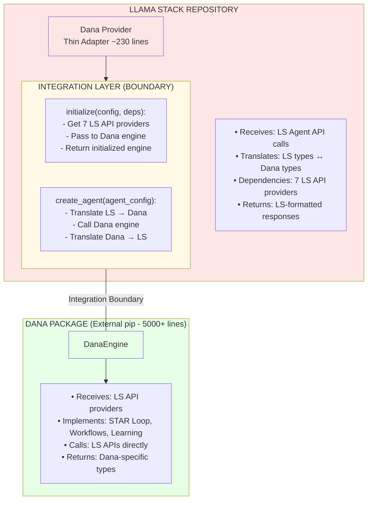
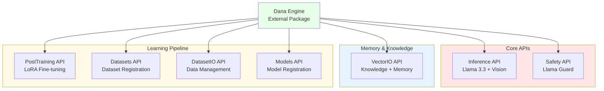
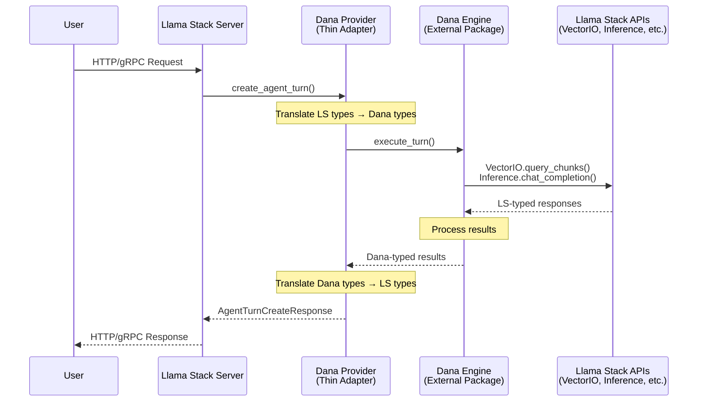
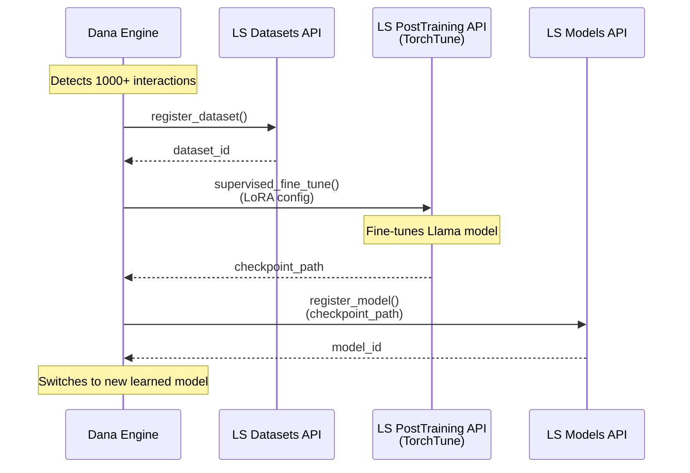
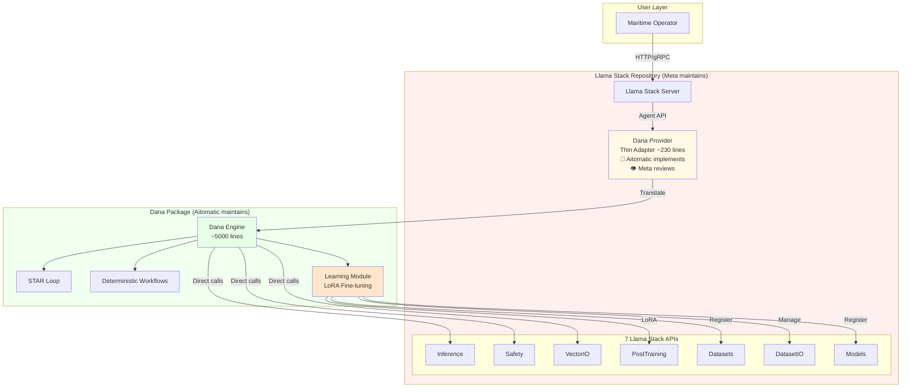

# Dana ↔ Llama Stack Integration Points

## Clear Boundary Definition



## 7 API Dependencies

Dana requires 7 Llama Stack APIs to function:



**Color Legend:**
- 🟢 Pale Green (#e6ffe6): Dana components
- 🔴 Pale Red (#ffe6e6): Core inference/safety
- 🔵 Pale Blue (#e6f3ff): Memory & knowledge
- 🟡 Pale Yellow (#fff9e6): Learning pipeline

All colors chosen for high contrast with black text.

---

## Integration Point 1: Provider Initialization

**Location:** `llama_stack/providers/inline/agents/dana/__init__.py`

```python
# IN LLAMA STACK REPO
async def get_provider_impl(config: DanaAgentConfig, deps: ProviderDependencies):
    """
    This is the INTEGRATION POINT.

    Inputs from Llama Stack:
    - config: DanaAgentConfig (from LS config)
    - deps: ProviderDependencies (7 LS API providers)

    Outputs to Llama Stack:
    - Dana provider instance (implements LS Agent protocol)
    """
    from .agents import DanaAgentProvider

    impl = DanaAgentProvider(config, deps)
    await impl.initialize()
    return impl
```

**What Crosses the Boundary:**
- **LS → Dana:** Configuration object, 7 API provider instances
- **Dana → LS:** Initialized Dana provider

## Integration Point 2: Agent Creation

**Location:** `llama_stack/providers/inline/agents/dana/agents.py`

```python
# IN LLAMA STACK REPO (Thin Adapter)
class DanaAgentProvider(Agents):  # Implements LS Agent protocol

    async def create_agent(self, agent_config: AgentConfig) -> AgentCreateResponse:
        """
        Input from Llama Stack:
        - agent_config: AgentConfig (LS type)

        Output to Llama Stack:
        - AgentCreateResponse (LS type)
        """
        # Translate LS types to Dana types
        dana_result = await self.engine.create_agent(
            model=agent_config.model,
            instructions=agent_config.instructions,
            tools=agent_config.tools,
            # ...
        )

        # Translate Dana types back to LS types
        return AgentCreateResponse(
            agent_id=dana_result.id  # Dana type → LS type
        )
```

**What Crosses the Boundary:**
- **LS → Adapter:** `AgentConfig` (LS type)
- **Adapter → Dana:** Simple Python types (strings, lists, dicts)
- **Dana → Adapter:** Dana-specific result object
- **Adapter → LS:** `AgentCreateResponse` (LS type)

## Integration Point 3: Agent Execution

**Location:** `llama_stack/providers/inline/agents/dana/agents.py`

```python
# IN LLAMA STACK REPO (Thin Adapter)
async def create_agent_turn(
    self,
    agent_id: str,
    session_id: str,
    messages: list[InterleavedContent],
    stream: bool = False,
) -> AgentTurnCreateResponse | AsyncIterator[AgentTurnResponseStreamChunk]:
    """
    Input from Llama Stack:
    - agent_id, session_id, messages (LS types)

    Output to Llama Stack:
    - AgentTurnCreateResponse or stream chunks (LS types)
    """
    # Create Dana session
    session = DanaSession(agent_id=agent_id, session_id=session_id)

    # Execute turn in Dana
    result = await self.engine.execute_turn(
        session=session,
        messages=messages,
    )

    # Translate back to LS types
    return self._convert_turn_response(result)
```

**What Crosses the Boundary:**
- **LS → Adapter:** `agent_id`, `session_id`, `messages` (LS types)
- **Adapter → Dana:** Dana session + messages
- **Dana → Adapter:** Dana turn result
- **Adapter → LS:** `AgentTurnCreateResponse` (LS type)

## Integration Point 4: Dana Calls LS APIs

**Location:** Inside `dana` package (external)

```python
# IN DANA PACKAGE (External)
class DanaEngine:
    def __init__(self, inference_provider, post_training_provider, vector_io_provider, ...):
        """
        Receives LS API providers as dependencies.
        Stores them for use during execution.
        """
        self.inference = inference_provider  # LS Inference API
        self.post_training = post_training_provider  # LS PostTraining API
        self.vector_io = vector_io_provider  # LS VectorIO API
        # ... (7 total)

    async def execute_turn(self, session, messages):
        """
        Dana calls LS APIs directly during execution.
        """
        # INTEGRATION POINT: Dana → LS VectorIO
        regulations = await self.vector_io.query_chunks(
            vector_db_id="maritime_kb",
            query=messages[-1],
            params={"top_k": 5}
        )

        # INTEGRATION POINT: Dana → LS Inference
        response = await self.inference.chat_completion(
            model=session.model,
            messages=self._format_messages(messages, regulations),
        )

        # Dana internal logic
        return self._process_response(response)
```

**What Crosses the Boundary:**
- **Dana → LS VectorIO:** Query request (LS types)
- **LS VectorIO → Dana:** Query response (LS types)
- **Dana → LS Inference:** Chat request (LS types)
- **LS Inference → Dana:** Chat response (LS types)

## Integration Point 5: Learning Trigger

**Location:** Inside `dana` package (external)

```python
# IN DANA PACKAGE (External)
class DanaLearningEngine:
    async def learn_from_interactions(self, interactions, base_model):
        """
        Dana triggers learning using LS APIs.
        """
        # INTEGRATION POINT: Dana → LS Datasets
        dataset = await self.datasets.register_dataset(
            purpose=DatasetPurpose.post_training_messages,
            source=RowsDataSource(rows=training_data),
        )

        # INTEGRATION POINT: Dana → LS PostTraining
        job = await self.post_training.supervised_fine_tune(
            model=base_model,
            training_config=TrainingConfig(...),
            algorithm_config=LoraFinetuningConfig(...),
        )

        # INTEGRATION POINT: Dana → LS Models
        model = await self.models.register_model(
            model_id=f"dana-{base_model}-learned",
            provider_model_id=checkpoint_path,
        )

        return model.model_id
```

**What Crosses the Boundary:**
- **Dana → LS Datasets:** Dataset registration request (LS types)
- **Dana → LS PostTraining:** Fine-tuning job request (LS types)
- **Dana → LS Models:** Model registration request (LS types)
- **LS APIs → Dana:** Responses confirming completion

## Data Flow Summary

### 1. User Request Flow



### 2. Learning Flow (LoRA Fine-Tuning)



## Type Conversion Examples

### Example 1: Agent Creation

```python
# INPUT from Llama Stack
agent_config = AgentConfig(
    model="meta-llama/Llama-3.3-70B-Instruct",
    instructions="You are a maritime navigation expert",
    tools=[...],
)

# CONVERSION in Thin Adapter
dana_config = {
    "model": agent_config.model,
    "instructions": agent_config.instructions,
    "tools": [t.model_dump() for t in agent_config.tools],
}

# CALL to Dana
dana_result = await dana_engine.create_agent(**dana_config)

# CONVERSION back to LS
return AgentCreateResponse(agent_id=dana_result.id)
```

### Example 2: VectorIO Query

```python
# IN DANA ENGINE
# Call LS VectorIO API (already LS types, no conversion needed)
regulations = await self.vector_io.query_chunks(
    vector_db_id="maritime_kb",
    query="IMO 2020 sulfur cap requirements",
    params={"top_k": 5}
)
# Returns: QueryChunksResponse (LS type)
# Dana uses it directly
```

## Key Principles

1. **Thin Adapter Responsibility:**
   - Type conversion ONLY (LS types ↔ Dana types)
   - No business logic
   - ~200-300 lines total

2. **Dana Package Responsibility:**
   - All business logic (STAR Loop, Workflows, Learning)
   - Receives LS API providers as dependencies
   - Calls LS APIs directly with LS types
   - ~5000+ lines total

3. **Clear Boundary:**
   - Llama Stack knows NOTHING about Dana internals
   - Dana knows about LS API contracts (uses them as dependencies)
   - Adapter is the ONLY connection point

4. **LS API Usage:**
   - Dana calls LS APIs directly (no adapter mediation)
   - Uses standard LS types (no custom types in LS APIs)
   - LS APIs are Dana's "infrastructure" layer

## Engineering Ownership

### What LS Team Does (Review & Platform)

- ✅ Review thin adapter code (~230 lines)
- ✅ Review provider registry entry
- ✅ Maintain standard LS API contracts
- ✅ Provide API guidance and support
- ✅ Approve PR for merge to main
- ❌ NOT implement thin adapter (Aitomatic does this)
- ❌ NOT Dana engine logic
- ❌ NOT Dana learning algorithms
- ❌ NOT Domain-specific code

### What Aitomatic Maintains (Owns Almost All Engineering)

- ✅ **Thin adapter implementation** (~230 lines in LS repo)
- ✅ Dana package (5000+ lines)
- ✅ **LoRA fine-tuning implementation and execution**
- ✅ STAR Loop implementation
- ✅ Deterministic workflows
- ✅ Learning algorithms (parametric + non-parametric)
- ✅ Domain-specific logic
- ✅ All testing (unit, integration, e2e)
- ✅ Documentation authoring
- ✅ CI/CD setup
- ❌ NOT LS APIs (uses them as dependencies)

---

## Summary: Integration Architecture



**Bottom Line:**
- **Llama Stack** provides the infrastructure (7 APIs)
- **Dana** consumes it (external package)
- **Thin adapter** (~230 lines) is just a translator at the boundary
- **Aitomatic** implements everything, **Meta** reviews and approves
