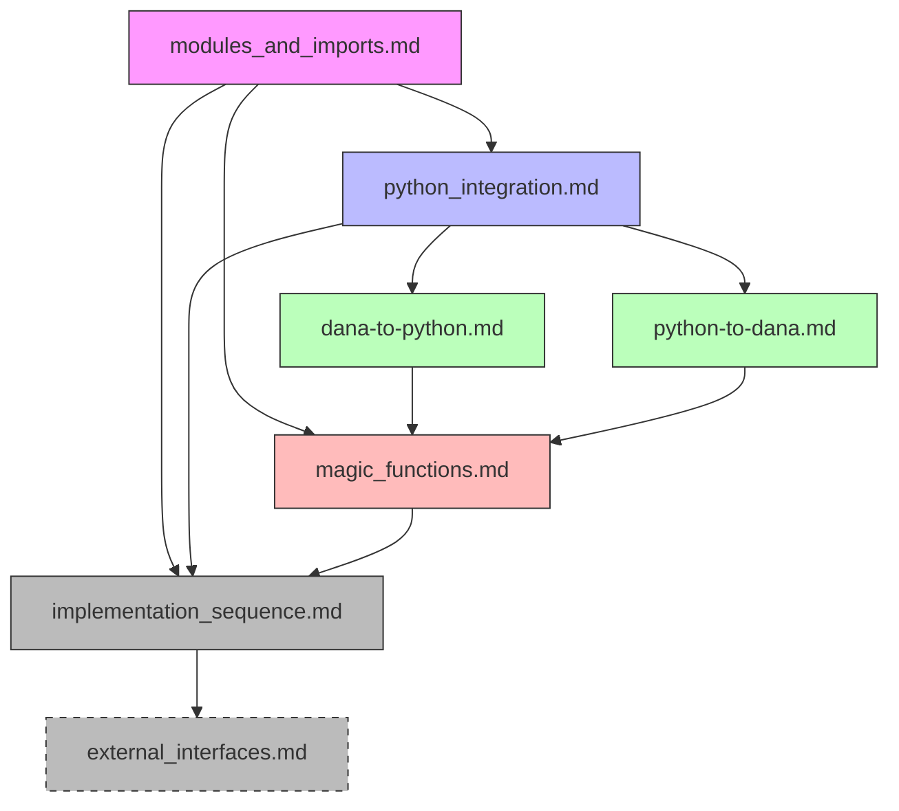

# Dana Design Document Sequence

```text
Author: Christopher Nguyen
Version: 0.1
Status: Design Phase
```

This document outlines the sequence of design documents for Dana's module system, Python integration, and magic functions.

## Document Structure

1. **Core Module System**
```
docs/design/01_dana_language_specification/
└── modules_and_imports.md           # Base module system design
```

2. **Python Integration**
```
docs/design/02_dana_runtime_and_execution/
├── python_integration.md            # High-level overview & coordination
├── dana-to-python.md               # Dana calling Python
└── python-to-dana.md               # Python calling Dana
```

3. **Magic Functions**
```
docs/design/01_dana_language_specification/
└── magic_functions.md              # Magic function system design
```

4. **Implementation Details**
```
docs/design/02_dana_runtime_and_execution/
├── implementation_sequence.md       # Complete implementation plan
└── external_interfaces.md          # Integration points & interfaces
```

## Document Sequence

### 1. modules_and_imports.md - DONE
- Core module system design
- Module loading and resolution
- Basic Python support
- Foundation for everything else

### 2. python_integration.md - DONE
- High-level overview of Python integration
- Integration strategy and principles
- Directory structure and organization
- Links to detailed Python integration docs

### 3. dana-to-python.md - DONE
- PythonFunction/Class/Object design
- Type conversion system
- Security model
- Resource management

### 4. python-to-dana.md - DONE
- Import system design
- Module wrapping
- Runtime integration
- Developer experience

### 5. magic_functions.md - DONE
- Magic function mechanism ([Design Doc](../../.implementation/magic_functions.md))
- AI integration design
- Code generation system
- Security considerations

### 6. implementation_sequence.md - DONE
- Complete implementation timeline
- File-by-file implementation plan
- Integration points
- Testing strategy

### 7. external_interfaces.md - TODO
- Final integration details
- Resource management
- External system interfaces
- Production considerations

## Document Dependencies



## Cross-References

### Module System → Python
- Module loading interface
- Type system integration
- Error handling

### Python → Magic Functions
- Function resolution
- Code generation
- Module caching

### Module System → Magic Functions
- Module loading
- Resolution pipeline
- Cache management

## Status and Next Steps

### Completed Documents
- ✓ modules_and_imports.md
- ✓ python_integration.md
- ✓ dana-to-python.md
- ✓ python-to-dana.md
- ✓ magic_functions.md
- ✓ implementation_sequence.md

### Remaining Work
- [ ] external_interfaces.md
  - Resource management design
  - External system interfaces
  - Production deployment
  - Security considerations

## Review Process

Each document should be reviewed for:
1. Completeness of design
2. Consistency with other documents
3. Security considerations
4. Implementation feasibility
5. Testing strategy
6. Documentation clarity 