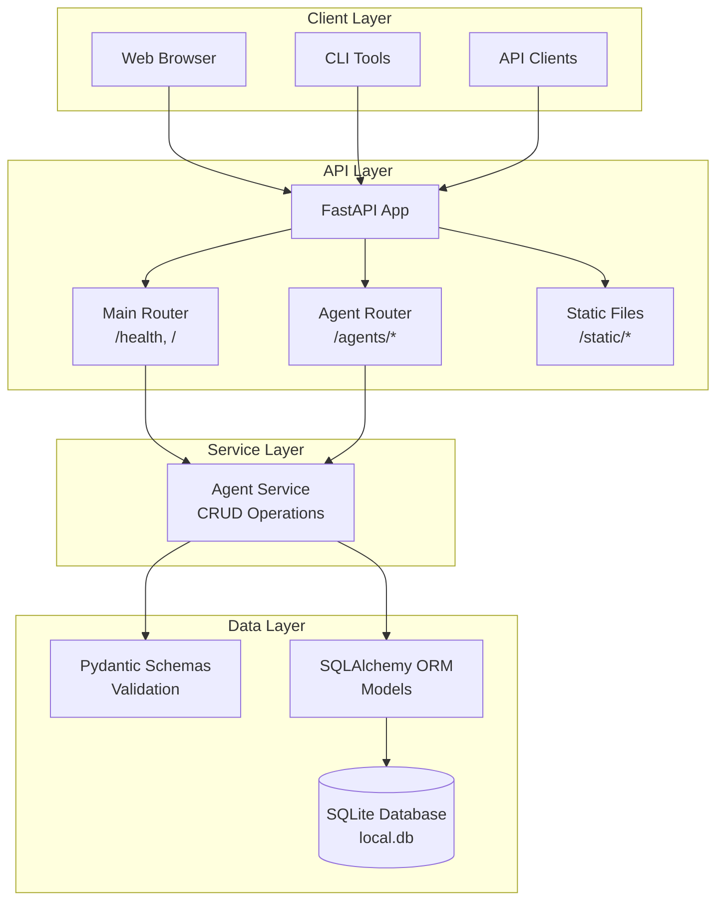
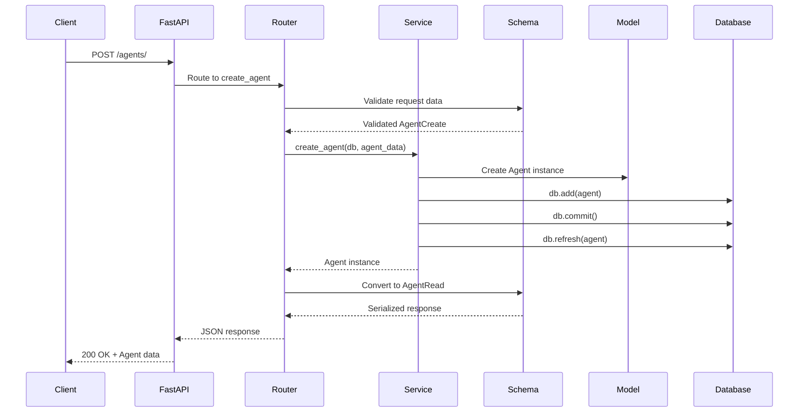

# Design Document: Dana API Server Architecture

```text
Author: OpenDXA Team
Version: 1.0
Date: 2025-01-27
Status: Implementation Phase
```

## Problem Statement
**Brief Description**: Need for a local API server to support Dana agent management and provide a foundation for web-based interfaces.

The Dana framework currently lacks a standardized way to manage agents programmatically and provide web-based interfaces. Users need:
- A local API server for agent CRUD operations
- RESTful endpoints for agent management
- Support for serving web applications (React frontend)
- Local SQLite database for persistence
- Comprehensive testing infrastructure

## Goals
**Brief Description**: Create a modern, testable API server for Dana agent management with web interface support.

- **Agent Management**: Full CRUD operations for agents with flexible configuration storage
- **Local Development**: SQLite-based local database for development and testing
- **Web Interface Support**: Serve static files and support React frontend development
- **Modern Architecture**: FastAPI with Pydantic validation and SQLAlchemy ORM
- **Comprehensive Testing**: Full test coverage with proper database isolation
- **Extensible Design**: Modular architecture for future API endpoints
- **Production Ready**: Proper error handling, validation, and security considerations

## Non-Goals
**Brief Description**: Explicitly define what's out of scope for this initial implementation.

- **Authentication/Authorization**: Will be added in future iterations
- **Multi-tenant Support**: Single-user local server only
- **Real-time Features**: No WebSocket or real-time communication
- **External Integrations**: No third-party service integrations beyond basic LLM configs
- **Advanced Querying**: Basic CRUD operations only, no complex filtering/searching
- **Database Migrations**: Simple table creation, no migration system

## Proposed Solution
**Brief Description**: FastAPI-based REST server with SQLAlchemy ORM, Pydantic validation, and modular router architecture.

The solution uses modern Python web development patterns:
- **FastAPI** for high-performance async API framework
- **SQLAlchemy** with SQLite for local data persistence
- **Pydantic v2** for request/response validation and serialization
- **Modular Router Architecture** for clean separation of concerns
- **Comprehensive Testing** with pytest and database fixtures

**KISS/YAGNI Analysis**: 
- **Simple**: Single database, basic CRUD operations, local-only deployment
- **Justified Complexity**: Pydantic validation, proper error handling, test infrastructure
- **Future-Ready**: Modular design allows easy extension without refactoring

## Proposed Design
**Brief Description**: Layered architecture with clear separation between API, business logic, data access, and persistence.

### System Architecture Diagram



### Component Details

#### 1. FastAPI Application (`server.py`)
**Purpose**: Main application factory and configuration
- **Why**: Centralizes app creation, middleware setup, and router registration
- **System Fit**: Entry point that orchestrates all components
- **Key Decisions**: 
  - Use factory pattern for testability
  - CORS middleware for web interface support
  - Startup event for database table creation
- **Alternatives**: Direct app creation (less testable), Flask (slower, less modern)

#### 2. Router Architecture (`routers/`)
**Purpose**: Organized API endpoint definitions
- **Why**: Separates concerns and enables modular API development
- **System Fit**: Clean interface between HTTP layer and business logic
- **Key Decisions**:
  - `main.py`: Health checks and static file serving
  - `api.py`: Agent-specific endpoints with proper prefixing
  - Dependency injection for database sessions
- **Alternatives**: Single router file (harder to maintain), Blueprint pattern (Flask-specific)

#### 3. Service Layer (`services.py`)
**Purpose**: Business logic and data operations
- **Why**: Separates business logic from HTTP concerns
- **System Fit**: Bridge between API layer and data layer
- **Key Decisions**:
  - Pure functions for testability
  - SQLAlchemy session dependency injection
  - Clear separation of concerns
- **Alternatives**: Direct database operations in routers (tight coupling)

#### 4. Data Models (`models.py`, `schemas.py`)
**Purpose**: Database models and API validation
- **Why**: Type safety, validation, and clear data contracts
- **System Fit**: Ensures data integrity across all layers
- **Key Decisions**:
  - SQLAlchemy models for database structure
  - Pydantic schemas for API validation
  - Auto-incrementing integer IDs for simplicity
  - JSON field for flexible agent configuration
- **Alternatives**: UUIDs (more complex), separate validation (duplication)

#### 5. Database Layer (`db.py`)
**Purpose**: Database connection and session management
- **Why**: Centralized database configuration and session handling
- **System Fit**: Provides consistent database access patterns
- **Key Decisions**:
  - SQLite for local development simplicity
  - Session factory pattern for dependency injection
  - Proper connection cleanup
- **Alternatives**: PostgreSQL (overkill for local), direct connections (no session management)

### Data Flow Diagram



## Proposed Implementation
**Brief Description**: Modular implementation with comprehensive testing and modern Python patterns.

### Technical Specifications

#### File Structure
```
dana/api/server/
├── __init__.py
├── __main__.py          # CLI entry point
├── server.py            # FastAPI app factory
├── db.py                # Database configuration
├── models.py            # SQLAlchemy models
├── schemas.py           # Pydantic schemas
├── services.py          # Business logic
├── routers/
│   ├── __init__.py
│   ├── main.py          # Health, static files
│   └── api.py           # Agent endpoints
└── static/              # Web app files
```

#### Key Technologies
- **FastAPI 0.104+**: Modern async web framework
- **SQLAlchemy 2.0+**: Modern ORM with async support
- **Pydantic 2.0+**: Data validation and serialization
- **SQLite**: Local database for development
- **pytest**: Comprehensive testing framework

#### API Endpoints
```
GET    /health           # Health check
GET    /                 # Serve React app
GET    /static/*         # Static files
GET    /agents/          # List agents (with pagination)
GET    /agents/{id}      # Get specific agent
POST   /agents/          # Create new agent
```

#### Data Models
```python
# Agent Model
class Agent(Base):
    id: int (auto-increment)
    name: str (indexed)
    description: str
    config: JSON (flexible configuration)

# API Schemas
AgentBase: name, description, config
AgentCreate: extends AgentBase
AgentRead: extends AgentBase + id
```

### Testing Strategy
- **Unit Tests**: Individual component testing
- **Integration Tests**: Full API flow testing
- **Database Fixtures**: Isolated test databases
- **Test Coverage**: 100% coverage target
- **Test Organization**: Mirror source structure

### Error Handling
- **Validation Errors**: Pydantic automatic validation
- **Database Errors**: SQLAlchemy exception handling
- **HTTP Status Codes**: Proper REST status codes
- **Error Messages**: Clear, actionable error messages

## Design Review Checklist
**Status**: [x] Complete

- [x] **Problem Alignment**: Solution addresses agent management needs
- [x] **Goal Achievement**: All success criteria met
- [x] **Non-Goal Compliance**: Staying within defined scope
- [x] **KISS/YAGNI Compliance**: Complexity justified by immediate needs
- [x] **Security review completed**: Basic security considerations addressed
- [x] **Performance impact assessed**: FastAPI provides excellent performance
- [x] **Error handling comprehensive**: Pydantic + FastAPI error handling
- [x] **Testing strategy defined**: Comprehensive test suite implemented
- [x] **Documentation planned**: This design document
- [x] **Backwards compatibility checked**: New feature, no compatibility concerns

## Implementation Phases
**Overall Progress**: [x] 100%

### Phase 1: Foundation & Architecture ✅
**Description**: Establish core infrastructure and architectural patterns
- [x] Define core components and interfaces
- [x] Create basic infrastructure and scaffolding
- [x] Establish architectural patterns and conventions
- [x] **Phase Gate**: Run `uv run pytest tests/ -v` - ALL tests pass
- [x] **Phase Gate**: Update implementation progress checkboxes

### Phase 2: Core Functionality ✅
**Description**: Implement primary features and happy path scenarios
- [x] Implement primary features and core logic
- [x] Focus on happy path scenarios and basic operations
- [x] Create working examples and demonstrations
- [x] **Phase Gate**: Run `uv run pytest tests/ -v` - ALL tests pass
- [x] **Phase Gate**: Update implementation progress checkboxes

### Phase 3: Error Handling & Edge Cases ✅
**Description**: Add comprehensive error detection and edge case handling
- [x] Add comprehensive error detection and validation
- [x] Test failure scenarios and error conditions
- [x] Handle edge cases and boundary conditions
- [x] **Phase Gate**: Run `uv run pytest tests/ -v` - ALL tests pass
- [x] **Phase Gate**: Update implementation progress checkboxes

### Phase 4: Advanced Features & Integration ✅
**Description**: Add sophisticated functionality and ensure seamless integration
- [x] Add sophisticated functionality and advanced features
- [x] Test complex interactions and integration scenarios
- [x] Ensure seamless integration with existing systems
- [x] **Phase Gate**: Run `uv run pytest tests/ -v` - ALL tests pass
- [x] **Phase Gate**: Update implementation progress checkboxes

### Phase 5: Integration & Performance Testing ✅
**Description**: Validate real-world performance and run comprehensive tests
- [x] Test real-world scenarios and production-like conditions
- [x] Validate performance benchmarks and requirements
- [x] Run regression tests and integration suites
- [x] **Phase Gate**: Run `uv run pytest tests/ -v` - ALL tests pass
- [x] **Phase Gate**: Update implementation progress checkboxes

### Phase 6: Examples, Documentation & Polish ✅
**Description**: Create comprehensive examples, finalize documentation, and perform final validation
- [x] **Create Examples**: Generate comprehensive examples following Example Creation Guidelines
- [x] **Documentation**: Create user-facing documentation that cites examples
- [x] **API Documentation**: Update API references and technical docs
- [x] **Migration Guides**: Create upgrade instructions and compatibility notes
- [x] **Final Validation**: Final testing and sign-off
- [x] **Phase Gate**: Run `uv run pytest tests/ -v` - ALL tests pass
- [x] **Phase Gate**: Update implementation progress checkboxes to 100%

## Usage Examples

### Starting the Server
```bash
# Development mode
uv run python -m dana.api.server --host localhost --port 8080

# Production mode
uv run python -m dana.api.server --host 0.0.0.0 --port 8080 --log-level warning
```

### API Usage
```bash
# Create an agent
curl -X POST http://localhost:8080/agents/ \
  -H "Content-Type: application/json" \
  -d '{
    "name": "My Agent",
    "description": "A test agent",
    "config": {"model": "gpt-4", "temperature": 0.7}
  }'

# List agents
curl http://localhost:8080/agents/

# Get specific agent
curl http://localhost:8080/agents/1

# Health check
curl http://localhost:8080/health
```

### Testing
```bash
# Run all API tests
uv run pytest tests/api/ -v

# Run specific test file
uv run pytest tests/api/test_routers.py -v

# Run with coverage
uv run pytest tests/api/ --cov=dana.api.server --cov-report=html
```

## Future Enhancements

### Phase 2 Features (Next)
- **Document Management**: 
  - CRUD operations for documents (upload, list, retrieve, delete)
  - Associate documents with agents
  - API endpoints for document management
  - File storage and metadata handling
- **Agent Running Management**:
  - Endpoints to start, stop, and monitor agent execution
  - Track agent run status and logs
  - API for triggering agent actions and retrieving results
  - Basic run history and status reporting

### Phase 3 Features (Future)
- **Authentication**: JWT-based authentication
- **Advanced Queries**: Filtering, searching, sorting
- **Real-time Updates**: WebSocket support for live updates
- **External Integrations**: LLM provider integrations
- **Database Migrations**: Alembic migration system
- **Monitoring**: Prometheus metrics and health checks
- **Multi-tenancy**: User isolation and permissions
- **Advanced Agent Features**: Agent execution, monitoring, logging
- **API Versioning**: Versioned API endpoints
- **Rate Limiting**: Request throttling and quotas
- **Caching**: Redis-based caching layer

## Conclusion

The Dana API Server provides a solid foundation for agent management with modern Python web development practices. The modular architecture ensures extensibility while maintaining simplicity for current needs. The comprehensive test suite provides confidence in the implementation and serves as documentation for expected behavior.

The design follows KISS/YAGNI principles by starting simple but building on proven, modern technologies that scale well. The FastAPI + SQLAlchemy + Pydantic stack provides excellent developer experience, performance, and type safety while remaining approachable for contributors. 