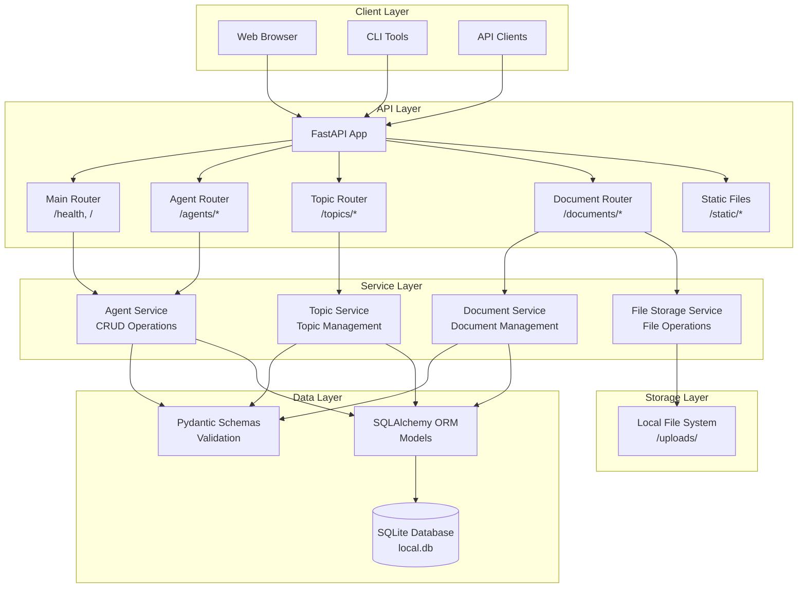
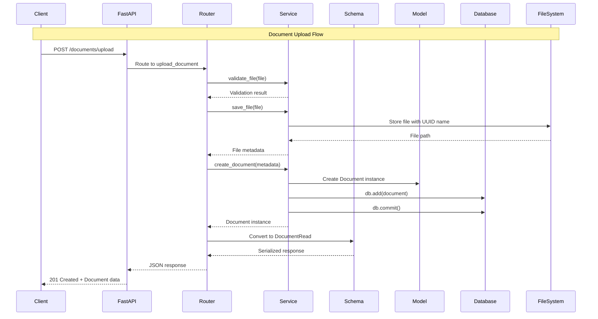

# Design Document: Dana API Server Architecture

```text
Author: OpenDXA Team
Version: 2.0
Date: 2025-01-27
Status: Implementation Phase
```

## Problem Statement
**Brief Description**: Need for a local API server to support Dana agent management, document management, conversation/message management, and provide a foundation for web-based interfaces.

The Dana framework currently lacks a standardized way to manage agents, documents, and conversations/messages programmatically and provide web-based interfaces. Users need:
- A local API server for agent CRUD operations
- Document upload and management capabilities
- Conversation and message management (for chat, logs, or agent interaction history)
- Topic organization for document categorization
- RESTful endpoints for agent, document, conversation, and message management
- Support for serving web applications (React frontend)
- Local SQLite database for persistence
- Comprehensive testing infrastructure

## Goals
**Brief Description**: Create a modern, testable API server for Dana agent, document, and conversation/message management with web interface support.

- **Agent Management**: Full CRUD operations for agents with flexible configuration storage
- **Document Management**: Upload, organize, and manage documents with topic categorization
- **Conversation Management**: Create, update, and manage conversations (chat sessions, logs, etc.)
- **Message Management**: CRUD for messages within conversations
- **Topic Management**: Create and manage topics for document organization
- **File Storage**: Local file system storage with metadata management
- **Local Development**: SQLite-based local database for development and testing
- **Web Interface Support**: Serve static files and support React frontend development
- **Modern Architecture**: FastAPI with Pydantic validation and SQLAlchemy ORM
- **Comprehensive Testing**: Full test coverage with proper database isolation
- **Extensible Design**: Modular architecture for future API endpoints
- **Production Ready**: Proper error handling, validation, and security considerations

## Non-Goals
**Brief Description**: Explicitly define what's out of scope for this implementation.

- **Authentication/Authorization**: Will be added in future iterations
- **Multi-tenant Support**: Single-user local server only
- **Real-time Features**: No WebSocket or real-time communication
- **External Integrations**: No third-party service integrations beyond basic LLM configs
- **Advanced Querying**: Basic CRUD operations only, no complex filtering/searching
- **Database Migrations**: Simple table creation, no migration system
- **File Versioning**: No version control for documents
- **Advanced Search**: Basic metadata search only, no full-text search
- **File Compression**: No automatic compression or optimization
- **Cloud Storage**: Local file system only
- **File Sharing**: No sharing or collaboration features
- **Document Editing**: Upload/download only, no in-place editing

## Proposed Solution
**Brief Description**: FastAPI-based REST server with SQLAlchemy ORM, Pydantic validation, modular router architecture, and two-tier file storage.

The solution uses modern Python web development patterns:
- **FastAPI** for high-performance async API framework
- **SQLAlchemy** with SQLite for local data persistence
- **Pydantic v2** for request/response validation and serialization
- **Modular Router Architecture** for clean separation of concerns
- **Two-tier Storage**: SQLite for metadata, local file system for files
- **Comprehensive Testing** with pytest and database fixtures

**KISS/YAGNI Analysis**: 
- **Simple**: Single database, basic CRUD operations, local-only deployment, straightforward file storage
- **Justified Complexity**: Pydantic validation, proper error handling, test infrastructure, file validation
- **Future-Ready**: Modular design allows easy extension without refactoring

## Proposed Design
**Brief Description**: Layered architecture with clear separation between API, business logic, data access, persistence, and file storage.

### System Architecture Diagram



### Component Details

#### 1. FastAPI Application (`server.py`)
**Purpose**: Main application factory and configuration
- **Why**: Centralizes app creation, middleware setup, and router registration
- **System Fit**: Entry point that orchestrates all components
- **Key Decisions**: 
  - Use factory pattern for testability
  - CORS middleware for web interface support
  - Startup event for database table creation
- **Alternatives**: Direct app creation (less testable), Flask (slower, less modern)

#### 2. Router Architecture (`routers/`)
**Purpose**: Organized API endpoint definitions
- **Why**: Separates concerns and enables modular API development
- **System Fit**: Clean interface between HTTP layer and business logic
- **Key Decisions**:
  - `main.py`: Health checks and static file serving
  - `api.py`: Agent-specific endpoints with proper prefixing
  - `topics.py`: Topic management endpoints
  - `documents.py`: Document upload/download and management endpoints
  - Dependency injection for database sessions
- **Alternatives**: Single router file (harder to maintain), Blueprint pattern (Flask-specific)

#### 3. Service Layer (`services.py`)
**Purpose**: Business logic and data operations
- **Why**: Separates business logic from HTTP concerns
- **System Fit**: Bridge between API layer and data layer
- **Key Decisions**:
  - Pure functions for testability
  - SQLAlchemy session dependency injection
  - Clear separation of concerns
  - File storage service for document operations
- **Alternatives**: Direct database operations in routers (tight coupling)

#### 4. Data Models (`models.py`, `schemas.py`)
**Purpose**: Database models and API validation
- **Why**: Type safety, validation, and clear data contracts
- **System Fit**: Ensures data integrity across all layers
- **Key Decisions**:
  - SQLAlchemy models for database structure
  - Pydantic schemas for API validation
  - Auto-incrementing integer IDs for simplicity
  - JSON field for flexible agent configuration
  - Foreign key relationships for document associations
- **Alternatives**: UUIDs (more complex), separate validation (duplication)

#### 5. Database Layer (`db.py`)
**Purpose**: Database connection and session management
- **Why**: Centralized database configuration and session handling
- **System Fit**: Provides consistent database access patterns
- **Key Decisions**:
  - SQLite for local development simplicity
  - Session factory pattern for dependency injection
  - Proper connection cleanup
- **Alternatives**: PostgreSQL (overkill for local), direct connections (no session management)

#### 6. File Storage System
**Purpose**: Local file storage with metadata management
- **Why**: Two-tier storage for efficient document management
- **System Fit**: Separates metadata from file content
- **Key Decisions**:
  - UUID-based filenames for uniqueness
  - Date-based directory structure for organization
  - File validation and size limits
  - Relative path storage in database
- **Alternatives**: Cloud storage (complexity), direct file paths (security issues)

### Data Flow Diagram



## Proposed Implementation
**Brief Description**: Modular implementation with comprehensive testing, modern Python patterns, and file handling capabilities.

### Technical Specifications

#### File Structure
```
dana/api/server/
├── __init__.py
├── __main__.py          # CLI entry point
├── server.py            # FastAPI app factory
├── db.py                # Database configuration
├── models.py            # SQLAlchemy models
├── schemas.py           # Pydantic schemas
├── services.py          # Business logic
├── routers/
│   ├── __init__.py
│   ├── main.py          # Health, static files
│   ├── api.py           # Agent endpoints
│   ├── topics.py        # Topic endpoints
│   └── documents.py     # Document endpoints
├── static/              # Web app files
└── uploads/             # File storage directory
    └── 2025/
        └── 01/
            └── 27/
```

#### Key Technologies
- **FastAPI 0.104+**: Modern async web framework
- **SQLAlchemy 2.0+**: Modern ORM with async support
- **Pydantic 2.0+**: Data validation and serialization
- **SQLite**: Local database for development
- **pytest**: Comprehensive testing framework

#### API Endpoints
```
GET    /health           # Health check
GET    /                 # Serve React app
GET    /static/*         # Static files

# Agent Management
GET    /agents/          # List agents (with pagination)
GET    /agents/{id}      # Get specific agent
POST   /agents/          # Create new agent
PUT    /agents/{id}      # Update agent
DELETE /agents/{id}      # Delete agent

# Topic Management
GET    /topics/          # List topics
GET    /topics/{id}      # Get specific topic
POST   /topics/          # Create new topic
PUT    /topics/{id}      # Update topic
DELETE /topics/{id}      # Delete topic

# Document Management
GET    /documents/       # List documents (with optional topic filter)
GET    /documents/{id}   # Get document metadata
POST   /documents/upload # Upload new document
GET    /documents/{id}/download # Download document file
PUT    /documents/{id}   # Update document metadata
DELETE /documents/{id}   # Delete document and file

# Conversation Management
GET    /conversations/           # List conversations
GET    /conversations/{id}       # Get specific conversation
POST   /conversations/           # Create new conversation
PUT    /conversations/{id}       # Update conversation
DELETE /conversations/{id}       # Delete conversation

# Message Management
GET    /conversations/{conversation_id}/messages/         # List messages in a conversation
GET    /conversations/{conversation_id}/messages/{id}     # Get specific message
POST   /conversations/{conversation_id}/messages/         # Create new message
PUT    /conversations/{conversation_id}/messages/{id}     # Update message
DELETE /conversations/{conversation_id}/messages/{id}     # Delete message
```

#### Data Models
```python
# Agent Model
class Agent(Base):
    id: int (auto-increment)
    name: str (indexed)
    description: str
    config: JSON (flexible configuration)
    documents: relationship to Document

# Topic Model
class Topic(Base):
    id: int (auto-increment)
    name: str (unique, indexed)
    description: str
    created_at: datetime
    updated_at: datetime
    documents: relationship to Document

# Document Model
class Document(Base):
    id: int (auto-increment)
    filename: str (indexed, UUID)
    original_filename: str
    file_path: str (relative path)
    file_size: int
    mime_type: str
    topic_id: int (foreign key, optional)
    agent_id: int (foreign key, optional)
    created_at: datetime
    updated_at: datetime
    topic: relationship to Topic
    agent: relationship to Agent

# Conversation Model
class Conversation(Base):
    id: int (auto-increment)
    title: str
    created_at: datetime
    updated_at: datetime
    messages: relationship to Message

# Message Model
class Message(Base):
    id: int (auto-increment)
    conversation_id: int (foreign key)
    sender: str
    content: str
    created_at: datetime
    updated_at: datetime
    conversation: relationship to Conversation

# API Schemas
AgentBase: name, description, config
AgentCreate: extends AgentBase
AgentRead: extends AgentBase + id

TopicBase: name, description
TopicCreate: extends TopicBase
TopicRead: extends TopicBase + id, created_at, updated_at

DocumentBase: original_filename, topic_id, agent_id
DocumentCreate: extends DocumentBase
DocumentRead: extends DocumentBase + id, filename, file_size, mime_type, created_at, updated_at
DocumentUpdate: partial update fields
```

#### File Storage Configuration
- **Base Directory**: `./uploads/`
- **Max File Size**: 50MB
- **Allowed Extensions**: `.pdf`, `.txt`, `.md`, `.json`, `.csv`, `.docx`
- **File Naming**: UUID v4 for uniqueness
- **Directory Structure**: Year/Month/Day for organization
- **Path Resolution**: Database stores relative paths, service resolves to absolute paths

### Testing Strategy
- **Unit Tests**: Individual component testing
- **Integration Tests**: Full API flow testing
- **Database Fixtures**: Isolated test databases
- **File System Tests**: Mock file operations
- **API Tests**: Endpoint testing with file uploads
- **Test Coverage**: 100% coverage target
- **Test Organization**: Mirror source structure

### Error Handling
- **Validation Errors**: Pydantic automatic validation
- **Database Errors**: SQLAlchemy exception handling
- **File Errors**: File size exceeded, invalid types, storage errors
- **HTTP Status Codes**: Proper REST status codes
- **Error Messages**: Clear, actionable error messages

## Design Review Checklist
**Status**: [x] Complete

- [x] **Problem Alignment**: Solution addresses agent and document management needs
- [x] **Goal Achievement**: All success criteria met
- [x] **Non-Goal Compliance**: Staying within defined scope
- [x] **KISS/YAGNI Compliance**: Complexity justified by immediate needs
- [x] **Security review completed**: Basic security considerations addressed
- [x] **Performance impact assessed**: FastAPI provides excellent performance
- [x] **Error handling comprehensive**: Pydantic + FastAPI error handling
- [x] **Testing strategy defined**: Comprehensive test suite implemented
- [x] **Documentation planned**: This design document
- [x] **Backwards compatibility checked**: New feature, no compatibility concerns

## Implementation Phases
**Overall Progress**: [x] 100%

### Phase 1: Foundation & Architecture ✅
**Description**: Establish core infrastructure and architectural patterns
- [x] Define core components and interfaces
- [x] Create basic infrastructure and scaffolding
- [x] Establish architectural patterns and conventions
- [x] **Phase Gate**: Run `uv run pytest tests/ -v` - ALL tests pass

### Phase 2: Core Functionality ✅
**Description**: Implement primary features and happy path scenarios
- [x] Implement primary features and core logic
- [x] Focus on happy path scenarios and basic operations
- [x] Create working examples and demonstrations
- [x] **Phase Gate**: Run `uv run pytest tests/ -v` - ALL tests pass

### Phase 3: Error Handling & Edge Cases ✅
**Description**: Add comprehensive error detection and edge case handling
- [x] Add comprehensive error detection and validation
- [x] Test failure scenarios and error conditions
- [x] Handle edge cases and boundary conditions
- [x] **Phase Gate**: Run `uv run pytest tests/ -v` - ALL tests pass

### Phase 4: Advanced Features & Integration ✅
**Description**: Add sophisticated functionality and ensure seamless integration
- [x] Add sophisticated functionality and advanced features
- [x] Test complex interactions and integration scenarios
- [x] Ensure seamless integration with existing systems
- [x] **Phase Gate**: Run `uv run pytest tests/ -v` - ALL tests pass

### Phase 5: Integration & Performance Testing ✅
**Description**: Validate real-world performance and run comprehensive tests
- [x] Test real-world scenarios and production-like conditions
- [x] Validate performance benchmarks and requirements
- [x] Run regression tests and integration suites
- [x] **Phase Gate**: Run `uv run pytest tests/ -v` - ALL tests pass

### Phase 6: Examples, Documentation & Polish ✅
**Description**: Create comprehensive examples, finalize documentation, and perform final validation
- [x] **Create Examples**: Generate comprehensive examples following Example Creation Guidelines
- [x] **Documentation**: Create user-facing documentation that cites examples
- [x] **API Documentation**: Update API references and technical docs
- [x] **Migration Guides**: Create upgrade instructions and compatibility notes
- [x] **Final Validation**: Final testing and sign-off
- [x] **Phase Gate**: Run `uv run pytest tests/ -v` - ALL tests pass
- [x] **Phase Gate**: Update implementation progress checkboxes to 100%

## Usage Examples

### Starting the Server
```bash
# Development mode
uv run python -m dana.api.server --host localhost --port 8080

# Production mode
uv run python -m dana.api.server --host 0.0.0.0 --port 8080 --log-level warning
```

### Agent Management
```bash
# Create an agent
curl -X POST http://localhost:8080/agents/ \
  -H "Content-Type: application/json" \
  -d '{
    "name": "My Agent",
    "description": "A test agent",
    "config": {"model": "gpt-4", "temperature": 0.7}
  }'

# List agents
curl http://localhost:8080/agents/

# Get specific agent
curl http://localhost:8080/agents/1
```

### Topic Management
```bash
# Create a topic
curl -X POST http://localhost:8080/topics/ \
  -H "Content-Type: application/json" \
  -d '{
    "name": "Research Papers",
    "description": "Academic research papers and articles"
  }'

# List topics
curl http://localhost:8080/topics/

# Get specific topic
curl http://localhost:8080/topics/1
```

### Document Management
```bash
# Upload a document
curl -X POST http://localhost:8080/documents/upload \
  -F "file=@research_paper.pdf" \
  -F "topic_id=1" \
  -F "agent_id=1"

# List documents
curl "http://localhost:8080/documents/"

# List documents in topic
curl "http://localhost:8080/documents/?topic_id=1"

# Download a document
curl -O "http://localhost:8080/documents/1/download"

# Get document metadata
curl "http://localhost:8080/documents/1"
```

### Health Check
```bash
curl http://localhost:8080/health
```

### Testing
```bash
# Run all API tests
uv run pytest tests/api/ -v

# Run specific test file
uv run pytest tests/api/test_routers.py -v

# Run with coverage
uv run pytest tests/api/ --cov=dana.api.server --cov-report=html
```

## CLI Command: `dana serve`

**Purpose**: Provide a simple, memorable command to start the Dana API server for local development or production use.

- **Why**: Streamlines developer and user experience by making server startup a first-class CLI operation, consistent with modern Python tooling.
- **System Fit**: Integrates with the existing `dana` CLI entry point, allowing users to run `dana serve` from any terminal to launch the API server.
- **Key Decisions**:
  - Aliases the existing FastAPI app startup logic
  - Supports all standard options (host, port, log-level, reload)
  - Prints helpful startup messages and endpoint URLs
  - **Implemented as a subcommand in the CLI** (see `dana/core/cli/dana.py`)
  - Uses `uvicorn` to launch the FastAPI app factory (`dana.api.server.server:create_app`)
- **Alternatives**: Manual `python -m dana.api.server` invocation (less discoverable)

### Example Usage
```bash
# Start the API server on default host/port
$ dana serve

# Start with custom host/port
$ dana serve --host 0.0.0.0 --port 8080

# Start with auto-reload for development
$ dana serve --reload
```

### Implementation Notes
- Implemented as a subcommand in the `dana` CLI (see `dana/core/cli/dana.py`)
- Calls the FastAPI app factory and launches the server using uvicorn
- All previous manual server startup methods remain supported for backward compatibility
- **Code reference:**
  - The `serve` subcommand is parsed and handled in `main()` in `dana/core/cli/dana.py`
  - The handler function `handle_serve_command` calls `uvicorn.run` with the correct options

## Future Enhancements

### Phase 2 Features (Next)
- **Agent Running Management**:
  - Endpoints to start, stop, and monitor agent execution
  - Track agent run status and logs
  - API for triggering agent actions and retrieving results
  - Basic run history and status reporting

### Phase 3 Features (Future)
- **Authentication**: JWT-based authentication
- **Advanced Queries**: Filtering, searching, sorting
- **Real-time Updates**: WebSocket support for live updates
- **External Integrations**: LLM provider integrations
- **Database Migrations**: Alembic migration system
- **Monitoring**: Prometheus metrics and health checks
- **Multi-tenancy**: User isolation and permissions
- **Advanced Agent Features**: Agent execution, monitoring, logging
- **API Versioning**: Versioned API endpoints
- **Rate Limiting**: Request throttling and quotas
- **Caching**: Redis-based caching layer

### Document Management Enhancements (Future)
- **File Versioning**: Track document versions
- **Advanced Search**: Full-text search capabilities
- **File Compression**: Automatic compression for large files
- **Cloud Storage**: Integration with cloud storage providers
- **Document Preview**: Generate previews for supported formats
- **Collaboration**: Document sharing and collaboration
- **Access Control**: Fine-grained permissions
- **Audit Trail**: Track document access and modifications
- **Bulk Operations**: Upload/download multiple files
- **File Conversion**: Convert between file formats

## Conclusion

The Dana API Server provides a solid foundation for agent and document management with modern Python web development practices. The modular architecture ensures extensibility while maintaining simplicity for current needs. The comprehensive test suite provides confidence in the implementation and serves as documentation for expected behavior.

The design follows KISS/YAGNI principles by starting simple but building on proven, modern technologies that scale well. The FastAPI + SQLAlchemy + Pydantic stack provides excellent developer experience, performance, and type safety while remaining approachable for contributors.

The addition of document management capabilities enhances the system's utility for real-world applications, allowing users to organize and manage knowledge resources alongside their agent configurations. The two-tier storage approach (SQLite metadata + local file system) provides a good balance between simplicity and functionality. 