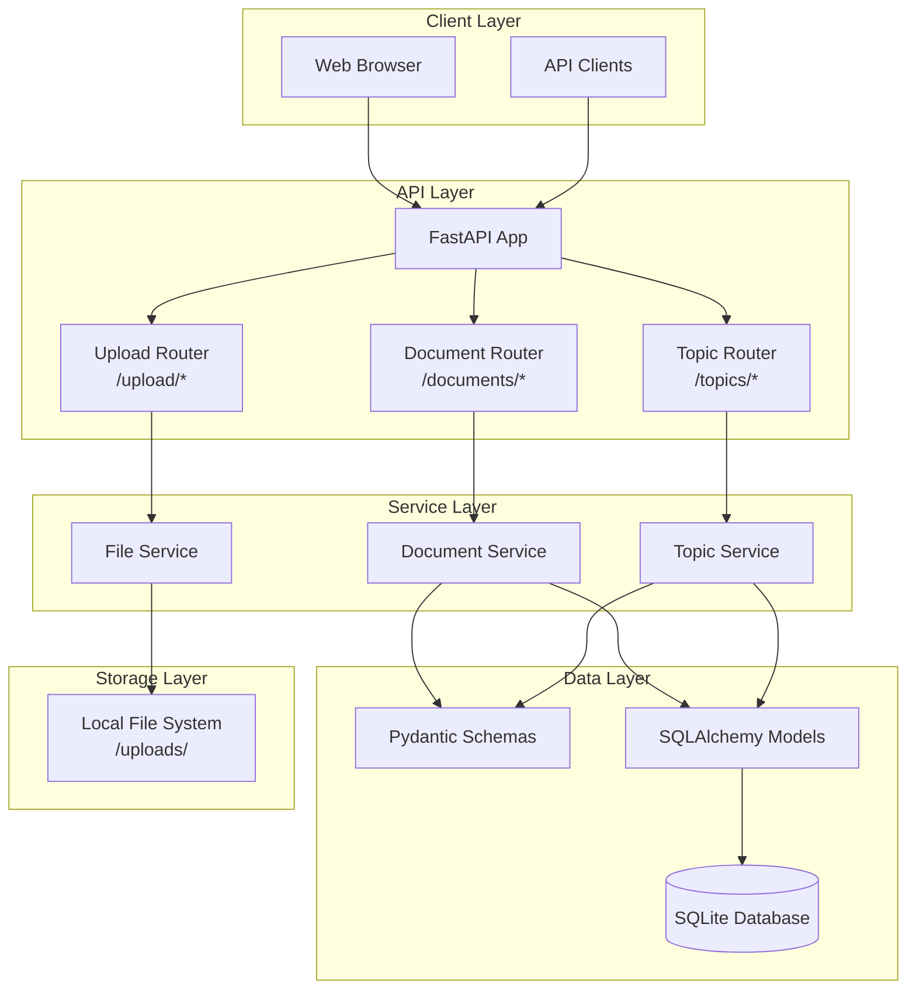
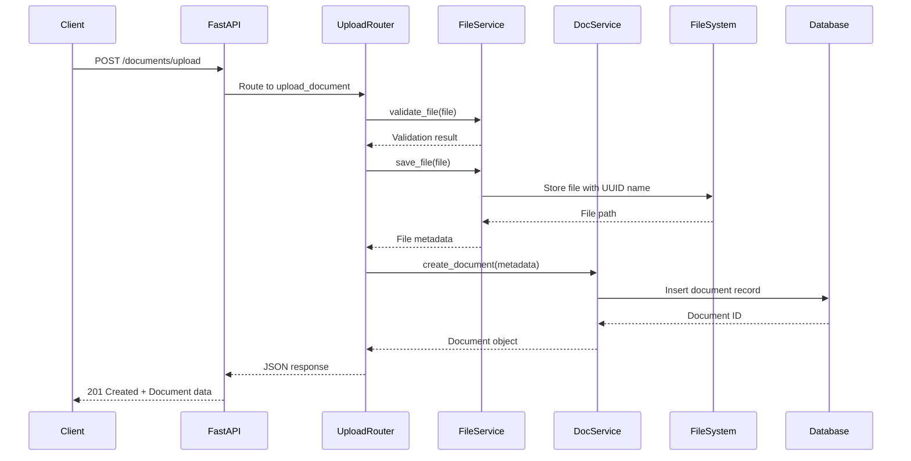

# Design Document: Document and Topic Management System

**Author**: OpenDXA Team  
**Version**: 1.0  
**Date**: 2025-01-27  
**Status**: Design Phase

## Problem Statement
Users need to upload and manage documents, organize them into topics, and associate them with agents. Documents may not always be associated with topics.

## Goals
- Document upload with file validation and local storage
- Topic creation and management
- Optional document-topic and document-agent associations
- RESTful API for all operations
- File metadata storage in SQLite database

## Non-Goals
- File versioning, advanced search, cloud storage, file sharing, document editing

## Proposed Solution
Two-tier storage: SQLite for metadata, local file system for files.

### Architecture
```
Client → FastAPI → Routers → Services → Database/FileSystem
```

### Data Models
```python
class Topic(Base):
    id = Column(Integer, primary_key=True, autoincrement=True)
    name = Column(String, unique=True, index=True)
    description = Column(Text)
    created_at = Column(DateTime, default=datetime.utcnow)
    updated_at = Column(DateTime, default=datetime.utcnow, onupdate=datetime.utcnow)

class Document(Base):
    id = Column(Integer, primary_key=True, autoincrement=True)
    filename = Column(String, index=True)  # UUID filename
    original_filename = Column(String)
    file_path = Column(String)
    file_size = Column(Integer)
    mime_type = Column(String)
    topic_id = Column(Integer, ForeignKey("topics.id"), nullable=True)
    agent_id = Column(Integer, ForeignKey("agents.id"), nullable=True)
    created_at = Column(DateTime, default=datetime.utcnow)
    updated_at = Column(DateTime, default=datetime.utcnow, onupdate=datetime.utcnow)
```

### API Endpoints
- `GET/POST /topics/` - Topic CRUD
- `GET/POST /documents/` - Document listing and upload
- `GET /documents/{id}/download` - File download
- `PUT/DELETE /documents/{id}` - Document management

### File Storage
- Directory: `./uploads/{year}/{month}/{day}/`
- Filenames: UUID v4 for uniqueness
- Max size: 50MB
- Allowed: PDF, TXT, MD, JSON, CSV, DOCX

## Implementation Phases
1. **Database Models** (25%) - SQLAlchemy models and Pydantic schemas
2. **File Storage** (25%) - Upload service and file management
3. **API Endpoints** (25%) - RESTful endpoints
4. **Testing** (25%) - Unit and integration tests

## Future Enhancements
- File versioning, advanced search, cloud storage, collaboration features

```text
Author: OpenDXA Team
Version: 1.0
Date: 2025-01-27
Status: Design Phase
```

## Problem Statement
**Brief Description**: Need for document management capabilities in the Dana API server to support agent workflows and knowledge organization.

Users need to:
- Upload and manage documents (PDFs, text files, etc.)
- Organize documents into topics for better categorization
- Associate documents with agents when needed
- Store files locally with proper metadata
- Retrieve and search documents efficiently
- Support various file formats for different use cases

## Goals
**Brief Description**: Create a comprehensive document management system with topic organization and file storage.

- **Document Upload**: Support multiple file formats with validation
- **Topic Management**: Create, manage, and organize topics
- **File Storage**: Local file system storage with metadata
- **Document-Topic Association**: Optional linking of documents to topics
- **Document-Agent Association**: Link documents to agents when needed
- **File Validation**: Size limits, format validation, security checks
- **Metadata Management**: Store and retrieve document metadata
- **API Endpoints**: RESTful API for all document operations

## Non-Goals
**Brief Description**: Explicitly define what's out of scope for this implementation.

- **File Versioning**: No version control for documents
- **Advanced Search**: Basic metadata search only, no full-text search
- **File Compression**: No automatic compression or optimization
- **Cloud Storage**: Local file system only
- **File Sharing**: No sharing or collaboration features
- **Document Editing**: Upload/download only, no in-place editing
- **Large File Streaming**: Files must fit in memory for processing

## Proposed Solution
**Brief Description**: Document management system with SQLite metadata storage and local file system storage.

The solution provides:
- **SQLite Database**: Store document and topic metadata
- **Local File System**: Store actual files in organized directory structure
- **FastAPI Endpoints**: RESTful API for document and topic management
- **File Validation**: Size and format validation
- **Optional Associations**: Documents can optionally link to topics and agents

**KISS/YAGNI Analysis**:
- **Simple**: Local file storage, basic metadata, straightforward associations
- **Justified Complexity**: File validation, metadata management, API structure
- **Future-Ready**: Extensible design for future features

## Proposed Design
**Brief Description**: Two-tier storage system with database metadata and file system storage.

### System Architecture Diagram



### Component Details

#### 1. Data Models
**Purpose**: Define database structure for documents and topics
- **Topic Model**: id, name, description, created_at, updated_at
- **Document Model**: id, filename, original_filename, file_path, file_size, mime_type, topic_id (optional), agent_id (optional), created_at, updated_at
- **Relationships**: Many-to-one between Document and Topic, Document and Agent

#### 2. File Storage Strategy
**Purpose**: Organize and store uploaded files
- **Directory Structure**: `/uploads/{year}/{month}/{day}/{filename}`
- **File Naming**: UUID-based filenames to prevent conflicts
- **Metadata Storage**: All file metadata stored in database
- **Path Resolution**: Database stores relative paths, service resolves to absolute paths

#### 3. API Endpoints
**Purpose**: RESTful interface for document and topic management

**Topic Endpoints**:
- `GET /topics/` - List all topics
- `POST /topics/` - Create new topic
- `GET /topics/{id}` - Get specific topic
- `PUT /topics/{id}` - Update topic
- `DELETE /topics/{id}` - Delete topic

**Document Endpoints**:
- `GET /documents/` - List documents (with optional topic filter)
- `POST /documents/upload` - Upload new document
- `GET /documents/{id}` - Get document metadata
- `GET /documents/{id}/download` - Download document file
- `PUT /documents/{id}` - Update document metadata
- `DELETE /documents/{id}` - Delete document and file

#### 4. File Upload Process
**Purpose**: Handle file uploads with validation and storage
1. **Validation**: Check file size, format, and security
2. **Storage**: Generate unique filename and store in organized directory
3. **Metadata**: Extract and store file metadata in database
4. **Association**: Link to topic and/or agent if specified

### Data Flow Diagram



## Proposed Implementation
**Brief Description**: Modular implementation with file handling, database models, and comprehensive API.

### Technical Specifications

#### File Structure
```
dana/api/server/
├── models.py            # Add Topic and Document models
├── schemas.py           # Add Topic and Document schemas
├── services.py          # Add document and topic services
├── routers/
│   ├── documents.py     # Document endpoints
│   └── topics.py        # Topic endpoints
└── uploads/             # File storage directory
    └── 2025/
        └── 01/
            └── 27/
```

#### Database Models
```python
class Topic(Base):
    id = Column(Integer, primary_key=True, autoincrement=True)
    name = Column(String, unique=True, index=True)
    description = Column(Text)
    created_at = Column(DateTime, default=datetime.utcnow)
    updated_at = Column(DateTime, default=datetime.utcnow, onupdate=datetime.utcnow)

class Document(Base):
    id = Column(Integer, primary_key=True, autoincrement=True)
    filename = Column(String, index=True)  # UUID filename
    original_filename = Column(String)     # Original filename
    file_path = Column(String)            # Relative path
    file_size = Column(Integer)
    mime_type = Column(String)
    topic_id = Column(Integer, ForeignKey("topics.id"), nullable=True)
    agent_id = Column(Integer, ForeignKey("agents.id"), nullable=True)
    created_at = Column(DateTime, default=datetime.utcnow)
    updated_at = Column(DateTime, default=datetime.utcnow, onupdate=datetime.utcnow)
```

#### API Schemas
```python
class TopicBase(BaseModel):
    name: str
    description: str

class TopicCreate(TopicBase):
    pass

class TopicRead(TopicBase):
    id: int
    created_at: datetime
    updated_at: datetime

class DocumentBase(BaseModel):
    original_filename: str
    topic_id: Optional[int] = None
    agent_id: Optional[int] = None

class DocumentCreate(DocumentBase):
    pass

class DocumentRead(DocumentBase):
    id: int
    filename: str
    file_size: int
    mime_type: str
    created_at: datetime
    updated_at: datetime
```

#### File Storage Configuration
- **Base Directory**: `./uploads/`
- **Max File Size**: 50MB
- **Allowed Extensions**: `.pdf`, `.txt`, `.md`, `.json`, `.csv`, `.docx`
- **File Naming**: UUID v4 for uniqueness
- **Directory Structure**: Year/Month/Day for organization

### Testing Strategy
- **Unit Tests**: Individual service and model testing
- **Integration Tests**: Full upload/download flow testing
- **File System Tests**: Mock file operations
- **API Tests**: Endpoint testing with file uploads
- **Cleanup Tests**: Ensure files are properly cleaned up

### Error Handling
- **File Size Exceeded**: Return 413 Payload Too Large
- **Invalid File Type**: Return 400 Bad Request
- **File Not Found**: Return 404 Not Found
- **Storage Errors**: Return 500 Internal Server Error
- **Validation Errors**: Return 422 Unprocessable Entity

## Design Review Checklist
**Status**: [ ] Not Started | [x] In Progress | [ ] Complete

- [x] **Problem Alignment**: Solution addresses document management needs
- [x] **Goal Achievement**: All success criteria defined
- [x] **Non-Goal Compliance**: Scope clearly defined
- [x] **KISS/YAGNI Compliance**: Complexity justified by immediate needs
- [ ] **Security review completed**
- [ ] **Performance impact assessed**
- [ ] **Error handling comprehensive**
- [ ] **Testing strategy defined**
- [ ] **Documentation planned**
- [ ] **Backwards compatibility checked**

## Implementation Phases
**Overall Progress**: [ ] 0% | [ ] 20% | [ ] 40% | [ ] 60% | [ ] 80% | [ ] 100%

### Phase 1: Database Models and Schemas (25% of total)
**Description**: Create database models and Pydantic schemas
- [ ] Create Topic and Document SQLAlchemy models
- [ ] Create Pydantic schemas for validation
- [ ] Add database migrations
- [ ] **Phase Gate**: Run `uv run pytest tests/ -v` - ALL tests pass

### Phase 2: File Storage Service (25% of total)
**Description**: Implement file upload and storage functionality
- [ ] Create file storage service
- [ ] Implement file validation
- [ ] Create directory structure management
- [ ] **Phase Gate**: Run `uv run pytest tests/ -v` - ALL tests pass

### Phase 3: API Endpoints (25% of total)
**Description**: Create RESTful API endpoints
- [ ] Implement topic CRUD endpoints
- [ ] Implement document upload/download endpoints
- [ ] Add proper error handling
- [ ] **Phase Gate**: Run `uv run pytest tests/ -v` - ALL tests pass

### Phase 4: Testing and Documentation (25% of total)
**Description**: Comprehensive testing and documentation
- [ ] Create unit tests for all components
- [ ] Create integration tests for file operations
- [ ] Update API documentation
- [ ] **Phase Gate**: Run `uv run pytest tests/ -v` - ALL tests pass

## Usage Examples

### Create a Topic
```bash
curl -X POST http://localhost:8080/topics/ \
  -H "Content-Type: application/json" \
  -d '{
    "name": "Research Papers",
    "description": "Academic research papers and articles"
  }'
```

### Upload a Document
```bash
curl -X POST http://localhost:8080/documents/upload \
  -F "file=@research_paper.pdf" \
  -F "topic_id=1" \
  -F "agent_id=1"
```

### List Documents in Topic
```bash
curl "http://localhost:8080/documents/?topic_id=1"
```

### Download a Document
```bash
curl -O "http://localhost:8080/documents/1/download"
```

## Future Enhancements

### Phase 2 Features (Future)
- **File Versioning**: Track document versions
- **Advanced Search**: Full-text search capabilities
- **File Compression**: Automatic compression for large files
- **Cloud Storage**: Integration with cloud storage providers
- **Document Preview**: Generate previews for supported formats

### Phase 3 Features (Future)
- **Collaboration**: Document sharing and collaboration
- **Access Control**: Fine-grained permissions
- **Audit Trail**: Track document access and modifications
- **Bulk Operations**: Upload/download multiple files
- **File Conversion**: Convert between file formats

## Conclusion

The Document and Topic Management System provides a solid foundation for organizing and managing documents within the Dana ecosystem. The local file storage approach ensures simplicity while the database metadata enables efficient querying and organization. The modular design allows for future enhancements while maintaining the KISS/YAGNI principles. 