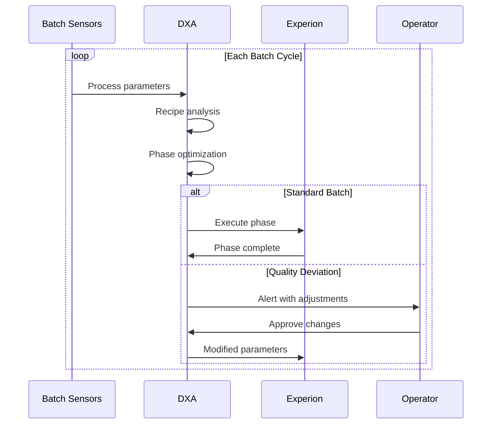
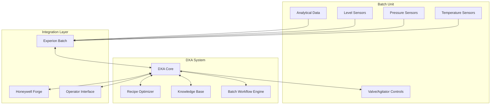

<!-- markdownlint-disable MD041 -->
<!-- markdownlint-disable MD033 -->

  

# Batch Process Automation Requirements

<!-- markdownlint-disable-next-line no-inline-images -->

    

## Business/Technical Problem Statement

### Persona
**Jennifer Martinez, Process Engineer**
- 7+ years of experience in specialty chemicals manufacturing
- Responsible for optimizing batch processes and ensuring product quality
- Must maintain consistent product quality while maximizing throughput
- Works across multiple production lines and product types
- Reports to the Production Manager

### Use Case
Jennifer needs to optimize batch processes in specialty chemicals manufacturing to ensure consistent product quality, maximize throughput, and minimize waste. She must monitor process parameters, identify optimization opportunities, and implement improvements to meet production targets and quality standards.

### Scenario
Jennifer is responsible for a critical batch process that has been experiencing quality variations. She needs to:
1. Review historical batch data to identify patterns in successful vs. failed batches
2. Analyze current process parameters against optimal ranges
3. Identify potential optimization opportunities
4. Develop and test process improvements
5. Implement changes across multiple batch reactors
6. Monitor results and document improvements

Jennifer is under pressure to improve the process quickly as the current quality variations are affecting customer satisfaction and increasing production costs. She needs a system that can help her analyze complex process data, identify optimization opportunities, and implement improvements across multiple batch reactors.

## Scenario Overview

This document describes how Domain Expert Agents (DXAs) enable autonomous batch operations at both unit and network levels, focusing on specialty chemicals manufacturing.

### Batch Process Components

1. **Sensor Network**
   - Temperature sensors
   - Pressure sensors
   - Level sensors
   - Analytical data
   - Valve/agitator controls

2. **DXA Core**
   - Recipe optimizer
   - Knowledge base
   - Batch workflow engine
   - Real-time monitoring

3. **Integration Layer**
   - Experion Batch system
   - Honeywell Forge platform
   - Operator interface
   - Recipe management

4. **Network Components**
   - Edge processing nodes
   - Distributed DXA network
   - Market interface
   - Production scheduling

### Example Scenario: Batch Process Optimization

#### Context

- Specialty chemicals batch process optimization environment
- DXA has access to:
  - Multi-variable batch data streams
  - Experion Batch execution system
  - Honeywell Forge platform
  - Historical batch records
  - Master recipe database
  - Standard operating procedures
  - Batch quality parameters
  - Clean-in-place procedures

    
     
    Batch Process: Reactor and Distillation Column Configuration

#### Challenge

1. Process Optimization
   - Reduce batch cycle time
   - Improve product quality consistency
   - Minimize operator interventions
   - Prevent batch failures
   - Optimize recipes in real-time
   - Manage phase transitions

2. Network Coordination
   - Coordinate multi-site production
   - Optimize recipes across plants
   - Respond to market demand
   - Maintain quality standards
   - Protect recipe IP
   - Maximize resource utilization

3. Knowledge Management
   - Capture process expertise
   - Learn from historical batches
   - Adapt to equipment variations
   - Standardize quality metrics
   - Share improvements across network
   - Maintain security protocols

#### DXA Actions

1. **Batch Monitoring**
   - Track process parameters
   - Analyze recipe performance
   - Detect quality deviations
   - Predict outcomes
   - Recommend adjustments
   - Execute approved changes

2. **Network Orchestration**
   - Schedule production
   - Distribute recipes
   - Monitor execution
   - Collect analytics
   - Improve recipes
   - Maintain quality standards

## Solution Architecture

### 1. Batch Unit Components

- Temperature sensors
- Pressure sensors
- Level sensors
- Analytical data
- Valve/agitator controls

### 2. DXA Core Components

#### Recipe Optimizer

- Recipe analysis
- Phase optimization
- Quality prediction
- Parameter adjustment
- Performance tracking

#### Knowledge Base

- Historical batch records
- Master recipe database
- Standard operating procedures
- Quality parameters
- Clean-in-place procedures

#### Batch Workflow Engine

- Phase transition management
- Execution control
- Quality monitoring
- Deviation handling
- Operator guidance

### Integration Details

#### System Integration

- Experion Batch connectivity
- Honeywell Forge platform integration
- Operator interface
- Sensor network integration
- Control system connectivity

#### Network Integration

- Edge processing nodes
- Distributed DXA network
- Market interface
- Production scheduling
- Recipe sharing protocols

## Success Criteria

- 30% reduction in batch cycle time
- 25% improvement in product quality consistency
- 40% reduction in operator interventions
- Zero failed batches
- Real-time recipe optimization
- Automated phase transitions
- Clear batch progression visualization
- 2ms edge decision time
- 98% edge processing
- Cross-plant recipe optimization
- Market-responsive scheduling
- Zero recipe IP exposure
- Network-wide quality consistency

## Performance Metrics

- Batch cycle time
- Product quality consistency
- Energy per batch
- Raw material utilization
- First-time-right rate
- Operator intervention rate
- Recipe transfer success
- Cross-plant learning rate
- Order fulfillment speed
- Network capacity utilization
- Quality consistency across sites
- Recipe IP protection
