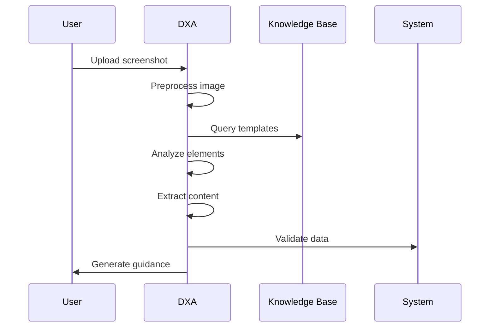
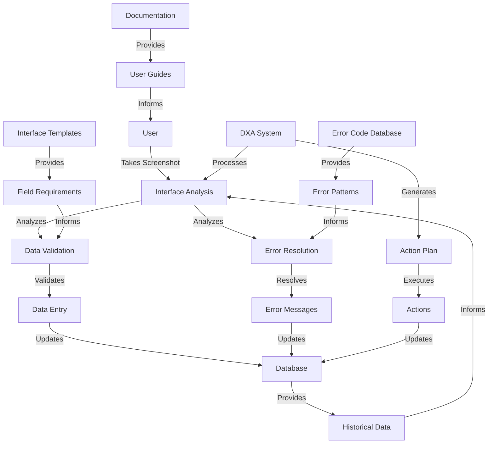

<!-- markdownlint-disable MD041 -->
<!-- markdownlint-disable MD033 -->

  

# Enterprise Software Screenshot Analysis Requirements

  

## Business/Technical Problem Statement

### Persona
**Emily Rodriguez, Business Analyst**
- 5+ years experience in enterprise software implementation
- Responsible for helping users navigate complex enterprise systems
- Must ensure accurate data entry and troubleshoot user issues
- Works with multiple departments and software systems
- Reports to the IT Operations Manager

### Use Case
Emily needs to help users verify data entry, troubleshoot errors, and understand form requirements in enterprise software systems. She must analyze screenshots of software interfaces, identify issues, and provide guidance to ensure accurate data entry and system usage.

### Scenario
Emily receives a support ticket from a finance department user who is encountering an error when submitting a purchase requisition. She needs to:
1. Review the screenshot of the error message and form
2. Identify the specific field causing the validation error
3. Analyze the form requirements and data constraints
4. Determine the correct data format or value needed
5. Provide clear instructions to the user
6. Document the issue for future reference

Emily is under pressure to resolve the issue quickly as the purchase requisition is time-sensitive and blocking an important procurement process. She needs a system that can help her analyze screenshots rapidly and provide accurate guidance to users.

## Scenario Overview

This document describes the requirements for enterprise software users who need to verify data entry, troubleshoot errors, and understand form requirements through screenshot analysis using DXA in a single conversation.

### System Components

1. **Screenshot Processing System**
   - Image preprocessor
   - OCR engine
   - Interface element recognizer
   - Error message extractor
   - Field content analyzer

2. **Knowledge Base**
   - Interface templates
   - Error code database
   - Field requirements
   - Historical patterns
   - System documentation

3. **Analysis Engine**
   - Data validation
   - Error resolution
   - Field requirement analysis
   - Pattern matching
   - Version compatibility

4. **Reporting System**
   - Validation report generator
   - Error resolution guide
   - Field requirement display
   - Step-by-step guidance
   - Documentation references

### Example Scenario: Interface Analysis Process

#### Context

- Enterprise software environment
- DXA has access to:
  - Interface templates
  - Error code database
  - Field requirements
  - Historical patterns
  - System documentation

#### Challenge

1. Accurate Analysis
   - Process various screenshot qualities
   - Recognize interface elements
   - Extract error messages
   - Validate data patterns
   - Match field requirements

2. Timely Response
   - Quick image processing
   - Rapid element recognition
   - Fast error resolution
   - Immediate guidance
   - Clear documentation

3. Security
   - Protect sensitive data
   - Handle user information
   - Maintain compliance
   - Control access levels
   - Manage data retention

#### DXA Actions

1. **Screenshot Analysis**
   - Preprocess images
   - Recognize elements
   - Extract content
   - Validate data
   - Match patterns

2. **Guidance Generation**
   - Verify data entry
   - Resolve errors
   - Clarify requirements
   - Provide steps
   - Document findings

## Solution Architecture

### 1. Input Components

- Screenshot capture system
- Interface templates
- Error databases
- Field requirements

### 2. DXA Core Components

#### Screenshot Processor

- Image preprocessing
- OCR processing
- Element recognition
- Content extraction

#### Element Analyzer

- Interface mapping
- Error detection
- Field identification
- Pattern matching

#### Validation Analyzer

- Data verification
- Error resolution
- Requirement checking
- Pattern validation

### Integration Details

#### System Integration

- Enterprise software
- Support ticketing
- Documentation system
- User management

#### Knowledge Integration

- Interface templates
- Error databases
- Field requirements
- Historical patterns

## Success Criteria

- Accurate identification of interface elements (>95% accuracy)
- Correct error code interpretation
- Accurate field requirement identification
- Valid data pattern recognition
- Response time under 60 seconds
- Successful resolution guidance

## Performance Metrics

- Interface element recognition accuracy
- Error code matching accuracy
- Data pattern validation accuracy
- Response generation time
- User comprehension rate
- Resolution success rate
