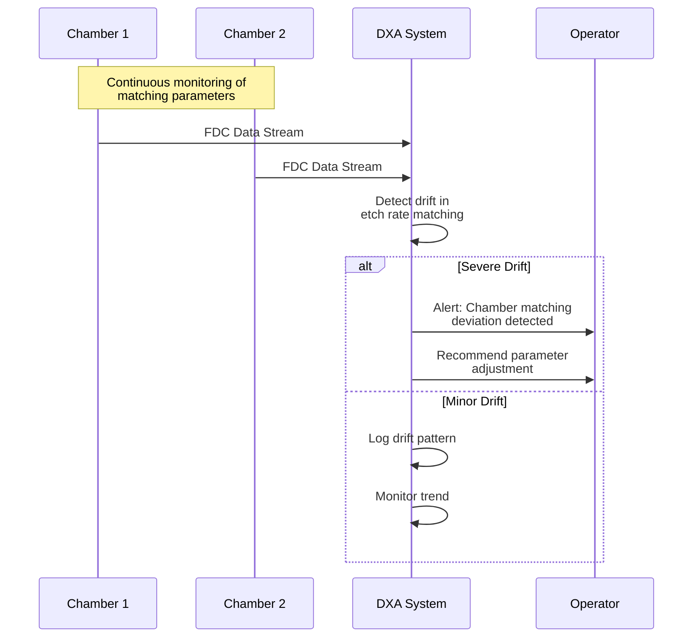
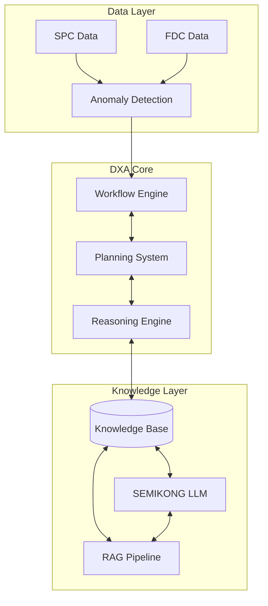
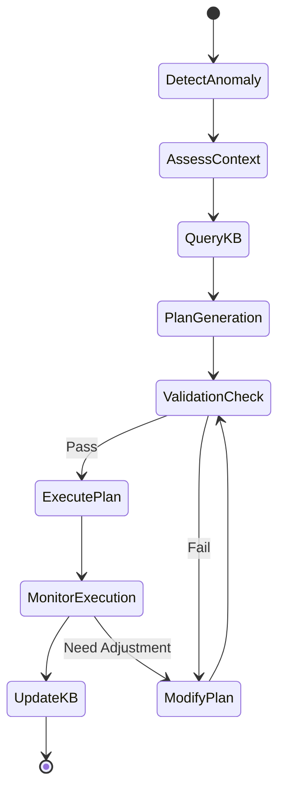
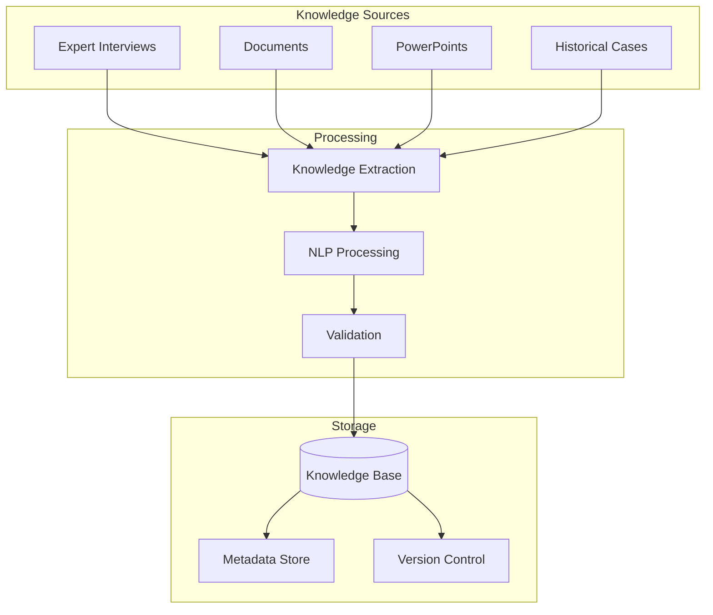
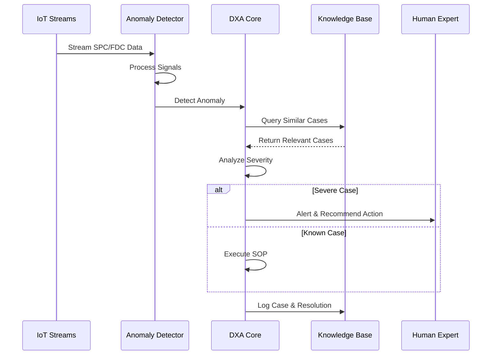

# Fab Domain Expert Agent (DXA) Requirements

## Scenario Overview

The system monitors a semiconductor etcher (RIE) through continuous SPC and FDC IoT data streams. The Domain Expert Agent (DXA) acts as a 24/7 virtual expert, performing:

1. Real-time monitoring of process data streams
2. Anomaly detection and classification
3. Problem diagnosis and root cause analysis
4. Recommendation of corrective actions based on SOPs
5. Continuous learning from new cases and expert feedback

### Example Scenario: RIE Chamber Matching

#### Context

- Two RIE chambers running the same process
- Critical parameters monitored:
  - Etch rates
  - Chamber pressure
  - RF power matching
  - Gas flow rates
  - Chamber temperature

#### Challenge

1. Maintain consistent performance across chambers
2. Early detection of parameter drift
3. Rapid diagnosis of matching issues
4. Automated correction within safe bounds

#### DXA Actions

1. **Continuous Monitoring**
   - Real-time FDC data analysis
   - SPC trend monitoring
   - Cross-chamber correlation analysis

2. **Anomaly Detection**
   - Statistical process control
   - Pattern recognition in multivariate data
   - Historical case matching

3. **Diagnosis & Resolution**
   - Root cause analysis using knowledge base
   - Parameter adjustment recommendations
   - SOP execution for known cases
   - Expert escalation for novel situations

4. **Learning & Optimization**
   - Case logging and classification
   - Success rate tracking
   - Knowledge base updates
   - SOP refinement

## Solution Architecture

### 1. Data Monitoring & Anomaly Detection Layer

- Integration with SPC and FDC data streams
- Plug-in architecture for AI/infra team's anomaly detection kernels
- Real-time monitoring and signal processing
- Multi-variate anomaly detection capabilities

### 2. Domain Expert Agent Core

#### 2.1 Workflow Engine

- Flexible workflow design combining expert knowledge and Fab APIs
- Support for multiple concurrent root cause analyses
- Dynamic workflow adaptation based on case context
- Integration with knowledge base for workflow templates

#### 2.2 Planning System

- Automated diagnosis planning
- SOP execution planning
- Resource allocation and scheduling
- Plan adaptation based on feedback

#### 2.3 Reasoning Engine

- Enhanced SEMIKONG LLM integration
- Multi-step reasoning capabilities
- Semantic knowledge base querying
- Uncertainty handling and probabilistic reasoning

### 3. Knowledge Management System

- Semantic Knowledge Base for:
  - Expert knowledge
  - SOPs and procedures
  - Historical cases
  - Workflow templates
  - Domain heuristics
- Flexible knowledge capture with customized templates
- Knowledge editing and version control
- Dynamic knowledge extension through expert interviews

### 4. Enhanced SEMIKONG LLM Integration

- Integration timeline: Complete by 1/31/2025
- Fab domain specialization through fine-tuning
- Components:
  - Data preparation pipeline
  - Model fine-tuning pipeline
  - RAG (Retrieval Augmented Generation) pipeline
- Evaluation and validation framework
- Specific requirements from original doc:
  - SemiKong with Llama 3.3 - 1/31/2025
  - Finetune with current SEMIKONG
  - Finetune specifically with Fab domain know-how (mostly from PowerPoint)
  - New SEMIKONG release date: Before 1/31/2025

## Technical Requirements

### Workflow Capabilities

- Dynamic workflow construction from expert knowledge
- Integration with multiple Fab APIs
- Support for 1-to-many root cause analysis
- Knowledge-based workflow design
- Original workflow requirements:
  - How to build workflows that combine expert interview results with multiple Fab APIs
  - Design elements (workflows, plans, facts, heuristics, conditions) should come from knowledge base

### Reasoning Capabilities

- Enhanced SEMIKONG integration
- Document-based reasoning support
- Raw FDC data anomaly detection
- Causal analysis and inference
- Original reasoning requirements:
  - Based on supporting documents to provide more information about cases
  - Root cause analysis beyond expert interview content
  - Anomaly detection from raw FDC data

### Knowledge Integration

- Flexible knowledge capture mechanisms
- Dynamic question generation for knowledge acquisition
- Knowledge base editing and maintenance
- Domain-specific template customization
- Original knowledge integration requirements:
  - Customized templates for different domain knowledge capture
  - Capability to extend questions based on expert answers
  - Flexibility to edit existing knowledge

## Current Limitations & Challenges

- SEMIKONG's current limitations in Fab domain knowledge (original issue)
- Need for specialized fine-tuning
- Complex integration requirements with existing systems
- Real-time performance requirements

## Success Criteria

- Accurate anomaly detection and classification
- Reduced mean time to diagnosis
- Successful integration with existing Fab systems
- Demonstrable reasoning capabilities
- Effective knowledge capture and utilization

## Workflow Example

