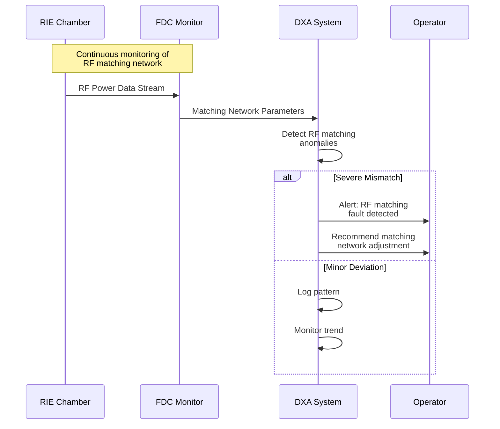
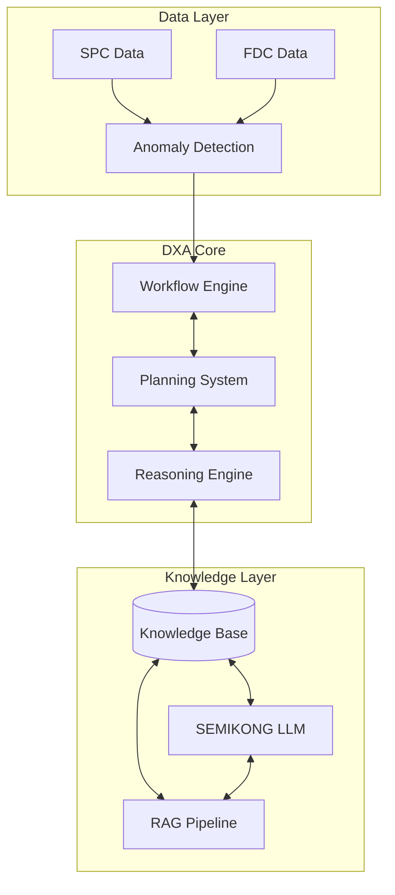
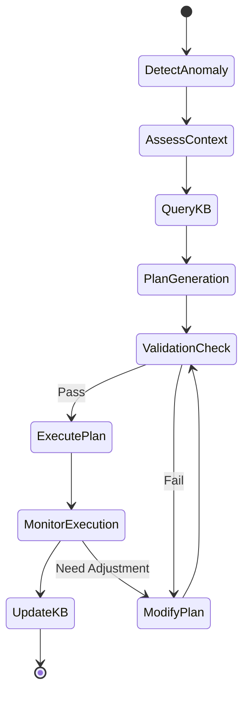
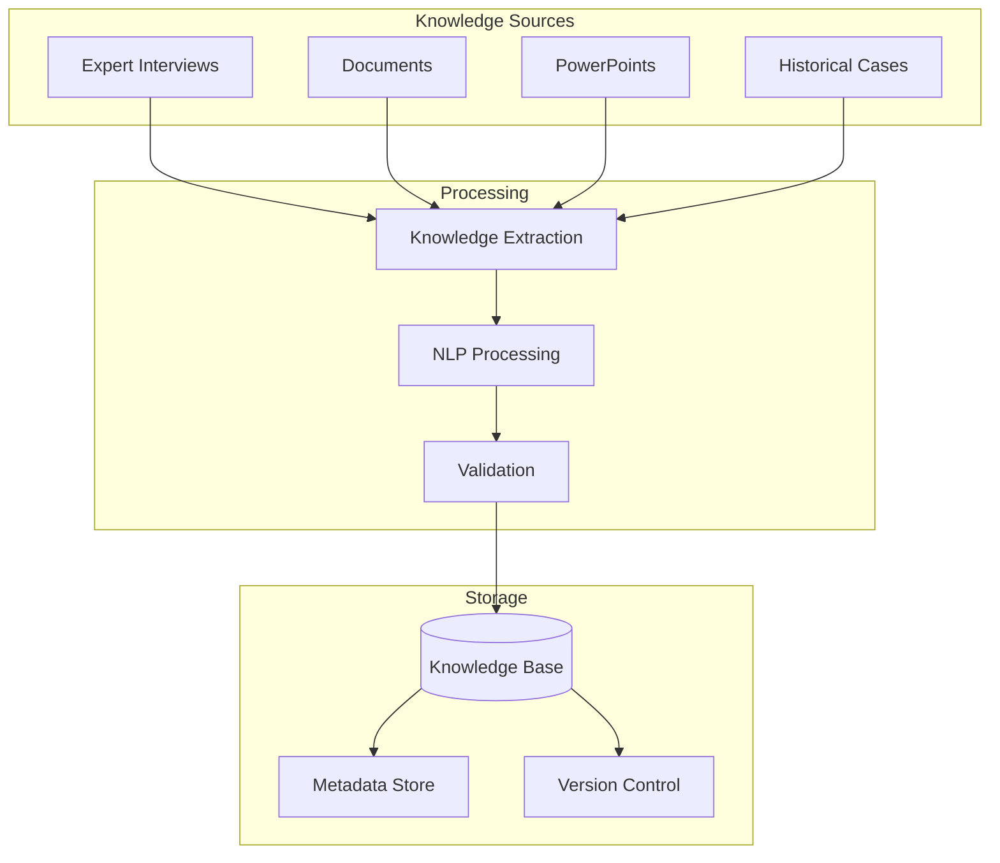
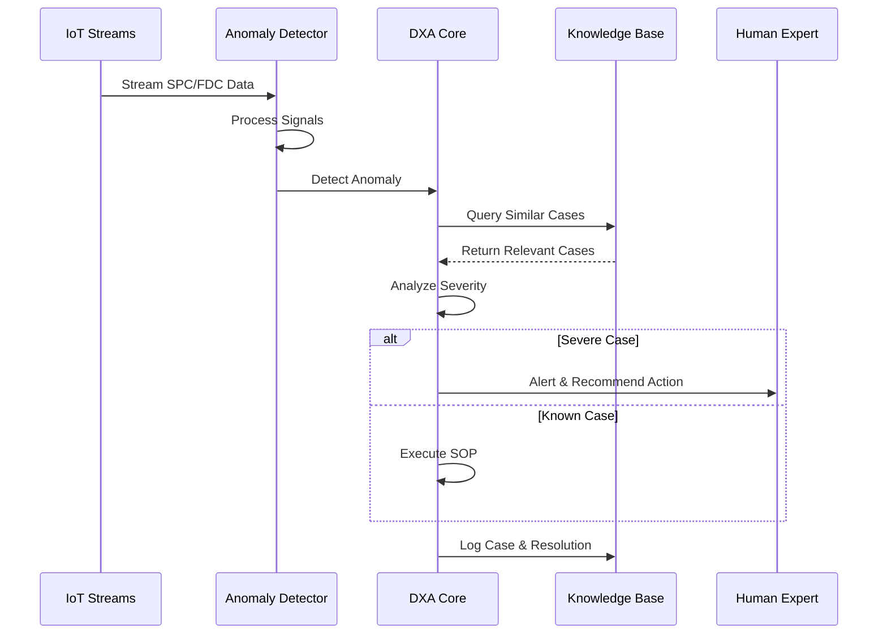

<!-- markdownlint-disable MD041 -->
<!-- markdownlint-disable MD033 -->

  

# Fab Domain Expert Agent (DXA) Requirements

  

## Scenario Overview

The system monitors a single semiconductor etcher (RIE) through continuous SPC and FDC IoT data streams. The Domain Expert Agent (DXA) acts as a 24/7 virtual expert, monitoring for various process issues:

### Critical RIE Parameters & Potential Issues

1. **Plasma Generation & Stability**
   - RF matching network faults
   - Power delivery issues
   - Plasma ignition failures
   - Unstable plasma conditions

2. **Process Chemistry**
   - Gas flow irregularities
   - Gas ratio deviations
   - Mass flow controller (MFC) issues
   - Gas line contamination
   - Reaction byproduct buildup

3. **Chamber Conditions**
   - Pressure control issues
   - Temperature uniformity problems
   - Chamber leak detection
   - Particle contamination
   - Wall coating/polymer buildup
   - O-ring degradation

4. **Wafer Processing**
   - Etch rate variations
   - Uniformity issues
   - Selectivity problems
   - Loading effects
   - Micro-loading effects
   - Pattern dependent etching

5. **Mechanical Systems**
   - Vacuum system failures
   - Wafer handling issues
   - Chuck/ESC problems
   - Cooling system malfunctions
   - Valve operation issues

### DXA Monitoring & Response Capabilities

1. **Real-time Parameter Monitoring**
   - Process parameters (pressure, power, gas flows)
   - Equipment state parameters
   - In-situ measurements where available
   - End-point detection signals

2. **Anomaly Detection Scope**
   - Single parameter deviations
   - Multi-parameter correlations
   - Pattern recognition in time series
   - Process sequence violations
   - Equipment state transitions

3. **Diagnostic Capabilities**
   - Root cause analysis across all subsystems
   - Historical case matching
   - Fault tree analysis
   - Parameter correlation analysis
   - Trend analysis and prediction

  

### Example Scenario: RIE RF Matching Fault Detection

#### Context

- Single RIE chamber operation
- Critical parameters monitored:
  - RF forward/reflected power
  - Matching network positions
  - Chamber pressure
  - Process gas flows
  - Plasma stability indicators

#### Challenge

1. Early Detection
   - Identify process deviations before yield impact
   - Detect subtle parameter drifts across multiple subsystems
   - Recognize complex fault patterns
   - Monitor interdependent parameter relationships

2. Accurate Diagnosis
   - Handle multiple concurrent issues
   - Determine root causes across different subsystems
   - Differentiate between symptoms and causes
   - Account for process history and maintenance state

3. Timely Response
   - Minimize time to diagnosis
   - Prevent unnecessary tool downtime
   - Prioritize issues based on severity
   - Balance quick fixes vs. long-term solutions

4. Knowledge Management
   - Capture tribal knowledge from experts
   - Maintain up-to-date SOPs
   - Learn from historical cases
   - Adapt to process and tool modifications

#### DXA Actions

1. **Continuous Monitoring**
   - Multi-parameter real-time analysis
   - System state tracking
   - Process sequence validation
   - Equipment health monitoring
   - Maintenance schedule integration

2. **Anomaly Detection**
   - Statistical process control
   - Multi-variate analysis
   - Pattern recognition across subsystems
   - Correlation analysis
   - Trend prediction

3. **Diagnosis & Resolution**
   - Systematic fault tree analysis
   - Cross-subsystem correlation
   - Historical case comparison
   - Expert knowledge application
   - SOP selection and execution
   - Escalation path determination

4. **Learning & Optimization**
   - Case history documentation
   - Success/failure tracking
   - SOP effectiveness analysis
   - Knowledge base enrichment
   - Expert feedback integration
   - Continuous model refinement

## Solution Architecture

### 1. Data Monitoring & Anomaly Detection Layer

- Integration with SPC and FDC data streams
- Plug-in architecture for AI/infra team's anomaly detection kernels
- Real-time monitoring and signal processing
- Multi-variate anomaly detection capabilities

### 2. Domain Expert Agent Core

#### 2.1 Workflow Engine

- Flexible workflow design combining expert knowledge and Fab APIs
- Support for multiple concurrent root cause analyses
- Dynamic workflow adaptation based on case context
- Integration with knowledge base for workflow templates

#### 2.2 Planning System

- Automated diagnosis planning
- SOP execution planning
- Resource allocation and scheduling
- Plan adaptation based on feedback

#### 2.3 Reasoning Engine

- Enhanced SEMIKONG LLM integration
- Multi-step reasoning capabilities
- Semantic knowledge base querying
- Uncertainty handling and probabilistic reasoning

### 3. Knowledge Management System

- Semantic Knowledge Base for:
  - Expert knowledge
  - SOPs and procedures
  - Historical cases
  - Workflow templates
  - Domain heuristics
- Flexible knowledge capture with customized templates
- Knowledge editing and version control
- Dynamic knowledge extension through expert interviews

### 4. Enhanced SEMIKONG LLM Integration

- Integration timeline: Complete by 1/31/2025
- Fab domain specialization through fine-tuning
- Components:
  - Data preparation pipeline
  - Model fine-tuning pipeline
  - RAG (Retrieval Augmented Generation) pipeline
- Evaluation and validation framework
- Specific requirements from original doc:
  - SemiKong with Llama 3.3 - 1/31/2025
  - Finetune with current SEMIKONG
  - Finetune specifically with Fab domain know-how (mostly from PowerPoint)
  - New SEMIKONG release date: Before 1/31/2025

## Technical Requirements

### Workflow Capabilities

- Dynamic workflow construction from expert knowledge
- Integration with multiple Fab APIs
- Support for 1-to-many root cause analysis
- Knowledge-based workflow design
- Original workflow requirements:
  - How to build workflows that combine expert interview results with multiple Fab APIs
  - Design elements (workflows, plans, facts, heuristics, conditions) should come from knowledge base

### Reasoning Capabilities

- Enhanced SEMIKONG integration
- Document-based reasoning support
- Raw FDC data anomaly detection
- Causal analysis and inference
- Original reasoning requirements:
  - Based on supporting documents to provide more information about cases
  - Root cause analysis beyond expert interview content
  - Anomaly detection from raw FDC data

### Knowledge Integration

- Flexible knowledge capture mechanisms
- Dynamic question generation for knowledge acquisition
- Knowledge base editing and maintenance
- Domain-specific template customization
- Original knowledge integration requirements:
  - Customized templates for different domain knowledge capture
  - Capability to extend questions based on expert answers
  - Flexibility to edit existing knowledge

## Current Limitations & Challenges

- SEMIKONG's current limitations in Fab domain knowledge (original issue)
- Need for specialized fine-tuning
- Complex integration requirements with existing systems
- Real-time performance requirements

## Success Criteria

- Accurate anomaly detection and classification
- Reduced mean time to diagnosis
- Successful integration with existing Fab systems
- Demonstrable reasoning capabilities
- Effective knowledge capture and utilization

## Workflow Example

## Demo Script (3 minutes)

### Setup (30s)

- RIE process monitoring interface
- Split screen showing:
  - Real-time RF matching data
  - DXA analysis dashboard
  - Plasma stability metrics
  - Knowledge base interface

### Demo Flow

#### 0:00-0:30 - Normal Operation

- Show real-time monitoring of RF matching
- Display key metrics:
  - Forward/reflected power
  - Matching network positions
  - Plasma stability indicators
- Highlight autonomous monitoring by DXA

#### 0:30-1:30 - Drift Detection & Analysis

- Introduce gradual drift in etch rate matching
- DXA performs multi-parameter analysis:
  - Historical pattern matching
  - Cross-chamber correlation
  - Process window validation
  - Root cause determination
- Show real-time reasoning process
- Display drift classification confidence

#### 1:30-2:30 - Automated Response

- DXA generates correction strategy
- Show parameter adjustment calculations
- Demonstrate SOP execution:
  - Safety bound validation
  - Step-by-step workflow
  - Real-time verification
- Display recovery metrics

#### 2:30-3:00 - Learning & Optimization

- Show case capture in knowledge base
- Display optimization metrics:
  - Time to detection
  - Correction accuracy
  - Learning integration
- Demonstrate value vs. manual process

### Interactive Elements

- Parameter trend exploration
- Alternative drift scenarios
- SOP step drill-down
- Knowledge base query interface

### Technical Requirements 2

#### Demo Environment

- Fab equipment simulation
- Real-time FDC/SPC feeds
- DXA reasoning visualization
- Knowledge base interface

#### Visualization Requirements

- Multi-parameter correlation plots
- Chamber matching metrics
- Drift detection confidence
- SOP execution status
- Learning capture display

#### Backup Plans

- Pre-recorded drift scenarios
- Offline analysis results
- Alternative chamber configurations
- Sample learning sequences
