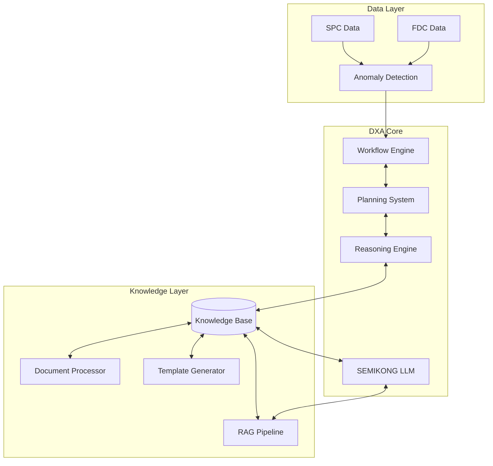

<!-- markdownlint-disable MD041 -->
<!-- markdownlint-disable MD033 -->

  

[Project Overview](../../README.md)

# Fab Domain Expert Agent (DXA) Requirements

## Business/Technical Problem Statement

### Persona
**Michael Chen, Semiconductor Process Engineer**
- 10+ years experience in semiconductor manufacturing
- Responsible for monitoring and troubleshooting RIE (Reactive Ion Etch) equipment
- Must maintain high throughput while ensuring process quality
- Works across multiple tools and process types
- Reports to the Fab Engineering Manager

### Use Case
Michael needs to continuously monitor RIE equipment for process issues and diagnose faults in real-time. He must identify potential problems before they impact production, determine root causes, and recommend appropriate corrective actions to prevent downtime and quality issues.

### Scenario
During a routine process check, Michael notices unusual behavior in one of the RIE tools. He needs to:
1. Review real-time SPC and FDC data from the affected tool
2. Analyze parameter trends for anomalies
3. Identify potential root causes based on historical data
4. Determine if immediate intervention is required
5. Recommend specific corrective actions
6. Document his findings for the maintenance team

Michael is under pressure to diagnose and resolve the issue quickly as the affected tool is critical to the current production lot. He needs a system that can help him monitor complex process data continuously and provide actionable insights when issues arise.

## Scenario Overview

The system monitors a single semiconductor etcher (RIE) through continuous SPC and FDC IoT data streams. The Domain Expert Agent (DXA) acts as a 24/7 virtual expert, monitoring for various process issues:

### Critical RIE Parameters & Potential Issues

1. **Plasma Generation & Stability**
   - RF matching network faults
   - Power delivery issues
   - Plasma ignition failures
   - Unstable plasma conditions

2. **Process Chemistry**
   - Gas flow irregularities
   - Gas ratio deviations
   - Mass flow controller (MFC) issues
   - Gas line contamination
   - Reaction byproduct buildup

3. **Chamber Conditions**
   - Pressure control issues
   - Temperature uniformity problems
   - Chamber leak detection
   - Particle contamination
   - Wall coating/polymer buildup
   - O-ring degradation

4. **Wafer Processing**
   - Etch rate variations
   - Uniformity issues
   - Selectivity problems
   - Loading effects
   - Micro-loading effects
   - Pattern dependent etching

5. **Mechanical Systems**
   - Vacuum system failures
   - Wafer handling issues
   - Chuck/ESC problems
   - Cooling system malfunctions
   - Valve operation issues

### DXA Monitoring & Response Capabilities

1. **Real-time Parameter Monitoring**
   - Process parameters (pressure, power, gas flows)
   - Equipment state parameters
   - In-situ measurements where available
   - End-point detection signals

2. **Anomaly Detection Scope**
   - Single parameter deviations
   - Multi-parameter correlations
   - Pattern recognition in time series
   - Process sequence violations
   - Equipment state transitions

3. **Diagnostic Capabilities**
   - Root cause analysis across all subsystems
   - Historical case matching
   - Fault tree analysis
   - Parameter correlation analysis
   - Trend analysis and prediction

### Example Scenario: RIE RF Matching Fault Detection

#### Context

- Single RIE chamber operation
- Critical parameters monitored:
  - RF forward/reflected power
  - Matching network positions
  - Chamber pressure
  - Process gas flows
  - Plasma stability indicators

#### Challenge

1. Early Detection
   - Identify process deviations before yield impact
   - Detect subtle parameter drifts across multiple subsystems
   - Recognize complex fault patterns
   - Monitor interdependent parameter relationships

2. Accurate Diagnosis
   - Handle multiple concurrent issues
   - Determine root causes across different subsystems
   - Differentiate between symptoms and causes
   - Account for process history and maintenance state

3. Timely Response
   - Minimize time to diagnosis
   - Prevent unnecessary tool downtime
   - Prioritize issues based on severity
   - Balance quick fixes vs. long-term solutions

4. Knowledge Management
   - Capture tribal knowledge from experts
   - Maintain up-to-date SOPs
   - Learn from historical cases
   - Adapt to process and tool modifications

#### DXA Actions

1. **Continuous Monitoring**
   - Multi-parameter real-time analysis
   - System state tracking
   - Process sequence validation
   - Equipment health monitoring
   - Maintenance schedule integration

2. **Anomaly Detection**
   - Statistical process control
   - Multi-variate analysis
   - Pattern recognition across subsystems
   - Correlation analysis
   - Trend prediction

3. **Diagnosis & Resolution**
   - Systematic fault tree analysis
   - Cross-subsystem correlation
   - Historical case comparison
   - Expert knowledge application
   - SOP selection and execution
   - Escalation path determination

4. **Learning & Optimization**
   - Case history documentation
   - Success/failure tracking
   - SOP effectiveness analysis
   - Knowledge base enrichment
   - Expert feedback integration
   - Continuous model refinement

## Solution Architecture

### 1. Data Monitoring & Anomaly Detection Layer

- Raw FDC data structuring and analysis
- Real-time signal processing
- Multi-parameter correlation detection
- Automated threshold adjustment

### 2. DXA Core Components

#### Workflow Engine

- Dynamic workflow construction from expert knowledge
- Integration with multiple Fab APIs
- Support for 1-to-many root cause analysis
- Knowledge-based workflow design
- Autonomous operation capabilities
- Collaborative mode switching

#### Planning System

- Confidence-based execution paths
- Auto-execution criteria
- Expert consultation triggers
- Decision point integration with SEMIKONG

#### Reasoning Engine

- Enhanced SEMIKONG LLM integration
- Document-based reasoning support
- Raw FDC data anomaly detection
- Causal analysis and inference
- Domain-adapted reasoning models

### Knowledge Integration

#### Document Processing

- Flexible knowledge capture mechanisms
- Dynamic template generation
- Expert interview workflow
- Knowledge base editing and maintenance
- Domain-specific template customization

#### Knowledge Validation

- Expert feedback integration
- Case validation workflow
- Learning capture verification
- Knowledge base consistency checks

## Current Limitations & Challenges

- SEMIKONG's current limitations in Fab domain knowledge (original issue)
- Need for specialized fine-tuning
- Complex integration requirements with existing systems
- Real-time performance requirements

## Implementation Timeline

### Phase 1 (v1.0) - Basic DXA: 1/8/2024

- Core monitoring capabilities
- Basic workflow execution
- Initial knowledge base

### Phase 2 (v1.1) - Enhanced Knowledge: 1/31/2024

- Document processing pipeline
- Dynamic template generation
- Expert interview system
- Knowledge validation workflow

### Phase 3 (v1.2) - SEMIKONG Integration: Q1 2024

- LLM decision point integration
- RAG pipeline implementation
- Domain-specific fine-tuning
- Autonomous operation capabilities

## Success Criteria

- Accurate anomaly detection and classification
- Reduced mean time to diagnosis
- Successful integration with existing Fab systems
- Demonstrable reasoning capabilities
- Effective knowledge capture and utilization

## Workflow Example

## Demo Script (3 minutes)

### Setup (30s)

- RIE process monitoring interface
- Split screen showing:
  - Real-time RF matching data
  - DXA analysis dashboard
  - Plasma stability metrics
  - Knowledge base interface

### Demo Flow

#### 0:00-0:30 - Normal Operation

- Show real-time monitoring of RF matching
- Display key metrics:
  - Forward/reflected power
  - Matching network positions
  - Plasma stability indicators
- Highlight autonomous monitoring by DXA

#### 0:30-1:30 - Drift Detection & Analysis

- Introduce gradual drift in etch rate matching
- DXA performs multi-parameter analysis:
  - Historical pattern matching
  - Cross-chamber correlation
  - Process window validation
  - Root cause determination
- Show real-time reasoning process
- Display drift classification confidence

#### 1:30-2:30 - Automated Response

- DXA generates correction strategy
- Show parameter adjustment calculations
- Demonstrate SOP execution:
  - Safety bound validation
  - Step-by-step workflow
  - Real-time verification
- Display recovery metrics

#### 2:30-3:00 - Learning & Optimization

- Show case capture in knowledge base
- Display optimization metrics:
  - Time to detection
  - Correction accuracy
  - Learning integration
- Demonstrate value vs. manual process

### Interactive Elements

- Parameter trend exploration
- Alternative drift scenarios
- SOP step drill-down
- Knowledge base query interface

### Technical Requirements 2

#### Demo Environment

- Fab equipment simulation
- Real-time FDC/SPC feeds
- DXA reasoning visualization
- Knowledge base interface

#### Visualization Requirements

- Multi-parameter correlation plots
- Chamber matching metrics
- Drift detection confidence
- SOP execution status
- Learning capture display

#### Backup Plans

- Pre-recorded drift scenarios
- Offline analysis results
- Alternative chamber configurations
- Sample learning sequences

### Enhanced DXA Capabilities

#### Knowledge Capture System

- Document processing pipeline
- Dynamic template generation
- Expert interview workflow
- Raw data structuring
- Knowledge validation process

#### Operational Modes

1. Autonomous Operation
   - Independent decision making
   - Confidence thresholds
   - Auto-execution criteria

2. Collaborative Operation
   - Expert consultation triggers
   - Knowledge validation workflow
   - Feedback integration

#### SEMIKONG Integration

- Decision point integration
- RAG implementation
- Fine-tuning approach
- Domain adaptation strategy

### Release Schedule

- v1.0: Basic DXA (1/8/2024)
- v1.1: Enhanced knowledge capture (1/31/2024)
- v1.2: SEMIKONG integration (Q1 2024)

---

Copyright © 2025 Aitomatic, Inc. Licensed under the <a href="../../LICENSE.md">MIT License</a>.
 
<a href="https://aitomatic.com">https://aitomatic.com</a>

