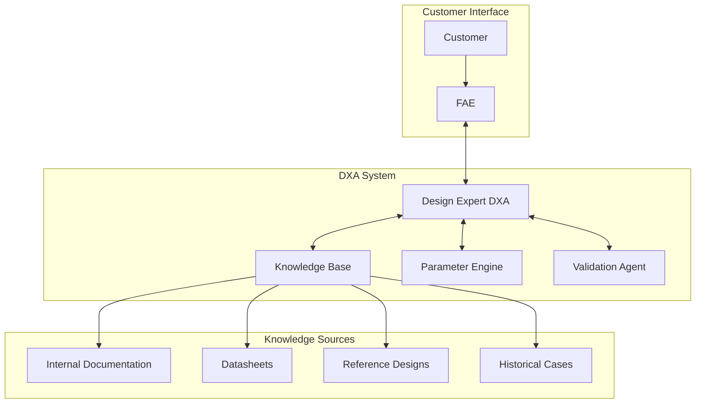
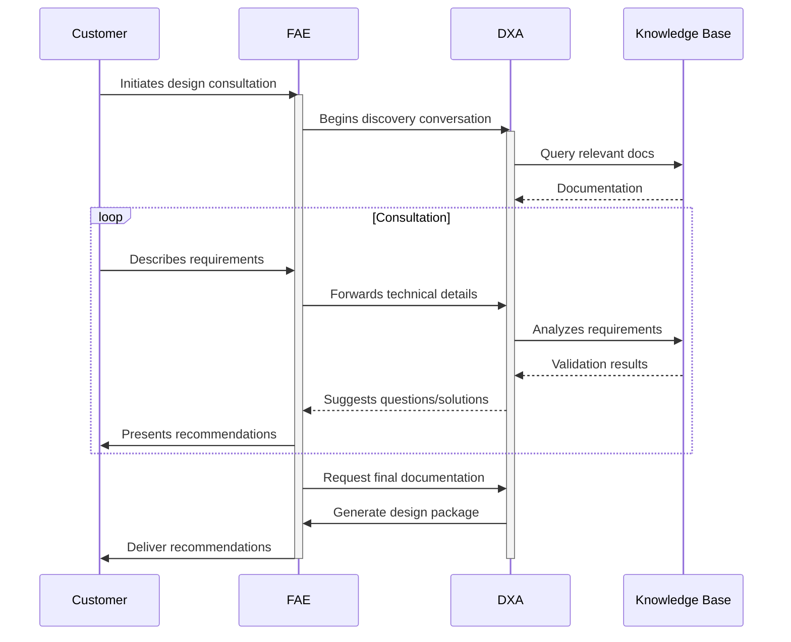
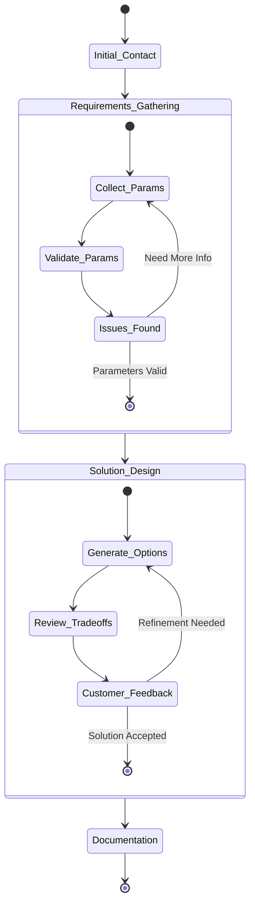

<!-- markdownlint-disable MD041 -->
<!-- markdownlint-disable MD033 -->

  

# Fabless Customer Design Support Scenario

This scenario describes how a Field Application Engineer (FAE), supported by a Domain Expert Agent (DXA), assists customers in successfully implementing IC designs through technical consultation and documentation.

  

## Circuit Design Support Consultation

**Actor:** Field Application Engineer (FAE) + Design Expert DXA  
**Goal:** Guide customer to successful system design implementation using company's IC

### Context

- Customer (circuit/system designer) seeks design guidance
- FAE leads customer interaction via call/web meeting
- DXA has access to:
  - Internal IC documentation and application notes
  - Public datasheets and reference designs
  - Historical design consultations
  - Circuit design expertise knowledge base

  

### System Architecture

### Consultation Process

### Flow

1. Customer initiates design consultation
2. FAE begins discovery conversation
   - DXA actively monitors discussion
   - DXA identifies key design parameters mentioned
3. FAE guides discussion while DXA:
   - Surfaces relevant documentation
   - Suggests technical questions to ask
   - Identifies potential design challenges
4. Customer describes design requirements
   - Operating conditions
   - Performance targets
   - System constraints
5. DXA analyzes requirements in real-time:
   - Validates parameter combinations
   - Flags potential issues
   - Suggests optimal configurations
6. FAE synthesizes DXA insights with expertise:
   - Presents design recommendations
   - Explains trade-offs
   - Provides application examples
7. Interactive problem-solving:
   - Customer asks follow-up questions
   - DXA provides real-time verification
   - FAE translates technical details
8. FAE and DXA collaborate on deliverables:
   - Design recommendations document
   - Reference circuit snippets
   - Parameter calculations
   - Best practices checklist

### Success Criteria

- Customer understands design recommendations
- All critical parameters addressed
- Design approach validated by DXA
- Clear action items documented
- Customer confident in implementation path
- Follow-up requirements identified

### DXA Performance Metrics

- Relevant documentation retrieval speed
- Accuracy of technical recommendations
- Issue prediction success rate
- Knowledge gap identification
- Response latency during live consultation

### Consultation States

## Demo Script (3 minutes)

### Setup (30s)

- Customer consultation interface
- Split screen showing:
  - FAE video conference window
  - DXA analysis dashboard
  - Circuit design workspace
  - Technical documentation viewer

### Demo Flow

#### 0:00-0:30 - Initial Customer Engagement

- Show FAE starting customer consultation
- DXA actively monitoring discussion
- Display real-time parameter identification:
  - Operating conditions
  - Performance targets
  - System constraints
- Highlight automatic documentation retrieval

#### 0:30-1:30 - Technical Analysis

- Customer describes specific design challenge
- DXA performs multi-faceted analysis:
  - Parameter validation
  - Design rule checking
  - Reference design matching
  - Performance optimization
- Show real-time documentation synthesis
- Display design trade-off analysis

#### 1:30-2:30 - Solution Development

- DXA generates design recommendations
- Show interactive optimization process:
  - Parameter adjustment impacts
  - Performance predictions
  - Design margin analysis
- FAE explains trade-offs with DXA support
- Display reference circuit suggestions

#### 2:30-3:00 - Documentation & Follow-up

- Generate consultation summary
- Show automated documentation package:
  - Design recommendations
  - Parameter calculations
  - Reference circuits
  - Best practices checklist
- Highlight knowledge capture for future cases

### Interactive Elements

- Circuit parameter exploration
- Alternative design scenarios
- Documentation drill-down
- Design trade-off visualization

### Technical Requirements

#### Demo Environment

- Video conferencing system
- Circuit design tools
- DXA analysis interface
- Documentation system

#### Visualization Requirements

- Parameter correlation plots
- Design trade-off matrices
- Performance prediction graphs
- Documentation synthesis display
- Knowledge capture interface

#### Backup Plans

- Pre-recorded consultation scenarios
- Offline analysis results
- Sample design challenges
- Alternative solution paths
