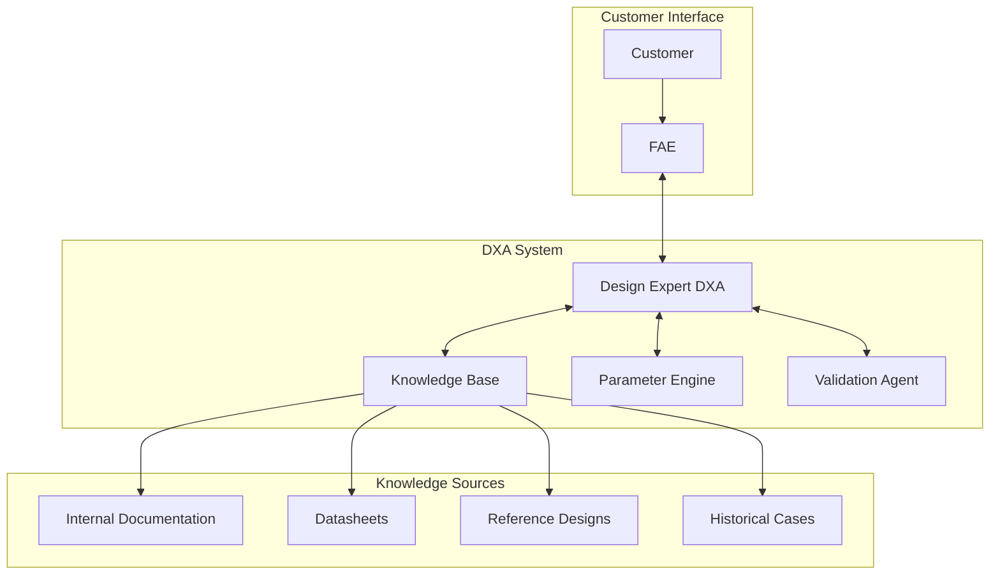
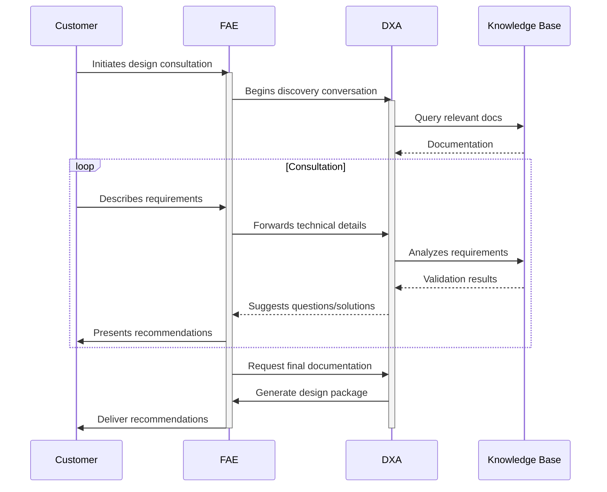
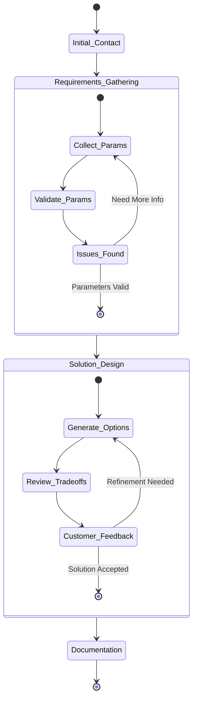

# Fabless Customer Design Support Scenario

This scenario describes how a Field Application Engineer (FAE), supported by a Domain Expert Agent (DXA), assists customers in successfully implementing IC designs through technical consultation and documentation.

## Circuit Design Support Consultation

**Actor:** Field Application Engineer (FAE) + Design Expert DXA  
**Goal:** Guide customer to successful system design implementation using company's IC

### Context

- Customer (circuit/system designer) seeks design guidance
- FAE leads customer interaction via call/web meeting
- DXA has access to:
  - Internal IC documentation and application notes
  - Public datasheets and reference designs
  - Historical design consultations
  - Circuit design expertise knowledge base

### System Architecture

### Consultation Process

### Flow

1. Customer initiates design consultation
2. FAE begins discovery conversation
   - DXA actively monitors discussion
   - DXA identifies key design parameters mentioned
3. FAE guides discussion while DXA:
   - Surfaces relevant documentation
   - Suggests technical questions to ask
   - Identifies potential design challenges
4. Customer describes design requirements
   - Operating conditions
   - Performance targets
   - System constraints
5. DXA analyzes requirements in real-time:
   - Validates parameter combinations
   - Flags potential issues
   - Suggests optimal configurations
6. FAE synthesizes DXA insights with expertise:
   - Presents design recommendations
   - Explains trade-offs
   - Provides application examples
7. Interactive problem-solving:
   - Customer asks follow-up questions
   - DXA provides real-time verification
   - FAE translates technical details
8. FAE and DXA collaborate on deliverables:
   - Design recommendations document
   - Reference circuit snippets
   - Parameter calculations
   - Best practices checklist

### Success Criteria

- Customer understands design recommendations
- All critical parameters addressed
- Design approach validated by DXA
- Clear action items documented
- Customer confident in implementation path
- Follow-up requirements identified

### DXA Performance Metrics

- Relevant documentation retrieval speed
- Accuracy of technical recommendations
- Issue prediction success rate
- Knowledge gap identification
- Response latency during live consultation

### Consultation States

