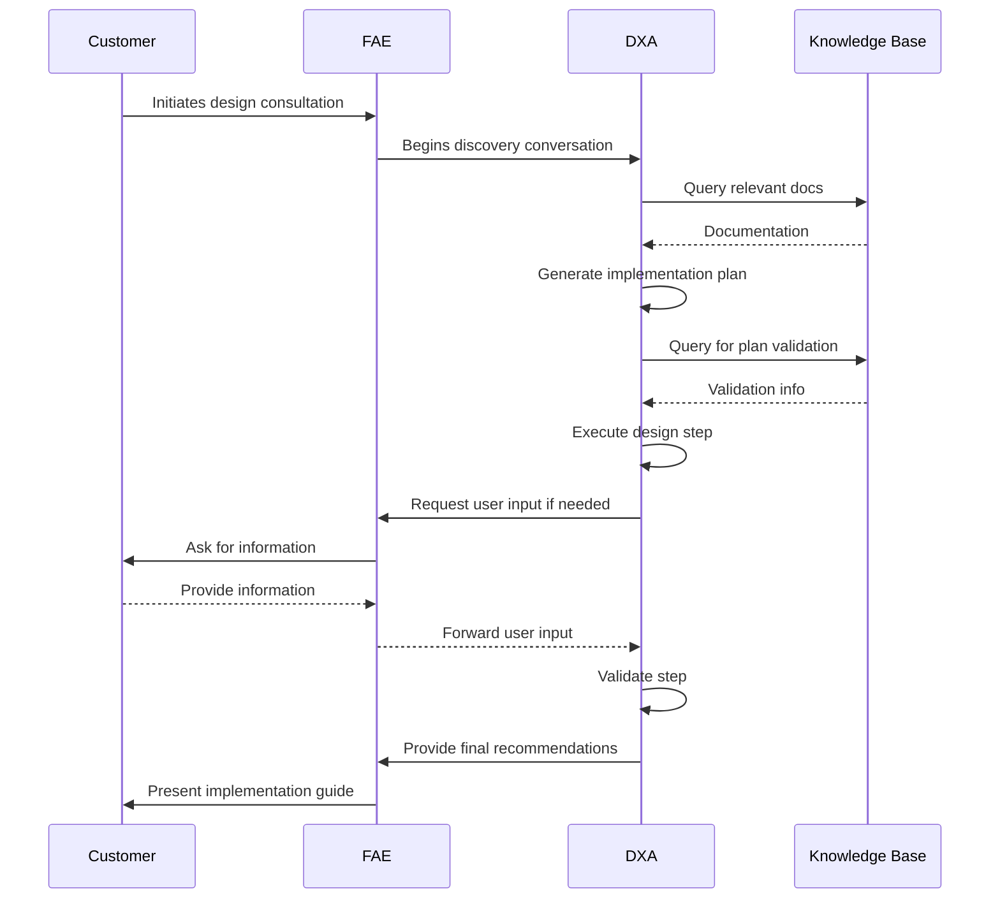
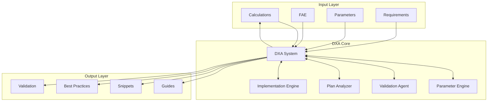

<!-- markdownlint-disable MD041 -->
<!-- markdownlint-disable MD033 -->

  

# Fabless Design Implementation Support Requirements

  

## Business/Technical Problem Statement

### Persona
**Thomas Lee, Field Application Engineer (FAE)**
- 8+ years experience in semiconductor design and implementation
- Responsible for supporting customers in implementing designs with company devices
- Must ensure successful customer implementations while minimizing support time
- Works with multiple customers and product lines
- Reports to the Technical Support Manager

### Use Case
Thomas needs to assist customers in successfully implementing new designs using the company's semiconductor devices. He must provide accurate technical guidance, troubleshoot implementation issues, and ensure customers can effectively use the company's products in their designs.

### Scenario
Thomas receives a support request from a customer who is struggling to implement a new design using the company's latest microcontroller. He needs to:
1. Review the customer's design specifications and implementation plan
2. Identify potential issues or optimization opportunities
3. Analyze compatibility with the company's device requirements
4. Develop a solution or recommendation
5. Provide clear implementation guidance
6. Document the interaction for future reference

Thomas is under pressure to resolve the issue quickly as the customer is on a tight development schedule and needs to get their product to market soon. He needs a system that can help him analyze design specifications, identify potential issues, and provide accurate implementation guidance.

## Scenario Overview

This document describes how a Field Application Engineer (FAE), supported by a Domain Expert Agent (DXA), assists customers in successfully implementing new designs using the company's devices through interactive technical consultation and documentation.

### System Components

1. **Design Support System**
   - Parameter engine
   - Validation agent
   - Plan analyzer
   - Documentation manager
   - Implementation tracker

2. **Knowledge Base**
   - Internal documentation
   - Datasheets
   - Reference designs
   - Historical cases
   - Troubleshooting guides

3. **Analysis Engine**
   - Design validation
   - Parameter optimization
   - Plan generation
   - Step execution
   - Issue resolution

4. **Reporting System**
   - Implementation guide generator
   - Circuit snippet display
   - Parameter calculator
   - Best practices checklist
   - Validation results

### Example Scenario: Design Implementation Process

#### Context

- Fabless design implementation environment
- DXA has access to:
  - Internal device documentation
  - Public datasheets
  - Reference designs
  - Historical consultations
  - Troubleshooting guides

#### Challenge

1. Accurate Implementation
   - Validate design parameters
   - Generate feasible plans
   - Execute design steps
   - Resolve issues
   - Document solutions

2. Timely Response
   - Quick parameter validation
   - Rapid plan generation
   - Fast issue resolution
   - Immediate guidance
   - Clear documentation

3. Knowledge Integration
   - Access internal docs
   - Use public resources
   - Apply best practices
   - Share historical cases
   - Update knowledge base

#### DXA Actions

1. **Design Support**
   - Validate parameters
   - Generate plans
   - Execute steps
   - Resolve issues
   - Document solutions

2. **Implementation Guidance**
   - Provide recommendations
   - Calculate parameters
   - Show circuit snippets
   - List best practices
   - Track progress

## Solution Architecture

### 1. Input Components

- Customer interface
- FAE interface
- Parameter inputs
- Requirement specs

### 2. DXA Core Components

#### Parameter Engine

- Parameter validation
- Optimization
- Calculation
- Verification

#### Plan Analyzer

- Plan generation
- Feasibility check
- Step validation
- Issue detection

#### Implementation Engine

- Step execution
- Progress tracking
- Issue resolution
- Documentation

### Integration Details

#### System Integration

- Customer systems
- FAE tools
- Documentation systems
- Knowledge bases

#### Knowledge Integration

- Internal docs
- Public resources
- Historical cases
- Best practices

## Success Criteria

- Customer understands implementation recommendations
- All critical parameters addressed
- Design approach validated by DXA
- Clear action items documented
- Customer confident in implementation path
- Follow-up requirements identified
- Implementation plan successfully executed
- All design steps validated

## Performance Metrics

- Relevant documentation retrieval speed
- Accuracy of technical recommendations
- Issue prediction success rate
- Knowledge gap identification
- Response latency during live consultation
- Plan generation efficiency
- Step execution success rate
- Implementation completion time
