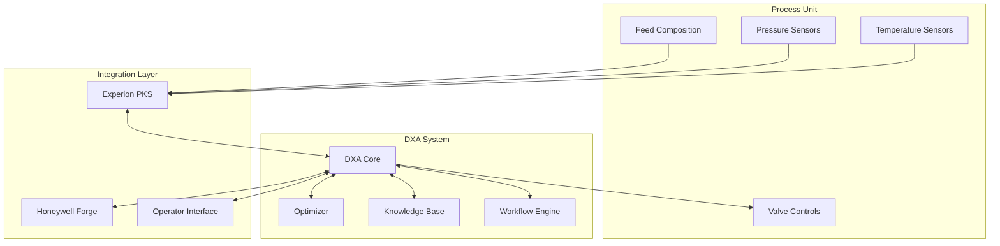
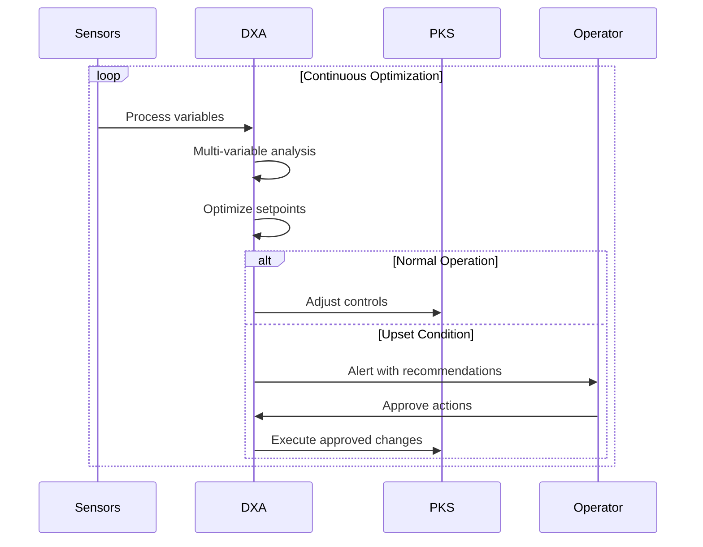
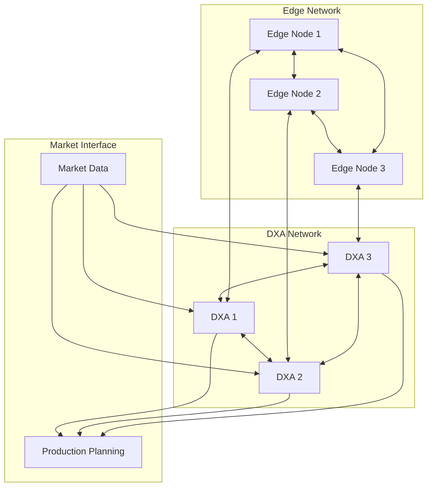
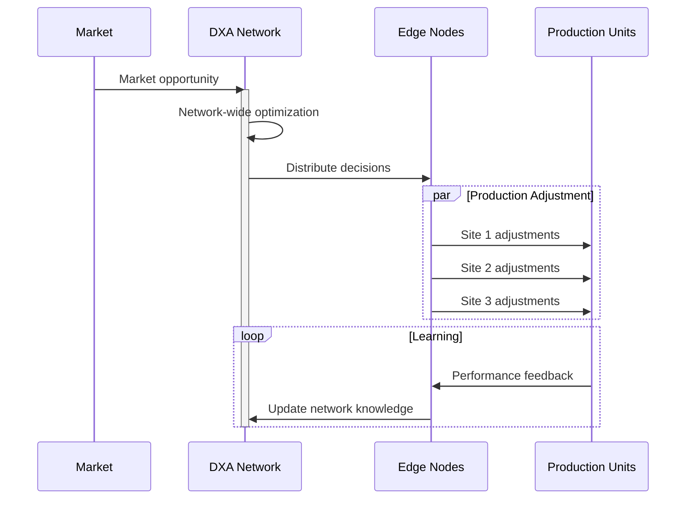

# Industrial Automation DXA Scenarios

This document describes two interconnected scenarios demonstrating how Domain Expert Agents (DXAs) enable autonomous industrial operations at both unit and network levels.

## Scenario 1: Distillation Column DXA

### Context

- Real-time distillation column optimization environment
- DXA has access to:
  - Multi-variable process data streams
  - Experion PKS integration
  - Honeywell Forge platform
  - Historical operating patterns
  - Process engineering knowledge base
  - Standard operating procedures

### System Architecture

### Optimization Process

### Success Criteria

- 25-40% performance improvement over manual operation
- Microsecond control decisions
- Automated upset condition handling
- Seamless Experion PKS integration
- Clear optimization metrics visualization

## Scenario 2: Autonomous Plant Network

### Context 2

- Multi-site process operations network
- Edge-to-edge intelligence framework
- DXA network has access to:
  - Real-time market data
  - Cross-plant production capabilities
  - Site-specific constraints
  - Network-wide optimization objectives
  - Inter-plant material flows

### System Architecture 2

### Network Orchestration Process

### Success Criteria 2

- 2ms response time for edge decisions
- 98% edge processing ratio
- Autonomous cross-plant optimization
- Market-responsive production
- Demonstrable value creation

### DXA Performance Metrics

#### Scenario 1 (Column)

- Optimization cycle time
- Product quality variance
- Energy efficiency improvement
- Upset condition recovery time
- Operator acceptance rate

#### Scenario 2 (Network)

- Edge response latency
- Cross-plant learning rate
- Market opportunity capture
- Network resilience
- Value creation metrics

### Key Capabilities

#### Scenario 1 (Column) 2

- Multi-variable process optimization
- Real-time control adaptation
- Expert-level reasoning
- Workflow automation
- Production planning
- Operator augmentation

#### Scenario 2 (Network) 2

- Edge-to-edge communication
- Distributed learning
- Market-driven optimization
- Cross-plant orchestration
- Autonomous decision-making
- Value stream creation

## Demo Scripts

### Scenario 1: Distillation Column DXA Demo (3 minutes)

#### Setup (30s)

- Live view of distillation column digital twin
- Split screen showing:
  - Process visualization (temperature, pressure, feed profiles)
  - DXA interface with real-time optimization metrics
  - Historical performance comparison chart

#### Demo Flow

##### 0:00-0:30 - Normal Operation

- Show DXA monitoring multiple process variables
- Highlight microsecond optimization decisions
- Display performance improvement metrics (25-40% better than manual)

##### 0:30-1:30 - Upset Condition Response

- Introduce feed composition disruption
- DXA detects deviation and analyzes impact
- Show expert-level reasoning process:
  - Pattern recognition from historical cases
  - Multi-variable impact analysis
  - Generation of corrective actions
- Display recommendations to operator

##### 1:30-2:30 - Automated Recovery

- Operator approves DXA recommendations
- Show automated workflow execution
- Display real-time recovery metrics
- Highlight learning capture for knowledge base

##### 2:30-3:00 - Value Summary

- Quick replay of key metrics
- Comparison with traditional operator response
- Display of economic benefits

### Scenario 2: Autonomous Plant Network Demo (4 minutes)

#### Setup (30s) 2

- Network visualization showing three plant sites
- Market data feed display
- Edge processing metrics dashboard
- Cross-plant material flow visualization

#### Demo Flow 2

##### 0:00-1:00 - Network Baseline

- Show normal operations across three sites
- Display edge processing metrics (2ms response time)
- Highlight autonomous communication patterns
- Demonstrate 98% edge vs. cloud processing ratio

##### 1:00-2:00 - Market Opportunity

- Introduce sudden market price change
- Show real-time detection and analysis
- Demonstrate network-wide optimization:
  - Cross-plant capacity assessment
  - Transport logistics consideration
  - Production constraint analysis

##### 2:00-3:00 - Autonomous Response

- Display coordinated production shifts
- Show edge-to-edge learning process
- Highlight autonomous decision execution
- Display value capture metrics

##### 3:00-4:00 - Strategic Impact

- Show accumulated learning across network
- Display economic value creation
- Highlight cloud independence
- Demonstrate defensive moat vs cloud providers

#### Interactive Elements

Both demos should include:

- Pause points for audience questions
- Drill-down capabilities into key metrics
- Alternative scenario exploration options
- Clear connection to customer pain points

#### Technical Requirements

##### Demo Environment

- Digital twin simulation environment
- Real-time data streaming capability
- Sub-millisecond visualization updates
- Interactive control capabilities

##### Visualization Requirements

- Process KPI dashboards
- Real-time optimization metrics
- Economic value calculations
- Network status indicators
- Edge processing statistics

##### Backup Plans

- Recorded scenarios for backup
- Offline data for pattern demonstration
- Alternative network configurations
- Pre-calculated optimization results
