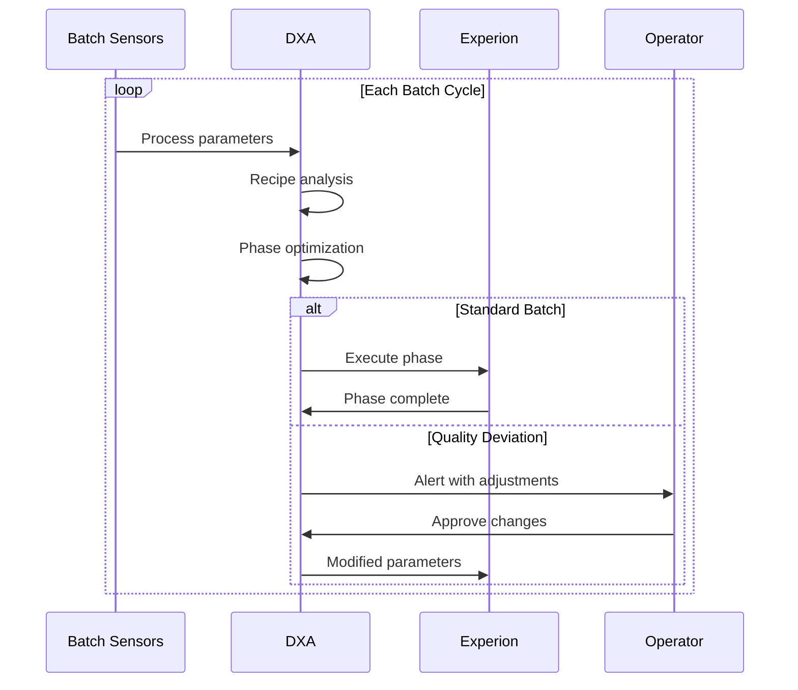

<!-- markdownlint-disable MD041 -->
<!-- markdownlint-disable MD033 -->

  

# Industrial Automation DXA Scenarios: Batch Processing

This document describes two interconnected scenarios demonstrating how Domain Expert Agents (DXAs) enable autonomous batch operations at both unit and network levels, focusing on specialty chemicals manufacturing.

<!-- markdownlint-disable-next-line no-inline-images -->

    

## Scenario 1: Batch Process DXA

### Context

- Specialty chemicals batch process optimization environment
- DXA has access to:
  - Multi-variable batch data streams
  - Experion Batch execution system
  - Honeywell Forge platform
  - Historical batch records
  - Master recipe database
  - Standard operating procedures
  - Batch quality parameters
  - Clean-in-place procedures

    
     
    Batch Process: Reactor and Distillation Column Configuration

### System Architecture

### Optimization Process

### Success Criteria

- 30% reduction in batch cycle time
- 25% improvement in product quality consistency
- 40% reduction in operator interventions
- Zero failed batches
- Real-time recipe optimization
- Automated phase transitions
- Clear batch progression visualization

## Scenario 2: Autonomous Batch Network

### Context 2

- Multi-site batch production network
- Edge-to-edge recipe intelligence
- DXA network has access to:
  - Real-time market demand
  - Cross-plant recipe variations
  - Site-specific equipment constraints
  - Network-wide quality standards
  - Raw material availability
  - Customer order queue

### System Architecture 2

### Network Orchestration

### Success Criteria 2

- 2ms edge decision time
- 98% edge processing
- Cross-plant recipe optimization
- Market-responsive scheduling
- Zero recipe IP exposure
- Network-wide quality consistency

### DXA Performance Metrics

#### Scenario 1 (Single Batch)

- Batch cycle time
- Product quality consistency
- Energy per batch
- Raw material utilization
- First-time-right rate
- Operator intervention rate

#### Scenario 2 (Network)

- Recipe transfer success
- Cross-plant learning rate
- Order fulfillment speed
- Network capacity utilization
- Quality consistency across sites
- Recipe IP protection

### Key Capabilities

#### Scenario 1 (Batch Unit)

- Recipe optimization
- Real-time batch monitoring
- Phase transition management
- Quality prediction
- Clean-in-place optimization
- Operator guidance

#### Scenario 2 (Network) 2

- Edge-to-edge recipe sharing
- Distributed batch scheduling
- Market-driven production
- Cross-plant recipe optimization
- Equipment-specific adaptation
- Quality standardization

## Demo Scripts

### Scenario 1: Batch Process DXA Demo (3 minutes)

#### Setup (30s)

- Live view of batch reactor digital twin
- Split screen showing:
  - Batch phase progression
  - Quality parameter trends
  - DXA optimization metrics
  - Historical batch comparison

#### Demo Flow

##### 0:00-0:30 - Normal Operation

- Show DXA monitoring batch progression
- Highlight automated phase transitions
- Display quality prediction metrics
- Show operator augmentation features

##### 0:30-1:30 - Quality Deviation Response

- Introduce raw material variation
- DXA detects quality drift
- Show expert-level reasoning:
  - Recipe adjustment calculation
  - Impact prediction
  - Correction strategy
- Display operator recommendations

##### 1:30-2:30 - Recovery Execution

- Operator approves adjustments
- Show recipe modification
- Display recovery trajectory
- Highlight knowledge capture

##### 2:30-3:00 - Value Summary

- Batch cycle time reduction
- Quality improvement metrics
- Operator efficiency gains
- Economic impact calculation

### Scenario 2: Autonomous Batch Network Demo (4 minutes)

#### Setup (30s) 2

- Network view of three production sites
- Order management dashboard
- Recipe transfer visualization
- Quality consistency metrics

#### Demo Flow 2

##### 0:00-1:00 - Network Operations

- Show parallel batch executions
- Display edge processing metrics
- Demonstrate recipe sharing
- Show quality consistency

##### 1:00-2:00 - Market Response

- Introduce rush customer order
- Show network capacity analysis
- Demonstrate schedule optimization
- Display recipe transfer

##### 2:00-3:00 - Network Execution

- Show coordinated production
- Display recipe adaptations
- Highlight quality maintenance
- Show order fulfillment tracking

##### 3:00-4:00 - Strategic Benefits

- Display network learning metrics
- Show economic improvements
- Highlight IP protection
- Demonstrate cloud independence

#### Interactive Elements

- Batch phase deep-dives
- Recipe comparison views
- Quality trend analysis
- Network loading scenarios

#### Technical Requirements

##### Demo Environment

- Batch process simulation
- Real-time data streams
- Recipe management system
- Quality prediction engine

##### Visualization Requirements

- Batch progression indicators
- Quality parameter trends
- Recipe version control
- Network synchronization status
- Edge processing metrics

##### Backup Plans

- Pre-recorded batch cycles
- Offline recipe databases
- Alternative quality scenarios
- Stored optimization results
