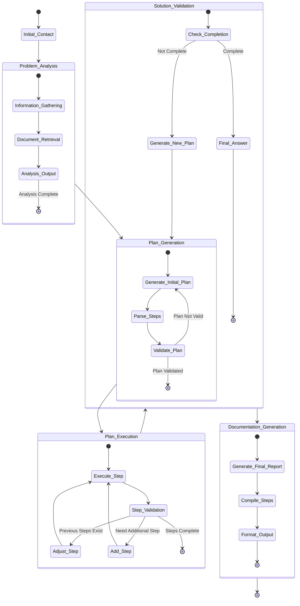
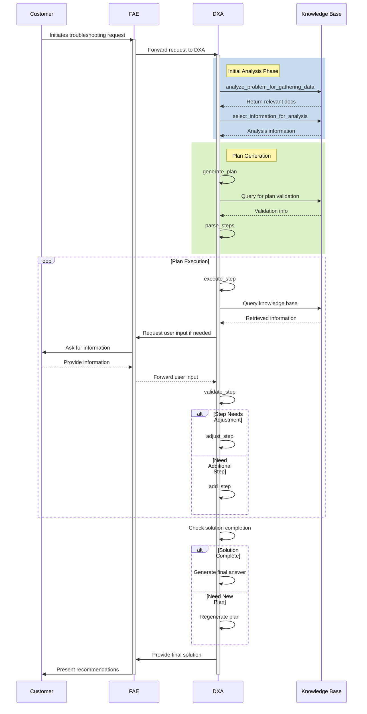

<!-- markdownlint-disable MD041 -->
<!-- markdownlint-disable MD033 -->

  

# FAE Customer Device Troubleshooting Scenario

This scenario describes how a Field Application Engineer (FAE), supported by a Domain Expert Agent (DXA), assists customers in troubleshooting device issues through technical consultation and documentation.

## Device Troubleshooting Consultation

**Actor:** Field Application Engineer (FAE) + Troubleshooting Expert DXA  
**Goal:** Guide customer to successfully resolve device issues using company's expertise

### Context

- Customer (device/system user) seeks troubleshooting guidance
- FAE leads customer interaction via call/web meeting
- DXA has access to:
  - Internal troubleshooting documentation and application notes
  - Public datasheets and troubleshooting guides
  - Historical troubleshooting consultations
  - Device troubleshooting expertise knowledge base

  

### System Architecture

### Consultation Process

### Flow

#### Customer Initiates Request

Submits troubleshooting request through FAE
Provides initial problem description

#### DXA Performs Initial Analysis

Gathers information from knowledge base
Retrieves relevant documentation
Processes initial problem statement
Analyzes document relevancy for the case

#### DXA Generates Action Plan

Creates structured troubleshooting steps
Validates plan feasibility
Ensures steps are executable
Sets expected outputs for each step

#### FAE and DXA Execute Plan

Processes each step sequentially
Validates step outputs
Adjusts steps based on previous results
Adds new steps if needed

#### Interactive Information Gathering

FAE requests specific information from customer
Customer provides required details
DXA validates user inputs
Adjusts analysis based on new information

#### Solution Development

DXA processes accumulated information
Validates solution completeness
Regenerates plan if needed
Confirms solution viability

#### Documentation Generation

Compiles step results
Formats final output
Generates recommendations
Creates comprehensive report

#### Solution Delivery

FAE presents final recommendations
Reviews implementation steps
Ensures customer understanding
Documents follow-up items

#### Success Criteria

All execution steps completed successfully
Solution validated by DXA
Clear documentation generated
Required user inputs obtained
Plan execution completed within threshold attempts
Solution matches original request requirements

#### DXA Performance Metrics

Number of plan regeneration attempts
Step execution success rate
Document retrieval accuracy
Information gathering efficiency
Plan validation success rate
Response time for each step
Solution completion time

#### System Constraints

Maximum step limit (MAX_STEP);
Plan regeneration threshold;
Question matching threshold;
Document retrieval limits;
Execution timeout parameters.

## Demo Flow

### 0:00-0:30 - Initial Problem Analysis
- FAE receives customer troubleshooting request
- DXA begins information gathering:
  - Real-time document retrieval
  - Context analysis activation
  - Knowledge base querying
- Display automatic parameter extraction:
  - Device configurations
  - Error conditions
  - System status

### 0:30-1:30 - Troubleshooting Process
- Customer describes device issues
- DXA executes analysis pipeline:
  - Problem decomposition
  - Step validation
  - Plan generation and parsing
  - Solution path identification
- Show dynamic plan adjustment:
  - Step refinement
  - Execution validation
  - Knowledge base correlation

### 1:30-2:30 - Interactive Resolution
- DXA generates solution recommendations:
  - Step-by-step execution
  - Real-time validation
  - Plan adjustment based on feedback
- Demonstrate adaptive workflow:
  - Information request handling
  - User input processing
  - Solution verification
- Display solution optimization

### 2:30-3:00 - Documentation Generation
- Generate final solution package:
  - Troubleshooting steps taken
  - Validation results
  - Recommended actions
  - Best practices applied
- Show automated report compilation

## Interactive Features
- Real-time plan adjustment
- Dynamic step validation
- Information request handling
- Solution verification workflow

## Technical Requirements

### Demo Environment
- Troubleshooting console interface
- DXA analysis system
- Knowledge base integration
- Real-time reporting system

### Visualization Components
- Problem analysis dashboard
- Step execution monitor
- Documentation generation preview
- Solution validation display

### Backup Scenarios
- Pre-configured test cases
- Offline troubleshooting workflows
- Sample device issues
- Alternative solution paths

## Error Handling
- Plan regeneration demonstration
- Step adjustment scenarios
- Invalid input recovery
- Threshold management examples

## Key Highlights
- Real-time document retrieval
- Dynamic plan generation
- Interactive step execution
- Automated solution validation
- Comprehensive documentation
