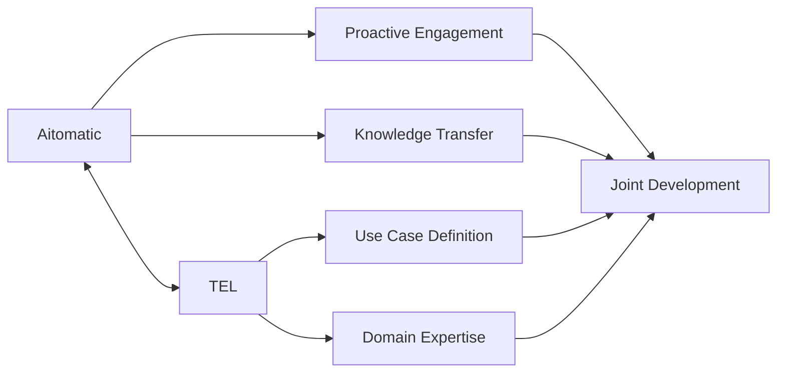
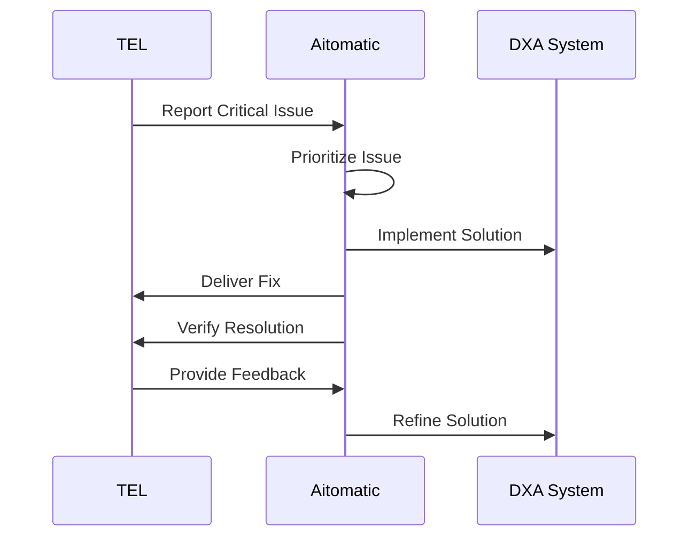
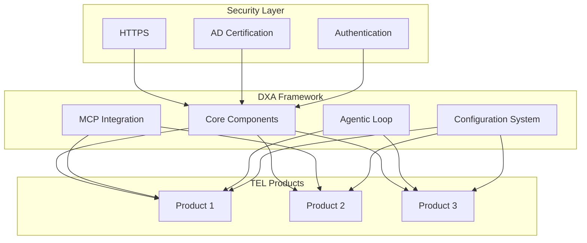
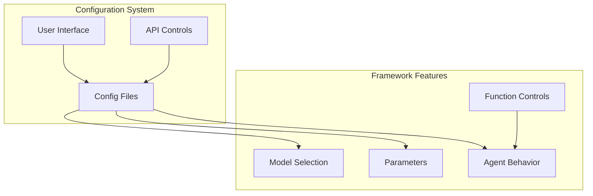
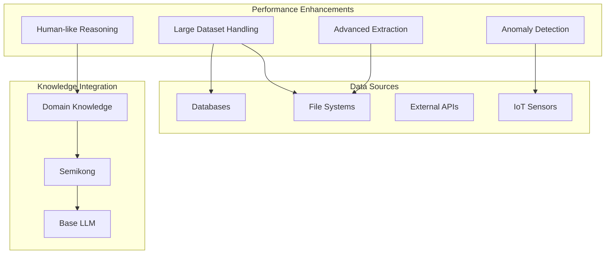
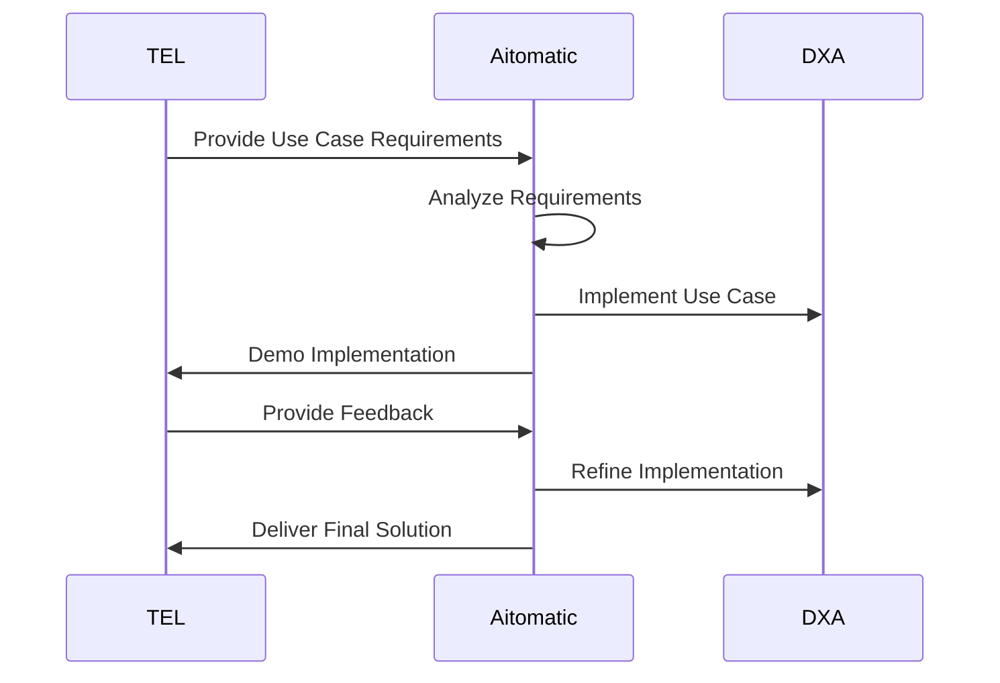
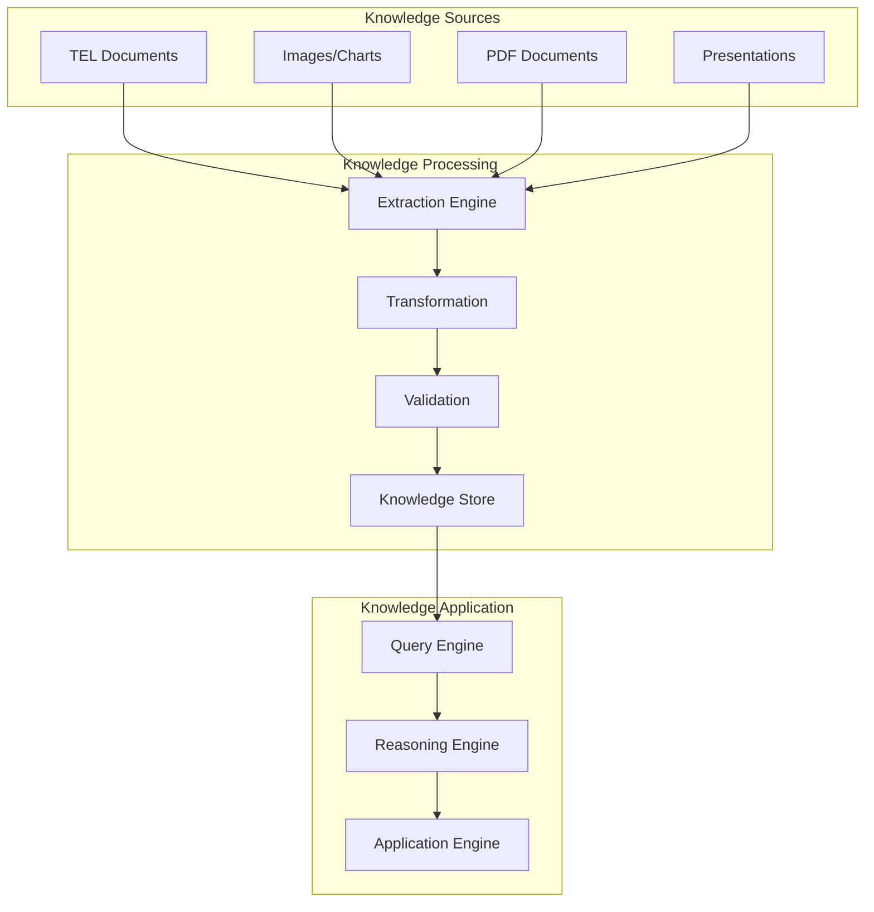
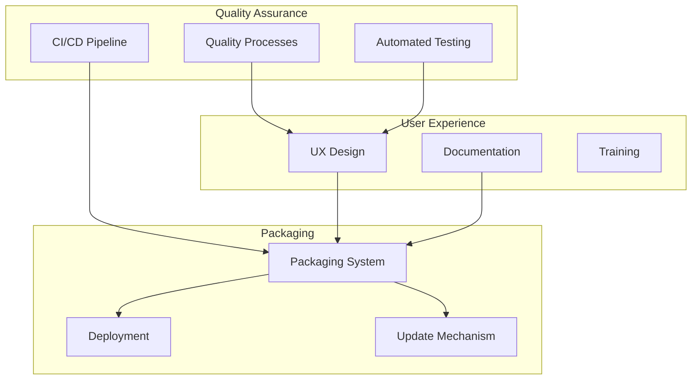
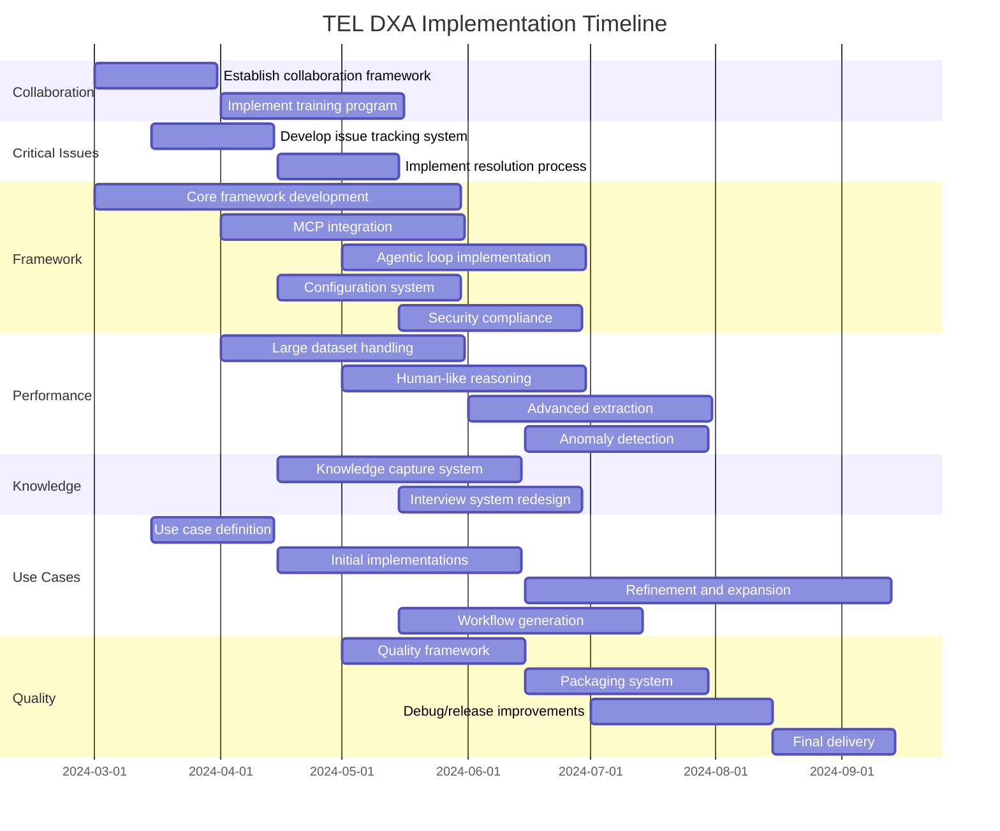

<!-- markdownlint-disable MD041 -->
<!-- markdownlint-disable MD033 -->

  

# Tokyo Electron (TEL) DXA Requirements

  

## Scenario Overview

This document outlines the requirements for the Domain Expert Agent (DXA) implementation with Tokyo Electron (TEL), focusing on collaboration, framework integration, and product development. The requirements are organized by priority based on value/effort ratio.

## Strategic Priorities

### 1. Enhanced Collaboration (Value/Effort: 4.2)

#### Key Requirements:
- **Improve collaboration with more proactive engagement** (Value/Effort: 4.2)
  - Establish regular touchpoints with TEL teams
  - Anticipate needs and challenges before they become issues
  - Provide timely updates on development progress
  - Create more proactive partnership with TEL teams

- **Establish closer collaboration with TEL** (Value/Effort: 4.2)
  - Create joint development teams with clear roles and responsibilities
  - Implement shared project management tools and processes
  - Develop communication protocols for efficient information exchange

- **Lead and educate/train TEL team on DXA** (Value/Effort: 2.6)
  - Develop comprehensive training materials for DXA framework
  - Conduct regular knowledge transfer sessions
  - Create documentation tailored to TEL's specific needs and use cases
  - Better educate TEL teams to use and develop with DXA

### 2. Critical Issue Resolution (Value/Effort: 2.7)

#### Key Requirements:
- **Focus on addressing the most CRITICAL issues from Bug Reports** (Value/Effort: 2.7)
  - Implement a severity-based prioritization system
  - Establish SLAs for critical issue resolution
  - Create a transparent tracking system for issue resolution progress
  - Address API bugs with retrieving agents from workspaces

- **Closer collaboration with different style to solve day-to-day issues** (Value/Effort: 2.5)
  - Develop an agile response team for rapid issue resolution
  - Implement daily stand-ups during critical issue periods
  - Create escalation paths for urgent matters

### 3. Framework Integration and Development (Value/Effort: 2.5)

#### Key Requirements:
- **Bring DXA Framework to core of product** (Value/Effort: 2.5)
  - Identify integration points within TEL's existing product architecture
  - Develop modular components that can be easily incorporated
  - Create APIs that align with TEL's development standards

- **Deliver DXA Framework with MCP** (Value/Effort: 4.4)
  - Ensure seamless integration between DXA and MCP components
  - Develop comprehensive documentation for MCP integration
  - Create reference implementations for common use cases
  - Implement Message Communication Protocol for efficient data exchange

- **Implement the "Agentic Loop" in DXA Framework** (Value/Effort: 4.0)
  - Design and implement the complete agentic loop architecture
  - Develop monitoring and feedback mechanisms
  - Create tools for visualizing and debugging the agentic loop

- **Security Compliance**
  - Better address security policies including HTTPS implementation
  - Support AD certification for enterprise environments
  - Implement secure authentication mechanisms

### 4. Framework Usability and Configuration (Value/Effort: 2.0)

#### Key Requirements:
- **Function Clarity**
  - Provide better explanations of purpose and effects of functions
  - Create comprehensive documentation for all framework functions
  - Develop visual representations of function relationships

- **Agent Behavior**
  - Provide clearer understanding of how configurations affect agent behavior
  - Create configuration guides with examples of behavior changes
  - Develop testing tools to validate behavior changes

- **Customization**
  - Enable configuration changes without Docker image deployment
  - Create hot-reload capabilities for configuration changes
  - Develop configuration management system

- **Model Switching**
  - Allow changing models via configuration files
  - Support multiple model configurations simultaneously
  - Create model performance comparison tools

### 5. Performance and Capability Improvements (Value/Effort: 1.3)

#### Key Requirements:
- **Large Dataset Handling**
  - Improve performance with 40,000+ entries/100MB+ datasets
  - Implement efficient data processing algorithms
  - Create data chunking and streaming capabilities
  - Develop memory optimization techniques

- **Human-like Reasoning**
  - Develop methods that better imitate human thinking processes
  - Implement multi-step reasoning capabilities
  - Create explanation generation for reasoning steps
  - Develop validation mechanisms for reasoning quality

- **Data Source Connectivity**
  - Connect with any kind of data source inside TEL environments
  - Develop universal connector framework
  - Create data transformation pipelines
  - Implement secure authentication for data sources

- **Advanced Extraction** (Value/Effort: 1.2)
  - Enable extraction from images and similar formats
  - Implement chart and diagram recognition
  - Develop PDF parsing with layout understanding
  - Create PowerPoint slide extraction capabilities

- **Anomaly Detection** (Value/Effort: 1.0)
  - Implement independent anomaly detection without relying on external APIs
  - Develop multiple anomaly detection algorithms
  - Create visualization tools for detected anomalies
  - Implement feedback mechanism for false positives/negatives

- **Knowledge Integration** (Value/Effort: 0.8)
  - Improve SemiKong performance with domain-specific knowledge
  - Implement domain adaptation techniques
  - Create comprehensive evaluation framework
  - Develop continuous improvement mechanisms

### 6. Use Case Development (Value/Effort: 2.4)

#### Key Requirements:
- **Involve TEL more closely to develop with their use-cases** (Value/Effort: 2.4)
  - Establish a use case development process with TEL stakeholders
  - Create a repository of prioritized use cases
  - Implement regular review cycles for use case implementation

- **Deliver framework/product at the right timing with their use-cases** (Value/Effort: 2.0)
  - Align development roadmap with TEL's business cycles
  - Create phased delivery plan based on use case priorities
  - Implement feedback loops to adjust timing as needed

- **Deliver workable product based on TEL use cases** (Value/Effort: 1.4)
  - Develop minimum viable products for each key use case
  - Implement iterative development cycles with regular demos
  - Create success metrics for each use case implementation

- **Workflow Generation** (Value/Effort: 1.3)
  - Enable generation of workflows beyond basic checking functions
  - Implement more sophisticated workflow patterns
  - Create workflow validation mechanisms
  - Develop workflow optimization capabilities

### 7. Knowledge Management and Capture (Value/Effort: 1.4)

#### Key Requirements:
- **Knowledge Capture** (Value/Effort: 1.4)
  - Better extraction of knowledge & workflow from existing documents
  - Develop document processing pipeline
  - Create knowledge extraction algorithms
  - Implement workflow identification and extraction
  - Design knowledge validation mechanisms

- **Fixed Templates** (Value/Effort: 1.0)
  - Make Knowledge Interview more flexible without un-skippable fixed templates
  - Redesign interview template to be more flexible
  - Implement skippable sections
  - Create customizable interview flows
  - Develop better UI/UX for interview process

### 8. Product Quality and Experience (Value/Effort: 1.7)

#### Key Requirements:
- **Improve collaboration & product quality** (Value/Effort: 1.7)
  - Implement comprehensive quality assurance processes
  - Develop automated testing frameworks
  - Create quality metrics and dashboards

- **Packaging and smooth experience for using and updating** (Value/Effort: 1.5)
  - Design intuitive packaging system for DXA components
  - Implement seamless update mechanisms
  - Create user-friendly installation and configuration processes
  - Reduce integration effort with actual data

- **Debug/Release Cycle** (Value/Effort: 1.7)
  - Streamline development and release processes
  - Implement automated testing frameworks
  - Create efficient debugging tools
  - Design incremental release strategy
  - Develop better integration testing with actual data

- **Effective work on use cases with Framework and various features** (Value/Effort: 1.0)
  - Develop feature prioritization framework
  - Create feature development roadmap aligned with use cases
  - Implement feature tracking and measurement system

## Implementation Timeline

## Success Metrics

### Collaboration Effectiveness
- Regular engagement cadence established and maintained
- Knowledge transfer sessions completed with high satisfaction scores
- Reduction in communication-related issues
- Increased TEL team participation in development process

### Issue Resolution
- Critical issues resolved within established SLAs
- Reduction in recurring issues
- Positive feedback from TEL on resolution process
- API bugs successfully addressed

### Framework Integration
- DXA successfully integrated into TEL's core products
- MCP integration completed and validated
- Agentic loop implemented and demonstrated
- Security compliance requirements met

### Framework Usability
- Configuration system implemented and validated
- Function documentation completed and validated
- Model switching capability implemented
- Positive user feedback on configuration experience

### Performance Improvements
- Successful handling of large datasets demonstrated
- Human-like reasoning capabilities validated
- Data source connectivity implemented
- Advanced extraction capabilities demonstrated
- Anomaly detection implemented and validated

### Use Case Implementation
- Priority use cases successfully implemented
- Use case implementations meet or exceed success criteria
- Positive user feedback on implemented solutions
- Workflow generation capabilities extended

### Knowledge Management
- Knowledge capture system implemented
- Interview system redesigned and validated
- Knowledge extraction from multiple formats demonstrated

### Product Quality
- High quality scores on delivered components
- Smooth packaging and update experience
- Reduced debug/release cycle time
- Positive user experience feedback 