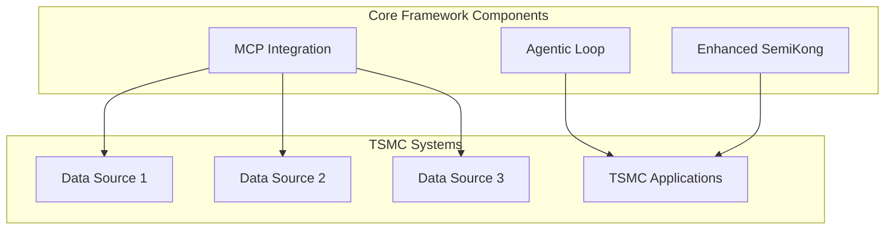
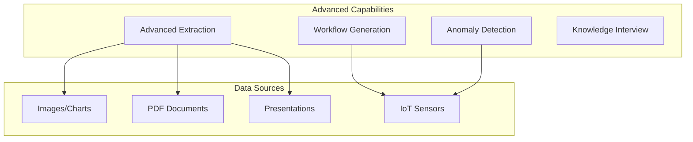
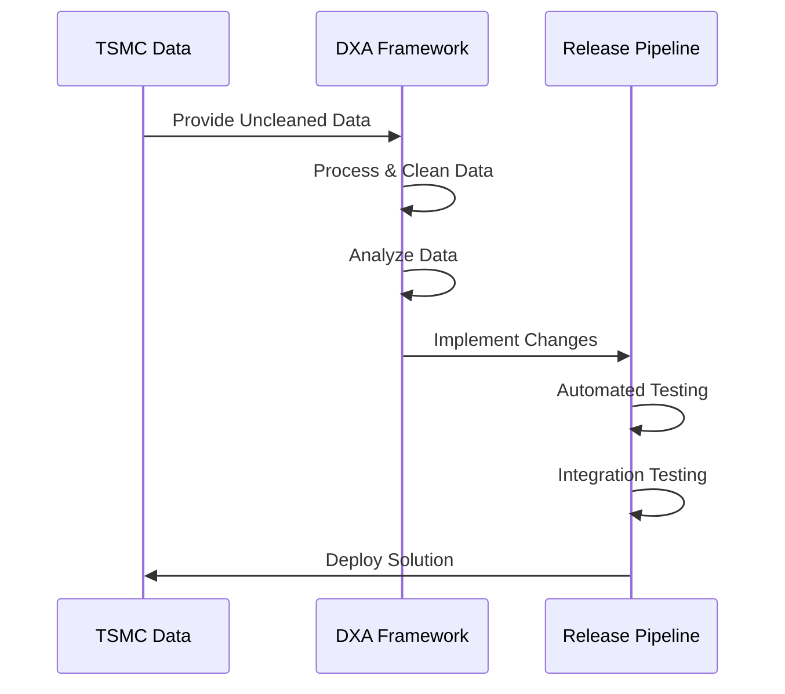
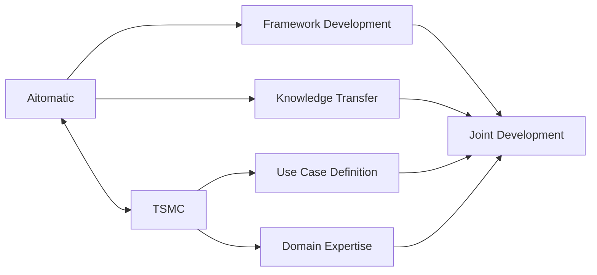
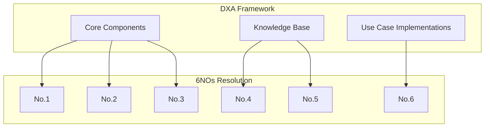
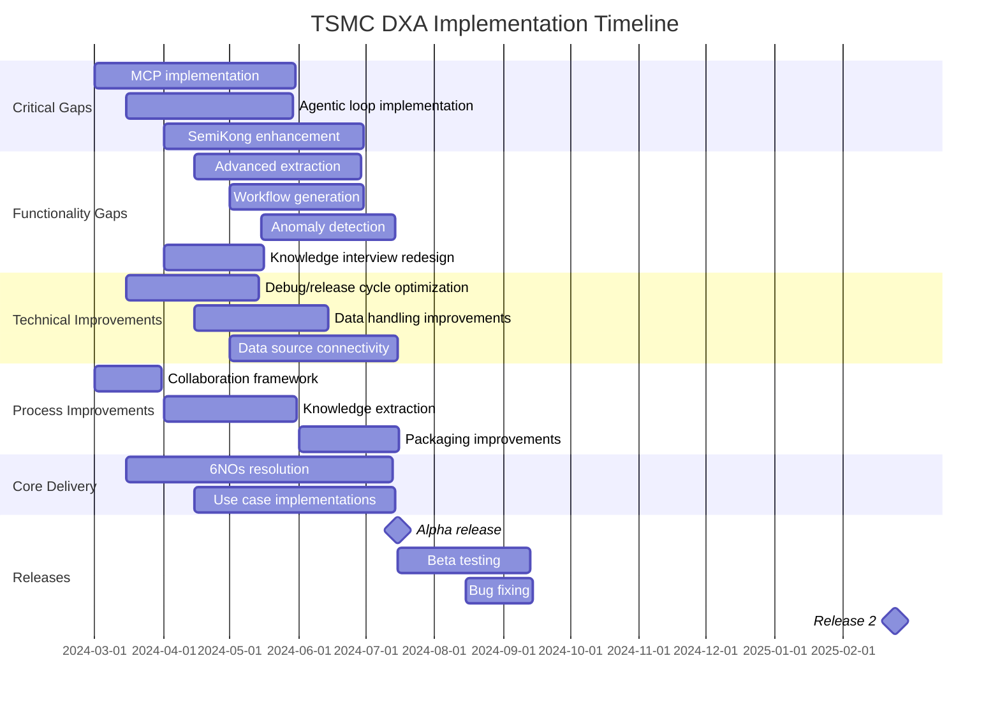

<!-- markdownlint-disable MD041 -->
<!-- markdownlint-disable MD033 -->

  

# Taiwan Semiconductor Manufacturing Company (TSMC) DXA Requirements

  

## Scenario Overview

This document outlines the requirements for the Domain Expert Agent (DXA) implementation with Taiwan Semiconductor Manufacturing Company (TSMC). The current implementation falls short of TSMC's original expectation for "a generic agentic solution that offers reasoning and troubleshooting capabilities, easily applicable to various tool models." The requirements are organized by priority to address critical gaps, significant functionality gaps, and necessary improvements.

## Strategic Priorities

### 1. High Priority - Critical Gaps (Value/Effort: 4.0-4.4)

#### Key Requirements:
- **MCP Implementation** (Value/Effort: 4.4)
  - Deliver DXA Framework with Message Communication Protocol
  - Develop comprehensive integration between DXA and MCP
  - Ensure seamless data flow between components
  - Create robust error handling and recovery mechanisms
  - Implement performance optimization for large-scale deployments

- **Agentic Loop Support** (Value/Effort: 4.0)
  - Ensure framework properly implements the "Agentic Loop"
  - Design and implement complete agentic loop architecture
  - Create monitoring and feedback mechanisms
  - Develop tools for visualizing and debugging the agentic loop
  - Implement performance metrics for loop efficiency

- **Enhanced SemiKong Performance** (Value/Effort: 0.8 → 3.5)
  - Improve LLM to outperform standard models in QA tasks with domain-specific knowledge
  - Implement domain adaptation techniques for TSMC-specific knowledge
  - Create comprehensive evaluation framework comparing to standard LLMs
  - Develop continuous improvement mechanisms
  - Integrate TSMC's domain knowledge into the model

### 2. Medium Priority - Significant Functionality Gaps (Value/Effort: 1.0-2.5)

#### Key Requirements:
- **Advanced Extraction Capabilities** (Value/Effort: 1.2 → 2.5)
  - Enable extraction from non-text formats (PPT/Image/PDF with charts)
  - Implement chart and diagram recognition
  - Develop PDF parsing with layout understanding
  - Create PowerPoint slide extraction capabilities
  - Build image analysis for technical diagrams and schematics

- **Workflow Generation** (Value/Effort: 1.3 → 2.3)
  - Expand beyond basic checking of sensors, maintenance, and parts lifetime data
  - Implement more sophisticated workflow patterns
  - Create workflow validation mechanisms
  - Develop workflow optimization capabilities
  - Enable complex multi-step troubleshooting workflows

- **Anomaly Detection** (Value/Effort: 1.0 → 2.0)
  - Implement independent anomaly detection without relying on external APIs
  - Develop multiple anomaly detection algorithms
  - Create visualization tools for detected anomalies
  - Implement feedback mechanism for false positives/negatives
  - Design self-learning capabilities for improved detection over time

- **Knowledge Interview Flexibility** (Value/Effort: 1.0 → 2.0)
  - Remove rigid fixed templates that can't be skipped
  - Redesign interview template to be more flexible
  - Implement skippable sections
  - Create customizable interview flows
  - Develop better UI/UX for interview process

### 3. Technical Improvements (Value/Effort: 1.4-1.7)

#### Key Requirements:
- **Debug/Release Cycle** (Value/Effort: 1.7)
  - Reduce the "excessively long" cycle and high integration effort with actual data
  - Streamline development and release processes
  - Implement automated testing frameworks
  - Create efficient debugging tools
  - Design incremental release strategy
  - Develop better integration testing with actual data
  - Target milestone: Release 2 date: 2025/02/24 Beta w/ stopping bugs

- **Data Handling** (Value/Effort: 1.5)
  - Improve performance with uncleaned actual data
  - Develop robust data cleaning pipelines
  - Implement data validation mechanisms
  - Create data quality assessment tools
  - Design fallback mechanisms for poor quality data

- **Data Source Connectivity** (Value/Effort: 1.4)
  - Enable connection with any kind of data source inside TSMC
  - Develop universal connector framework
  - Implement adapters for common TSMC data sources
  - Create data transformation pipeline
  - Design secure authentication mechanisms
  - Implement data validation and quality checks

### 4. Process Improvements (Value/Effort: 1.4-2.6)

#### Key Requirements:
- **Collaborative Effectiveness** (Value/Effort: 2.6)
  - Make collaboration more effective
  - Establish regular communication channels and cadence
  - Create shared project management tools and processes
  - Develop clear roles and responsibilities
  - Implement feedback mechanisms for continuous improvement

- **Knowledge Extraction** (Value/Effort: 1.4)
  - Better extraction of workflows from existing TSMC documents
  - Develop document processing pipeline
  - Create knowledge extraction algorithms
  - Implement workflow identification and extraction
  - Design knowledge validation mechanisms
  - Create knowledge organization system

- **Packaging** (Value/Effort: 1.6)
  - Create better packaging with smooth experience for using and updating
  - Design intuitive packaging system for DXA components
  - Create streamlined installation process
  - Develop comprehensive documentation
  - Implement version control and dependency management
  - Design update and rollback mechanisms

### 5. Core Framework Delivery (Value/Effort: 1.2-1.3)

#### Key Requirements:
- **Deliver the framework to resolve the 6NOs with priorities agreed** (Value/Effort: 1.3)
  - Implement solutions for each of the 6NOs
  - Create prioritization framework
  - Develop tracking system for resolution progress
  - Design validation mechanisms for solutions

- **Framework that works for the usecase** (Value/Effort: 1.2)
  - Develop use case specific implementations
  - Create customization capabilities
  - Implement performance optimizations for specific use cases
  - Design validation framework for use case success

- **Deliver Workable DXA that solves TSMC problem** (Value/Effort: 1.2)
  - Implement problem-specific solutions
  - Create validation mechanisms
  - Develop performance metrics
  - Design feedback and improvement system

- **Deliver the DXA Framework as a core of Agent** (Value/Effort: 1.3)
  - Develop modular architecture for easy extension
  - Create comprehensive API documentation
  - Implement reference implementations for common patterns
  - Design flexible configuration system

## Implementation Timeline

## Success Metrics

### Critical Gap Resolution
- MCP successfully integrated with DXA Framework
- Agentic Loop implemented and validated against TSMC requirements
- SemiKong demonstrably outperforms standard LLMs on TSMC-specific tasks

### Functionality Gap Closure
- Successful extraction from multiple non-text formats demonstrated
- Complex workflow generation capabilities validated
- Independent anomaly detection implemented and verified
- Knowledge interview system redesigned with positive user feedback

### Technical Improvement Validation
- Debug/release cycle time reduced by at least 50%
- Successful handling of uncleaned TSMC data demonstrated
- Connection to all required TSMC data sources validated

### Process Improvement Metrics
- Collaboration effectiveness metrics show positive trend
- Knowledge extraction from TSMC documents validated
- Packaging system receives positive user feedback

### Core Delivery Validation
- All 6NOs addressed according to agreed priorities
- Use case implementations meet success criteria
- Framework successfully solves TSMC's specific problems
- Framework architecture validated as extensible and modular 

## Development Work Plan

This section outlines the detailed development work needed to meet TSMC's requirements for the DXA framework.

> **PRIORITY NOTE:** The team will focus first on the Agentic Loop Implementation as the highest priority development item, as it forms the foundation for many other capabilities.

### 1. Critical Gap Development Work

#### Agentic Loop Implementation (Value/Effort: 4.0) - FIRST PRIORITY
The framework needs a complete agentic loop architecture:
- **Perception-Action cycle**: Develop the full loop of environment sensing, reasoning, action planning, and execution
- **Feedback mechanisms**: Create systems to capture outcomes of actions and feed them back into the reasoning process
- **Monitoring tools**: Build visualization and debugging tools to observe the agentic loop in action
- **Performance metrics**: Implement measurement systems to evaluate loop efficiency and effectiveness

#### MCP Integration (Value/Effort: 4.4)
This requires:
- **Development of a comprehensive MCP connector**: Create a robust Message Communication Protocol integration that can handle TSMC's enterprise-scale data flows
- **Data flow optimization**: Build efficient data pipelines between DXA and various TSMC systems
- **Error handling mechanisms**: Implement sophisticated error recovery and retry logic for production-grade reliability
- **Performance tuning**: Optimize for TSMC's large-scale deployment needs, including load balancing and resource management

#### SemiKong Enhancement (Value/Effort: 0.8 → 3.5)
The current LLM implementation needs significant improvement:
- **Domain adaptation**: Fine-tune SemiKong with TSMC-specific knowledge and terminology
- **Evaluation framework**: Create benchmarks comparing SemiKong against standard LLMs on TSMC-specific tasks
- **Knowledge integration**: Develop methods to incorporate TSMC's proprietary knowledge into the model
- **Continuous learning pipeline**: Build systems for ongoing model improvement based on usage patterns

### 2. Functionality Gap Development Work

#### Advanced Extraction Capabilities (Value/Effort: 1.2 → 2.5)
Current text-only extraction needs to be expanded:
- **Multi-format parser**: Develop parsers for PPT, PDF, and image formats
- **Chart recognition**: Build computer vision components to identify and extract data from charts and diagrams
- **Layout understanding**: Create systems that understand document structure beyond just text
- **Technical diagram analysis**: Implement specialized extraction for semiconductor-specific diagrams and schematics

#### Workflow Generation (Value/Effort: 1.3 → 2.3)
Current workflow capabilities are too limited:
- **Advanced workflow patterns**: Develop more sophisticated workflow templates beyond basic checking functions
- **Multi-step troubleshooting**: Create complex diagnostic and resolution workflows
- **Validation mechanisms**: Build systems to verify workflow correctness before execution
- **Optimization engine**: Implement tools to improve workflow efficiency and effectiveness

#### Anomaly Detection (Value/Effort: 1.0 → 2.0)
Need to move beyond reliance on external APIs:
- **Native anomaly detection**: Develop built-in algorithms for detecting anomalies in TSMC data
- **Multiple detection methods**: Implement statistical, machine learning, and rule-based approaches
- **Visualization tools**: Create dashboards for anomaly visualization and investigation
- **Self-learning capabilities**: Build systems that improve detection accuracy over time

#### Knowledge Interview Flexibility (Value/Effort: 1.0 → 2.0)
Current rigid templates need redesign:
- **Flexible interview system**: Rebuild the knowledge capture interface with skippable sections
- **Customizable flows**: Create tools for TSMC to define their own interview templates
- **Improved UI/UX**: Develop a more intuitive and user-friendly interview experience
- **Integration with knowledge base**: Build seamless connections between interviews and knowledge storage

### 3. Technical Improvement Development Work

#### Debug/Release Cycle (Value/Effort: 1.7)
Current cycle is "excessively long":
- **CI/CD pipeline**: Implement automated build, test, and deployment systems
- **Testing framework**: Develop comprehensive automated testing for all components
- **Debugging tools**: Create specialized tools for troubleshooting in TSMC's environment
- **Integration testing**: Build systems to test with actual TSMC data more efficiently

#### Data Handling (Value/Effort: 1.5)
Current system struggles with uncleaned data:
- **Robust data cleaning**: Develop preprocessing pipelines for messy real-world data
- **Validation mechanisms**: Create systems to verify data quality and completeness
- **Fallback handling**: Implement graceful degradation when data quality is poor
- **Performance optimization**: Build systems that maintain speed even with large, messy datasets

#### Data Source Connectivity (Value/Effort: 1.4)
Need universal connectivity to TSMC systems:
- **Universal connector framework**: Develop a flexible system for connecting to any TSMC data source
- **Adapter library**: Build specific adapters for common TSMC systems
- **Authentication integration**: Implement secure access to protected data sources
- **Data transformation**: Create tools to normalize data from diverse sources

### 4. Process Improvement Development Work

#### Collaborative Effectiveness (Value/Effort: 2.6)
Improve development partnership:
- **Collaboration platform**: Implement shared project management and communication tools
- **Knowledge transfer system**: Create documentation and training materials
- **Feedback mechanisms**: Build systems to capture and act on TSMC feedback
- **Role definition tools**: Develop clear responsibility matrices for joint development

#### Knowledge Extraction (Value/Effort: 1.4)
Better document processing:
- **Document pipeline**: Build end-to-end processing for TSMC documentation
- **Extraction algorithms**: Develop specialized methods for identifying workflows in documents
- **Validation tools**: Create systems to verify extracted knowledge accuracy
- **Knowledge organization**: Implement taxonomies and structures for TSMC's domain knowledge

#### Packaging (Value/Effort: 1.6)
Improve deployment experience:
- **Package management**: Develop a comprehensive system for DXA component packaging
- **Installation automation**: Create streamlined installation processes
- **Update mechanisms**: Build tools for seamless updates without disruption
- **Version control**: Implement robust dependency management

### 5. Core Framework Delivery Work

#### 6NOs Resolution (Value/Effort: 1.3)
Address TSMC's specific pain points:
- **Prioritization framework**: Develop systems to track and prioritize the 6NOs
- **Solution implementation**: Build specific solutions for each of the 6NOs
- **Validation mechanisms**: Create tools to verify that solutions actually resolve the issues
- **Progress tracking**: Implement dashboards to monitor resolution status

#### Use Case Implementation (Value/Effort: 1.2)
Deliver solutions for specific TSMC scenarios:
- **Use case framework**: Develop templated approaches for common TSMC scenarios
- **Customization tools**: Build systems allowing TSMC to adapt solutions to their needs
- **Performance optimization**: Create specialized optimizations for TSMC-specific workloads
- **Validation suite**: Implement comprehensive testing for each use case

### Implementation Approach

To successfully deliver these requirements, we will:

1. **Parallel development tracks**:
   - Core architecture team focused on Agentic Loop (FIRST PRIORITY) and MCP
   - AI team focused on SemiKong enhancements
   - Extraction team focused on multi-format capabilities
   - Workflow team focused on advanced patterns and anomaly detection

2. **Phased delivery**:
   - Phase 1 (Months 1-3): Focus on critical gaps (Agentic Loop, MCP)
   - Phase 2 (Months 3-6): Address functionality gaps and technical improvements
   - Phase 3 (Months 6-9): Complete process improvements and core delivery
   - Phase 4 (Months 9-12): Integration, testing, and refinement

3. **Continuous validation**:
   - Regular demos with TSMC stakeholders
   - Incremental delivery of capabilities
   - Feedback incorporation throughout development
   - Metrics-based evaluation against success criteria 