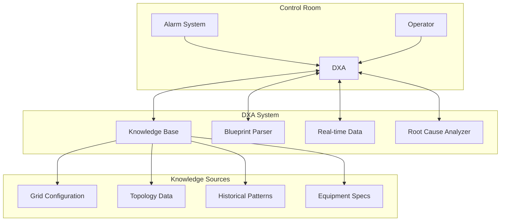
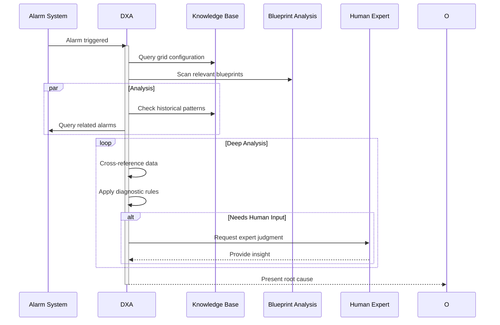

<!-- markdownlint-disable MD041 -->
<!-- markdownlint-disable MD033 -->

  

# Utility Fault Diagnosis Scenario

This scenario describes how a Domain Expert Agent (DXA) performs root-cause analysis of alarms in an electrical grid base station, supporting grid operators in fault diagnosis and resolution.

  

## Grid Station Alarm Analysis

**Actor:** Grid Operator + Diagnostic Expert DXA
**Goal:** Determine precise root cause of grid control system alarms

### Context

- Base station environment with grid control equipment
- Alarm triggered by subsystem malfunction
- DXA has access to:
  - Grid configuration knowledge base
  - Equipment blueprints (PDF format)
  - Control system documentation
  - Historical alarm patterns
  - Real-time sensor/telemetry data
  - Grid topology and connection diagrams

  

### System Architecture

### Root Cause Analysis Process

### Success Criteria

- Single root cause identified (vs probability-ranked list)
- Supporting evidence documented
- Clear fault location specified
- Minimal human expert consultation needed
- Accurate blueprint interpretation
- Rapid analysis completion

### DXA Performance Metrics

- Root cause accuracy rate
- Time to determination
- False positive rate
- Human expert consultation frequency
- Blueprint analysis accuracy
- Knowledge base coverage

### Key Capabilities

- PDF blueprint parsing and interpretation
- Grid topology understanding
- Real-time system state analysis
- Pattern recognition in alarm sequences
- Integration with control systems
- Selective human expert engagement

## Demo Script (3 minutes)

### Setup (30s)

- Grid control room view showing base station monitoring interface
- Split screen displaying:
  - Alarm notification system
  - DXA analysis interface
  - Grid topology visualization
  - Blueprint analysis window

### Demo Flow

#### 0:00-0:30 - Normal Operation & Alarm

- Show normal grid monitoring state
- Trigger alarm from critical subsystem
- DXA immediately begins data collection:
  - Real-time sensor readings
  - Related alarms/events
  - Equipment state

#### 0:30-1:30 - Root Cause Analysis

- DXA performs multi-source analysis:
  - Parse relevant blueprints
  - Query grid configuration
  - Analyze historical patterns
  - Cross-reference documentation
- Show real-time reasoning process
- Display confidence levels for potential causes

#### 1:30-2:30 - Expert Consultation & Resolution

- DXA identifies need for human expertise
- Show targeted question generation
- Expert provides input
- DXA incorporates feedback and finalizes diagnosis
- Present definitive root cause with evidence

#### 2:30-3:00 - Value Summary

- Show time saved vs traditional diagnosis
- Display accuracy metrics
- Highlight knowledge capture for future cases
- Demonstrate blueprint analysis accuracy

### Interactive Elements

- Drill-down into blueprint analysis
- Alternative fault scenario exploration
- Historical case comparison
- Expert feedback integration

### Technical Requirements

#### Demo Environment

- Grid control system simulation
- Blueprint parsing system
- Real-time data streams
- Expert interface mockup

#### Visualization Requirements

- Alarm visualization
- Blueprint analysis overlay
- Reasoning process display
- Root cause confidence metrics
- Knowledge base updates

#### Backup Plans

- Pre-recorded analysis sequence
- Offline blueprint analysis results
- Sample expert consultation workflow
- Alternative fault scenarios
