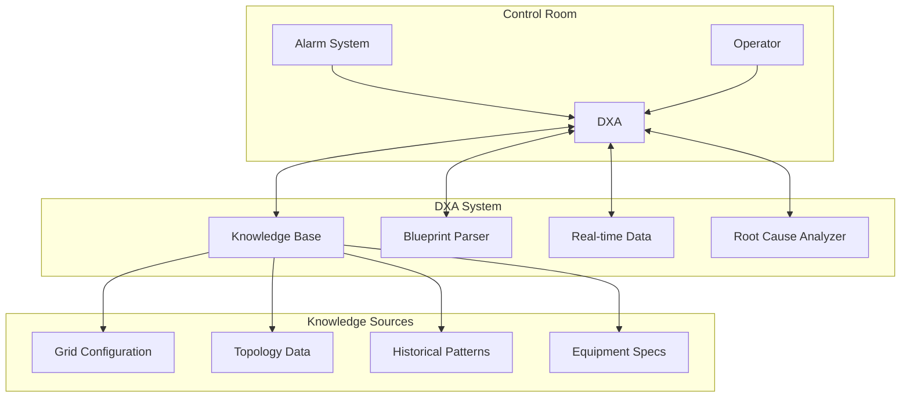
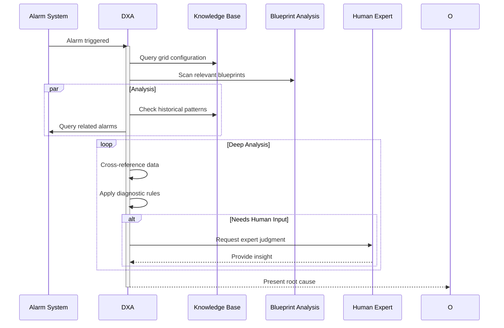

# Utility Fault Diagnosis Scenario

This scenario describes how a Domain Expert Agent (DXA) performs root-cause analysis of alarms in an electrical grid base station, supporting grid operators in fault diagnosis and resolution.

## Grid Station Alarm Analysis

**Actor:** Grid Operator + Diagnostic Expert DXA
**Goal:** Determine precise root cause of grid control system alarms

### Context

- Base station environment with grid control equipment
- Alarm triggered by subsystem malfunction
- DXA has access to:
  - Grid configuration knowledge base
  - Equipment blueprints (PDF format)
  - Control system documentation
  - Historical alarm patterns
  - Real-time sensor/telemetry data
  - Grid topology and connection diagrams

### System Architecture

### Root Cause Analysis Process

### Success Criteria

- Single root cause identified (vs probability-ranked list)
- Supporting evidence documented
- Clear fault location specified
- Minimal human expert consultation needed
- Accurate blueprint interpretation
- Rapid analysis completion

### DXA Performance Metrics

- Root cause accuracy rate
- Time to determination
- False positive rate
- Human expert consultation frequency
- Blueprint analysis accuracy
- Knowledge base coverage

### Key Capabilities

- PDF blueprint parsing and interpretation
- Grid topology understanding
- Real-time system state analysis
- Pattern recognition in alarm sequences
- Integration with control systems
- Selective human expert engagement
