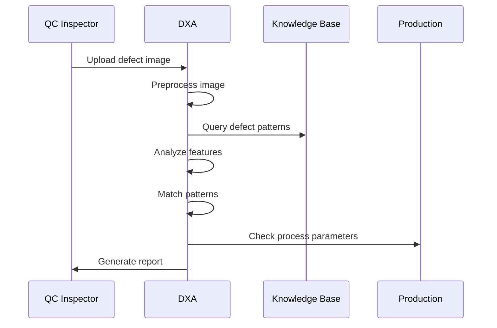
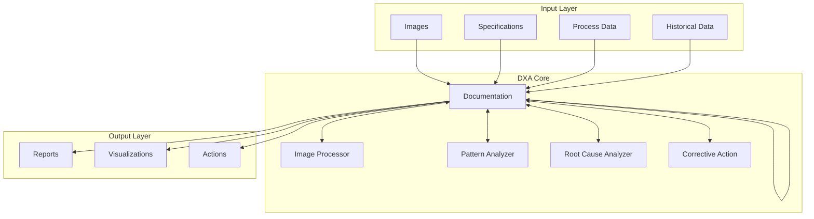

<!-- markdownlint-disable MD041 -->
<!-- markdownlint-disable MD033 -->

  

[Project Overview](../../README.md)

# Manufacturing Quality Control Visual Analysis Requirements

## Business/Technical Problem Statement

### Persona
**Sarah Chen, Quality Control Inspector**
- 5+ years experience in semiconductor manufacturing quality control
- Responsible for visual inspection of critical components
- Must maintain high throughput while ensuring accuracy
- Works across multiple production lines and product types
- Reports to the Quality Assurance Manager

### Use Case
Sarah needs to quickly identify and classify defects in semiconductor components during the manufacturing process. She must determine the root cause of defects, assess their severity, and recommend appropriate corrective actions to prevent production delays and quality issues.

### Scenario
During a routine inspection of a batch of semiconductor wafers, Sarah notices unusual patterns of defects that she hasn't encountered before. She needs to:
1. Capture high-resolution images of the defects
2. Analyze the defect patterns against known defect databases
3. Determine if the defects are critical or minor
4. Identify potential root causes based on historical data
5. Recommend immediate corrective actions
6. Document her findings for quality records and shift handover

Sarah is under pressure to complete this analysis quickly as the production line may need to be adjusted or stopped depending on her findings. She needs a system that can help her make accurate assessments rapidly while providing comprehensive documentation.

## Scenario Overview

This document describes the requirements for manufacturing quality control teams who need to analyze product defects and degradation patterns through visual inspection using DXA in a single conversation.

### System Components

1. **Image Processing System**
   - Image preprocessor (supports standard formats: PNG, JPEG, TIFF, BMP)
   - Feature extractor
   - Pattern analyzer
   - Measurement system
   - Color/texture analyzer
   - Real-time feedback system
   - Interactive annotation tools
   - Image upload interface
   - Analysis results dashboard
   - Side-by-side comparison tools
   - Measurement overlay tools
   - Defect highlighting tools
   - Visual reporting tools

2. **Knowledge Base**
   - Defect pattern database
   - Quality specifications
   - Historical resolutions
   - Process parameters
   - Product specifications
   - Reference image library
   - Measurement calibration data
   - Multi-site standardization data
   - Training materials
   - Quality system compliance requirements

3. **Analysis Engine**
   - Defect classification
   - Pattern matching
   - Root cause analysis
   - Severity assessment
   - Resolution generation
   - State preservation system
   - Recovery management
   - Failed analysis recovery
   - Interrupted session handling
   - Temporary image handling
   - Analysis state preservation

4. **Reporting System**
   - Analysis report generator
   - Visual comparison tools
   - Corrective action planner
   - Documentation references
   - Side-by-side comparison tools
   - Measurement overlay tools
   - Defect highlighting tools
   - Shift handover reports
   - Reference image browser

### Example Scenario: Defect Analysis Process

#### Context

- Manufacturing quality control environment
- DXA has access to:
  - Defect pattern database
  - Quality control specifications
  - Historical defect resolutions
  - Production process parameters
  - High-resolution image processing
  - Production line integration
  - Multi-site standardization data

#### Challenge

1. Accurate Analysis
   - Process high-resolution images
   - Extract defect features
   - Match known patterns
   - Assess severity
   - Identify root causes

2. Timely Response
   - Quick image processing
   - Rapid pattern matching
   - Fast root cause analysis
   - Immediate corrective actions
   - Clear documentation

3. Quality Compliance
   - Meet quality standards
   - Follow inspection protocols
   - Maintain documentation
   - Ensure traceability
   - Support audits
   - Comply with security protocols
   - Support all required product types

#### DXA Actions

1. **Image Analysis**
   - Preprocess images
   - Extract features
   - Analyze patterns
   - Measure dimensions
   - Assess severity
   - Provide real-time feedback
   - Enable interactive annotation

2. **Defect Resolution**
   - Match known patterns
   - Identify root causes
   - Generate solutions
   - Plan corrective actions
   - Document findings
   - Support shift handover
   - Ensure multi-site standardization

## Solution Architecture

### 1. Input Components

- Image capture system
- Quality specifications
- Process parameters
- Historical data
- Production line integration
- Multi-site standardization data

### 2. DXA Core Components

#### Image Processor

- Image preprocessing
- Feature extraction
- Pattern analysis
- Measurement calibration
- Computer vision system
- Pattern recognition system
- Measurement calibration system
- Defect classification system

#### Pattern Analyzer

- Defect classification
- Pattern matching
- Severity assessment
- Root cause analysis
- Secure data handling (on-premise deployment)

#### Corrective Action Generator

- Solution generation
- Action planning
- Verification steps
- Documentation
- Training requirements integration

### Integration Details

#### System Integration

- Image processing system
- Quality management system
- Production system
- Documentation system
- Production line integration
- Quality system compliance
- Computer vision system
- Pattern recognition system
- Measurement calibration system
- Secure data handling (on-premise deployment)

#### Knowledge Integration

- Defect databases
- Quality standards
- Process parameters
- Resolution history
- Training requirements
- Shift handover procedures
- Multi-site standardization
- Quality compliance requirements

## Success Criteria

- Accurate defect classification (>95% accuracy)
- Correct pattern matching
- Valid root cause identification
- Response time under 2 minutes
- Successful resolution guidance
- Secure data handling compliance
- Complete analysis documentation
- Effective corrective actions
- Reliable system recovery
- Consistent measurement accuracy
- Maximum analysis duration within specified limits
- Secure data handling per security protocols
- Support for all required product types
- Successful shift handover completion
- Multi-site standardization compliance
- Training completion verification

## Performance Metrics

- Image analysis accuracy
- Pattern matching precision
- Defect classification accuracy
- Analysis generation time
- Resolution success rate
- Corrective action effectiveness
- System response time (<2 minutes)
- Recovery time (<30 seconds)
- Data retention compliance
- User interaction satisfaction
- Image processing performance:
  - Maximum supported resolution: 4K (3840x2160)
  - Supported formats: PNG, JPEG, TIFF, BMP
  - Processing time: <5 seconds for standard images
  - Storage retention: 30 days for temporary files
- Training effectiveness metrics
- Multi-site consistency score
- Shift handover success rate

---

Copyright © 2025 Aitomatic, Inc. Licensed under the <a href="../../LICENSE.md">MIT License</a>.
 
<a href="https://aitomatic.com">https://aitomatic.com</a>

